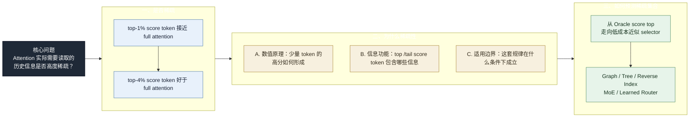

# Top 1% Attention / KV 压缩研究问题整理

## 0. 要回答的问题目录

> **Attention 实际需要读取的历史信息是否高度稀疏，这种稀疏性为什么存在，以及如何低成本预测这种稀疏性？**



### 一、Attention 是否只需要少量（稀疏）历史信息？

**是稀疏的，且具有以下特征：**
1. score top 1% 已经基本接近 full attention；长文本检索更敏感，需要保留更高比例，但仍明显少于全量 context。
2. score top 2%-20% 均略优于 full attention，其中 4% 最好。
3. score top 1% 的位置和功能组成具有明显层间差异：浅层几乎不命中远程答案，中高层的答案命中上升，最后一层又明显偏向 position end；不能简单概括为“深层集中在 front/end”。

### 二、为什么 top-2% 的 token 就足够模型正确回答问题？为什么 tail-10% 的 token 对 perplexity 有害？

我们把 token 按不同标准分类：
- Score： top / tail；
- Function： front / end / answer / others

从数值和功能上比较它们的区别：

#### A. 数值
1. Top/tail 覆盖多少 attention score mass？
- Top-1% 平均覆盖 85%~90% mass，而 Tail 10% 的 mass 几乎为零。
2. Top/tail, front/end/answer/other 是否位于不同奇异子空间？
- 不同种类 token 所使用的 SVD 子空间差异很小；
- 30% 的 tail token 于 top token 的方向相反。

#### B. 信息功能
1. Top 1% token 覆盖哪些信息？
- top 1% 按 token 数量约含 `1.6% answer / 12.0% front / 36.2% end / 50.2% other`，但 score mass 主要集中于 front 和 end。
2. Front/end/answer/other 的重要性如何？
- answer 与 end 最重要，mask 后模型无法正确回答；
- front 最不重要，mask 后虽然 perplexity 升高，但依旧能答对问题；
- other mask 掉，模型也无法正确回答问题，还不知道如何解释。
3. 其他现象：
- 所有 answer token 中，只有约 10% 被 top-2% 选中，且足以正确回答问题；
- 模型中间层更关注 answer，模型浅层和最深层几乎不关注 answer，且 score 分布更 uniform；
- 每个 head 只关注 2% 的 token，但一层内所有 head 总共关注了 15% 的 token。

**结论：模型自发将关键信息压缩到少数 token(head) 中，但现有的模型结构没能利用这一点，导致有用的信息分散在不同 token、不同 head 上。**

#### C. 适用边界：稀疏性在什么条件下成立？
1. 哪些任务、样本和 token 上不存在 attention 稀疏性？
2. 普通生成、长程检索、多跳推理、代码和数学任务需要的有效 token budget 是否不同？
3. 不同 layer/head 的最优保留比例是否不同？是否存在不能稀疏化的层或 head？

### 三、怎么办：如何提前预测出所需的稀疏 kv token？

1.  如何从 oracle score top 1% 走向工程可行的近似 score top 1%？
2.  MoE specialization / reverse index 是否能作为高效检索机制？

## 本轮组会的核心主线

这次组会最核心的研究逻辑是：

> **先确认 Attention 所需历史信息是否高度稀疏，再解释这种稀疏性为什么存在，最后才设计如何低成本预测稀疏集合。**

目前 oracle pruning 已经为“是否稀疏”提供了初步正向证据。因此，当前工作的重心是第二步“为什么稀疏”，而不是直接跳到某个 solution。

第一，如果 `90%` 比 `100%` 好，就必须回答：

> 最后的 `10%` 为什么让结果变差？

这不能停留在“它们是噪声”这个说法上，而要解释它们如何通过：

```text
QK similarity -> softmax weight -> weighted V -> output direction
```

一步步影响最终 attention output。

第二，top 1% 为什么有效，可以优先从 softmax 的选择性回答：

> softmax 是否已经把主要概率质量集中到 top 1%？

第三，top 1% 保留的信息到底是什么，不能只给观察比例，要验证这些信息类型的作用。

第四，还要明确这种稀疏性的能力边界和模型规模效应：

> 小模型为什么学不过大模型？是否是 hidden dimension / head dimension 不够导致长尾信息在表征空间里混淆？

如果这个方向成立，那么目标不仅是 KV 压缩，而是：

> 能不能训练一个小模型，让它学会聪明地筛选、压缩和检索长 context 中真正有用的信息。

当上述机制得到解释后，第三步才是把 oracle top 1% 转化为可实现的 selector：用 graph、tree、reverse index、MoE specialization 或 learned router，在不计算 full attention 的情况下预测真正需要读取的历史 token。

## 1. 背景依据

背景材料见：

`ymluo/doc/section17_attention_pruning_ppl.md`

目前已有现象：

- 在 oracle attention pruning 设置下，每层每个 head 只保留 attention/QK 分数最高的一小部分 token。
- 普通 token 生成任务中，保留 `1%` token 时 PPL 已经非常接近 full attention。
- 长文本检索任务更敏感，但 `1%` 也已经进入接近 full attention 的区间，继续增大到 `4%-20%` 后进一步收敛。
- 这说明大量低 attention score token 对最终输出的边际贡献较小，甚至可能引入噪声。

因此，现在的核心不是继续证明 “top 1% 有效”，而是解释：

> 为什么 top 1% 有效？  
> 剩下 token 为什么贡献小，甚至可能有害？  
> top 1% 和 tail token 在 softmax、V 加权、输出方向和表征空间中分别起什么作用？

## 2. 问题一：为什么 full attention / 全量 context 不一定最优？

导师这次强调的版本不是泛泛地说“加噪声会变差”，而是要沿着 attention 计算链路分析。

### 2.1 已有现象

已有实验 1 说明：

- `gold_only` loss 为 `0.06498`，`oracle_top_chunk` 与其相同，说明只保留正确证据已经足够。
- `full_gold_middle` loss 为 `0.37171`，高于 `full_gold_begin` 的 `0.33435` 和 `full_gold_end` 的 `0.20238`，说明位置中间的证据最容易被削弱。
- `irrelevant_plus_gold` loss 为 `0.27650`，说明无关噪声会明显伤害正确答案置信度。
- `semantic_plus_gold` loss 为 `0.12509`，也比 `gold_only` 差，但比 `irrelevant_plus_gold` 好。原因可能是当前 semantic distractor 写得较明显，模型能识别其不可信。
- `random_top_chunk` 和 `semantic_only_wrong` 基本失败，说明压缩有效不是因为 token 少，而是因为保留了正确证据。

这些结果支持：

> full context 并不天然最优，额外 token 会降低正确答案的置信度。

但导师认为这还不够。真正要回答的是：

> 被加入的低分 token 是如何在 attention 计算里影响输出的？

### 2.2 接下来要分析 tail 10%

如果某个实验里 `90%` 比 `100%` 好，那么被去掉的最后 `10%` 就是重点分析对象。

要问：

- 最后 10% token 和 query 之间的 QK / cosine similarity 到底是多少？
- 它们经过 softmax 后占多少 attention mass？
- 它们对应的 V 向量被加权后，对最终 output direction 改变了多少？
- 加入这 10% 后，是改变了 norm，还是改变了 direction？
- 这些 direction 和 top 1% / full output 的方向有什么区别？
- 如果这些 token 的 QK / cosine similarity 不为 0，它们为什么仍然会被 softmax 分到低权重？
- 低权重乘上 V 后是否仍然会累积成可见扰动？

导师要求把过程拆透明：

```text
query-key score -> softmax weight -> weighted V -> attention output direction
```

不能只说 “tail token 是噪声”，而要说明：

> tail token 为什么是噪声，它们在数值上如何影响 softmax 和 V 加权结果。

更具体地说，要回答三层问题：

1. **score 层面**：tail 10% 与 query 的相似度分布是什么？
2. **softmax 层面**：tail 10% 在概率质量里占多少？
3. **V / output 层面**：tail 10% 的 weighted V sum 让输出方向偏离了多少？

## 3. 问题二：为什么 top 1% 有效？

导师给出的核心解释路径是 softmax 的选择性。

### 3.1 需要验证的假设

假设：

> softmax 是强选择性的，top 1% token 已经覆盖了主要 attention mass，并且能近似恢复 full attention output 的主要方向。

要验证：

- top 1%、2%、3%、4%、5%、6% 分别覆盖多少 attention mass？
- top 1% output 和 full output 的 cosine similarity 是多少？
- 从 1% 增加到 2%、3%、4%、5%、6%，output 方向变化有多大？
- 边际收益是否快速饱和？

### 3.2 必做实验：top-ratio sweep

对每层、每 head、每个 query row，计算：

```text
full_output = softmax(all scores) @ V
top_r_output = softmax(masked top r%) @ V
```

其中：

```text
r = 1%, 2%, 3%, 4%, 5%, 6%
```

指标：

- attention mass coverage；
- `cos(top_r_output, full_output)`；
- relative L2 error；
- norm ratio；
- output direction angle；
- 在 SVD / PCA 主方向上的投影变化。

想回答：

> 为什么 1% 就够？  
> 1% 到 2%、3%、4% 的增益是否已经很小？  
> 4% 为什么可能是某些实验中的 optimal？

如果实验成立，可以形成这样的解释：

> top 1% 有效的第一原因不是它“刚好包含答案”，而是 softmax 本身高度 selective，top 1% 已经恢复了主要 attention mass 和主要 output direction。答案 token 只是其中一类重要信息。

## 4. 问题三：top 1% 到底包含什么信息？

目前已有观察：

- score top 1% 可以按位置与功能拆为 `answer_span / position_front_1pct / position_end_1pct / other`。
- 浅层 top 1% 基本不包含 answer token。
- 中高层更多包含 answer token。
- 浅层主要落在 position end 1% 和 other。

导师指出：这些只是观察，不是结论。

接下来必须回答：

- 浅层不包含 answer，那浅层 top 1% 到底在做什么？
- position end 1% 为什么重要？
- position end 1% 是否提供语法、格式、局部结构、当前位置预测信息？
- other 里到底是什么？是噪声，还是语义桥？
- 中高层 answer_span 命中更高，是否说明中高层承担长程检索？

因此后续不能只统计比例，还要做功能验证：

- 去掉某类 token 后 output direction 是否变差？
- 只保留某类 token 是否能恢复某种能力？
- 某类 token 在某些层/head 中是否稳定出现？
- 它们在 K/V/hidden 表征空间中是否有可解释的分布？

## 5. 问题四：position end 1% 有什么用？

需要明确区分两个概念：

- `score_top_1pct`：attention/QK 分数最高的 1% token。
- `position_end_1pct`：序列位置最后面的 1% token。

已有观察是：

> score top 1% 中有相当比例落在 position end 1%。

这引出一个新问题：

> 为什么模型会在 score top 1% 中保留这么多最近位置的 token？

假设：

- 这些 token 可能承担局部语法、格式、短程依赖和当前位置预测功能。
- 它们不一定是答案证据，但可能对稳定生成有用。

需要验证：

```text
top1_all
top1_without_position_end1
only_position_end1_in_top1
top1_without_answer_span
only_answer_span_in_top1
```

看这些 ablation 对 output direction 和 answer loss 的影响。

## 6. 问题五：score-tail 10% 对输出方向有什么影响？

需要区分：

- `score_top_1pct`：分数最高的 1%。
- `score_tail_10pct`：分数最低的 10%。

导师这次特别强调：如果最后 10% 加进去让性能变差，就要分析这 10% 如何影响表征空间。

### 6.1 表征空间分析

对 top 1% 和 score-tail 10% 的 K/V/hidden states 做投影：

- PCA / SVD 前 2-3 个方向；
- top singular vectors 上的投影；
- norm 分布；
- cosine similarity heatmap；
- top 1% centroid 与 tail 10% centroid 的距离。

要看：

- top 1% 是否集中在某些方向；
- score-tail 10% 是否更分散、更低范数，或者落在不同子空间；
- answer_span、position_end_1pct、other 是否在投影空间中可分；
- score-tail 10% 是否在 V 空间中形成扰动方向。

### 6.2 SVD 表征基分析方案

目前和师兄讨论出的具体做法是：

1. 采样一批输出位置，例如普通续写 token、长文本检索答案 token、问题末尾的 end token。
2. 对这些位置收集对应层/head 的表征，形成一个表征矩阵：

```text
X = [x_1; x_2; ...; x_n]
```

这里的 `x_i` 可以分别取：

- key representation；
- value representation；
- hidden representation；
- attention output representation。

3. 对矩阵 `X` 做 SVD：

```text
X = U S V^T
```

其中 `V` 的列向量可以看成这个样本集合中的主要表征方向，也就是一组表征空间基。

4. 把不同 token 集合投影到这组基上：

```text
projection(x) = x @ V_k
```

重点比较：

- `score_top_1pct` token；
- `score_tail_10pct` token；
- `position_end_1pct_in_top1` token；
- `answer_span_in_top1` token；
- `other_in_top1` token。

5. 观察这些集合在主方向上的分布差异。

重点问题：

- top 1% 是否主要集中在少数主方向上？
- score-tail 10% 是否更分散，或者更多落在低能量方向上？
- answer span token 是否在某些主方向上更突出？
- position end 1% token 是否形成局部结构/格式相关的方向？
- score-tail 10% 是否和 top 1% 在表征空间中方向接近，还是近似正交？
- score-tail 10% 的 V 投影是否会对 top 1% 的 weighted V output 方向产生扰动？

建议输出：

- 每类 token 在前 `k` 个奇异方向上的平均投影；
- 每类 token 的投影能量占比；
- 每类 token 到 top 1% centroid 的距离；
- top 1% centroid 与 score-tail 10% centroid 的 cosine；
- 按 layer/head 汇总的投影差异。

### 6.3 输出方向分析

比较：

```text
full_output = softmax(all scores) @ V
top1_output = softmax(masked top 1%) @ V
top1_plus_tail10_output = softmax(masked top 1% + score-tail 10%) @ V
tail10_only_output = softmax(masked score-tail 10%) @ V
```

指标：

- `cos(top1_output, full_output)`
- `cos(top1_plus_tail10_output, full_output)`
- `cos(top1_output, top1_plus_tail10_output)`
- relative L2 error
- norm ratio
- output direction angle

要回答：

- score-tail 10% 是否基本不改变方向？
- 它是否只改变 norm？
- 它是否在某些层/head 中明显扰动方向？
- 如果它会扰动方向，它是否就是 full attention 中的噪声来源？

### 6.4 证明 tail 10% 让结果变差的最小实验

这个问题不要直接表述为“tail 10% 是噪声”，而要证明一条链路：

```text
score 很低
-> softmax mass 很小
-> weighted V 方向与主输出方向不一致
-> 加回 tail token 后 output direction 偏移
-> loss / PPL 变差
```

建议先做四个实验。

#### 6.4.1 Mass 实验

对每层、每 head、每个 query row，按 attention/QK score 排序，取：

```text
top1
top90
tail10
full
```

统计：

```text
mass_top1 = sum softmax(scores)[top1]
mass_top90 = sum softmax(scores)[top90]
mass_tail10 = sum softmax(scores)[tail10]
```

想回答：

- tail10 在 softmax 概率质量中到底占多少？
- 如果 mass 很小但加回去仍然变差，问题就可能不在概率质量大小，而在 V 方向扰动。

#### 6.4.2 Direction 实验

计算：

```text
full_output = softmax(all scores) @ V
top90_output = softmax(masked top90) @ V
tail10_output = softmax(masked tail10) @ V
top1_output = softmax(masked top1) @ V
```

统计：

```text
cos(top90_output, full_output)
cos(tail10_output, top90_output)
cos(tail10_output, top1_output)
norm(tail10_output) / norm(top90_output)
relative_l2(full_output, top90_output)
```

判断：

- 如果 `tail10_output` 和 `top90_output` 方向相似度低，说明 tail10 携带的 V 方向与主输出方向不一致。
- 如果 `tail10_output` norm 不大但方向差异明显，也可能在累积后拉偏 full output。

#### 6.4.3 Add-back 实验

不要只比较 `top90` 和 `full`，而是逐步把 tail token 加回去：

```text
top90
top90 + lowest 1%
top90 + lowest 2%
top90 + lowest 3%
...
top90 + lowest 10%
full
```

每一步记录：

```text
loss / PPL
cos(output, top90_output)
cos(output, full_output)
relative_l2(output, top90_output)
added_tail_mass
added_tail_output_norm
```

如果随着 tail token 加回去：

- loss / PPL 逐步变差；
- output direction 逐步偏离 top90；
- added tail output 与 top90 output 方向相似度低；

就能比较有力地说明最后 10% 是如何让结果变差的。

#### 6.4.4 SVD 投影实验

结合和师兄讨论的 SVD 方法，构造表征矩阵：

```text
X = [V_top1; V_top90; V_tail10]
X = U S V^T
```

然后把不同集合投影到前 `k` 个主方向：

```text
projection(x) = x @ V_k
```

观察：

- tail10 是否更多落在低能量方向；
- tail10 是否比 top1/top90 更分散；
- tail10 centroid 和 top1/top90 centroid 的 cosine 是否低；
- tail10 是否在某些主方向上与 top1/top90 呈反向投影；
- tail10 是否在 V 空间中形成可见的扰动方向。

#### 6.4.5 预期结论模板

如果实验支持，可以这样表述：

> 最后的 10% token 让结果变差，不是因为它们拥有大的 attention mass，而是因为它们的 weighted V 方向与主要输出方向不一致。虽然单个低分 token 权重很小，但 tail10 的累积贡献会使 full attention output 相对 top90 output 发生方向偏移，进而降低答案预测质量。

## 7. 97% 性能和剩下 3% 损失

问题：

> 97% 到底有多好？剩下 3% 到底差在哪里？

需要避免只报告平均值。

要分析：

- 3% 损失集中在哪些样本？
- 是 answer accuracy 掉了，还是 confidence / logprob 掉了？
- 是否主要出现在长尾实体、位置中间证据、多跳推理、语义冲突、代码或数学任务？

下一步：

- 对失败样本做 bucket 分析：长度、needle depth、答案类型、干扰类型。
- 同时报告 accuracy、answer NLL、PPL、logprob margin。

## 8. 小模型与长 context 的更大问题

导师最后提到，这个问题不只是 KV 压缩问题，也可能解释：

> 小模型为什么学习能力比大模型差？  
> 小模型为什么处理长尾信息和长 context 更困难？

导师的直觉：

- 小模型 hidden dimension / head dimension 更低；
- 低维空间更容易发生语义混淆；
- 长 context 中存在大量长尾信息和复杂语义组合；
- 小模型可能不是完全不能处理长 context，而是不能稳定区分和检索这些长尾信息。
- 大模型通过更高的维度减少混淆，但参数量按很高代价增长，性价比不一定好。

因此，压缩可能帮助小模型：

- 先从长 context 中筛出关键 token / span；
- 降低混淆；
- 让小模型在较短有效 context 中处理原本很长的信息。

更大的目标可以表述为：

> 能不能用一个较小的模型，训练出一个足够聪明的 context selector / compressor，让它帮助自己或大模型从长 context 中筛出真正有用的信息？

这件事的价值不只是节省 KV cache，而是可能降低长 context 推理中对大模型维度和参数量的依赖。

要验证：

- 小模型使用 oracle compression 后，是否能接近大模型 full context？
- 小模型失败是因为找不到关键信息，还是找到后也用不好？
- 不同模型规模的 top 1% mass、answer span 命中率、output cosine 是否不同？
- hidden dimension / head dimension 变化时，表征混淆程度是否下降？
- 小模型 selector 学到的 top 1% 是否能迁移到大模型或更长 context？

## 9. 从 oracle top 1% 到工程可行方案

oracle top 1% 使用真实 attention/QK 排序，只是诊断上界。

工程目标是：

> 用低成本方法近似找到 oracle top 1%。

候选方向：

- query-aware retrieval；
- chunk/span-level retrieval；
- learned router；
- lightweight pre-selector；
- KV / hidden state reverse index；
- MoE specialization。

需要验证：

- 近似 selector 和 oracle top 1% overlap 有多高？
- 近似 selector 是否能恢复 attention output direction？
- 它是否只找到 answer token，还是能找到完整的有效 V 加权集合？

## 10. MoE specialization / reverse index

MoE specialization / reverse index 的作用不是简单加速，而是：

> 学一个机制，高效逼近 oracle top 1%。

要验证：

- expert 是否自然形成 specialization？
- router 是否能把 query 分到 evidence / span / semantic cluster？
- reverse index 的召回率和误召回成本如何？
- 用 oracle top 1% 作为监督信号训练 router 是否有效？

指标：

- top-k recall；
- oracle overlap；
- attention output cosine；
- answer loss；
- expert 分工可视化。

## 11. 当前优先级

优先做以下五件事。

### 11.1 Softmax mass 曲线

统计 top 1%、2%、3%、4%、5%、6% 的 attention mass coverage。

目的：

> 验证 softmax 是否足够 selective。

### 11.2 Attention output 方向曲线

比较 top-ratio output 与 full output：

- cosine；
- relative L2；
- norm ratio；
- SVD/PCA 投影变化。

目的：

> 验证 top 1% 是否已经恢复主要输出方向。

### 11.3 Score-tail 10% profiling

分析分数最低 10%：

- softmax mass；
- V 加权贡献；
- output direction 扰动；
- K/V/hidden 表征投影。
- 基于采样表征矩阵做 SVD，观察 top 1% 和 score-tail 10% 在主表征方向上的投影分布。
- 做 add-back 实验：从 `top90` 开始逐步加入 lowest 1%-10%，观察 loss、mass 和 output direction 如何变化。

目的：

> 解释 full attention 中低分 token 为什么可能让结果变差。

### 11.4 Position-end 1% ablation

分析 top 1% 中位于序列尾部 1% 的 token：

- 去掉它们；
- 只保留它们；
- 看 output / loss 变化。

目的：

> 验证 position end token 是否承担局部结构和生成稳定性。

### 11.5 Top 1% 信息类型 ablation

分别处理：

```text
answer_span
position_front_1pct
position_end_1pct
other
```

目的：

> 验证 top 1% 中不同信息类型的真实作用，而不是只停留在观察。

## 12. 方法论要求

导师这轮最重要的要求是：

- 观察不能直接当结论。
- 每个结论都要继续拆成可验证问题。
- 如果暂时不能验证，要明确写成 hypothesis。
- 不能说“模型不可解释”，只能说“我现在还没找到解释方法”。
- 要沿着计算链路做透明 profiling，而不是黑盒描述。

当前最核心的计算链路是：

```text
QK score / cosine similarity
-> softmax weight
-> weighted V
-> attention output direction
-> final loss / PPL
```

后续实验都应该围绕这条链路展开。
