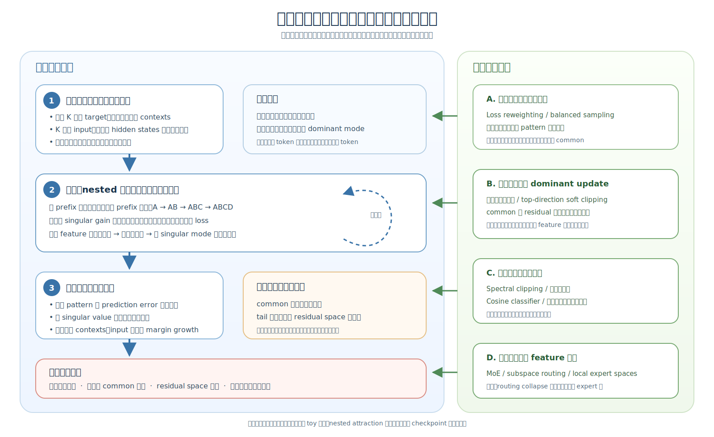

# 公共奇异方向的生命周期：成核、嵌套强化、饱和与干预

## 文档目的

本文整理一个待验证的因果故事：大语言模型训练中，某些高频 token 和高频 pattern 如何首先形成公共高增益方向，嵌套语言结构如何持续复用并强化该方向，该强化何时边际递减，以及它如何在饱和前伤害长尾 feature 的学习。

本文的目标不是主张所有谱集中都有害。公共方向可以承载有用的句法和语义复用。真正需要解释和干预的是：

> 为什么少数公共方向会过早、过强地占据梯度和表示空间，使本来可以进入其他方向的长尾 feature 被迫共享有限的 residual space。



## 核心结论

整个过程可以分成四个阶段：

1. 高频 token、共享 target 和高频 pattern 使训练早期的相关梯度占据主导，形成第一个公共预测方向。
2. 嵌套语言结构反复继承该方向；已有的大 singular gain 又让复用它成为更快的局部下降路径，从而形成正反馈。
3. 当相关 pattern 的 prediction error 下降后，强化边际递减并逐渐饱和；大 singular value 本身不能凭空制造新梯度。
4. 在饱和之前，common 主空间可能已经先成形，长尾 feature 只能在较弱、较小的 residual space 中竞争。

对应的干预可以发生在成核、强化、参数增益和空间共享四个位置，分别对应 loss reweighting、方向感知优化器、谱控制和 MoE / subspace routing。

## 1. 第一个公共奇异方向如何形成

### 1.1 高频 token 的三个数据属性

考虑高频句法 token K。它通常同时具有三个属性：

1. K 经常作为 target；
2. 能够预测 K 的前文 context 非常多样；
3. K 也经常作为 input，出现在许多不同的后续预测中。

训练早期，模型还不能可靠预测 K，因此每个 K-related 样本都会产生明显梯度。K 的频率又高，所以这些梯度在总更新中的占比很大。

### 1.2 K 作为 target：聚合不同 contexts

当 K 作为 target 时，K 的输出 embedding 会被预测 K 的 context hidden states 拉动。不同 context 反复预测同一个 K，K 因而逐渐接近这些 context 表示的加权平均方向。

同时，预测 K 的 context hidden states 也会被拉向有利于提高 K logit 的方向。在 tied embedding 中，这两条路径通过同一张 embedding 表直接耦合。

这里的“均值方向”应严格理解为：

> 所有预测 K 的 context hidden states 的条件均值，而不一定是全体 token embedding 的简单算术平均。

只有当 K 的前文覆盖许多 group 且分布较广时，这个条件均值才可能接近全局公共方向。

### 1.3 K 作为 input：向 hidden states 注入共享分量

当 K 出现在输入 context 中时，所有包含 K 的 hidden states 都会继承一段由 K 提供的共享分量。它们并不会因此完全相同，因为其他 token 和位置仍然提供不同的 residual component。

因此更准确的图像是：

> 包含 K 的 hidden state = K 提供的 common component + 当前 context 提供的 residual component。

如果 common component 的能量过大，不同 hidden states 就会显得更相似，真正区分不同预测任务的信息只能进入 residual space。

### 1.4 从公共统计方向到 dominant singular mode

K 作为 target 聚合 contexts，作为 input 又把公共分量传播给更多 contexts。高频使这些相关更新在训练早期反复出现，不再像随机方向那样互相抵消。

于是 tied embedding、hidden representation 和中间映射中逐渐出现一条公共输入—输出通道。该通道收到最多的同向更新，形成第一个 dominant singular mode。

这个 singular mode 不应被解释成“一个 singular vector 就等于 K”。更准确的解释是：

> 它承载了 K 及其关联句法结构共同形成的公共预测成分；K 可能是该方向上投影最大的锚点之一。

## 2. 嵌套语言结构如何持续强化该方向

### 2.1 嵌套结构提供链式继承

语言 feature 往往不是彼此独立，而是在已有结构上继续增加条件：

```text
A
AB
ABC
ABCD
```

较长 prefix 会继承较短 prefix 已经学到的公共成分，再增加自己的 residual information。因此，如果 A 或 AB 已经使用了 common direction，ABC 和 ABCD 在训练开始时就不是从空白表示空间出发。

### 2.2 大 singular gain 提供局部优化优势

一旦某条公共通道已经具有较大的 singular value，hidden state 沿该方向发生较小改变，就能带来较大的相关 logit 变化。

对于一个尚未学会、但与已有结构相关的新 pattern，模型有两种局部选择：

1. 在新的 residual direction 上建立独立 feature；
2. 调整已经存在的 common direction，快速改变相关 logits。

如果第二种方式能够更快降低当前 loss，反向传播就会在该方向产生更大的 hidden gradient。优化器并不是主动“选择”它，而是大 singular gain 自动放大了与当前 prediction error 对齐的梯度分量。

### 2.3 正反馈循环

强化循环可以按下面的顺序理解：

1. common direction 已经形成，并具有较大 singular gain；
2. 新的 nested feature 继承已有 common component；
3. 沿 common direction 修改 hidden state 能更快改变相关 logits；
4. 更多新 feature 因而继续使用该方向；
5. 更多 hidden states 在该方向上具有较大投影；
6. 参数收到更多沿同一输入—输出通道的更新；
7. 该 singular mode 进一步增强。

这个循环成立需要两个条件：

- 当前 prediction error 与该 singular mode 的输出方向仍然对齐；
- 新 feature 对该方向的使用确实产生继续强化参数的更新，而不是被 residual path 或其他层重新展开。

所以“大 singular value 自动无限增长”不是本文的主张。它只能放大已有且对齐的 error signal。

## 3. 强化何时边际递减并达到饱和

### 3.1 早期：成核最快

高频 pattern 尚未学会，单样本梯度大，出现次数又多。此时公共方向增长最快，频率优势最明显。

### 3.2 中期：吸引相关但尚未学会的 feature

简单 common pattern 已经较容易预测，但复杂或新的相关 contexts 仍存在明显 error。已经形成的大 singular gain 会继续影响这些尚未解决的 pattern，使它们更容易复用 common direction。

### 3.3 后期：随 prediction error 衰减而饱和

当相关 pattern 的预测概率已经足够高，其 gradient 会变小。此时无论 singular value 多大，都不能凭空产生新的更新，正反馈因而边际递减。

后期仍可能保留三类较弱更新：

- cross-entropy 在 accuracy 饱和后继续缓慢增大 margin；
- K 作为 input 参与其他尚未学会的预测任务；
- 少数困难或新 context 仍然产生与 common mode 对齐的 error。

因此，饱和表示“该方向不再快速增长”，不表示早期形成的表示结构会自动恢复均衡。

## 4. 公共方向如何伤害长尾学习

### 4.1 梯度份额失衡

训练早期，高频 pattern 对总更新贡献更大。长尾 pattern 的梯度出现次数少，容易被 common 梯度覆盖、抵消或延迟。直接结果是长尾达到稳定准确率和足够 margin 所需的训练步数增加。

### 4.2 长尾被迫进入 residual space

当 common component 已经占据大量表示能量后，长尾特有信息主要依靠 residual component 表达。raw hidden dimension 即使很大，如果训练没有把 tail feature 分配到这些额外方向，实际 tail effective dimension 仍然可能很小。

### 4.3 Feature interference

多个长尾 feature 如果被挤入同一个低维 residual space，它们的表示和参数梯度会更容易重叠。更新一个 feature 可能同时影响其他 feature，表现为更低的 gradient signal-to-interference ratio、更小 margin 和更慢学习。

### 4.4 Tied embedding 中的“稀释—传染”

高频 K 作为 target 形成公共方向后，又作为 input 把该方向注入其他 contexts。被注入 common component 的长尾 token 随后还要参与自己的内部预测，因此最初来自 K 的表示稀释会传播到本来不以 K 为 target 的任务。

## 5. 按因果环节组织潜在解决方案

| 干预位置 | 潜在方法 | 目标 | 主要风险 |
|---|---|---|---|
| 成核之前 | Inverse target-frequency loss reweighting、balanced sampling、对已学会高频 pattern 动态降权 | 削弱高频 pattern 在训练早期不成比例的梯度份额 | 降权过强会让有用 common pattern 学不会 |
| 方向强化时 | 方向感知优化器、top-gradient-direction soft clipping、common/residual 分量使用不同学习率 | 允许 common direction 存在，但阻止它继续吸收所有新 feature | 硬删除 top direction 会破坏真正有用的共享结构 |
| 参数增益层 | Spectral clipping、谱正则、正交参数化、cosine classifier、语义方向与 confidence scale 解耦 | 限制少数通道获得过高 singular gain | 可能降低有效 compositional reuse 或置信度表达 |
| 表示空间层 | MoE、subspace routing、局部 expert spaces | 让无关 feature 不必在同一个 global subspace 内竞争 | Routing collapse 会把同一问题复制到 expert 层 |

### 5.1 Loss reweighting：干预成核

Loss reweighting 直接减少高频 target 对总梯度的贡献。它改变的是公共方向形成的速度和强度，而不是要求 K 的几何终点完全改变。

合理目标是 soft reweighting：保留 K 的学习信号，同时避免 K 在长尾开始学习前就垄断主要更新。

### 5.2 优化器隔离：干预强化循环

方向感知优化器可以将更新拆成 dominant component 和 residual component，分别控制两者的学习率或更新上限。

这种方法比直接删除 top singular direction 更符合本理论，因为目标是控制过度复用，而不是否认 common structure 的价值。

### 5.3 谱控制：限制高增益通道

谱控制直接限制少数 singular values 的增长，使不同方向的局部优化增益不至于相差过大。

它处理的是强化条件，而不一定消除频率不均的起因。因此，谱控制和 loss reweighting 应被视为作用在不同阶段的互补方法。

### 5.4 MoE：隔离表示空间

MoE 不直接消灭 common direction，而是允许不同语义区域在不同局部参数空间中形成自己的 singular structure。长尾 feature 不必与所有 common feature 共享同一个 global matrix。

有效性不能只看 routing entropy 或参数量，还必须检查 expert specialization、每个 expert 内部的 effective rank，以及长尾 feature 是否真正减少了相互干扰。

## 6. 现有实验证据与主张边界

### 6.1 已有实验支持的部分

- 严格 `1:1:1:1` 与 `7:1:1:1` 对照表明，频率不均会延迟所有 group 达到稳定满准确率的时间。
- K-token 实验表明，共享高频 target 可以形成接近 context centroid 的方向。
- Tied + attention 实验中，target-frequency reweighting 能显著压平谱并改善长尾内部 pattern 的收敛。
- 3D toy 实验表明，raw dimension 增加不会自动转化为 tail effective dimension；packed condition 中 tail 仍可能停留在低维 residual space。
- Transformer 实验表明，多层 hidden transformation 能重新展开一部分被压缩的 embedding geometry，因此集中并非不可逆。

### 6.2 尚未被直接验证的部分

- 自然语言 nested prefix 是否是实际 LLM 中 dominant singular mode 的主要强化来源；
- 参数 singular value 的增长是否在时间上先于 feature top-subspace mass 的增长；
- feature concentration 是否又能预测下一阶段相同 singular value 的继续增长；
- 优化器隔离、谱控制和 MoE 是否通过本文描述的机制改善长尾，而不是通过其他容量或正则效应。

因此，本文当前应被视为一个与已有现象一致、但仍需 checkpoint 级因果验证的工作理论。

## 7. 最小验证路径

下一步实验应至少同时记录以下时间序列：

1. 梯度矩阵的 top singular value 和方向；
2. 参数矩阵的 top singular value 和方向；
3. common、nested-extra 与 tail feature 在 top subspace 上的投影；
4. common、tail 的 group-conditioned gradient norm、cosine 和 SIR；
5. 每个 pattern 的 loss、accuracy 和 margin。

关键因果顺序是：

```text
高频相关梯度先对齐
→ 参数 common singular mode 形成
→ nested feature 的 top-subspace mass 上升
→ 下一阶段同一 singular mode 继续增强
→ tail residual rank / SIR / 学习速度下降
```

如果 feature concentration 先于参数谱集中，或者切断 top singular direction 后 nested feature 仍以相同方式集中，则本文关于 singular-gain attraction 的机制需要被修正。
