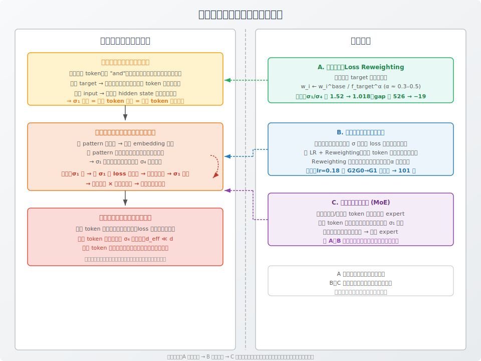

# Singular Value Amplification in Autoregressive Language Models: Formation, Reinforcement, and Intervention



> **一句话**：高频且上下文多样的 token 通过「作为 target 被所有人拉向均值」和「作为 input 向所有人注入共享分量」两条路径，成为 embedding 矩阵的第一个大奇异方向；嵌套语言前缀通过链式梯度继承将该方向逐层放大，最终低频 token 的专用方向因梯度资源被抢占而冻结，其表示被稀释、内部预测能力受损。

## TL;DR

高频且上下文分布均匀的 token（如 "and"）通过两条路径被耦合到 embedding 矩阵的第一个大奇异方向：

1. **作为 target**：被所有前文 token 合力拉向全体 embedding 的均值方向
2. **作为 input**：向所有以它为上下文的 hidden state 中注入一段共享分量

嵌套语言数据（如 "city"→"beautiful city"→"NYC is a beautiful city"）通过「链式继承」持续放大该方向：后到的 pattern 在梯度流中面对的是已被前面 pattern 改造过的 embedding，无法从头塑造自己的方向。

低频方向因梯度资源不足而被冻结（$d_{\text{eff}} \ll d$），长尾 token 的表示被稀释、内部循环变慢。Issue 应当从**切断起因**（reweighting）、**切断传导**（归一化）、**切断累积**（大 lr + rew）、**隔离空间**（MoE）四个层面被解决。

---

## 1. 背景：数据先验

- 自然语言 token 频率服从 Zipf 分布
- 部分高频 token（如 "and"、"the"）的上下文分布接近均匀——前接什么都有，后接什么也都有
- 语言具有嵌套组合性：短 prefix 被不断嵌入更长的 prefix，短 pattern 的频次高于长 pattern

上述三点是给定属性，不做假设改动。

---

## 2. 第一个大奇异方向从何而来？

### 2.1 基础梯度机制

任何 next-token prediction 的 cross-entropy 梯度等价于：**将 target token 的 embedding 拉向 input context 的 hidden state**。

在 tied embedding + 中间层模型（最简形式：$z_j = (M E_i) \cdot E_j$）中：

- $E_{\text{target}}$ 被拉向 $M E_{\text{input}}$ 的方向
- $E_{\text{input}}$ 也得到了反向拉力，与 target 互相奔赴

### 2.2 高频 token 的特殊性

考虑 token $K$，其特征为：(a) 被大量不同的前文 token 预测；(b) 自身后接大量不同的后文 token；(c) 出现频率极高。

**路径一（作为 target）**：所有预测 $K$ 的 bigram 都对 $E_K$ 产生一次拉力：

$$E_K \text{ 每次被更新时，受力方向 } \propto \sum_{\text{所有预测 }K\text{ 的前文 }X} \text{频次}_X \cdot M E_X$$

若前文分布接近均匀（"and" 的情况），**$E_K$ 被拉向全体 token embedding 的均值方向。**

**路径二（作为 input）**：当 $K$ 出现在上下文 $(\cdot , K)$ 中时，hidden state 包含 $M E_K$ 的分量。**所有以 $K$ 为上一 token 的样本，其 hidden state 共享一段完全相同的成分。**

### 2.3 汇合为 dominant singular mode

路径一把 $E_K$ 推向均值。路径二把所有接在 $K$ 后面的 hidden state 都抹上了一层 $E_K$ 的颜色。

**两条路径在梯度流中同时作用，且都因 $K$ 的高频率而被放大。结果是 embedding 矩阵中指向均值方向的那个 singular vector 累积了最多的梯度更新量 → 它成为 $\sigma_1$。**

实验验证（toy bigram K-token）：$E_K$ 与全体非 K token 质心的余弦为 +0.99（untied 及 tied+attention 下均成立）。全体非 K token 的 embedding centroid 精确指向 $E_K$ 的初始方向（untied 下误差 0.05°）。

---

## 3. 嵌套语言数据为何放大该方向？

### 3.1 嵌套结构

自然语言中，短 prefix 的 pattern 被嵌入长 prefix。例如：

```
A→B     出现 3 次（AB, ABC, ABCD 各一次）
B→C     出现 2 次（ABC, ABCD）
C→D     出现 1 次（ABCD）
```

### 3.2 链式继承

梯度更新是叠加进行的。每一步：

1. A→B (3×) → $E_A$ 和 $E_B$ 最先高频互拉 → 彼此靠近，形成强耦合方向
2. B→C (2×) → $E_C$ 被拉向 $E_B$。但此时 $E_B$ 已不再是纯 B 方向——它已被 A 改变。$E_C$ 的实际收敛方向 =「A 和 B 的混合方向」
3. C→D (1×) → $E_D$ 被拉向一个三层混合的方向

**后到的 pattern 在起步时面对的就是已被前面 pattern 改造过的 embedding，无法从零开始塑造自己的独立方向。**

### 3.3 频率不对称是关键

若所有 bigram 频次相等（各 1 次），继承仍是均匀的——没有「先到者」先改变方向。

但频次为 3:2:1 时，A→B 有足够的时间先将 A 和 B 拧在一起，然后 B→C、C→D 的梯度再传过来时，碰到的是已被占据的方向。

**实验验证（4 维 nested bigram）**：$\sigma_1/\sigma_4$ 从初始的 1.00 在 200 步内膨胀至 2.23。$\sigma_1$ 承载了 A、B、C 三组的信息，$\sigma_4$（D 的专用方向）几乎完全停止增长。

---

## 4. 强化过程的停止条件与对长尾的伤害

### 4.1 何处停止

- 当与高频方向有关的所有 token 都被拖入该方向时，loss 对这些 token 已足够低，沿该方向的梯度自然减小
- 但此时 $d_{\text{eff}} \ll d$ 已经形成——大量独立特征被挤压进少数 singular 方向
- 低频方向的 $\sigma$ 仍远小于 $\sigma_1$，该差距不再会自动缩小（无反馈机制平衡）

### 4.2 对长尾的伤害

| 伤害类型 | 机制 |
|---------|------|
| **梯度资源失衡** | 沿 $\sigma_1$ 方向走一步，loss 下降 ∝ $\sigma_1$。沿低频方向走 ∝ $\sigma_4$（远小于 $\sigma_1$）。优化器自然优先在 $\sigma_1$ 上走 |
| **方向污染** | 低频 context 在预测 K 时，自己的 embedding 也被拉向质心方向。低频 token 的表示不再纯粹 |
| **内部循环变慢** | 被污染的 token 互相做内部预测（如 C2,C0→C1），两个输入都不纯 → 更难学习 |
| **有效维度冻结** | $\sigma_4$ 几乎不涨——不是 D 没被训练，是 D 的梯度太弱，对抗不了已被 A/B/C 占据的优势方向 |

**实验验证**：With-K 的 attention 模型（dim=4）中，G2G0→G1（内部循环）无 reweighting 时**永不收敛**，用 reweighting 后 101 步收敛。这证明了「污染 → 内部循环变难」的直接联系。

---

## 5. 干预方案

干预方案作用于因果链的不同阶段。阶段一出现大奇异方向的**起源**，方案 A（Loss Reweighting）在此切入，削减源头。阶段二为嵌套结构对方向的**持续放大**，方案 B（优化器侧）阻断反馈循环，方案 C（模型侧/MoE）隔离子空间。阶段三为已发生的**损害**，不再适合单点干预，预防应在前两个阶段完成。

| 阶段 | 方案 | 类别 | 原理 |
|------|------|------|------|
| 阶段一（起源） | A. Loss Reweighting | 损失函数 | 降低高频 target 的梯度权重，$w_i \leftarrow w_i^{\text{base}} / f_{\text{target}}^\alpha$ ($\alpha\approx 0.3-0.5$)，从一开始阻止 $\sigma_1$ 偏离太远 |
| 阶段二（放大） | B. 优化器侧 | 梯度/学习率 | 梯度方向归一化消除 $\sigma$ 大小对 loss 下降效率的影响；大 lr + reweighting 使低频 token 获得更多有效更新；reweighting 在此阶段可能需调整形式（如 $\alpha$ 衰减） |
| 阶段二（放大） | C. 模型侧 (MoE) | 路由/子空间 | 将不同频率/语义的 token 路由至不同 expert 子空间，低频 token 的 $\sigma$ 方向免遭高频污染。需语义门控：语义相近 → 相近 expert |
| 阶段三（后果） | — | — | 此阶段为已发生的损害（$d_{\text{eff}}\ll d$、表示稀释），不应在此阶段单点干预 |

A、B、C 互补，可联合使用以覆盖不同机制路径。

### 5.1 Loss Reweighting 的效果证据

| 实验 | 无 reweighting | Reweighting | 改善 |
|------|---------------|------------|------|
| Untied bigram: K vs group gap | 526 | −19 | gap 消除 |
| Tied+attention: internal pattern | 永不收敛 | 101 | 解锁 |
| Tied+attention: $\sigma_1/\sigma_4$ | 1.52 | 1.018 | 光谱近乎平坦 |
| Tied+attention: 最大可用 lr | 0.03 | 0.18 | 6× |
| Nested bigram: $\sigma_1/\sigma_4$ | 2.23 | — | 待测 |

### 5.2 Reweighting 的能力边界

1. **硬除（$\alpha=1$）在 $f_{\text{target}}$ 过大时抑制过度**。$K$ 被 50 个 group 预测时，除以 50 使 $K$ 的梯度权重趋近于零，$K$ 无法学习。必须使用 soft 版本（$\alpha \approx 0.5$）。
2. **不消除均值方向，只控制拉力强度**。$E_K$ 依旧是全体 centroid——reweighting 改变的是力的幅度而非几何终点。
3. **当长尾 token 完全缺失于某些 mini-batch 时，reweighting 无效**。需离线统计全局频率作为先验。
4. **维度越低，效果越显著**。低维下 baseline 的光谱集中更严重，reweighting 的边际收益更大。
5. **reweighting 与归一化/MoE 互补，可联合使用以覆盖不同机制路径**。

---

## 6. 当前不确定性

1. 真实 Transformer 多层 attention 下，嵌套继承效应在中间层 hidden state 里是被放大还是被修复？
2. reweighting 的 soft $\alpha$ 在真实 LLM 预训练（数万亿 token）中的最优值预估为多少？是否需要有计划地在训练早期、中期、后期做对应调整？
3. 损失重权与 focal loss、class-balanced loss 等现有方法的组合是否产生协同增益？
4. 在生成任务的下游评估中，reweighting 是否影响生成多样性与事实准确性？
