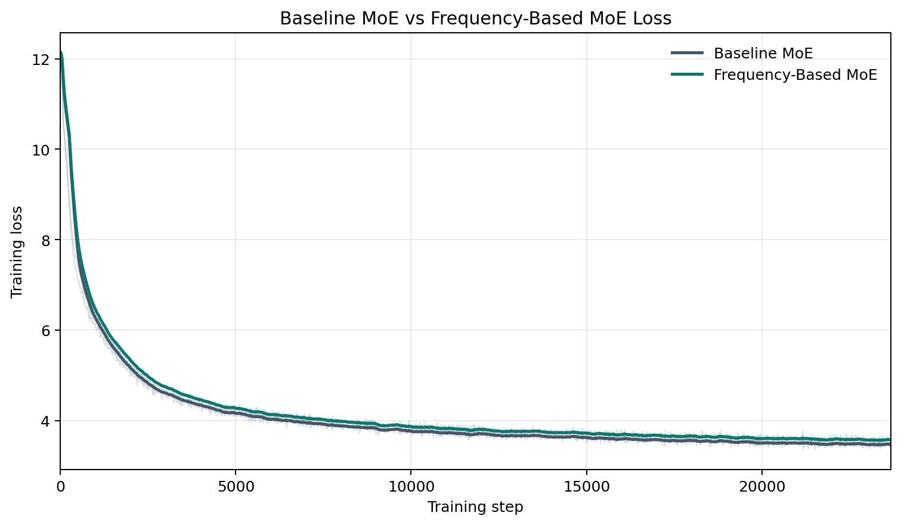

# 面向端侧 MoE 部署的 Frequency-Based MoE：Feature 分段、模型结构与系统收益

## 1. 二阶段结论：现有 MoE 的预测式换入不可直接部署

端侧 MoE 部署的核心矛盾来自两个方面：expert activation 的可预测性结构不理想，以及单个 expert 过大导致动态换入无法被计算隐藏。

在普通 shared MoE 中，router 使用完整 token 表征做分发，而分发结果很容易被表征中的低层 token identity 信息主导。这些信息集中在 SVD 谱空间最靠前的强方向上：它们在不同 token 之间变化很快，但对同一个 token 在不同层之间又高度相似。因此，普通 MoE 的可预测性呈现出如下结构：

- **跨 token 预测较差**：相邻 token 的 token identity 信息变化快，expert id 容易跳变。
- **同 token 跨层预测很强**：同一个 token 在不同层的强 SVD 方向相似，因此 expert activation 高度相关。

这类跨层可预测性并不代表模型实现了理想的 feature specialization。相反，它说明不同层的 routing 仍被低层、共享、token-level 的信号主导，没有把 common feature、上下文 feature 和长尾 feature 拆成不同计算路径。

从系统角度看，普通 MoE 的另一个瓶颈更直接：每个 routed expert 都很大，且不同 expert 内部包含大量 common feature 与上下文 feature 的冗余计算。由于没有实现 feature 粒度的 specialization，系统每次换入都必须搬运一个完整 expert，而不是只搬运真正变化的那部分 feature 计算。二阶段分析已经显示，即使 expert 预测达到 $100\%$ 准确，在当前 PCIe / HBM / 计算速度比下，完整 expert 的传输时间仍难以被该层计算覆盖，可能带来约 $200\%$ 级别的额外时延。因此，普通 MoE 的“预测 expert 并换入”不是一个可直接落地的端侧方案。

本阶段的目标是改变 MoE 的 expert 组织方式：让模型按 feature 频率形成 specialization，把高频共享计算常驻，把可预测的中频计算作为主要 prefetch 对象，把长尾计算拆成足够小的专家单元，从而用可控的常驻内存换取显著更低的动态传输压力。

## 2. Feature 空间理解：频率、稀疏度与组合多样性

### 2.1 可计算的 Feature 定义

我们把训练后参数矩阵中的谱方向定义为模型内部 feature。以 attention output projection 矩阵 $W_O$ 为例：

$$
W_O=U\Sigma V^\top.
$$

对于 token 表征 $h$，线性计算可以展开为：

$$
hW_O
=
hU\Sigma V^\top
=
\sum_i (h^\top u_i)\sigma_i v_i^\top.
$$

因此，token 在第 $i$ 个输入侧 feature direction 上的激活强度定义为：

$$
z_i(h)=\sigma_i h^\top u_i,
$$

对应的 feature energy 为：

$$
e_i(h)=z_i(h)^2=\sigma_i^2(h^\top u_i)^2.
$$

对每个 token，将 feature energy 从高到低排序，并取累计覆盖 $90\%$ energy 的最小 feature 集合 $\mathcal{A}_{0.9}(h)$。进一步统计 feature $i$ 在全体 token 中进入该集合的频率：

$$
f_i
=
\frac{1}{T}\sum_{t=1}^{T}
\mathbf{1}\{i\in\mathcal{A}_{0.9}(h_t)\}.
$$

$f_i$ 将 feature 从抽象概念转化为可以排序和分段的模型内部计算单元。

### 2.2 Feature 激活呈现明确长尾

我们在 Qwen3-0.6B 的全部 28 层上统计了 attention 中 $q/k/v/o$ projection 的 feature activation，共覆盖 112 个参数矩阵。结果显示，feature activation frequency 具有明确的 hot-feature / long-tail 结构：少量 feature 在大量 token 中反复激活，大量 feature 只在少数 token 中出现。


在线性坐标下，可以直接看到左侧少量 feature 形成高频头部，右侧大量 feature 构成长尾。按 28 层平均，最高频 feature 与平均 feature 激活频率如下：

| matrix | top-1 feature activation frequency | mean feature activation frequency |
|---|---:|---:|
| q_proj | 99.97% | 14.72% |
| k_proj | 99.91% | 12.90% |
| v_proj | 85.67% | 28.69% |
| o_proj | 96.57% | 31.09% |

这说明模型内部同时存在接近全局共享的 common feature，以及大量明显更低频的差异化 feature。二者不应继续混合在同一个完整 expert 中统一存储和搬运。

### 2.3 单 Token 的 Feature 激活具有稀疏性

在 rank 1024 的 feature basis 上，每个 token 覆盖 $90\%$ feature energy 所需的平均 feature 数为：

| matrix | average active features per token | active ratio |
|---|---:|---:|
| q_proj | 150.8 | 14.7% |
| k_proj | 132.1 | 12.9% |
| v_proj | 293.8 | 28.7% |
| o_proj | 318.4 | 31.1% |


这说明一个 token 并不会稠密使用完整 feature space。尤其在 $q/k$ 中，约 $13\%$-$15\%$ 的 feature 已经能够覆盖 $90\%$ energy。模型内部计算因此具备进一步拆分为共享路径和条件路径的基础。

### 2.4 三类 Feature 的系统含义

Feature frequency 决定一个方向在多少 token 中被复用；频段内激活密度决定单个 token 会同时使用多少 feature；不同 token 的激活集合差异决定 feature 组合的多样性。三者共同导出以下结构：

| feature band | token 激活性质 | feature 组合性质 | expert 组织 |
|---|---|---|---|
| 高频 common | 几乎所有 token 都激活 | token 间高度重合，组合少 | 一个较大的常驻 common expert |
| 中频 middle | 每个 token 激活较多，局部上下文中持续出现 | 组合数量有限 | 少量中等 expert，适合预测式 prefetch |
| 低频 long-tail | feature 数量多，但每个 token 只激活少量 | 组合丰富，exact prediction 更难 | 大量小 expert，常驻或大 cache 覆盖 |

这里的关键是区分 **feature band 的宽度** 与 **单个 expert 的容量**。Common band 可以较窄，但服务所有 token，因此 expert 容量需要足够大。Long-tail band 可以很宽，但每个 token 只使用少量长尾 feature，因此应拆成大量小 expert，而不是少量大 expert。

## 3. 模型结构：Frequency-Based MoE

### 3.1 结构设计

基于上述 feature 空间认识，我们设计 Frequency-Based MoE。设进入 FFN/MoE 的 post-attention residual 表征为 $h\in\mathbb{R}^{d}$，按 feature activation frequency 将 routing feature 分为 common、middle 和 tail 三段。当前验证模型采用以下分段作为首版实现：

$$
B_{\mathrm{common}}=\{0\%-1\%\},
\qquad
B_{\mathrm{mid}}=\{1\%-10\%\},
\qquad
B_{\mathrm{tail}}=\{10\%-100\%\}.
$$

三个频段对应三种不同 expert 角色：

```text
Common band:
  1 个较大的 common expert；
  所有 token 都经过该 expert；
  始终常驻 HBM，不需要预测。

Middle-frequency band:
  少量中等 expert；
  使用中频 feature activation 做分发；
  由于上下文持续性更强，作为主要预测式 prefetch / swap 对象。

Long-tail band:
  大量小 expert；
  使用长尾 feature activation 做细粒度分发；
  由于 exact prediction 更难，应尽量常驻更多或通过大 cache / recall@K 覆盖。
```

对应的端侧部署策略是：

```text
resident / cache:
  common expert + 大量小粒度 tail experts

dynamic prefetch / swap:
  数量少、可预测性更强的 middle experts
```

### 3.2 前向计算

当前 token 在频段 $B$ 上的 scaled feature activation 为：

$$
z_B(h)=\left[\sigma_i h^\top u_i\right]_{i\in B}.
$$

Middle 和 long-tail routing 分别为：

$$
\mathcal{R}_m(h)
=
\operatorname{TopK}\left(G_m(z_{B_{\mathrm{mid}}}(h)),K_m\right),
$$

$$
\mathcal{R}_l(h)
=
\operatorname{TopK}\left(G_l(z_{B_{\mathrm{tail}}}(h)),K_l\right).
$$

设 common expert 为 $C$，middle experts 为 $\{M_i\}$，long-tail experts 为 $\{L_j\}$，则模型输出为：

$$
\operatorname{FMoE}(h)
=
C(h)
+
\sum_{i\in\mathcal{R}_m(h)}\alpha_iM_i(h)
+
\sum_{j\in\mathcal{R}_l(h)}\beta_jL_j(h).
$$

Feature projection 仅用于产生 gate。真正进入 common、middle 和 long-tail expert 的输入始终是完整 post-attention residual 表征 $h$。这一设计保留完整上下文信息，同时让 expert 的选择显式对应不同频率的 feature activation。


## 4. 当前模型验证：能力保持与可预测结构

当前 Frequency-Based MoE 使用如下结构：

```text
Common: 0%-1% feature band, 1 个 expert, intermediate size 1536
Middle: 1%-10% feature band, 4 个 experts, 每个 intermediate size 768
Tail:   10%-100% feature band, 16 个 experts, 每个 intermediate size 768

Routing: attn_pre_o 投影到对应 O-SVD feature band，并乘奇异值
Expert input: full hidden state
```

普通 baseline 为：

```text
Shared expert: 1 个 always-on expert, intermediate size 1536
Routed experts: 4 个 experts, 每个 intermediate size 1536, top-1
Routing: 普通 mlp_input / x_moe
```

### 4.1 训练 Loss 正常

当前模型训练曲线正常下降。下图只展示 baseline 与 Frequency-Based MoE 共同覆盖的训练 step 区间，说明 feature-frequency routing 可以稳定接入 MoE 训练流程。



### 4.2 下游任务保持同一水平

对每个任务，我们选取该任务中最能体现当前模型表现的指标进行对比；对于包含多个指标的任务，优先列出 Frequency-Based MoE 相对更优或差距更小的指标。

| task | metric | baseline MoE | Frequency-Based MoE |
|---|---|---:|---:|
| arc_challenge | acc_norm | 0.2167 | 0.2201 |
| arc_easy | acc | 0.4057 | 0.3939 |
| hellaswag | acc_norm | 0.2734 | 0.2740 |
| piqa | acc | 0.5968 | 0.5919 |
| race | acc | 0.4700 | 0.4801 |
| siqa | acc | 0.3644 | 0.3664 |
| winogrande | acc | 0.5154 | 0.5051 |
| average | selected task average | 0.4061 | 0.4045 |

这说明在当前训练规模和模型设置下，Frequency-Based MoE 已经保持与 baseline 基本一致的下游任务表现。结构改变没有破坏模型基本能力。

### 4.3 Expert 激活呈现分频段可预测结构

真实部署时，我们关心两类预测性：一类是同一个 token 在不同层之间的 expert activation 是否稳定；另一类是相邻 token 之间的 expert activation 是否具有上下文连续性。下表直接从本地 predictability 矩阵提取和重算，其中 same-token 使用跨层汇总均值，cross-token 使用部署相关的 best-available 口径：

```text
Same-token:
  使用所有更浅层到更深层预测的汇总均值。

Cross-token:
  对目标层 l，取前一个 token 已完成的所有层中预测率最高的一层。
```

| routing target | experts | random | same-token | cross-token best previous-token layer |
|---|---:|---:|---:|---:|
| baseline MoE | 4 | 0.2500 | 0.6744 | 0.5515 |
| Frequency middle | 4 | 0.2500 | 0.6539 | 0.6212 |
| Frequency tail | 16 | 0.0625 | 0.4229 | 0.3883 |

这张表给出两个直接结论：

- **Cross-token 预测：Frequency middle > baseline MoE > Frequency tail。** Middle feature 具有更强的上下文持续性和更少的组合数量，因此相邻 token 之间的 expert activation 更容易预测。这说明 middle band 是更适合做预测式 prefetch / swap 的对象。
- **Same-token 跨层预测：baseline MoE 与 Frequency middle 处于相近区间，Frequency tail 明显更低。** Baseline 的同 token 跨层可预测性来自 token identity 主导的 routing；它说明同一个 token 在不同层中保留了相似的低层强信号，但不代表实现了 feature specialization。Frequency middle 保持较高预测性，而 Frequency tail 明显更低，符合长尾 feature 组合更丰富、exact prediction 更难的预期。

同时，当前模型中的 tail expert 与 middle expert 使用相同 intermediate size。这是为了先在 active compute 对齐的条件下验证 feature-frequency routing 本身，尽量一次只改变一个关键因素。后续部署版本将进一步把 tail expert 小粒度化，使其符合“数量多、单个小、cache 覆盖率高”的端侧目标。

### 4.4 端侧 Memory 与 Latency 建模

普通 MoE 在端侧有两种直接部署方式：全部 expert 常驻，或者预测式 swapping。前者带来最高 HBM 压力；后者每次需要搬运完整 routed expert。二阶段结果已经显示，在当前 PCIe / HBM / 计算速度比下，即使 expert 预测准确，完整 expert 的传输时间仍可能带来约 $200\%$ 级别的额外时延。

当前 Frequency-Based MoE 的 memory / latency 收益将在下一阶段部署版结构中直接评估。本阶段为了验证模型结构的可行性，tail expert 与 middle expert 使用了相同 intermediate size。这一设置保证了 active compute 与 baseline 可比，也让实验主要检验 feature-frequency routing 是否能稳定训练、保持任务能力并形成分频段 routing 结构。

下一阶段的部署版结构会把 tail expert 进一步小粒度化。目标是让 common 常驻、middle 做主要预测式 prefetch / swap、tail 通过小粒度 resident / cache / recall@K 覆盖，从而把动态传输对象从完整大 expert 改成少量可预测 middle expert。

Qwen-style expert 为 SwiGLU 三矩阵结构，单个 expert 参数量近似为：

$$
P_{\mathrm{expert}}(k)\approx 3kd^2,
$$

其中 $d$ 是 hidden size，$k$ 是 expert intermediate expansion。

当前验证模型保持 per-token active routed capacity 与 baseline 对齐：

```text
Baseline:
  每 token 激活 1 x 1536 routed expert

Frequency-Based MoE:
  每 token 激活 1 x 768 middle + 1 x 768 tail
```

后续端侧部署版本将进一步调整为：

```text
Common:
  large, resident

Middle:
  medium, predictable, prefetch / swap

Tail:
  many, tiny, resident/cache covered
```

在这种部署形态下，优化目标不是最低常驻内存，而是在 HBM 可承受范围内最小化预期动态传输成本：

$$
\mathbb{E}[C_{\mathrm{swap}}]
=
\sum_e P(e\text{ activated})S_e(1-\mathrm{HitRate}_e).
$$

只要 middle 的 prefetch hit rate 足够高，且 tail expert 被小粒度化并通过 cache 覆盖，系统就可以把普通 MoE 的“完整 expert 大搬运”变成“少量可预测 middle 搬运 + 低成本 tail miss”，从而显著降低 latency overhead。

## 5. 阶段结论与下一步

本阶段形成了从二阶段瓶颈、feature 空间理解到端侧 MoE 结构设计的完整路径：

```text
Baseline MoE:
  可预测性来自低层 token-level 信号主导；
  expert 没有形成足够 feature specialization；
  每个 expert 过大，预测式换入仍会产生约 200% latency overhead。

Feature 空间:
  高频 feature 接近全局共享；
  中频 feature 组合有限、上下文持续性更强；
  长尾 feature 数量多、单 token 激活稀疏、组合丰富。

Frequency-Based MoE:
  common 常驻；
  middle 作为主要预测式 prefetch / swap 对象；
  tail 做成大量小 expert，并通过 resident/cache/recall@K 覆盖。

当前验证:
  训练 loss 正常；
  下游任务与 baseline 保持同一水平；
  middle 与 tail 均显示出高于随机的可预测结构。
```

接下来两个月的核心工作是把当前验证模型推进到端侧部署形态：

```text
1. 参数量对齐:
   保持总参数量和 active compute 与 baseline 可比。

2. Tail 小粒度化:
   将 tail expert 做得显著小于 middle expert，
   验证 resident/cache 覆盖后的实际 miss bytes。

3. Middle prefetch:
   提升 middle predictor，并报告在真实 cache budget 下的 hit rate 和 latency 收益。

4. 系统闭环:
   将 resident memory、dynamic transfer、prefetch hit rate 和端到端 latency 统一建模，
   给出相对普通 MoE 全常驻与普通 MoE swapping 的 Pareto 改善。
```

Frequency-Based MoE 的核心价值是把模型内部真实存在的 feature 频率分层转化为可部署的 expert 层次：高频计算常驻，中频计算可预测换入，长尾计算小粒度缓存覆盖，从而在保持模型能力的同时降低端侧 MoE 的动态传输压力。
