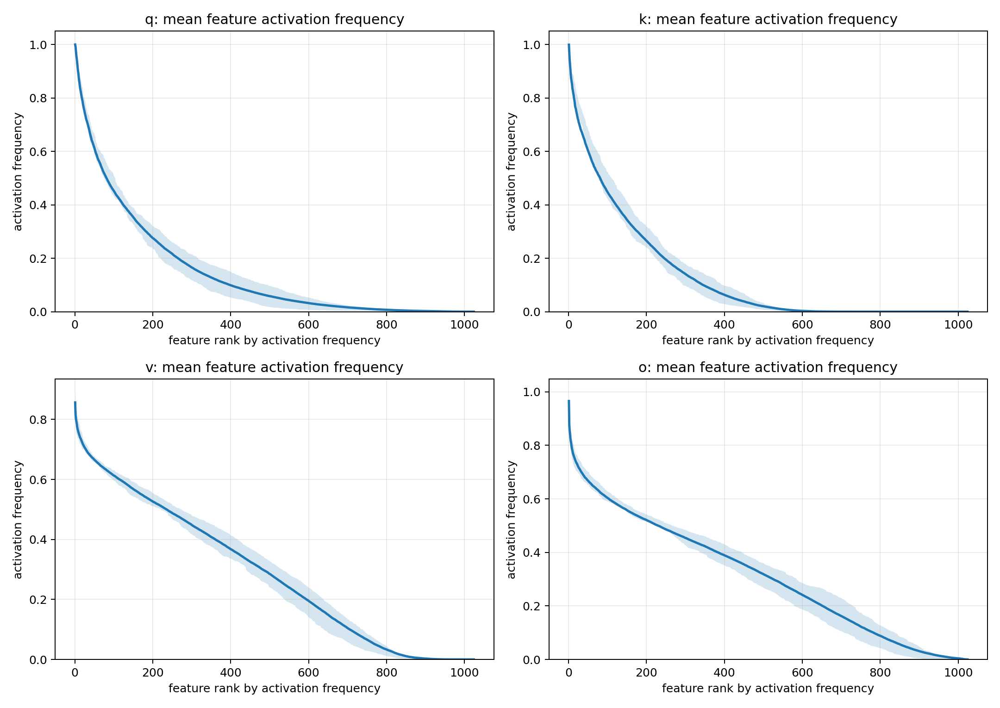
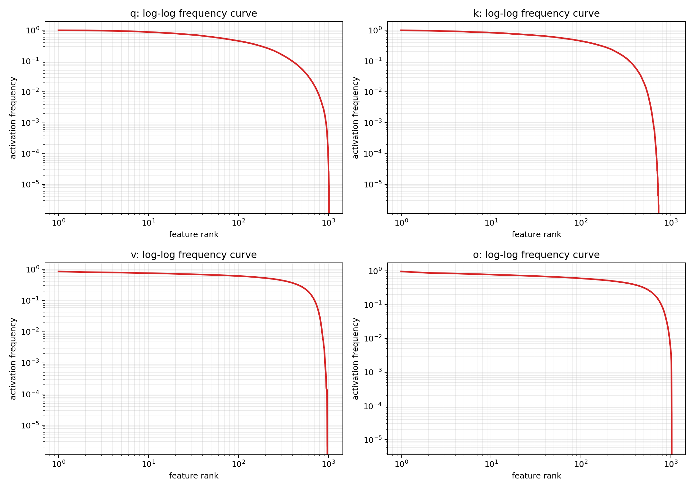
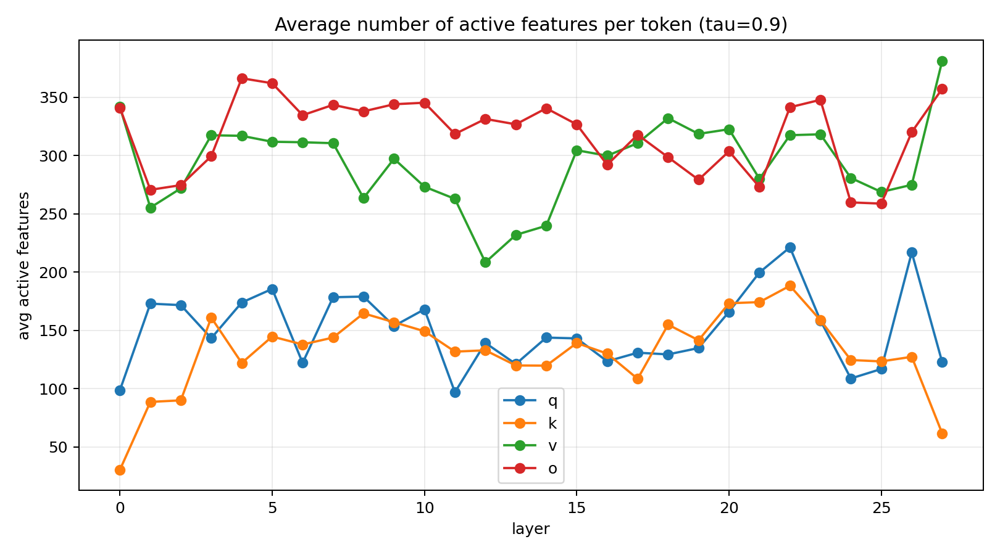
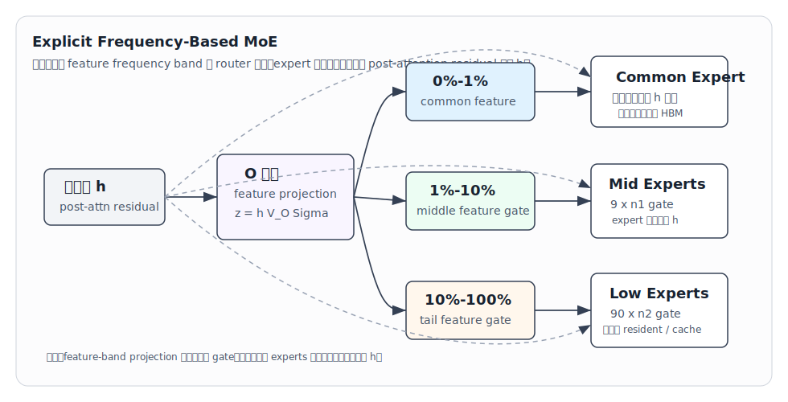
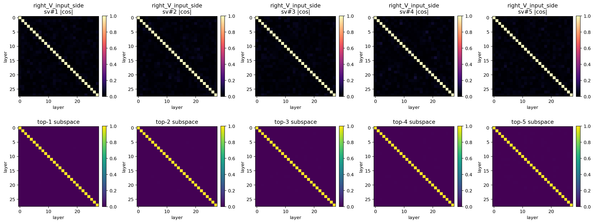
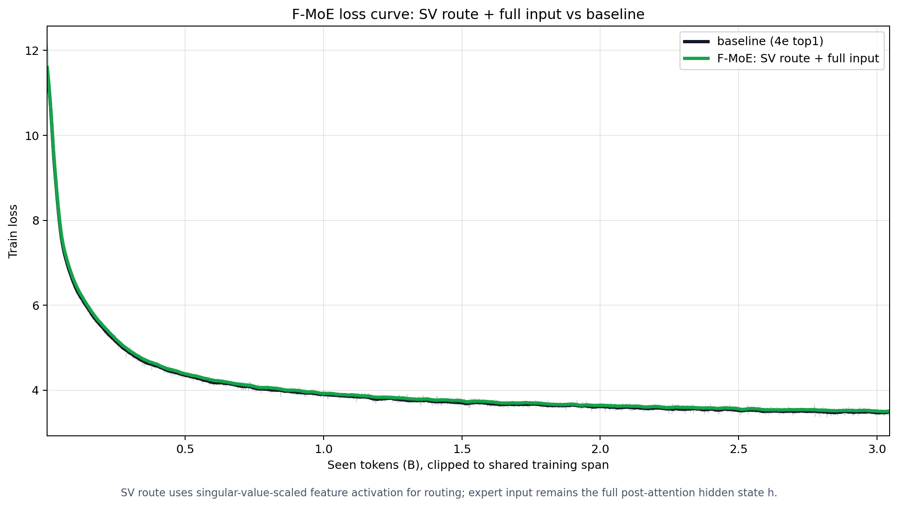

# 面向端侧 MoE 部署的 Frequency-Based MoE：Feature 分段、模型结构与系统收益

## 1. 核心结论

上一阶段已经明确，端侧 MoE 部署的关键挑战不是单纯提高 expert 预测准确率，而是让模型形成适合 load-on-demand 的 **feature-level specialization**：高频共享计算应当常驻，低频差异化计算应当拆成更小的动态单元。

本阶段进一步得到三项结论：

```text
1. 模型内部 feature usage 具有明确的频率分层：
   少量高频 feature 接近全局共享；
   中频 feature 在局部上下文中反复出现；
   大量长尾 feature 只被部分 token 稀疏激活。

2. Feature 的频率、激活密度和组合多样性共同决定 expert 结构：
   高频 feature -> 单个较大的 common expert，常驻 HBM；
   中频 feature -> 少量中等 expert，粗粒度分发并重点 prefetch；
   长尾 feature -> 大量小 expert，细粒度分发并按需换入。

3. Frequency-Based MoE 已经保持与 baseline 接近的模型能力，
   并为降低动态换入参数量、提高端侧 prefetch 效率建立了结构基础。
```

因此，本阶段形成的模型设计原则可以概括为：

> **越高频的 feature 越共享、激活越稠密、组合越少，因此采用少量较大的常驻 expert；越长尾的 feature 越稀疏、组合越丰富，因此采用大量较小的按需 expert，并通过更高 recall 的预取策略控制访问成本。**

## 2. Feature 空间的分段观察

### 2.1 可计算的 Feature 定义

我们把训练后参数矩阵中的谱方向定义为模型内部 feature。以 attention output projection 矩阵 $W_O$ 为例，对其做奇异值分解：

$$
W_O=U\Sigma V^\top.
$$

对于 token 表征 $h$，线性计算可以展开为：

$$
hW_O
=
hU\Sigma V^\top
=
\sum_i (h^\top u_i)\sigma_i v_i^\top.
$$

因此，token 在第 $i$ 个输入侧 feature direction 上的激活强度可以定义为：

$$
z_i(h)=\sigma_i h^\top u_i,
$$

对应的 feature energy 为：

$$
e_i(h)=z_i(h)^2=\sigma_i^2(h^\top u_i)^2.
$$

对每个 token，将 feature energy 从高到低排序，并取累计覆盖 $90\%$ energy 的最小 feature 集合 $\mathcal{A}_{0.9}(h)$。进一步统计 feature $i$ 在全体 token 中进入该集合的频率：

$$
f_i
=
\frac{1}{T}\sum_{t=1}^{T}
\mathbf{1}\{i\in\mathcal{A}_{0.9}(h_t)\}.
$$

$f_i$ 将 feature 从抽象概念转化为可以排序和分段的模型内部计算单元。

### 2.2 Feature 激活呈现明确的长尾结构

我们在 Qwen3-0.6B 的全部 28 层上统计了 attention 中 $q/k/v/o$ projection 的 feature activation，共覆盖 112 个参数矩阵。结果显示，feature activation frequency 具有明确的 hot-feature / long-tail 结构：少量 feature 在大量 token 中反复激活，大量 feature 只在少数 token 中出现。



在线性坐标下，可以直接看到左侧少量 feature 形成高频头部，右侧大量 feature 构成长尾。log-log 视角进一步显示，$q/k$ 的 Zipf-like 形态最清晰，$v/o$ 的长尾分布相对平滑。



按 28 层平均，最高频 feature 与平均 feature 激活频率如下：

| matrix | top-1 feature activation frequency | mean feature activation frequency |
|---|---:|---:|
| q_proj | 99.97% | 14.72% |
| k_proj | 99.91% | 12.90% |
| v_proj | 85.67% | 28.69% |
| o_proj | 96.57% | 31.09% |

这组结果说明，模型内部同时存在接近全局共享的 common feature，以及大量明显更低频的差异化 feature。二者不应继续混合在同一个完整 expert 中统一存储和搬运。

### 2.3 单 Token 的 Feature 激活具有能量稀疏性

在 rank 1024 的 feature basis 上，每个 token 覆盖 $90\%$ feature energy 所需的平均 feature 数为：

| matrix | average active features per token | active ratio |
|---|---:|---:|
| q_proj | 150.8 | 14.7% |
| k_proj | 132.1 | 12.9% |
| v_proj | 293.8 | 28.7% |
| o_proj | 318.4 | 31.1% |



这说明一个 token 并不会稠密使用完整 feature space。尤其在 $q/k$ 中，约 $13\%$-$15\%$ 的 feature 已经能够覆盖 $90\%$ energy。模型内部计算因此具备进一步拆分为共享路径和条件路径的基础。

### 2.4 高频、中频与长尾 Feature 的结构差异

Feature frequency 决定一个方向在多少 token 中被复用；频段内激活密度决定单个 token 会同时使用多少 feature；不同 token 的激活集合差异则决定 feature 组合的多样性。三者共同形成以下分段结构：

| feature band | token 激活性质 | feature 组合性质 | 系统含义 |
|---|---|---|---|
| 高频 common | 激活稠密，几乎所有 token 都会使用 | token 间高度重合，组合少 | 共享计算，直接常驻 |
| 中频 middle | 激活频率和密度居中，在局部上下文中持续出现 | 组合数量有限 | 少量粗粒度 expert，适合预测和 prefetch |
| 低频 long-tail | 单 token 激活稀疏，但候选 feature 总数多 | 不同 token 可形成丰富组合 | 大量细粒度小 expert，按需加载 |

这里需要区分 **feature band 的宽度** 与 **单个 expert 的容量**。Common band 可以只覆盖较窄的高频 feature 范围，但 common expert 服务所有 token，因此需要提供较大的共享计算容量；long-tail band 即使包含大量 feature，每个 token 实际只使用其中少量方向，因此可以拆成大量更小的 expert。

## 3. 模型结构：Frequency-Based MoE

### 3.1 从 Feature 分段导出 Expert 结构

基于第 2 章的观察，本阶段采用显式的 Frequency-Based MoE。设进入 FFN/MoE 的 post-attention residual 表征为 $h\in\mathbb{R}^{d}$，按 feature activation frequency 将 routing feature 分为：

$$
B_{\mathrm{common}}=\{0\%-10\%\},
\qquad
B_{\mathrm{mid}}=\{10\%-20\%\},
\qquad
B_{\mathrm{tail}}=\{20\%-100\%\}.
$$

三个频段对应三种不同的 expert 组织方式：

```text
Common band:
  1 个较大的 common expert；
  所有 token 都经过该 expert；
  始终常驻 HBM，不需要预测。

Middle-frequency band:
  少量中等容量 expert；
  使用中频 feature activation 做粗粒度分发；
  依靠较强的上下文持续性进行提前 prefetch。

Long-tail band:
  大量小容量 expert；
  使用长尾 feature activation 做细粒度分发；
  通过小粒度 load-on-demand 和 recall@K 控制访问成本。
```

建议的容量和数量关系为：

$$
k_c>k_m>k_l,
\qquad
1<N_m\ll N_l,
$$

其中 $k_c,k_m,k_l$ 分别表示 common、middle 和 long-tail expert 的 hidden expansion，$N_m,N_l$ 分别表示 middle 和 long-tail expert 数量。

### 3.2 前向计算

当前 token 在频段 $B$ 上的 scaled feature activation 为：

$$
z_B(h)=\left[\sigma_i h^\top u_i\right]_{i\in B}.
$$

Middle 和 long-tail routing 分别为：

$$
\mathcal{R}_m(h)
=
\operatorname{TopK}\left(G_m(z_{B_{\mathrm{mid}}}(h)),K_m\right),
$$

$$
\mathcal{R}_l(h)
=
\operatorname{TopK}\left(G_l(z_{B_{\mathrm{tail}}}(h)),K_l\right).
$$

设 common expert 为 $C$，middle experts 为 $\{M_i\}$，long-tail experts 为 $\{L_j\}$，则模型输出为：

$$
\operatorname{FMoE}(h)
=
C(h)
+
\sum_{i\in\mathcal{R}_m(h)}\alpha_iM_i(h)
+
\sum_{j\in\mathcal{R}_l(h)}\beta_jL_j(h).
$$

Feature projection 仅用于产生 gate。真正进入 common、middle 和 long-tail expert 的输入始终是完整 post-attention residual 表征 $h$。这一设计保留了完整上下文信息，同时让 expert 的选择显式对应不同频率的 feature activation。



### 3.3 预期模型与系统效果

该结构将模型能力和系统收益统一在同一条路径上：

```text
模型能力:
  Expert 仍处理完整表征，保持模型表达能力和训练稳定性。

Feature specialization:
  不同频段使用不同 gate 和容量，使 expert 对应更明确的 feature 组合。

HBM residency:
  Common computation 始终常驻，middle experts 数量少、易于缓存。

Prefetch:
  Middle routing 具有较强上下文持续性，适合高精度提前加载；
  Long-tail routing 使用 recall@K 覆盖候选 expert。

Dynamic swapping:
  真正按需搬运的是尺寸更小的 long-tail expert，而不是完整 flat expert。
```

## 4. Expert 激活预测与跨层 Feature 对齐

### 4.1 分频段预测策略

F-MoE 不要求所有频段具有相同的预测方式：

| frequency band | predictor 目标 | 部署策略 |
|---|---|---|
| common | 无需预测 | 始终常驻 |
| middle | 强调 top-1 precision 与跨 token persistence | 提前 prefetch 或长期缓存 |
| long-tail | 强调 recall@K 与额外传输量的平衡 | 动态候选集预取与小粒度换入 |

现有 next-token routing 测试已经显示，F-MoE 的预测准确率由 baseline 的 $0.483$ 提升到 $0.491$-$0.498$。这表明显式 feature-frequency routing 能够保持并改善与实际逐 token prefetch 直接相关的预测信号。

对于 long-tail experts，系统可以根据 predictor confidence 动态调整候选数量 $K$。由于单个 long-tail expert 足够小，提高 recall 所产生的额外传输量仍可保持在可控范围内。

### 4.2 使用目标层 Feature Basis 进行跨层预测

不同 Transformer 层承担不同的表征变换，因此各层 $W_O$ 学到的 feature basis 具有明确的 layer specialization。Qwen3-0.6B 的子空间分析显示，以 layer 4 和 layer 10 为例，输入侧前 5 个奇异方向的绝对 cosine 分别约为：

$$
0.029,\quad 0.009,\quad 0.020,\quad 0.013,\quad 0.005.
$$

这说明不同层确实使用不同的 feature 坐标组织计算。跨层 predictor 因此采用目标层 basis 对齐：当使用第 $p$ 层表征预测第 $q$ 层 expert activation 时，将前层表征投影到第 $q$ 层的 routing feature basis：

$$
\widetilde z_{p\rightarrow q,B}
=
h^{(p)}\Phi_B^{(q)}\Sigma_B^{(q)}.
$$

预测器随后使用 $\widetilde z_{p\rightarrow q,B}$ 直接预测第 $q$ 层的 local expert id。该方法在不约束模型训练空间的前提下，为跨层 prefetch 建立统一的目标层 feature 坐标。



## 5. 模型能力验证

当前 F-MoE 采用 **SV route + full input**：router 使用奇异值加权后的 feature activation strength，expert 继续接收完整表征。

### 5.1 训练 Loss

在共同的 3.046B token 训练区间内，F-MoE 与 baseline loss 基本重合：

| model | tokens | final loss in shared span | loss at 3.0B tokens |
|---|---:|---:|---:|
| baseline 4e top1 | 3.046B | 3.5086 | 3.5035 |
| F-MoE: SV route + full input | 3.046B | 3.5072 | 3.5183 |



这说明 feature-frequency routing 可以稳定接入 MoE 训练流程，并保持与 baseline 一致的语言建模能力。

### 5.2 下游任务

| model | downstream average |
|---|---:|
| baseline | 0.4088 |
| F-MoE: SV route + full input | 0.4052 |

F-MoE 的下游任务平均分与 baseline 保持在同一水平，证明新的 routing 结构没有以牺牲模型基本能力为代价换取系统友好性。

## 6. Dynamic Swapping 参数量建模

F-MoE 的系统收益来自把动态换入对象从完整 flat expert 拆成更小的 long-tail expert。

设 attention 主干单层参数近似为 $4d^2$。Flat MoE 有 $N$ 个 experts，每个 expert 为 $d\rightarrow kd\rightarrow d$，则：

$$
P_{\mathrm{flat}}
\approx
4d^2+2Nkd^2.
$$

若 attention、router 和当前使用的一个 expert 常驻，则：

$$
R_{\mathrm{flat}}
\approx
4d^2+2kd^2,
$$

$$
\rho_{\mathrm{flat}}
=
\frac{4+2k}{4+2Nk}.
$$

Flat MoE 每个 token 需要准备的动态 expert 参数量为：

$$
S_{\mathrm{flat}}\approx2kd^2.
$$

对于 F-MoE，设 common expert expansion 为 $k_c$，middle experts 数量为 $N_m$、expansion 为 $k_m$，long-tail experts 数量为 $N_l$、expansion 为 $k_l$，则：

$$
P_{\mathrm{fmoe}}
\approx
4d^2
+2k_cd^2
+2N_mk_md^2
+2N_lk_ld^2.
$$

端侧部署时，attention、common expert 和 middle experts 常驻或进入高优先级缓存，仅 long-tail experts 按需换入，因此：

$$
R_{\mathrm{fmoe}}
\approx
4d^2+2k_cd^2+2N_mk_md^2,
$$

$$
\rho_{\mathrm{fmoe}}
=
\frac{4+2k_c+2N_mk_m}
{4+2k_c+2N_mk_m+2N_lk_l}.
$$

逐 token 动态换入参数量为：

$$
S_{\mathrm{fmoe}}\approx2k_ld^2.
$$

因此，相对 flat MoE 的逐 token swapping 参数量比例为：

$$
\eta_{\mathrm{swap}}
=
\frac{S_{\mathrm{fmoe}}}{S_{\mathrm{flat}}}
=
\frac{k_l}{k}.
$$

当 long-tail expert 的 hidden expansion 设计为 flat expert 的 $1/8$ 时，逐 token 动态 expert 参数量降低到 baseline 的约 $12.5\%$。Common 和 middle computation 提供稳定的 resident computation window，使更小的 long-tail expert 传输具备隐藏在计算之后的条件。

## 7. 阶段结论

本阶段已经形成从 feature 观察、模型结构到端侧部署收益的完整路径：

```text
Feature 观察:
  模型内部 feature activation 呈现高频头部与稀疏长尾；
  不同频段具有不同的激活密度和组合多样性。

模型结构:
  Common -> 单个较大常驻 expert；
  Middle -> 少量中等 expert，粗粒度分发并重点 prefetch；
  Long-tail -> 大量小 expert，细粒度分发并按需换入。

模型能力:
  F-MoE 的训练 loss 和下游任务表现与 baseline 保持同一水平。

预测路径:
  Next-token routing 已保持并改善可预测性；
  跨层预测使用目标层 feature basis 对齐前层表征。

系统收益:
  Dynamic swapping 对象从完整 expert 缩小为 long-tail expert；
  当 k_l/k=1/8 时，逐 token 动态参数量降低到 baseline 的 12.5%。
```

Frequency-Based MoE 的核心价值是把模型内部真实存在的 feature 频率分层转化为可部署的 expert 层次：高频计算常驻、中频计算可预测、长尾计算小粒度按需加载，从而同时保持模型能力并降低端侧 MoE 的动态传输压力。
