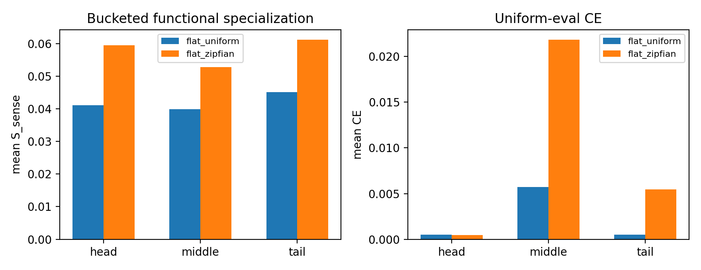

# Result Summary: H0529a Zipfian Frequency Shortcut

Hypothesis purpose card:

```text
Projects/from-attention-to-search/main/hypotheses/archive/H0529a_zipfian_frequency_shortcut/purpose_card.md
```

## Observation

主指标是 tail bucket 的 ablation-based context-sense functional specialization，即 tail $S_{\mathrm{sense}}$。它决定判断，因为 H0529a 问的是 Zipfian token frequency 是否会削弱 rare token-context 的功能性专家分工，而不是 routing heatmap 是否变得不同。

结果不支持原强假设：

| Condition | Head $S_{\mathrm{sense}}$ | Middle $S_{\mathrm{sense}}$ | Tail $S_{\mathrm{sense}}$ |
|---|---:|---:|---:|
| `flat_uniform` | `0.0411` | `0.0399` | `0.0451` |
| `flat_zipfian` | `0.0595` | `0.0528` | `0.0612` |

Zipfian condition 的 tail $S_{\mathrm{sense}}$ 没有下降，反而高于 uniform。

Route-function alignment 也没有显示 tail failure 被 Zipfian 放大：

| Condition | Head alignment | Middle alignment | Tail alignment |
|---|---:|---:|---:|
| `flat_uniform` | `0.7714` | `0.8166` | `0.7777` |
| `flat_zipfian` | `0.8542` | `0.8128` | `0.7930` |

但 Zipfian 确实改变了训练和负载结构：

| Condition | Final train loss | Final load entropy | Selected gate prob |
|---|---:|---:|---:|
| `flat_uniform` | `0.0021` | `0.8143` | `0.6731` |
| `flat_zipfian` | `0.0039` | `0.5218` | `0.7734` |

Zipfian 的 final load entropy 更低，说明专家负载更集中；uniform-eval CE 也在 middle/tail 略差：

| Condition | Head CE | Middle CE | Tail CE |
|---|---:|---:|---:|
| `flat_uniform` | `0.0005` | `0.0057` | `0.0005` |
| `flat_zipfian` | `0.0005` | `0.0219` | `0.0055` |

## Interpretation

H0529a 的强版本被削弱：在当前 Zipfian hierarchical-sense setup 中，token frequency pressure 没有直接表现为 tail context-sense functional specialization 下降。

更安全的解释是：

```text
Zipfian frequency 改变了 optimization / load structure，
但它不是 flat top-1 router functional specialization failure 的充分放大器。
```

这把下一步判断从“Zipfian 一定会制造更强 shortcut failure”改成：

```text
frequency pressure 需要和 objective / route-function binding 一起看；
不能只靠 Zipfian 数据分布解释 uniform setup 中的 route-function mismatch。
```

## Limitation

本结果只覆盖第一版 Zipfian control：token frequency 是 Zipfian，但 context distribution conditional on token 仍然 balanced。它不能否定 context/sense frequency 本身 heavy-tailed 时的 failure。

另外，$S_{\mathrm{sense}}$ 在 Zipfian 下变大可能部分来自 ablation delta scale 变大，而不是更干净的专家语义分工。因此必须同时看 CE、alignment 和 route diagnostics。

## Key Figures



这张图说明：Zipfian 没有降低 tail $S_{\mathrm{sense}}$，但 uniform-eval CE 在 middle/tail 有小幅变差。

## Claim Update

Supported:

- Zipfian token frequency 会改变训练负载结构；`flat_zipfian` 的 final load entropy 明显低于 `flat_uniform`。

Weakened:

- “Zipfian token frequency 会放大 flat router 的 tail functional specialization failure”没有被当前结果支持。

Still unclear:

- Hierarchical common/sense MoE 是否能在同一 Zipfian setup 下改善 functional specialization。
- 如果 context/sense frequency 也 heavy-tailed，failure 是否会更明显。

## What Cannot Be Claimed

不能 claim：

- Zipfian 分布不会造成任何 router shortcut；
- frequency 对 MoE specialization 不重要；
- Hierarchical MoE 已经没有必要；
- 真实语言中的 long-tail sense distribution 会有同样行为；
- routing NMI 足以证明或否定 functional specialization。

## Next Decision

继续完成 H0530a hierarchy comparison，但解释口径要收紧：它不再是“修复已证明的 Zipfian tail failure”，而是测试 common/sense decomposition 是否能在 Zipfian load-skew 条件下进一步改善 route-function alignment。

## Result Documents

Detailed:

```text
Projects/from-attention-to-search/main/experiments/H0529a_zipfian_frequency_shortcut/detailed.md
```

Curated tables:

```text
Projects/from-attention-to-search/main/experiments/H0529a_zipfian_frequency_shortcut/tables/
```

Runner:

```text
XingyuD/Attention_Search_Experiments/active/synthetic_data_understanding/scripts/run_h0529a_zipfian_frequency_shortcut.py
```

Config:

```text
XingyuD/Attention_Search_Experiments/active/synthetic_data_understanding/configs/h0529a_zipfian_frequency_shortcut.json
```

ACP job:

```text
pt-1d236anf
```
