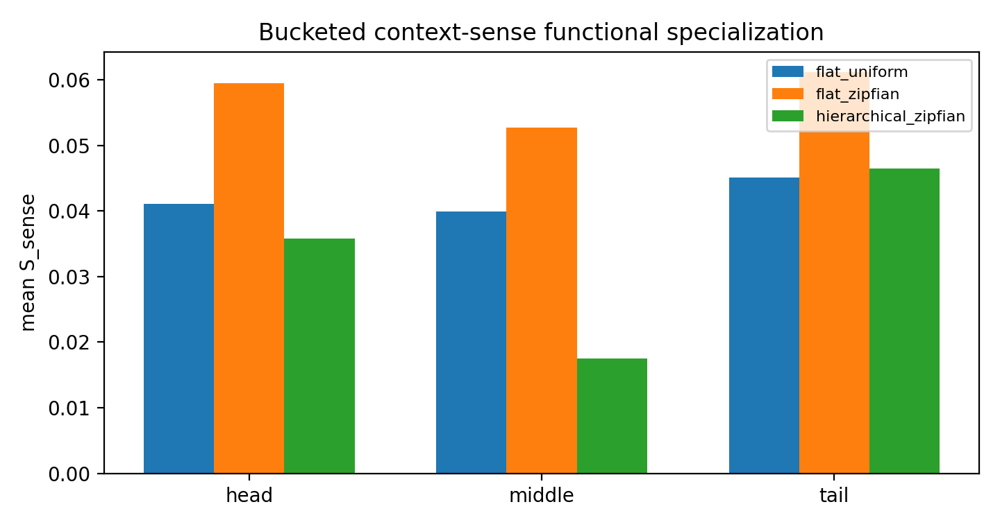
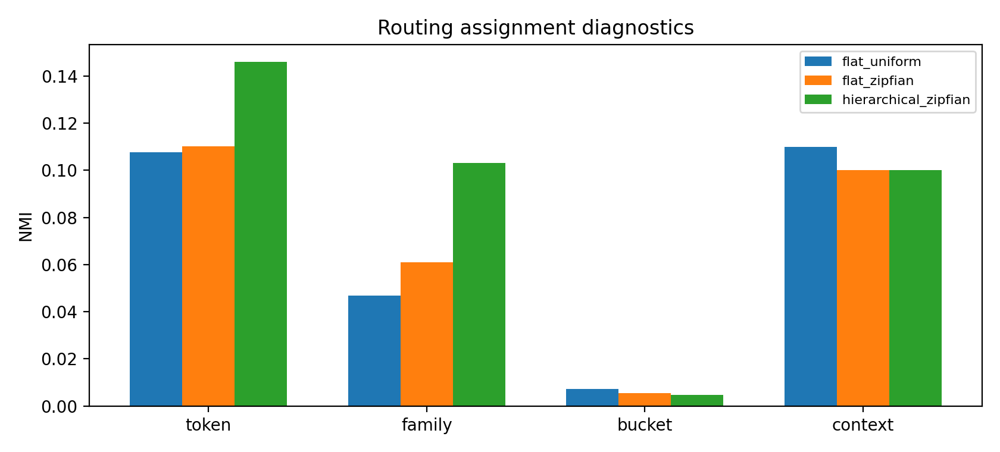

# Detailed Report: H0530a Hierarchical Common/Sense MoE

## 0. 摘要

H0530a 问的是：

> 在同一个 Zipfian hierarchical-sense dataset 上，two-level common/sense MoE 是否比 flat top-1 sparse MoE 更能形成 tail context-sense functional specialization？

答案是：

```text
没有。
当前 hierarchy 没有改善 tail S_sense，也明显降低 tail route-function alignment，并使 tail uniform-eval CE 变差。
```

因此本实验不支持“common/sense hierarchy alone 解决 route-function mismatch”。

## 1. 实验设置

Shared runner:

```text
XingyuD/Attention_Search_Experiments/active/synthetic_data_understanding/scripts/run_h0529a_zipfian_frequency_shortcut.py
```

Shared config:

```text
XingyuD/Attention_Search_Experiments/active/synthetic_data_understanding/configs/h0529a_zipfian_frequency_shortcut.json
```

ACP job:

```text
pt-1d236anf
```

Run name:

```text
h0529a_zipfian_hierarchical_4gpu_20260525
```

Conditions:

```text
flat_zipfian
hierarchical_zipfian
```

Hierarchy implementation:

- coarse common MoE routes current hidden state；
- fine MoE routes a family-reference residual；
- output is common path plus fine path；
- no load balance；
- top-1 selected-gate sparse dispatch。

## 2. Implementation Audit

The full run completed successfully:

```text
status: completed
ACP state: SUCCEEDED
CUDA_DEVICE_COUNT: 4
```

Sparse dispatch checks passed in the run entry audit:

```text
router gradient: nonzero
router delta after optimizer step: nonzero
active experts per token: 1
full_soft_mixture: False
selected_gate_renormalized: False
```

## 3. Primary Functional Metric

Primary metric:

$$
S_{\mathrm{sense}}^{B}(k)=\max_e\left[\Delta L_{k,e}-\max_{k'\neq k}\Delta L_{k',e}\right]
$$

Summary:

| Condition | Head $S_{\mathrm{sense}}$ | Middle $S_{\mathrm{sense}}$ | Tail $S_{\mathrm{sense}}$ |
|---|---:|---:|---:|
| `flat_zipfian` | `0.0595` | `0.0528` | `0.0612` |
| `hierarchical_zipfian` | `0.0358` | `0.0176` | `0.0465` |

Interpretation:

```text
Hierarchy did not improve ablation-based functional specialization.
```

## 4. Route-Function Alignment

| Condition | Head alignment | Middle alignment | Tail alignment |
|---|---:|---:|---:|
| `flat_zipfian` | `0.8542` | `0.8128` | `0.7930` |
| `hierarchical_zipfian` | `0.8432` | `0.3480` | `-0.0693` |

Tail alignment becoming negative means the dominant routed fine expert is not the expert whose ablation most increases the tail sense loss; in some cases its ablation can even reduce CE. This is direct route-function mismatch evidence.

## 5. Task Performance

| Condition | Head CE | Middle CE | Tail CE | Head acc | Middle acc | Tail acc |
|---|---:|---:|---:|---:|---:|---:|
| `flat_zipfian` | `0.0005` | `0.0219` | `0.0055` | `1.0000` | `0.9902` | `0.9978` |
| `hierarchical_zipfian` | `0.0011` | `0.0182` | `0.0920` | `0.9996` | `0.9935` | `0.9735` |

Hierarchy slightly improves middle CE but substantially worsens tail CE. Since the hypothesis is tail specialization, this does not support the hierarchy.

## 6. Routing Diagnostics

| Condition | NMI(route, token) | NMI(route, family) | NMI(route, bucket) | NMI(route, context) |
|---|---:|---:|---:|---:|
| `flat_zipfian` | `0.1102` | `0.0609` | `0.0054` | `0.1002` |
| `hierarchical_zipfian` | `0.1461` | `0.1031` | `0.0046` | `0.1002` |

Hierarchy increases route-token and route-family association, but this does not improve functional specialization. This repeats the uniform-setup lesson:

```text
routing structure is not expert function evidence.
```

## 7. Figures



This figure shows that `hierarchical_zipfian` is below `flat_zipfian` on all buckets for $S_{\mathrm{sense}}$.



This figure shows that higher token/family routing association does not imply better causal expert utility.

## 8. Interpretation

Result:

```text
Hierarchy changed routing assignment and retained task learning, but did not improve functional expert specialization.
```

Interpretation:

```text
The bottleneck remains route-function binding, not merely whether the router has a two-level semantic decomposition.
```

Claim:

```text
In this minimal Zipfian common/sense synthetic setup, current Hierarchical MoE does not solve flat router route-function mismatch.
```

Speculation:

```text
The fine router may still optimize an assignment that is convenient for NTP loss rather than one that makes expert utility identifiable. A useful hierarchy may require explicit route-function consistency, utility-aware routing, load/exploration control, or a better fine-reference construction.
```

## 9. Claim Boundary

Can claim:

```text
The tested minimal common/sense hierarchy did not improve tail ablation-based functional specialization relative to flat Zipfian top-1 sparse MoE.
```

Cannot claim:

```text
All Hierarchical MoE variants fail.
Common/sense decomposition has no value.
Real language MoE will behave similarly.
Extra capacity was controlled away.
```

## 10. Artifact Map

Curated tables:

```text
Projects/from-attention-to-search/main/experiments/H0530a_hierarchical_common_sense_moe/tables/
```

Curated figures:

```text
Projects/from-attention-to-search/main/experiments/H0530a_hierarchical_common_sense_moe/figures/
```

Raw result dir:

```text
XingyuD/Attention_Search_Experiments/active/synthetic_data_understanding/results/h0529a_zipfian_frequency_shortcut/h0529a_zipfian_hierarchical_4gpu_20260525
```

Runtime log:

```text
XingyuD/Attention_Search_Experiments/active/synthetic_data_understanding/logs/acp/h0529a_zipfian_hierarchical_4gpu_20260525_runtime_20260525_034916.log
```

Repro command:

```bash
H0529A_ZIPFIAN_ALLOW_REAL_SUBMIT=1 \
RUN_NAME=h0529a_zipfian_hierarchical_4gpu_20260525 \
JOB_NAME=ats-h0529a-zipfian-hier-4gpu \
RUN_STAGE=full \
MAX_PARALLEL=4 \
bash scripts/submit_h0529a_zipfian_frequency_shortcut_4gpu_acp.sh
```
