# Detailed Result: slot_context_dominance_router_specialization

Anchor:

```text
../../problem_anchors/gated_main_causes/slot_context_dominance_router_specialization_anchor.md
```

Story:

```text
This experiment separates whether slot context can control routing for one fixed B token from whether the same mechanism survives many B-token identities.
```

## 0. Quick Recap

目的：检验 stronger slot context + slot-centroid router init 是否足以让 top-1 MoE 形成 slot-aligned routing 和 slot-specific expert utility。

假设：如果 slot 信息在 B-position hidden state 中可见且决定 target，那么 learned top-1 router 应该按 slot 分 expert，并且 assigned expert 应与 utility-best expert 对齐。

实验思路：先跑 `single_b_sanity`，固定同一个 `B_i`，只改变 slot；再跑 `multi_b_primary`，使用 256 个 `B_i` 测试 B identity variation 是否压过 slot context。

结论：single-B 支持 slot 可控 routing；multi-B 削弱 strong hypothesis。trajectory follow-up 进一步说明，multi-B 的主要问题不是一个干净 slot router 在训练中崩坏，而是 slot-centroid init 在 256 个 B identity 下起点就不干净；训练会增加 slot-center separation、改善 route NMI 和 Assign-Utility，但仍没有把 route assignment 稳定绑定到 utility-best expert。

证据：multi-B `A_long_repeated` 的 route NMI `0.243 -> 0.591`、Assign-Utility `0.565 -> 0.925`；`B_long_distributed` 的 route NMI `0.078 -> 0.313`、Assign-Utility `0.326 -> 0.747`；`Oracle_b_position_only` 与 `Oracle_slot_router` 最终均为 `1.000`。

## 1. Anchor Link And Decision Point

Anchor:

```text
Projects/from-attention-to-search/main/problem_anchors/gated_main_causes/slot_context_dominance_router_specialization_anchor.md
```

Parent question:

```text
why ordinary gating does not produce stable functional specialization
```

This experiment updates:

```text
weak slot signal may explain prior routing failure
```

## 2. Purpose

这个实验不是证明 MoE 有用，也不是测试 reverse KV retrieval。它只回答一个窄问题：

```text
当 slot context 明确决定 B_i 后的 target 时，standard top-1 selected-gate MoE 是否会把 route assignment 绑定到 slot-specific expert utility？
```

## 3. Hypothesis And Rival Explanations

Primary hypothesis:

```text
stronger slot context plus slot-centroid init is sufficient for learned top-1 routing to become slot-functional.
```

Rival explanations:

```text
slot is visible but learned router does not use it;
router uses slot in single-B but B identity variation dominates in multi-B;
route heatmap aligns but expert causal utility does not.
```

## 4. Experiment Logic

Two stages:

| Stage | Mode | Role |
|---|---|---|
| 1 | `single_b_sanity` | 固定同一个 B token，只测 slot context 是否能让 route heatmap 对角化 |
| 2 | `multi_b_primary` | 使用 256 个 `B_i`，测试 slot routing 是否能抵抗 B identity variation |

Conditions:

| Condition | Meaning |
|---|---|
| `C0_short_slot_init` | one-token slot cue baseline |
| `A_long_repeated_slot_init` | 5-token repeated slot cue |
| `B_long_distributed_slot_init` | 5-token distributed code; no single position identifies slot |
| `Oracle_slot_router` | forced `slot -> expert` upper bound |
| `Oracle_b_position_only` | forced `slot -> expert` only at B position |
| `A_long_random_init` | repeated cue with random router init control |
| `B_long_random_init` | distributed code with random router init control |

## 5. Setup

Training uses normal full-sequence causal NTP:

```text
loss = mean CE(x_t -> x_{t+1})
```

Primary metrics are measured at B position:

```text
positions 10-14: slot prefix
position 15: B_i
position 16: Y_{s,i}
seq_len = 32
```

The model is the corrected `top1_selected_gate_sparse` path:

```text
experts = 4
slots = 4
load balance = off
steps = 1600
seeds = 20260521, 20260522, 20260523, 20260524
```

## 6. Primary Metric And Decision Rule

Primary decision metric bundle:

```text
route NMI / route heatmap / forced utility heatmap / assignment_utility_agreement
```

Assign-Utility asks whether the routed expert equals the expert whose ablation causes the largest slot-conditioned CE increase. It is necessary but not sufficient: route NMI alone can be high without causal expert utility, while random-init controls show Assign-Utility can be high when utility collapses to a common expert.

Supporting metrics:

```text
target-position accuracy
h_B -> slot probe accuracy
NMI(route, slot)
best-permutation route-slot diagonal purity
NMI(route, B id)
```

## 7. Main Result

| Mode | Condition | Target Acc | Probe h_B->slot | Route NMI | Diag Purity | Assign-Utility |
|---|---|---:|---:|---:|---:|---:|
| `single_b_sanity` | `C0_short_slot_init` | 1.000 | 1.000 | 0.467 | 0.562 | 1.000 |
| `single_b_sanity` | `A_long_repeated_slot_init` | 1.000 | 1.000 | 1.000 | 1.000 | 1.000 |
| `single_b_sanity` | `B_long_distributed_slot_init` | 1.000 | 1.000 | 0.893 | 0.812 | 1.000 |
| `single_b_sanity` | `Oracle_slot_router` | 1.000 | 1.000 | 1.000 | 1.000 | 1.000 |
| `multi_b_primary` | `C0_short_slot_init` | 1.000 | 1.000 | 0.338 | 0.553 | 0.759 |
| `multi_b_primary` | `A_long_repeated_slot_init` | 1.000 | 1.000 | 0.593 | 0.646 | 0.921 |
| `multi_b_primary` | `B_long_distributed_slot_init` | 1.000 | 1.000 | 0.297 | 0.502 | 0.733 |
| `multi_b_primary` | `Oracle_slot_router` | 1.000 | 0.997 | 1.000 | 1.000 | 1.000 |

## 8. Mechanism Follow-Up

Purpose:

```text
Fill five diagnostic gaps:
1. route NMI at initialization versus final;
2. route NMI trajectory during training;
3. route-slot and forced-utility heatmaps;
4. strict B-position-only Oracle;
5. random-init controls.
```

It also records whether routing and slot differentiation can be seen directly through:

```text
slot center norm / cosine movement
router weight delta from initialization
router-weight to slot-center cosine
slot-center and router-weight PCA paths
```

Trajectory result:

| Mode | Condition | NMI 0 -> 1600 | Assign 0 -> 1600 | Center norm 0 -> 1600 | Router delta final |
|---|---|---:|---:|---:|---:|
| `single_b` | `A_long_repeated_slot_init` | 1.000 -> 1.000 | 0.438 -> 1.000 | 1.089 -> 3.186 | 0.165 |
| `single_b` | `B_long_distributed_slot_init` | 1.000 -> 0.893 | 0.438 -> 1.000 | 0.491 -> 4.185 | 0.146 |
| `single_b` | `Oracle_b_position_only` | 1.000 -> 1.000 | 0.438 -> 1.000 | 1.089 -> 3.982 | 0.000 |
| `single_b` | `A_long_random_init` | 0.217 -> 0.159 | 0.375 -> 1.000 | 1.089 -> 5.885 | 0.220 |
| `single_b` | `B_long_random_init` | 0.000 -> 0.000 | 0.500 -> 1.000 | 0.491 -> 6.013 | 0.219 |
| `multi_b` | `A_long_repeated_slot_init` | 0.243 -> 0.591 | 0.565 -> 0.925 | 1.166 -> 4.903 | 0.167 |
| `multi_b` | `B_long_distributed_slot_init` | 0.078 -> 0.313 | 0.326 -> 0.747 | 0.652 -> 4.298 | 0.177 |
| `multi_b` | `Oracle_b_position_only` | 1.000 -> 1.000 | 0.625 -> 1.000 | 1.166 -> 3.644 | 0.000 |
| `multi_b` | `A_long_random_init` | 0.009 -> 0.351 | 0.402 -> 0.908 | 1.166 -> 5.562 | 0.303 |
| `multi_b` | `B_long_random_init` | 0.006 -> 0.010 | 0.420 -> 0.998 | 0.652 -> 5.039 | 0.285 |

Interpretation:

```text
multi-B slot-centroid initialization is not initially diagonal enough:
A_long starts at NMI 0.243; B_long starts at NMI 0.078.
Training improves both but does not close the gap to Oracle.
```

The strict `Oracle_b_position_only` condition reaches the same upper-bound outcome as the all-position Oracle. This means the upper bound does not depend on forcing the whole sequence; routing only at the B position is enough for the slot-utility solution.

Random-init controls are important because they expose a metric caveat. In multi-B `B_long_random_init`, Assign-Utility reaches `0.998` while route NMI stays `0.010`. This can happen when utility-best expert collapses toward a common expert, so Assign-Utility must be interpreted together with route NMI, route heatmap, and forced expert loss heatmap.

## 9. Key Figures

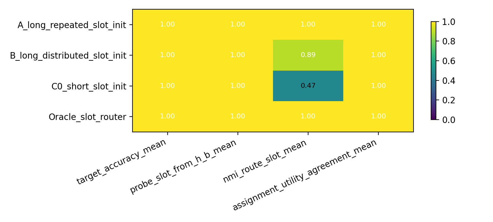

Supports: fixed-B 条件下，long repeated cue 让 route-slot alignment 和 assignment-utility 同时达到 1.0，是 slot context 可控制 routing 的正控证据。

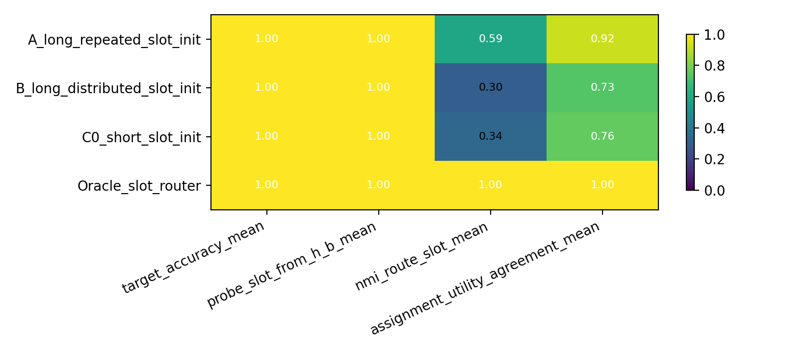

Supports: multi-B 条件下，slot probe 和 target accuracy 接近满分，但 learned routing 的 route-slot alignment 与 assignment-utility 没有稳定达到 Oracle，说明问题不是 slot 完全不可见。

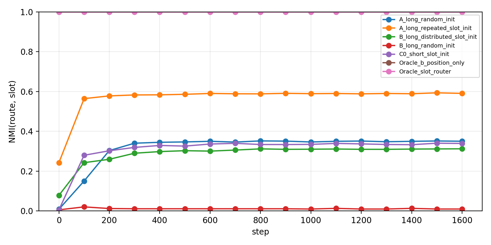

Supports: multi-B slot-init 条件在 step 0 就低于 clean diagonal routing；训练提高 NMI，但 distributed code 最终仍明显不足。

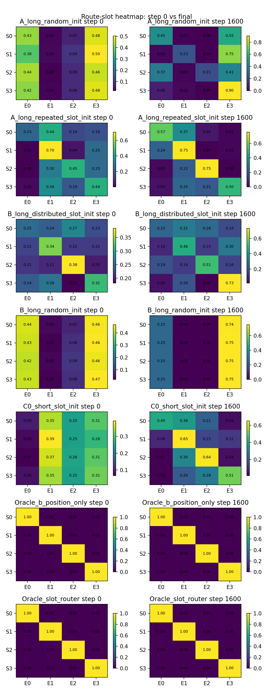

Supports: initial/final heatmap 直接显示 route distribution 不是 clean slot-to-expert permutation。

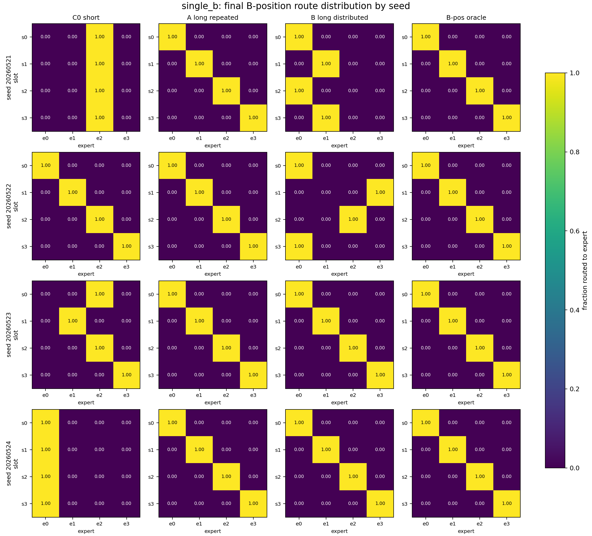

Supports: fixed-B 下 `A_long_repeated` 在所有 seeds 都达到 final 对角 routing；`B_long_distributed` 大多对齐但仍有 seed 差异。

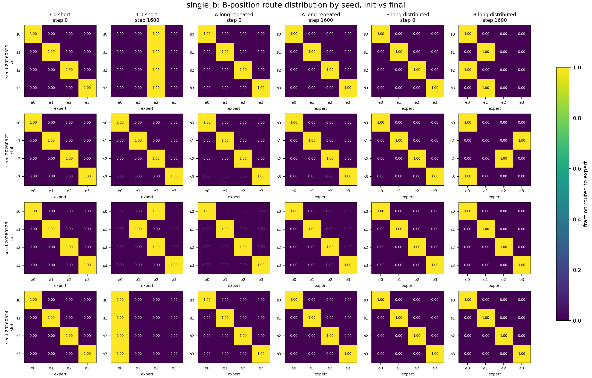

Supports: fixed-B 的 init/final 对比显示 short cue 可在训练中退化到 common expert，而 `A_long_repeated` 保持跨 seed 对角分发。

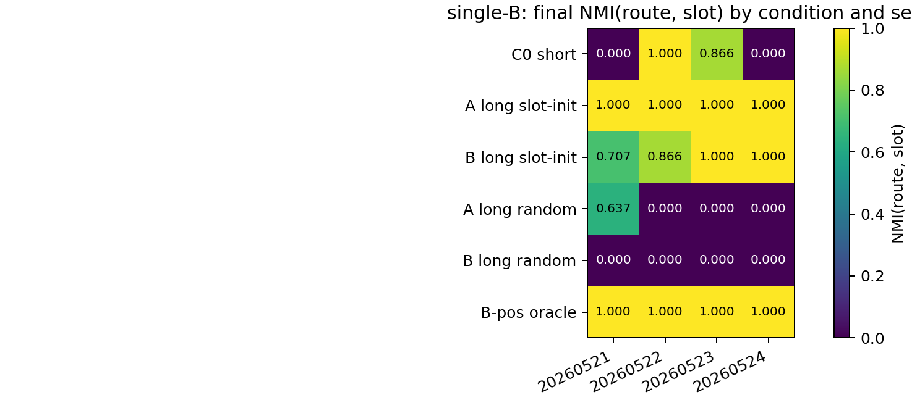

Supports: fixed-B 的 condition-by-seed NMI heatmap 显示 `A_long_repeated` 跨 seeds 稳定为 1.0，强于 short 和 random controls。

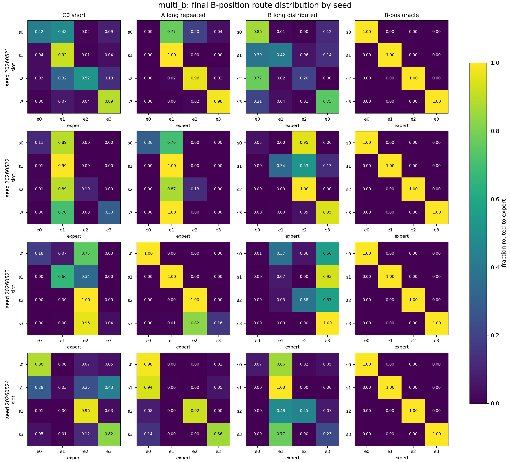

Supports: multi-B 下 seed-level 分发图显示 `A_long_repeated` 只是不稳定改善，`B_long_distributed` 没有跨 seed 稳定形成 slot-to-expert permutation。

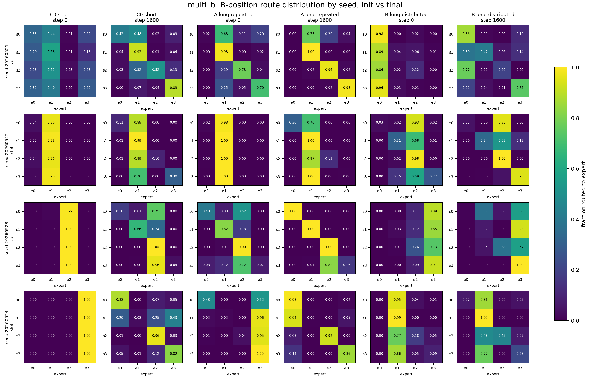

Supports: multi-B 的 init/final 对比显示 slot-centroid init 在多 B identity 下起点不完全对角，训练后 `A_long` 多数 seeds 改善但仍不稳定。

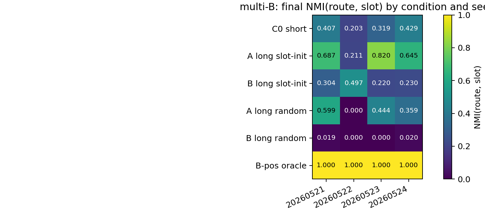

Supports: multi-B 的 final NMI heatmap 显示 `A_long` 多数 seeds 高于 `C0`，但 seed instability 仍明显；`B_long` 不支持稳定 slot-specialization。

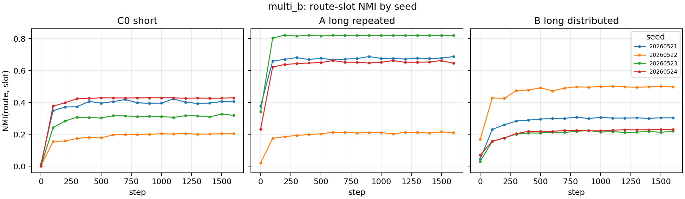

Supports: seed-level NMI trajectory 显示平均趋势会掩盖 seed 2 的 `A_long` 失败和 `B_long` 的整体低对齐。

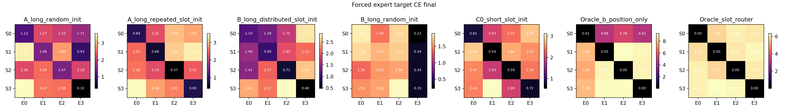

Supports: forced expert loss heatmap 用 utility 侧检查 slot-specific expert advantage，避免把 route heatmap 误读成功能 specialization。

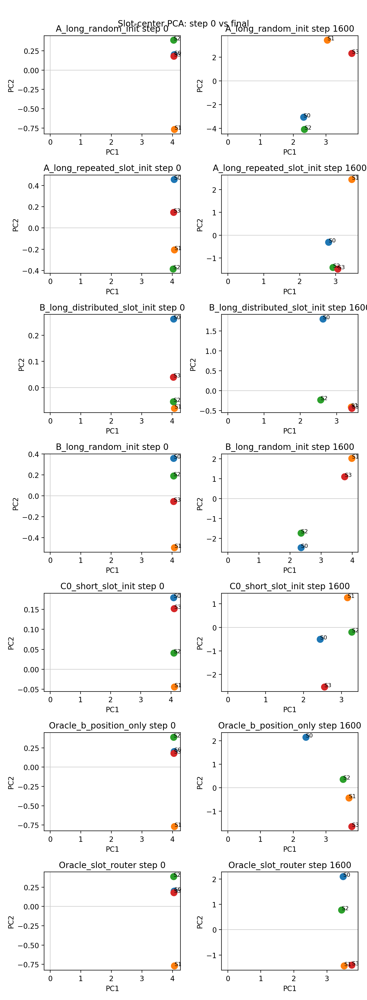

Supports: slot centers 在训练中分离，说明 representation geometry 确实移动；问题是 router 没有稳定把这种分离转成 slot-functional top-1 assignment。

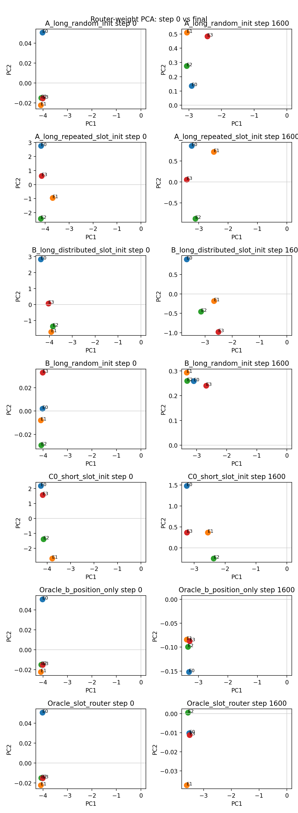

Supports: router weights 也在移动，但 movement 本身不保证 route assignment 与 utility-best expert 对齐。

## 10. Evidence Walkthrough

Observation:

```text
single-B: long repeated cue reaches route NMI = 1.0 and assignment-utility = 1.0.
single-B: distributed code reaches assignment-utility = 1.0 but route NMI = 0.893.
multi-B: h_B slot probe remains near 1.0 for learned conditions.
multi-B: A_long improves assignment-utility to 0.921, but not perfect.
multi-B: B_long distributed falls to 0.733 assignment-utility and 0.297 route NMI.
multi-B: Oracle remains 1.0 on route and assignment-utility.
multi-B trajectory: A_long starts at route NMI 0.243 and ends at 0.591.
multi-B trajectory: B_long starts at route NMI 0.078 and ends at 0.313.
multi-B strict B-position Oracle reaches final assignment-utility 1.0.
multi-B B_long random-init reaches assignment-utility 0.998 but route NMI 0.010, exposing a utility-collapse metric caveat.
```

Interpretation:

```text
slot information is visible and useful, but standard learned top-1 routing does not reliably choose it as the functional specialization axis when many B identities are present.
```

## 11. Interpretation

The result splits the weak-context explanation:

```text
weak context signal explains part of the previous failure only in the degenerate same-B diagnostic.
```

But the stronger claim is weakened:

```text
stronger slot context and centroid init are not sufficient for robust multi-B functional specialization.
```

The most informative contrast is:

```text
multi-B Oracle = 1.0
multi-B learned B_long distributed = 0.733
```

This means the task admits slot-specific expert utility, but learned routing does not robustly bind to it.

## 12. Full Experiment Record

Data construction:

```text
slots = 4
experts = 4
single_b_sanity: one shared B token across slots
multi_b_primary: 256 B-token identities across slots
slot prefix positions = 10-14
B position = 15
target position = 16
seq_len = 32
```

Training setup:

```text
model path: top1_selected_gate_sparse
training loss: full-sequence causal NTP
load balance: off
steps: 1600
seeds: 20260521, 20260522, 20260523, 20260524
first-pass conditions: C0_short_slot_init, A_long_repeated_slot_init, B_long_distributed_slot_init, Oracle_slot_router
trajectory follow-up conditions: C0_short_slot_init, A_long_repeated_slot_init, B_long_distributed_slot_init, Oracle_slot_router, Oracle_b_position_only, A_long_random_init, B_long_random_init
```

Curated tables:

```text
tables/single_b_summary_by_condition.csv
tables/multi_b_summary_by_condition.csv
tables/single_b_trajectory_summary_by_condition.csv
tables/multi_b_trajectory_summary_by_condition.csv
tables/single_b_trajectory_route_metrics_by_step.csv
tables/multi_b_trajectory_route_metrics_by_step.csv
tables/trajectory_initial_final_by_condition.csv
```

Curated figures:

```text
figures/single_b_decision_metrics.png
figures/multi_b_decision_metrics.png
figures/single_b_route_nmi_initial_final_bar.png
figures/single_b_route_slot_nmi_trajectory.png
figures/single_b_route_slot_heatmap_step0_final.png
figures/single_b_seed_final_route_slot_heatmaps.png
figures/single_b_seed_route_nmi_trajectory.png
figures/single_b_forced_expert_loss_heatmap_final.png
figures/single_b_router_weight_to_slot_center_cosine_trajectory.png
figures/multi_b_route_nmi_initial_final_bar.png
figures/multi_b_route_slot_nmi_trajectory.png
figures/multi_b_route_slot_heatmap_step0_final.png
figures/multi_b_seed_final_route_slot_heatmaps.png
figures/multi_b_seed_route_nmi_trajectory.png
figures/multi_b_forced_expert_loss_heatmap_final.png
figures/multi_b_slot_center_pca_step0_final.png
figures/multi_b_router_weight_pca_step0_final.png
figures/multi_b_router_weight_to_slot_center_cosine_trajectory.png
```

ACP jobs:

```text
single_b_sanity: pt-1hik6tn0
multi_b_primary: pt-9pm1t5ul
single_b_trajectory_followup: pt-xmf0ui1b
multi_b_trajectory_followup: pt-1cchrtfq
```

No failed or partial runs are promoted into this report. Runtime logs remain in
the code workspace log paths listed in the artifact map.

## 13. Claim Boundary

Supported:

```text
slot context can control routing when B identity is fixed.
```

Weakened:

```text
slot visibility plus slot-centroid init is sufficient for ordinary top-1 NTP MoE specialization.
```

Not claimed:

```text
real-corpus expert specialization;
reverse-index utility;
benefit of load balance or auxiliary routing objectives;
failure of all MoE architectures.
```

## 14. Next Decision

Do not add a broader context-length sweep yet.

Next minimal test:

```text
multi_b_primary + target-position route-function binding signal
```

The decisive question is whether explicit binding can raise:

```text
A_long assignment_utility_agreement: 0.921 -> near 1.0 stable across seeds
B_long assignment_utility_agreement: 0.733 -> materially higher
```

## 15. Links And Artifact Map

anchor:

```text
Projects/from-attention-to-search/main/problem_anchors/gated_main_causes/slot_context_dominance_router_specialization_anchor.md
```

summary:

```text
Projects/from-attention-to-search/main/experiments/slot_context_dominance_router_specialization/summary.md
```

detailed:

```text
Projects/from-attention-to-search/main/experiments/slot_context_dominance_router_specialization/detailed.md
```

code workspace:

```text
Projects/from-attention-to-search/XingyuD/Attention_Search_Experiments/active/synthetic_data_understanding
```

runner:

```text
scripts/run_slot_context_dominance_router_specialization.py
```

config:

```text
configs/slot_context_dominance_router_specialization.json
```

key code files:

```text
src/synthetic_data_understanding/tiny_moe.py
scripts/submit_slot_context_dominance_4gpu_acp.sh
```

data / manifest:

```text
results/slot_context_dominance_router_specialization/slot_context_single_b_full_20260526/data_audit.json
results/slot_context_dominance_router_specialization/slot_context_multi_b_full_20260526/data_audit.json
results/slot_context_dominance_router_specialization/slot_context_single_b_trajectory_full_20260527/data_audit.json
results/slot_context_dominance_router_specialization/slot_context_multi_b_trajectory_full_20260527/data_audit.json
```

result dir:

```text
results/slot_context_dominance_router_specialization/slot_context_single_b_full_20260526
results/slot_context_dominance_router_specialization/slot_context_multi_b_full_20260526
results/slot_context_dominance_router_specialization/slot_context_single_b_trajectory_full_20260527
results/slot_context_dominance_router_specialization/slot_context_multi_b_trajectory_full_20260527
```

figure dir:

```text
figures/slot_context_dominance_router_specialization/slot_context_single_b_full_20260526
figures/slot_context_dominance_router_specialization/slot_context_multi_b_full_20260526
figures/slot_context_dominance_router_specialization/slot_context_single_b_trajectory_full_20260527
figures/slot_context_dominance_router_specialization/slot_context_multi_b_trajectory_full_20260527
```

curated tables:

```text
Projects/from-attention-to-search/main/experiments/slot_context_dominance_router_specialization/tables/
```

curated figures:

```text
Projects/from-attention-to-search/main/experiments/slot_context_dominance_router_specialization/figures/
```

logs / checkpoints:

```text
logs/acp/slot_context_single_b_full_20260526_runtime_*.log
logs/acp/slot_context_multi_b_full_20260526_runtime_*.log
logs/acp/slot_context_single_b_trajectory_full_20260527_runtime_*.log
logs/acp/slot_context_multi_b_trajectory_full_20260527_runtime_*.log
results/slot_context_dominance_router_specialization/*/*/*/seed_*/model.pt
```

first-pass repro command:

```bash
python scripts/run_slot_context_dominance_router_specialization.py \
  --config configs/slot_context_dominance_router_specialization.json \
  --run-name slot_context_multi_b_full_20260526 \
  --run-stage full \
  --modes multi_b_primary \
  --conditions C0_short_slot_init,A_long_repeated_slot_init,B_long_distributed_slot_init,Oracle_slot_router \
  --seeds 20260521,20260522,20260523,20260524 \
  --parallel \
  --max-parallel 4
```

trajectory follow-up repro command:

```bash
python scripts/run_slot_context_dominance_router_specialization.py \
  --config configs/slot_context_dominance_router_specialization.json \
  --run-name slot_context_multi_b_trajectory_full_20260527 \
  --run-stage full \
  --modes multi_b_primary \
  --conditions C0_short_slot_init,A_long_repeated_slot_init,B_long_distributed_slot_init,Oracle_slot_router,Oracle_b_position_only,A_long_random_init,B_long_random_init \
  --seeds 20260521,20260522,20260523,20260524 \
  --parallel \
  --max-parallel 4 \
  --trajectory
```

job id:

```text
single_b_sanity: pt-1hik6tn0
multi_b_primary: pt-9pm1t5ul
single_b_trajectory_followup: pt-xmf0ui1b
multi_b_trajectory_followup: pt-1cchrtfq
bridge_abcd_single_b: pt-qeorv2p9
bridge_abcd_multi_b: pt-gr1vtgfn
```

## 17. Bridge Experiment: r-B / AB / CB / DB

结论：bridge 结果把 0524 和当前实验的表面冲突拆开了。0524 的结论是 semantic init alone 不足以形成 stable functional specialization；bridge 的结论是，当 B-position target pressure 对齐时，long role context 可以显著增强 route-role alignment。二者不矛盾。

Bridge docs:

```text
summary: ../slot_context_bridge_abcd_context_length/summary.md
detailed: ../slot_context_bridge_abcd_context_length/detailed.md
```

Bridge result table:

| Mode | Condition | Init | Final NMI | Final Assign-Utility | Target Acc |
|---|---|---|---:|---:|---:|
| fixed-B | short role | semantic | 0.467 | 1.000 | 1.000 |
| fixed-B | long role | semantic | 1.000 | 1.000 | 1.000 |
| fixed-B | distributed role | semantic | 0.893 | 1.000 | 1.000 |
| multi-B | short role | semantic | 0.338 | 0.759 | 1.000 |
| multi-B | long role | semantic | 0.593 | 0.921 | 1.000 |
| multi-B | distributed role | semantic | 0.297 | 0.733 | 1.000 |

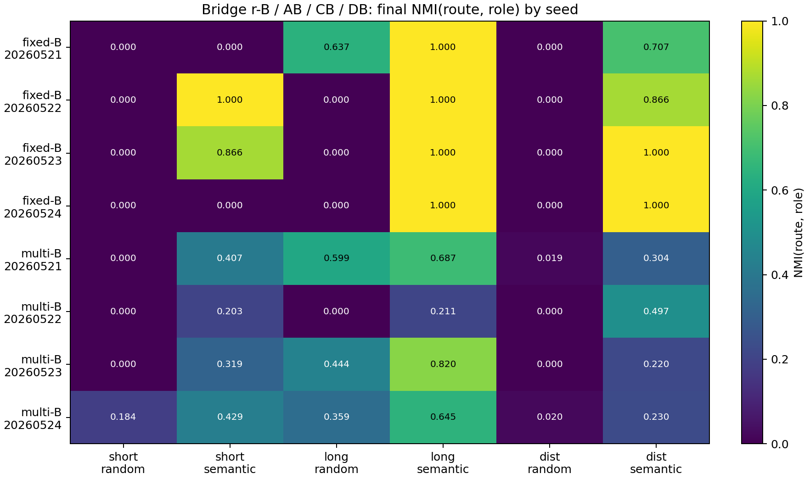

Interpretation: seed-level NMI shows fixed-B long semantic is stable, while multi-B remains unstable even when semantic init helps.

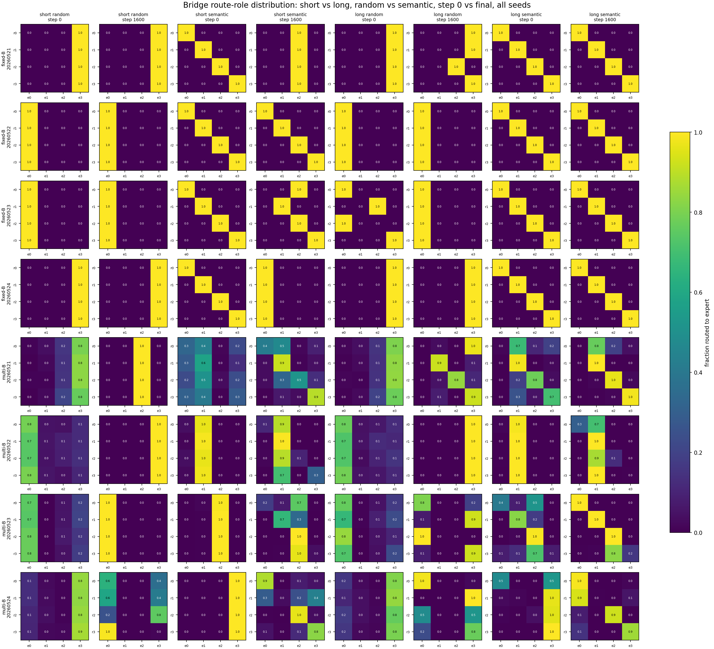

Interpretation: semantic centroid init plus long role context is the clearest role-aligned route prior. Random init does not reliably self-organize into the same partition.

Bridge artifacts:

```text
curated tables:
Projects/from-attention-to-search/main/experiments/slot_context_bridge_abcd_context_length/tables/bridge_abcd_initial_final_by_seed.csv
Projects/from-attention-to-search/main/experiments/slot_context_bridge_abcd_context_length/tables/bridge_abcd_single_b_summary_by_condition.csv
Projects/from-attention-to-search/main/experiments/slot_context_bridge_abcd_context_length/tables/bridge_abcd_multi_b_summary_by_condition.csv

result dirs:
results/slot_context_dominance_router_specialization/bridge_abcd_single_b_full_20260527
results/slot_context_dominance_router_specialization/bridge_abcd_multi_b_full_20260527
```
