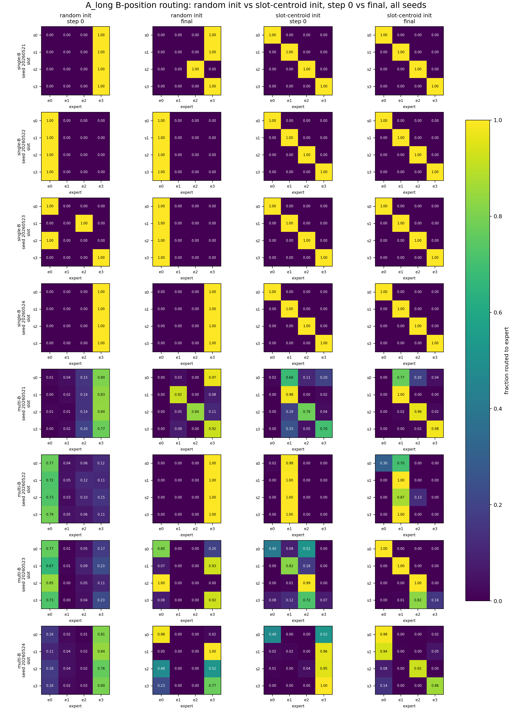

# Result Summary: slot_context_dominance_router_specialization

Anchor:

```text
../../problem_anchors/gated_main_causes/slot_context_dominance_router_specialization_anchor.md
```

Story:

```text
This experiment tests whether stronger slot context can make top-1 MoE routing follow slot-specific expert utility rather than B-token identity variation.
```

## 0. Closure Summary

目的：判断之前的 routing failure 是否主要来自 B-position slot signal 太弱。

假设 / 问题：如果 slot 在 B-position hidden state 中可见且决定 target，stronger slot context + slot-centroid router initialization 是否足以形成 slot-aligned routing 和 slot-specific expert utility？

结论：single-B 支持 slot context 可以控制 routing；multi-B 削弱强版本假设。follow-up trajectory 进一步说明，multi-B 的核心缺口不是“训练把一个干净对角 routing 破坏掉”，而是 slot-centroid init 在多 B identity 下起点就不够对角，训练虽改善 route-slot NMI 和 slot-center separation，但仍不足以稳定绑定 route assignment 和 expert utility。bridge `r-B / AB / CB / DB` 说明 0524 semantic-prior decay 与当前 fixed-B NMI 上升不矛盾：long context 在当前协议下确实增强 route-role alignment。

关键证据：multi-B `A_long_repeated` 的 route NMI 从 `0.243 -> 0.591`、Assign-Utility 从 `0.565 -> 0.925`；`B_long_distributed` 从 `0.078 -> 0.313`、Assign-Utility 从 `0.326 -> 0.747`；`Oracle_b_position_only` 和 `Oracle_slot_router` 最终均为 `1.000`。bridge fixed-B `long_role_semantic_init` final NMI 为 `1.000` across seeds，multi-B semantic init 也在 short/long/distributed 三类上都高于 random init。

结论边界：不能声称普通 top-1 MoE 在 NTP 中自然形成稳定 slot-level functional specialization；也不能用 Assign-Utility 单独替代 route heatmap 和 forced-utility heatmap，因为 random-init 条件可出现 high Assign-Utility 但 low route NMI 的 utility-collapse 假象。

下一步决策：不要继续加 context length sweep；固定 `multi_b_primary`，测试显式 route-function binding signal。

## Observation

结论：`single_b_sanity` 支持 slot context 可以控制 routing；`multi_b_primary` 不支持“stronger slot context 足以压过 B identity variation”的强版本。

核心决策指标是 route NMI / route heatmap / forced utility heatmap / `assignment_utility_agreement` 的组合；其中 Assign-Utility 回答 assigned expert 是否等于 causal utility-best expert，但不能单独替代 routing 结构。

| Mode | Condition | Target Acc | Probe h_B->slot | NMI(route, slot) | Diag Purity | Assign-Utility |
|---|---|---:|---:|---:|---:|---:|
| `single_b_sanity` | `C0_short_slot_init` | 1.000 | 1.000 | 0.467 | 0.562 | 1.000 |
| `single_b_sanity` | `A_long_repeated_slot_init` | 1.000 | 1.000 | 1.000 | 1.000 | 1.000 |
| `single_b_sanity` | `B_long_distributed_slot_init` | 1.000 | 1.000 | 0.893 | 0.812 | 1.000 |
| `single_b_sanity` | `Oracle_slot_router` | 1.000 | 1.000 | 1.000 | 1.000 | 1.000 |
| `multi_b_primary` | `C0_short_slot_init` | 1.000 | 1.000 | 0.338 | 0.553 | 0.759 |
| `multi_b_primary` | `A_long_repeated_slot_init` | 1.000 | 1.000 | 0.593 | 0.646 | 0.921 |
| `multi_b_primary` | `B_long_distributed_slot_init` | 1.000 | 1.000 | 0.297 | 0.502 | 0.733 |
| `multi_b_primary` | `Oracle_slot_router` | 1.000 | 0.997 | 1.000 | 1.000 | 1.000 |

## Mechanism Diagnostic Addendum

结论：follow-up 补齐了五个缺口：初末 NMI、NMI trajectory、routing/utility heatmap、B-position-only Oracle、random-init control，并记录 slot center 与 router weight 的移动。它支持“multi-B 起点 geometry 不够干净，训练只能部分修复”的解释。

| Mode | Condition | NMI 0 -> 1600 | Assign 0 -> 1600 | Center norm 0 -> 1600 | Router delta final |
|---|---|---:|---:|---:|---:|
| `single_b` | `A_long_repeated_slot_init` | 1.000 -> 1.000 | 0.438 -> 1.000 | 1.089 -> 3.186 | 0.165 |
| `single_b` | `B_long_distributed_slot_init` | 1.000 -> 0.893 | 0.438 -> 1.000 | 0.491 -> 4.185 | 0.146 |
| `multi_b` | `A_long_repeated_slot_init` | 0.243 -> 0.591 | 0.565 -> 0.925 | 1.166 -> 4.903 | 0.167 |
| `multi_b` | `B_long_distributed_slot_init` | 0.078 -> 0.313 | 0.326 -> 0.747 | 0.652 -> 4.298 | 0.177 |
| `multi_b` | `Oracle_b_position_only` | 1.000 -> 1.000 | 0.625 -> 1.000 | 1.166 -> 3.644 | 0.000 |
| `multi_b` | `A_long_random_init` | 0.009 -> 0.351 | 0.402 -> 0.908 | 1.166 -> 5.562 | 0.303 |
| `multi_b` | `B_long_random_init` | 0.006 -> 0.010 | 0.420 -> 0.998 | 0.652 -> 5.039 | 0.285 |

解释：`Oracle_b_position_only=1.000` 说明只在 B position 强制 slot router 已足够达到 utility upper bound；不需要全序列 Oracle 才能解释上界。random-init 的 `B_long_random_init` 在 multi-B 下 Assign-Utility 接近 `0.998` 但 route NMI 只有 `0.010`，说明 Assign-Utility 必须和 route NMI、route-slot heatmap、forced expert loss heatmap 一起读。

## Bridge Addendum: r-B / AB / CB / DB

结论：bridge 实验说明 0524 的 AB/CB semantic-prior decay 和当前 fixed-B NMI 上升不矛盾。旧实验削弱的是“semantic init alone 足以形成 stable functional specialization”；bridge 支持的是更弱、更局部的结论：“当 target pressure 和 B-position metric 对齐时，stronger context 会提高 route-role alignment”。

| Mode | Condition | Init | Final NMI | Final Assign-Utility | Target Acc |
|---|---|---|---:|---:|---:|
| fixed-B | short role | semantic | 0.467 | 1.000 | 1.000 |
| fixed-B | long role | semantic | 1.000 | 1.000 | 1.000 |
| fixed-B | distributed role | semantic | 0.893 | 1.000 | 1.000 |
| multi-B | short role | semantic | 0.338 | 0.759 | 1.000 |
| multi-B | long role | semantic | 0.593 | 0.921 | 1.000 |
| multi-B | distributed role | semantic | 0.297 | 0.733 | 1.000 |


Interpretation: fixed-B long semantic is a clean positive control: same B identity, different role context, final NMI `1.000` across seeds. multi-B long semantic is stronger than short/distributed semantic on average, but still seed-unstable. This supports “context signal helps routing” and preserves the multi-B boundary.


Interpretation: random init does not reliably discover the role partition. Semantic centroid init plus long role context is the condition where the route-role heatmap most clearly becomes or stays diagonal.

Bridge result files:

```text
bridge summary: ../slot_context_bridge_abcd_context_length/summary.md
bridge detailed: ../slot_context_bridge_abcd_context_length/detailed.md
tables: ../slot_context_bridge_abcd_context_length/tables/bridge_abcd_*.csv
jobs: single_b pt-qeorv2p9; multi_b pt-gr1vtgfn
```

## Interpretation

`single_b_sanity` 说明：当 B identity 固定，只改变 slot context 时，slot signal 足以进入 B-position hidden state，并且 repeated long cue 可以让 route-slot heatmap 完全对角化；distributed code 也能让 assignment-utility 达到 1.0，但 route-slot NMI 和 diagonal purity 有 seed 差异。

`multi_b_primary` 说明：当 256 个 `B_i` 身份同时存在时，slot 仍然可从 `h_B` 线性读出，target prediction 也学会了；但 learned top-1 router 没有稳定把 route assignment 绑定到 slot utility。特别是 `B_long_distributed_slot_init` 的 `assignment_utility_agreement=0.733`，低于 short cue 的 `0.759`，不能支持 distributed slot context 足以诱导 functional specialization。

Oracle 在 multi-B 下为 1.0，说明任务本身存在 slot-specific expert utility 上界；失败不是任务无法承载 specialization，而是 learned routing dynamics 没有稳定使用这个可见且有用的 slot factor。

## Limitation

本实验只覆盖 synthetic four-slot / four-expert / seq_len=32 / no-load-balance top-1 selected-gate MoE。它不能推出真实语料、更多 experts、load-balance、辅助路由目标或更深模型中的结论。

## Key Figure For Discussion



How to read: rows are all seeds, columns compare `random init` versus `slot-centroid init`; within each init type, left is step 0 and right is final. Each small heatmap is B-position routing: row = slot, column = expert, value = fraction routed to that expert.

Vertical comparison: within the same init type, compare step 0 to final. In fixed-B, slot-centroid init keeps a clean diagonal under `A_long`; random init does not reliably self-organize into a diagonal. In multi-B, NTP training can improve some random and slot-centroid runs, but the slot-centroid condition remains the more interpretable slot-aligned prior.

Horizontal comparison: at the same step, compare random init to slot-centroid init. Slot-centroid init starts and ends more slot-aligned than random in fixed-B, and is generally stronger in multi-B, though multi-B still has seed instability.

Result interpretation: strong context plus slot-centroid initialization helps router partition by slot. The result supports the weaker claim that context/semantic prior improves routing alignment. It does not prove that ordinary top-1 NTP naturally reaches stable slot-specialization without such prior or under multi-B identity variation.

## Claim Update

- Supported: slot context 本身能控制 routing；single-B full run 下 repeated cue 和 Oracle 都达到 route/utility 对齐。
- Weakened: stronger slot context plus slot-centroid init 不足以在 multi-B setting 中稳定压过 B identity variation。
- Still unclear: 更强 routing objective、utility-aware regularization、load-balance 或更长 adaptation 是否能把可见 slot factor 稳定绑定到 expert utility。

## What Cannot Be Claimed

不能声称 top-1 MoE 在普通 NTP 中自然形成稳定 slot-level functional specialization。也不能声称 route heatmap 对角就等价于 expert causal utility 对齐。

## Next Decision

下一步不要继续加 context length sweep。更小的 decisive test 是固定 `multi_b_primary / A_long_repeated`，加入一个明确 route-function binding signal，例如 target-position slot-router auxiliary loss 或 utility-aware routing regularizer，判断 `assignment_utility_agreement` 是否从约 0.92 稳定推到接近 1.0，并改善 distributed code。
