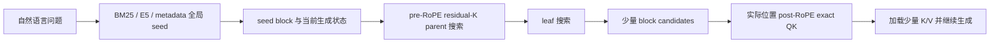

# 1B Token Context 搜索：当前研究设计

**文档类型：** current-state document  
**更新时间：** 2026-07-14  
**模型：** Qwen3-0.6B 真实 Q/K  
**当前规模：** 两份独立的 10M-token 语料，各 39,062 个 256-token block  
**研究状态：** 发现了可利用的 KV 结构，但尚未证明最终问答收益，也尚未完成真实 1B-token 运行

## 0. 一句话结论

> 当前证据不支持“用一个 K-mean 或严格半径界从 1B tokens 中零损失全局检索”；它支持三个更窄的性质：QK中存在可校准的block prior，query-responsive heads可跨数据集稀疏化，查询方向具有可学习但不紧致的中等低维流形。前两者已在真实10M转化为4.06倍执行加速和7.59% K存储；第三者在完整block轴上能用10.49%候选保持95.12% raw Top16，但z-score更脆弱且代理仍线性扫blocks，尚未得到最终问答与1B次线性收益。

## 1. 可证伪猜想

### 1.1 当前主猜想 C1

给定按真实文档顺序排列的超长上下文和一个已经激活的 seed block，去除全局公共方向后的 block K centroid 在位置上分段连续。使用连续的 64-block parent 和 8-block leaf 建立两级索引，可以只精扫不超过 5% 的 blocks，同时找回至少 70% 的全库精确 K-centroid Top10 邻居。

该猜想可以被以下结果直接推翻：

- 真实完整 record 前向得到的 K 在 5% block 精扫预算下，Top10 邻居召回低于 70%；
- 层次搜索与打乱文本的位置对照没有明显差异；
- block-local 前向有局部性，但完整 record causal prefill 中局部性消失；
- 找回的 K-centroid 邻居不能提高后续真实 QK 候选召回或最终生成质量。

当前状态：前三项得到部分或正面支持；第四项尚未测试。因此 C1 只能被写成“KV centroid 扩展假说”，不能写成“最终 attention 或问答加速已经成立”。

### 1.2 当前主猜想 C2

在冻结LODO selected heads后，生成Q方向的条件分布可以由train-only原型近似。用原型支撑值建立概率候选，再用真实selected-head max-QK精排，有机会在完整39,062-block轴上只精扫不超过25%的blocks，同时保留至少90%的exact Top16。

该猜想的冻结否定条件是：

- 完整block轴的exact Top16 recall低于90%；
- 达到90% recall需要超过25%候选；
- 代理索引、候选读取和精排总时间不低于selected-head线性扫描；
- 代理只保持QK排序，却不能保持post-RoPE attention或生成质量。

完整39,062-block验证已经通过raw版本的冻结门槛：10.49%候选覆盖95.12% raw exact Top16。对当前最佳系统使用的z-score目标，25%候选覆盖90.50%；exact精排后的最终RRF39 gold recall为46.04%，完整selected-head为49.17%，即保留93.64%。因此C2在质量上部分通过，但代理索引仍线性扫描block支撑表，尚未通过次线性wall-clock条件。

### 1.3 已被否定的强猜想 C0

> 一个 block 内的 token K 指向同一语义方向，因此一个 K-mean 足以作为该 block 的全局语义地址。

实际结果：block 内 K 确实集中，但不同 block 的 K-mean 也高度同向；直接 `Q x K-mean` 的测试集最佳 Recall@16 只有 0.4%。因此被否定的是“单 K-mean 可承担全局语义检索”这一具体猜想，而不是“block K 存在可压缩结构”这一更弱先验。

## 2. 任务定义

### 2.1 输入

- 长度为 `N` 的真实 token 序列；
- Qwen3-0.6B 前向产生的真实 pre-RoPE 和 post-RoPE Q/K；
- block size `T=256`；
- 四个代表性 layer/query-head 通道：`L3/H10`、`L21/H8`、`L6/H7`、`L16/H14`；
- 可选的自然语言问题、生成状态或已经激活的 seed block。

### 2.2 必须分开的两个输出

**第一次全局语义寻址：**

```text
自然语言问题 -> 全库相关证据 block
```

该任务目前由 BM25、E5 或其他 RAG 方法承担。当前 K-mean 实验没有解决它。

**seed 后的 KV 区域扩展：**

```text
seed block / 当前模型状态 -> 可能参与后续 attention 的少量 KV 区域
```

本轮层次搜索只测试了这个任务的一个代理目标：找回全库精确 residual-K centroid Top10 邻居。

### 2.3 下游目标

最终目标不是 centroid 邻居本身，而是：

```text
在模型持续生成时，用更少的索引点积、KV 读取和跨卡通信，
保留 full-attention 会使用的关键 token，并保持最终答案质量。
```

当前代理目标与该下游目标之间仍缺少一项关键实验：`RAG seed + KV expansion` 对真实多步生成是否优于 `RAG only`。

## 3. 可观测先验

### P1：模型 K 存在跨文本公共方向

**直观含义：** 不同文本产生的 K 不是均匀分布在 128 维空间中，而是共享模型造成的强背景方向。

**可测量定义：**

```text
concentration(b,h)
  = ||mean_t K[b,t,h]|| / mean_t ||K[b,t,h]||
```

如果 256 个单位向量随机独立，该量级约为 `1/sqrt(256)=0.063`。真实值约为 `0.52`，但随机 block K-mean cosine 仍高达 `0.84~0.93`。

**实现含义：** 不能直接把 raw K-mean 当作语义地址；必须先估计并去除全局均值 `g_h`。

### P2：真实文档内存在缓慢变化的 segment 状态

**直观含义：** 一篇文档或一次会话内，相邻 blocks 的主题和模型内部状态通常连续变化，而不是每 256 tokens 随机跳变。

**可测量定义：**

```text
r[b,h] = normalize(mean_t K[b,t,h] - global_mean[h])
C(d)   = mean cosine(r[b,h], r[b+d,h])
```

支持该先验需要同时看到：

- 同 record 相邻 cosine 高于跨 record 随机 cosine；
- `C(d)` 随 block 距离增加而下降；
- 打乱文本后该现象消失；
- 完整 record causal prefill 中仍然存在。

### P3：block 内 token residual K 位于中低秩子空间

**直观含义：** 去掉 block 均值后，256 个 token K 的主要变化不是占满全部 128 维。

**可测量定义：**

```text
K_res[b,h] = K[b,:,h] - mean_t K[b,t,h]
K_res       = U Sigma V^T
E_r         = sum_{i<=r} sigma_i^2 / sum_i sigma_i^2
```

当前完整 record 前向中，rank-16 保留约 `83.6%~93.1%` residual 能量，90% 能量所需 rank 约为 `14.0~20.7`。

**实现含义：** 可以研究 `mean + low-rank basis + error term` 的压缩索引，但不能从能量保留率直接推出 max-QK 误差。

### P4：max-attention 由 query 方向上的极值决定

**直观含义：** attention block score 更接近支持函数，而不是平均重建误差：

```text
h_K(q) = max_{k in block} q^T k
```

少量低能量 token 仍可能成为某个 q 的最大内积。因此普通 SVD 能量和无监督几何覆盖不保证 max-attention 保真。

**实现含义：** 候选压缩必须对真实 query 分布建模，或者提供足够紧的 query-conditioned upper bound。

### P5：RoPE 将内容方向与相对位置耦合

```text
(R_i q)^T (R_j k) = q^T R_(j-i) k
```

post-RoPE K 不能直接作为位置无关的全局索引。粗检索使用 pre-RoPE K；候选进入精排后，必须恢复真实位置并计算 post-RoPE QK。

### P6：条件相关性在 layer/head 上组合分解

对每个模型通道定义独立候选集合：

```text
S_lh^k(q) = TopK_b score_lh(q, b)
```

480个真实queries上，同层非GQA-sibling的Top16 mean Jaccard只有0.78%；16个train-selected heads在held-out test上的micro/macro recall为53.4%/48.0%，随机16 heads为21.2%/21.5%。这支持不同heads不是同一ranking的重复副本，并且部分专业性可跨query复用。

但是全448 heads的Top16平均展开成4,299个不同blocks，约占10M语料的11.0%。因此成立的是“每通道稀疏、跨通道组合不稀疏”，不是“全模型共享一个小Top-K”。实现上必须先做head routing，不能扫描所有heads后直接取并集。

### P7：QK 排名包含 query-invariant block prior

480题中有81个blocks被全部queries的某些heads提名，其中只有一个在一题上同时是gold。用下面的分解描述该现象：

```text
score_lh(q,b) = mu_lh(b) + delta_lh(q,b)
```

`mu_lh(b)`表示block范数、公共方向、位置或模型通道偏好造成的query-independent吸引力；`delta_lh(q,b)`才是当前query相关项。跨head多数投票会重复累加`mu`，解释了公共hubs压过少数专业head证据的现象。

E10b已在同一480题上完成5折无泄漏全库估计。448个heads的`Var_b(E_q score) / Var_{q,b}(score)`均值/中位数为49.8%/50.5%；cross-fitted z-score把universal hubs从81降到0，并把全head Top16的RRF39 gold recall从22.71%提高到38.13%，配对`p=1.10e-13`。因此“可分离静态prior”得到支持，但尚未验证attention与生成。

### P8：有用head具有可观测的rank responsiveness

对每个head定义train-only无标签统计：

```text
D_lh = number of distinct raw Top1 blocks across train queries
       / number of train queries
```

5折中按`D_lh`选择16/448 heads，再读取held-out query的cross-fitted z-score Top16，gold并集召回为62.08%，matched random为28.68%；16-head集合的fold-pair Jaccard为0.906。把209.6个平均候选用RRF压回39 blocks后，召回为49.79%，高于全448-head z-score共识的38.13%。

这个结果支持“少数query-responsive heads + 大量投票噪声”，但`D_lh`是比较七个proxy后的探索性winner，必须在整个dataset或新query外部holdout上冻结复验。它也没有超过matched BM25-block的66.67%。

## 4. 数学模型

当前用以下分解组织证据：

```text
k_pre[b,t,h]
  = g[h] + z[s(b),h] + U[b,h] a[b,t,h] + epsilon[b,t,h]

k_post[b,t,h]
  = R(position(b,t)) k_pre[b,t,h]

score_lh(q,b)
  = mu_lh(b) + delta_lh(q,b)

active_heads
  = heads with stable Top1-block responsiveness on calibration queries
```

| 项 | 对应先验 | 测量变量 | 代码阶段 | 当前证据 |
|---|---|---|---|---|
| `g[h]` | 跨文本公共方向 | concentration、随机 block cosine、global mean | K-mean index、geometry analysis | 强支持 |
| `z[s(b),h]` | 文档内缓慢变化状态 | global-centered offset cosine、record locality | locality analysis、hierarchical search | 支持 |
| `U a` | block residual 中低秩 | rank-8/16 energy、rank90 | sampled SVD profiling | 支持压缩，不支持安全剪枝 |
| `epsilon` | query 相关极值 token | exact max-QK 与 FPS 近似差异 | FPS coreset evaluation | 证明不能忽略 |
| `R(position)` | 位置相位 | pre/post K、完整 record 前向 | QK capture、context-mode comparison | 理论明确，检索实验仍不完整 |
| `S_lh(q)` | head组合稀疏性 | Top-K Jaccard、并集增长、held-out head coverage | all-head frozen ranking analysis | 支持稳定专业heads；全head并集过宽 |
| `mu_lh(b)` | query-independent hub prior | 跨query block nomination frequency、方差分解、五折去偏 | all-head full-score calibration | 支持；均值解释49.8%方差，z-score显著减少hubs并提高RRF39 |
| `D_lh` | 无标签head rank responsiveness | train Top1-block多样性、held-out head coverage | strict 5-fold + dataset LODO head gate | 压力测试支持；LODO 16 heads召回62.50%，仍需全新queries/dataset |

这里的 `z` 不是传统文本 embedding，也没有被证明可以从自然语言问题直接访问。它只表示相邻真实文档区域的 K residual 统计状态相似。

## 5. 实现契约

### 5.1 Stage A：真实 K 索引构建

**输入假设：** token 序列已经按 block 划分；模型权重固定；捕获的是指定 layer/head 的真实 Q/K。

**算法：**

1. 对每个 block 或完整 record 执行 causal prefill。
2. 捕获四个通道的 pre-RoPE K；block-local 模式额外保存局部 post-RoPE K。
3. 对每个 block 保存 token mean、四段 segment mean 和 concentration。
4. 保存 `float16` 数组和描述模型、通道、block 数量的 `summary.json`。

**通过条件：** 输出 block 数、token 数、通道和 head dimension 与语料元数据一致；没有 synthetic vector；没有使用 gold label 选择向量。

**失败原因：** block 数不一致、Q/K hook 指向错误张量、完整 record 分片缺块、RoPE 空间标注错误。

**代码：** [build_block_kmean_index.py](../../projects/parallel_block_retrieval/src/build_block_kmean_index.py)、[build_kmean_from_sharded_raw.py](../../projects/parallel_block_retrieval/src/build_kmean_from_sharded_raw.py)

### 5.2 Stage B：直接 Q 到 K-mean 全局检索

**输入：** 2,000 个真实 step queries，每个 query 保留末尾 16 个 Q；39,062 个 block 的 K mean/segment mean。

**算法：** 分别计算 last-Q、Q-mean、Q-max，raw/cosine，global-centered，单 centroid/四 segment，pre/post-RoPE 等 13 个打分版本；每个版本返回前 512 个 blocks。

**输出：** 每种方法的目标 block rank，以及 Recall@1/3/16/512。

**失败判定：** 候选预算16下无法稳定召回 gold evidence block，则不能作为全局语义检索器。

**代码：** [run_block_kmean_retrieval.py](../../projects/parallel_block_retrieval/src/run_block_kmean_retrieval.py)

### 5.3 Stage C：两级 residual-K centroid 搜索

**输入：** `B=39,062` 个 block，每个 block 四个 128 维 pre-RoPE K mean；500 个随机 seed blocks。

**中间变量：**

```text
v_b = normalize(flatten_h(normalize(meanK[b,h] - globalMean[h])))
parent_p = normalize(mean_{b in 64-block group p} v_b)
leaf_l   = normalize(mean_{b in 8-block group l} v_b)
```

**参数：**

| 参数 | 当前值 | 定义与理由 | 太小时 | 太大时 |
|---|---:|---|---|---|
| block size | 256 tokens | 与现有 10M 系统一致 | 索引和 top-k 数量增加 | block 内语义混合增加 |
| parent size | 64 blocks | 测试较低 summary 成本 | parent 数量和第一层点积增加 | summary 过度平均 |
| leaf size | 8 blocks | 保留局部连续性 | leaf 点积增加 | 候选粒度变粗 |
| query blocks | 500 | 固定 seed=17 的诊断样本 | 方差大 | 诊断更慢 |
| exact neighbors | 10 | 定义全库几何 oracle | 只观察极少邻居 | 混入弱邻居 |
| parent fraction `alpha` | 5/10/20/50% | 扫描速度与召回 sweep | 第二层漏掉区域 | 加速下降 |
| final block fraction `beta` | 0.5/1/2/5% | 精扫预算 sweep | exact neighbor 丢失 | 加速下降 |

**精确算法：**

1. 用 `v_query @ all_v.T` 得到全库 exact Top10，排除 query 自身，作为 oracle。
2. 用 `v_query @ parent.T` 选择 top `alpha` parents。
3. 只在选中 parents 内，用 `v_query @ leaf.T` 选择足以覆盖 `beta * B` blocks 的 leaves。
4. 展开 leaves 为原始 blocks，在候选中计算精确 centroid dot product 并返回 Top10。
5. 计算返回 Top10 与 oracle Top10 的交集比例。
6. 保存每个参数组合的实际 leaf 比例、实际 block 比例、召回和估算点积比例。

**点积成本模型：**

```text
cost / flat ~= 1 / parent_size + alpha / leaf_size + beta
```

**输出：** exact-neighbor recall 与 estimated dot-product speedup。这里不输出 QA accuracy，也不输出真实 attention recall。

**失败原因：** 连续 group 内不相似、parent mean 抵消、seed 的邻居跨越大量独立 records、四通道合并方式与真实 query 不匹配。

**代码：** [benchmark_two_level_kmean_search.py](../../projects/parallel_block_retrieval/src/benchmark_two_level_kmean_search.py)

### 5.4 Stage D：token 级 max-QK 近似

**当前实现：** 每个 block、每个通道用 farthest-point sampling 选 1/2/4/8/16 个真实 K 原型，在每题16个 lexical candidate blocks 内比较 approximate max-QK 与256-token exact max-QK。

**安全界：** 若原型覆盖半径为 `rho`，则

```text
0 <= h_K(q) - h_P(q) <= ||q|| rho
```

**通过条件：** Top1 agreement 足够高且安全上界能显著减少需要 exact scoring 的候选。

**当前结果：** 16原型只有14.2%/22.0% Top1 agreement；安全上界保留100%候选。当前实现失败。

**代码：** [build_sparse_k_fps_coreset.py](../../projects/parallel_block_retrieval/src/build_sparse_k_fps_coreset.py)、[evaluate_sparse_k_fps_coreset.py](../../projects/parallel_block_retrieval/src/evaluate_sparse_k_fps_coreset.py)

### 5.5 Stage E：最终精排与 KV 加载

**计划契约，尚未完成：**

1. 层次索引只产生少量 block candidates。
2. 对候选恢复真实 token 位置。
3. 使用当前生成 Q 计算 post-RoPE exact QK。
4. 按指定 token/block budget 加载 K/V。
5. 与 full-attention 或完整候选 oracle 比较 attention mass、关键 token recall、生成答案和延迟。

Stage E 尚无完整证据，因此不能把 Stage C 的 centroid-neighbor recall 写成最终系统质量。

## 6. 当前系统结构



职责边界：RAG 负责第一次全局语义寻址；residual-K hierarchy 负责 seed 后的内部区域扩展；post-RoPE exact QK 负责最终 attention 判定。

## 7. 1B-token 复杂度外推

令 `N=1B`、block size `256`，则：

```text
B = N / 256 = 3,906,250 blocks
```

四通道、head dimension 128、FP16 时：

| 存储内容 | 估算大小 |
|---|---:|
| 全部四通道 token K | 约 1.024 TB |
| 每 block 一个四通道 centroid | 约 4 GB |
| 每 block 四通道 rank-16 basis | 约 64 GB |

使用 `parent=64`、`leaf=8`、`alpha=20%`、`beta=2%`：

```text
cost / flat = 1/64 + 0.20/8 + 0.02 = 0.060625
estimated dot reduction = 16.5x
```

这只是点积数量模型，不包含显存带宽、分片、跨卡通信、TopK、Q capture 和 KV paging，因此不是 1B 系统的真实 wall-clock speedup。

## 8. 与 RAG 的边界

| 项目 | RAG | residual-K 层次索引 |
|---|---|---|
| 输入 | 自然语言 query | seed block、当前 Q、模型内部状态 |
| 表示 | 外部语义 embedding / lexical index | 模型自身 pre-RoPE K residual |
| 主要任务 | 第一次全局证据寻址 | seed 后扩展、KV routing、attention 候选剪枝 |
| 当前已验证 | 10M 证据和最终答案 baseline | centroid 几何结构与近邻扩展代理任务 |
| 当前位置处理 | 通常不建模 | pre-RoPE 粗检索，post-RoPE 精排 |

当前方法没有超过 RAG。要建立独立贡献，必须证明模型内部动态状态能够发现一次性文本 embedding 检索漏掉的后续证据，或者在相同质量下显著减少动态重复检索与 KV 读取成本。

## 9. 当前结论边界

**已有证据支持：**

- 真实 block K 存在强全局公共方向；
- 去除 block mean 后的 token K 具有稳定的中低秩谱；
- 真实 record 内 residual K centroid 具有多尺度局部连续性；
- 打乱文本会破坏该局部性和层次搜索收益；
- 固定两级树可以减少 centroid 近邻扩展点积。

**已有证据否定：**

- 单个 raw K-mean 可以直接替代 RAG；
- 四段 K-mean 足以处理稀疏实体证据；
- 无监督 FPS-16 可以稳定近似 exact max-QK；
- SVD 能量保留率本身足以证明 max-attention 安全剪枝。

**证据不足：**

- 层次结构是否保留真实 attention top tokens；
- 是否提高多步生成最终答案；
- 是否优于 `RAG only`；
- 全部 layer/head 是否具有相同属性；
- 10M 结果是否稳定扩展到真实 100M 和 1B；
- 端到端多卡 wall-clock 加速。

## 10. 最小下一步

固定同一批500条多步问题和同一 RAG seed，比较：

```text
A: RAG only
B: RAG seed + residual-K hierarchy + post-RoPE exact rerank
```

必须同时报告：第二跳 gold evidence recall、exact-attention token recall、累计加载 tokens、最终答案正确率、单题分阶段延迟和多卡通信量。只有 B 在质量或成本上形成配对优势，当前几何属性才转化为系统贡献。

## 11. 2026-07-14 LODO更新：Head响应性是跨任务属性

整数据集留出实验对head轴模型提供了更强证据。每次完整留出一个LongBench数据集，`head x block` prior与head gate只由另外五个数据集估计。冻结16个Top1-diversity heads后：

```text
mean candidate tokens = 53,847
candidate union recall = 62.50%
final 9,984-token RRF39 recall = 49.17%
random 16-head union expectation = 28.41%
```

这一结果与原五折的62.08%/49.79%基本一致。更重要的是，train-only Top1 diversity与held-out单head召回的Spearman平均为0.622，完整head排序跨六个训练集的平均Spearman为0.997。因此head轴可以写成较稳定的模型属性：

```text
score_lh(q,b) = static_block_prior_lh(b)
              + head_responsiveness_lh * query_residual_lh(q,b)
              + noise
```

但这仍没有解决block轴。当前扫描仍线性读取39,062 blocks；1卡到4卡只从741.77秒降到357.33秒，即2.08倍加速。下一阶段的创新重点必须转到：如何利用block prior、record locality或可证明的query-conditioned bound减少K读取和候选block数量，而不是继续增加heads。

Matched BM25-block仍为66.67%，高于KV的49.17%。因此当前最可靠的边界是：稳定head稀疏性可以减少内部attention搜索通道，但还不是比RAG更好的第一次全局寻址器。

### 11.1 真实稀疏执行结果

六个LODO折的16-head集合并集只有20个query-head channels，覆盖12层和17个`layer x KV-head` channels。实际只扫描这些通道后，单GPU时间从完整741.77秒下降到182.72秒，实测4.06倍加速，RRF39仍为49.17%，480题gold命中零差异。

```text
query-head arithmetic reduction = 448 / 20 = 22.4x
measured wall-clock speedup       = 741.77 / 182.72 = 4.06x
```

这个差距本身是新的系统证据：当前内核在head稀疏后转为K-profile读取、层启动、block遍历和Top-K受限。17个连续K channels现已无损预打包，存储从143.36 GB降到10.88 GB（7.59%）；已有packed计时因GPU资源争用作废，必须在独占GPU上重跑I/O、compute、Top-K分阶段profiling。

### 11.2 Block支持函数：精确安全与概率粗路由的边界

对selected head，block分数的token极值项是K集合的支持函数：

```text
h_b(q) = max_t q^T k_bt
```

这给出两个不同目标：

1. **严格安全剪枝：** 用中心和覆盖半径给出`h_b(q)`上界，任何可能进入exact Top-K的block都不能被删除。
2. **概率粗路由：** 用train-only查询方向原型近似`h_b(q)`，允许极少排序误差，再由exact selected-head QK精排。

对block的S段中心半径界为：

```text
h_b(q) <= max_j [q^T c_bj + ||q|| r_bj]
```

它在真实10M的480题、7,680个query-head pairs上没有安全性违反，但S=16仍平均保留99.9985% blocks且估算速度为0.938x。极值由少量方向尖点决定，而最坏情况覆盖半径把这些尖点的可能性传播给几乎所有query，因此该安全界在高维下是空的。

查询方向并非完全无结构。LODO训练查询方向的32维rank90平均为18.10、有效秩为11.62；128个train-only原型对held-out token方向的最近余弦均值约0.80。最近原型支撑值在512个均匀抽样真实blocks上与exact分数的Spearman为0.819，取128候选覆盖exact Top16的93.77%，但Top1一致率仅19.62%。

完整39,062-block轴、480题、7,680个query-head pairs进一步得到：

```text
raw target:
  5.24% candidates  -> 89.51% exact Top16
  10.49% candidates -> 95.12% exact Top16
  25.00% candidates -> 98.80% exact Top16

z-score target with proxy-fitted prior:
  10.49% candidates -> 76.89% exact Top16
  25.00% candidates -> 90.50% exact Top16
```

另行构建96个fold-head的train-only exact-QK mean/std profile后，25%候选反而只有89.09%，没有修复z-score损失。解释是z-score对低方差blocks除以很小的标准差，会放大原型方向近似的残差；代理自校准的均值/方差产生了一定误差抵消。原型近似主要保持raw支持函数，不天然保持去偏后的极值次序。

因此当前更新后的属性模型是：

```text
head axis:  stable sparsity, lossless routing is feasible
query axis: moderate manifold structure, raw probabilistic routing is feasible
block-token extreme axis: worst-case radius bounds are too loose
normalization axis: z-score amplifies prototype residuals
```

这与RAG的边界在于索引对象不同：RAG索引文本语义，当前代理索引模型内部某个layer/head的支持函数响应。它只有在动态生成Q、非词法attention目标或RAG miss集合上形成下游增益时才构成独立贡献；目前的抽样排序结果还不满足这一点。
