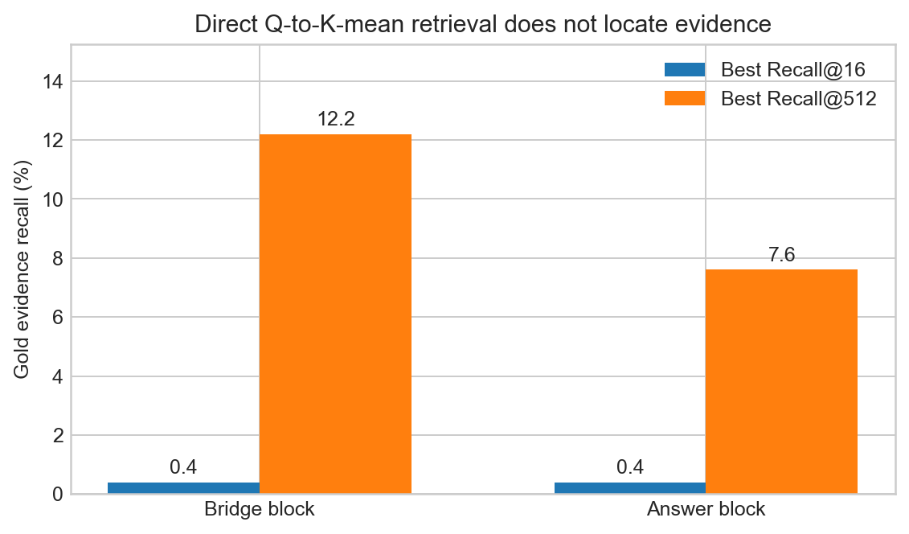
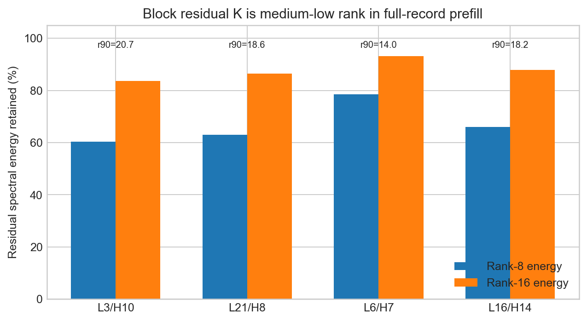
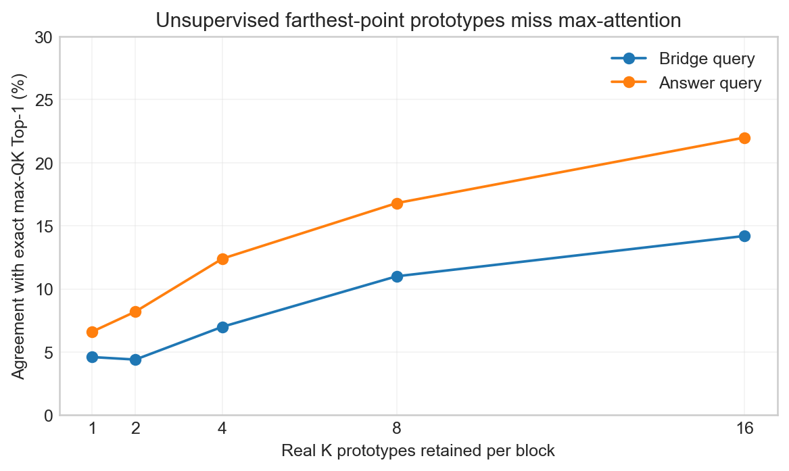
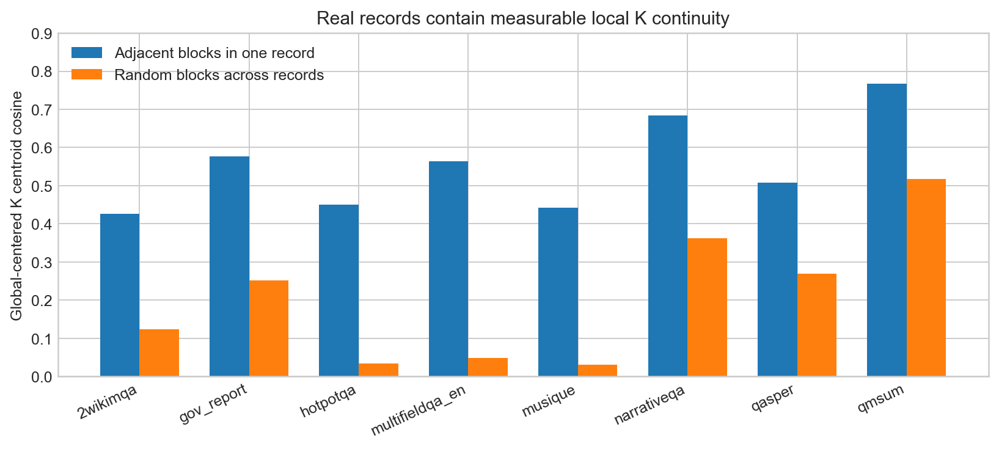
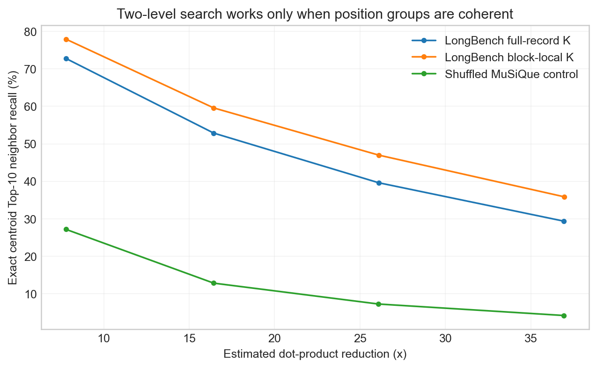

# 1B Token Context 搜索：实验结果与猜想更新

**文档类型：** visualization/results document + iteration ledger  
**日期：** 2026-07-14  
**数据：** 两份真实10M-token语料，每份39,062个blocks  
**模型：** Qwen3-0.6B真实Q/K  
**对应设计：** [design.md](design.md)  
**对应实验协议：** [experiment_design.md](experiment_design.md)

## 0. 结论先行

> 真实10M实验表明，QK搜索的head轴可无损稀疏化：LODO selected-head扫描保持49.17% RRF39并实测加速4.06倍，连续K存储降到全profile的7.59%。完整block轴上，查询原型以10.49%候选保持95.12% raw exact Top16，但z-score需25%候选才保持90.50%，且代理评分仍线性扫blocks；因此当前突破是“head轴无损压缩+raw query轴概率路由”，不是已经完成1B次线性检索。

## 1. 当前研究判定

| 研究问题 | 判定 | 核心结果 | 允许的结论 |
|---|---|---|---|
| block K是否集中 | 通过 | concentration约0.52，随机方向基准0.063 | K有强公共方向 |
| 单K-mean能否全局找证据 | 失败 | test最佳Recall@16仅0.4% | 不能替代RAG |
| residual K是否低秩 | 部分支持 | rank16保留83.6%到93.1%，rank90为14.0到20.7 | 可研究有损压缩 |
| FPS-16能否保持max-QK | 失败 | Top1 agreement为14.2%/22.0% | 无监督几何覆盖不够 |
| 真实record是否局部连续 | 通过 | 相邻比跨record随机高0.238到0.515 | 可建立位置/record层次结构 |
| 两级树能否减少centroid点积 | 通过tradeoff，未达高压缩目标 | 7.79x/72.78%；16.44x/52.86% | seed后近邻扩展可减少估算点积 |
| query-invariant prior能否校准 | 通过 | 平均解释49.8%分数方差 | 需要去偏后再跨head融合 |
| 少量query-responsive heads能否无gold选择 | LODO压力测试通过 | 16-head候选召回62.50%，RRF39 49.17% | head轴可稀疏执行 |
| head稀疏性是否产生实测收益 | 通过 | 741.77秒降到182.72秒，4.06x | 不是22.4x理论量替代实测 |
| 严格block上界能否次线性剪枝 | 失败 | 16段仍保留99.9985% blocks | 当前安全界不可用 |
| query原型能否近似exact排序 | raw通过、z-score较弱 | 完整轴10.49%候选保持95.12% raw Top16；25%保持90.50% z-score Top16 | 可进入exact精排验证 |
| 是否保持真实attention/答案 | 证据不足 | 尚未运行Stage E/E7 | 不能宣称最终系统有效 |
| 是否适用于真实1B和多卡 | 部分证据 | 10M selected-head有4.06x；packed多卡和1B未完成 | 不能宣称1B wall-clock结果 |

## 2. 如何阅读这些图

五张图分别对应五种不同指标：

- 图1使用gold evidence block label，回答“K-mean能否直接找答案证据”；
- 图2使用SVD能量，回答“block token K能否压缩”；
- 图3使用同record与跨record cosine，回答“文档顺序是否包含K局部结构”；
- 图4使用exact centroid neighbor oracle，回答“层次树是否保留K几何邻居”；
- 图5使用exact max-QK Top1，回答“16个K原型是否能替代256个token K”。

这五个指标不能互相替换。尤其是图4的72.78%不能写成答案召回率或最终正确率。

## 3. E1结果：K-mean 集中但不能全局检索



**目的：** 检查一个block的K均值是否可作为全局语义地址。  
**设置：** 2,000个真实step queries；39,062个blocks；每个query末尾16个Q；13种raw/cosine/centered/segment/pre/post打分；图中选择test上每个预算的最佳方法。  
**横轴：** 第一跳bridge evidence与第二跳answer evidence。  
**纵轴：** gold evidence block进入前K名的query比例。  
**观察：** 最佳Recall@16两类均为0.4%；把预算放宽到512，bridge为12.2%，answer为7.6%。  
**通过：** concentration约0.52，说明block内K确实共享强方向。  
**失败：** 共享方向不具有足够block区分度；不同随机block的K-mean cosine仍为0.84到0.93。  
**原因证据：** 去中心前随机和相邻block cosine几乎一样；在全局打乱MuSiQue上也是如此，说明主要成分是模型公共背景，不是文档语义。  
**更新后的猜想：** K-mean只能作为结构摘要，不能作为自然语言到证据的独立全局检索器。  
**不能证明：** 该结果没有否定token级QK检索，也没有否定learned/query-aware block summary。

**证据：** [musique_kmean_retrieval_summary.json](evidence/musique_kmean_retrieval_summary.json)；服务器逐题结果 `outputs/musique_official_aligned_2000_block_kmean_retrieval_centered_v2/rows.jsonl`。

### 代表性失败模式

- **宽候选仍失败：** answer任务即使读512/39,062个blocks，最佳方法也只召回7.6%，不是简单地把TopK从16增大就能解决。
- **四段均值仍失败：** segment4相对单均值有时提高Recall@512，但Recall@16仍为0.4%，说明稀疏实体方向没有被均值稳定保留。
- **去全局均值仍失败：** centered版本没有把Recall@16提高到可用范围，说明失败不只来自一个简单DC方向。

## 4. E2结果：block residual K 是中低秩，不是统一rank-16



**目的：** 检查256个token K减去block均值后的主要变化是否落在小子空间。  
**设置：** LongBench完整record causal prefill；随机512个blocks；四个通道；对每个block residual K做SVD。  
**横轴：** 四个layer/query-head通道。  
**柱高：** rank-8或rank-16保留的平均谱能量。  
**顶部文字：** 达到90%能量所需的平均rank。  
**观察：** rank-16保留83.57%、86.52%、93.15%、87.87%；rank90分别为20.68、18.64、14.03、18.24。  
**通过：** 四个通道rank90都远低于128，且block-local与full-record范围接近。  
**未通过：** “统一rank-16保留至少90%”只在L6/H7成立。  
**更新后的猜想：** 使用自适应rank或`rank-16 + residual bound`，不能把16维当作无损事实。  
**不能证明：** Frobenius能量高不等于`max q^T k`误差小。

**证据：** [longbench_recordcontext_subspace.json](evidence/longbench_recordcontext_subspace.json)。

### 代表性通过与困难通道

- **容易压缩：** L6/H7 的rank-16能量为93.15%，rank90约14.0。
- **困难通道：** L3/H10 的rank-16能量只有83.57%，rank90约20.7。
- **研究含义：** 通道级rank差异本身可以成为未来head/router的输入，但必须在train/dev选择，不能按test gold效果挑head。

## 5. E3结果：FPS-16 不能近似 max-attention



**目的：** 检查每个block保留少量真实K原型能否近似256-token exact max-QK。  
**设置：** 每题先有16个lexical candidate blocks；每block每通道使用nested FPS保留1/2/4/8/16个真实K；比较approximate与exact max-QK的Top1。  
**横轴：** 每block保留的K原型数。  
**纵轴：** approximate Top1与exact Top1一致率。  
**观察：** 随原型数增加，一致率上升，但FPS-16在bridge query只有14.2%，answer query只有22.0%。  
**失败：** 低于90%可用目标，也低于50%最低失败线。  
**安全界结果：** 为保证exact Top3不丢失，`||q||rho`界平均保留100%候选，不能剪枝。  
**原因解释：** FPS最小化全方向欧氏覆盖半径；真实max-QK只关心query会访问的方向。少量极值K对某些Q重要，但不一定是最远点。  
**更新后的猜想：** 必须学习真实query manifold，或者构造query-conditioned bound。  
**不能证明：** 该实验只否定无监督FPS这一种原型选择，没有否定所有token K压缩。

**证据：** [musique_fps16_summary.json](evidence/musique_fps16_summary.json)。

## 6. E4结果：真实record存在局部连续性



**目的：** 检查去除全局公共方向后，真实文档相邻blocks是否仍比无关blocks更相似。  
**设置：** LongBench八个数据集；同record相邻blocks与跨record随机pairs；四通道平均。  
**横轴：** 数据集。  
**纵轴：** global-centered block K centroid cosine。  
**蓝柱：** 同record相邻blocks。  
**橙柱：** 跨record随机blocks。  
**观察：** 八个数据集蓝柱都高于橙柱，相邻优势为0.238到0.515。  
**对照：** 全局打乱MuSiQue的global-centered adjacent cosine约为0，与random相同。  
**通过：** 局部性跨八种真实任务存在，并且不是全局公共方向单独造成。  
**更新后的猜想：** 上下文更接近piecewise-stationary K field；可用position/record hierarchy压缩搜索。  
**不能证明：** 邻近K centroid不一定是当前生成Q真正需要的attention token。

**证据：** [longbench_record_locality.json](evidence/longbench_record_locality.json)。

### 代表性样本

| 类型 | 数据集 | 相邻 | 跨record随机 | 如何解释 |
|---|---|---:|---:|---|
| 清晰局部性 | MultiFieldQA | 0.564 | 0.049 | 文档内连续性强，跨文档背景低 |
| 清晰局部性 | HotpotQA | 0.450 | 0.034 | 局部结构不是高全局baseline造成 |
| 高背景但仍有局部性 | QMSum | 0.767 | 0.518 | 只看0.767会夸大，应看excess=0.249 |
| 高背景但仍有局部性 | NarrativeQA | 0.685 | 0.362 | 文体共性很强，但相邻仍额外相关 |
| 负对照 | 打乱MuSiQue | 约0 | 约0 | 打乱位置后固定位置树失去依据 |

八个数据集的excess correlation length约为15.7到142.9 blocks，说明不能把全语料固定成一个4K局部窗口。分段尺度应由record类型或change point决定。

## 7. E5结果：两级树存在速度-召回折中



**目的：** 检查真实文档的位置局部性是否能减少seed后centroid近邻扩展点积。  
**设置：** 500个随机seed blocks；全库exact Top10 centroid neighbors作oracle；parent=64、leaf=8；图中只画四个配对预算。  
**横轴：** 相对flat scan的估算点积减少倍数，越右计算越少。  
**纵轴：** oracle Top10 centroid neighbors被层次搜索找回的平均比例。  
**蓝线：** 完整record causal prefill K。  
**橙线：** block-local K。  
**绿线：** 全局打乱MuSiQue位置对照。  
**观察：** 真实LongBench在所有预算上显著高于打乱对照；减少点积越多，召回越低。  
**通过：** full-record在7.79x时达到72.78%，超过5%精扫的70%目标。  
**未通过：** full-record在16.44x时只有52.86%，没有达到高压缩配置的70%目标。  
**因果证据：** 同样算法在打乱对照只有27.16%和12.80%，支持收益来自连续group coherence。  
**更新后的猜想：** 固定树适合做有损KV区域扩展；下一步应通过自适应分段提高同一成本下的召回。  
**不能证明：** 这不是gold evidence recall、attention-token recall、QA accuracy或wall-clock speedup。

**证据：** [longbench_recordcontext_two_level_search.json](evidence/longbench_recordcontext_two_level_search.json)、[longbench_blocklocal_two_level_search.json](evidence/longbench_blocklocal_two_level_search.json)、[musique_two_level_search.json](evidence/musique_two_level_search.json)。

### 四个配对配置

| parent保留 | block精扫 | 估算点积减少 | block-local recall | full-record recall | 打乱对照 |
|---:|---:|---:|---:|---:|---:|
| 5% | 0.5% | 36.9x | 35.86% | 29.34% | 4.16% |
| 10% | 1% | 26.1x | 46.98% | 39.60% | 7.22% |
| 20% | 2% | 16.4x | 59.58% | 52.86% | 12.80% |
| 50% | 5% | 7.8x | 77.94% | 72.78% | 27.16% |

## 8. E6结果：完整record前向没有消除结构

**测试：** 对同一LongBench语料比较block-local K与完整record causal prefill K。  
**低秩结果：** 两种方式的residual rank90范围都约为14到21。  
**层次搜索：** 完整record结果低于block-local，但5%配置仍有72.78% recall。  
**逐block方向：** 四通道global-centered配对cosine约为0.897、0.668、0.926、0.674。  
**通过：** 低秩和位置局部性不是每256 tokens重启前向造成的纯伪影。  
**限制：** 部分通道逐block方向只有约0.67，不能把block-local profile当作完整record K的精确替代品。  
**更新后的猜想：** 可用block-local做快速结构探索，但最终索引和质量实验必须使用真实完整上下文K。

服务器证据：`outputs/real_longbench_docqa_10m_recordcontext_kmean4_index_v1/context_mode_comparison_v1.json`。

## 9. 阶段级 profiling

| 阶段 | 输入规模 | 输出证据 | 观测 | 结论 |
|---|---:|---|---:|---|
| query Q capture | 2,000 queries x 16 tokens x 4 profiles | retrieval summary | 67.92 s | 模型前向比纯矩阵打分昂贵 |
| 全库K-mean打分 | 2,000 x 39,062 blocks x 13 methods | rank/recall | 总score 3.72 s，约1.86 ms/query | K-mean很快，但目标错误 |
| full-record K mean归约 | 39,062 blocks | FP16 means/segments | 从已有raw shards归约47.78 s | 不包含原始prefill成本 |
| FPS评估 | 2,000 steps x 16 candidates x 1/2/4/8/16 prototypes | agreement/bound | 95.52 s | 近似不准且安全界无剪枝 |
| 两级centroid搜索 | 500 seed blocks | recall/cost model | 7.79x/72.78%；16.44x/52.86% | 只有估算点积收益 |

缺失的profiling证据：

- 两级树每阶段真实CUDA wall-clock；
- parent/leaf TopK通信量；
- 原始KV从CPU/其他GPU加载的时间；
- post-RoPE exact rerank时间；
- 最终decode tokens/s；
- 1/2/4/6/8卡扩展曲线。

因此速度结论当前只能写为“减少估算点积”，不能写为“系统加速7.79倍或16.44倍”。

## 10. 失败分解

### 10.1 大失败：Q x K-mean找不到gold block

```text
可能原因1：block内K不集中
  -> 被否定；concentration约0.52

可能原因2：RoPE平均导致方向抵消
  -> 不是唯一原因；pre-RoPE同样失败

可能原因3：全局公共方向淹没差异
  -> 得到支持；随机block cosine 0.84~0.93

可能原因4：只用一个centroid过粗
  -> 四段centroid仍然失败

剩余瓶颈：证据相关token是稀疏极值，mean不是适合的全局语义标签
```

最终因果路径：

```text
K集中
-> 集中主要来自公共模型方向
-> 去中心和四段均值仍不能保留稀疏证据方向
-> 单K-mean全局检索被否定
```

### 10.2 大失败：16个真实K原型仍不能保持max-QK

```text
可能原因1：压缩率太高
  -> 原型数从1增加到16时改善，但16仍远低于可用水平

可能原因2：原型不是实际K
  -> 被否定；原型直接选自真实token K

可能原因3：安全界公式错误
  -> 未发现；问题是覆盖半径太大，界过松

验证瓶颈：FPS优化全方向欧氏覆盖，不优化真实Q访问方向
```

更新：下一轮只测试query-aware原型或query-conditioned上界，不再继续无监督FPS budget sweep。

### 10.3 大失败：高压缩层次配置召回不足

```text
可能原因1：真实上下文没有局部性
  -> 被否定；八个数据集均有明显excess locality

可能原因2：结构只存在于block-local前向
  -> 被否定；full-record仍有局部性和72.78%宽预算召回

可能原因3：固定8/64边界跨越真实change point
  -> 仍可能，是E8的目标

可能原因4：centroid几何邻居不是下游attention标签
  -> 尚未排除，是E7的核心不确定性
```

## 11. 迭代账本

### Iteration 1：单 K-mean 全局检索

**猜想：** block内K共享语义方向。  
**参数化：** concentration与一个128维K-mean。  
**操作化：** Q与39,062个block means全矩阵打分。  
**结果：** concentration高，但test Recall@16仅0.4%。  
**解释：** “集中”没有转化为“可区分”；公共方向占主导。  
**猜想更新：** 先去除全局背景，并区分“全局寻址”和“seed后扩展”。  
**下一不确定性：** residual K是否仍有结构。

### Iteration 2：global-centered residual centroid

**猜想：** 去除公共方向后，block特有信息会显现。  
**参数化：** `meanK - globalMean`。  
**结果：** 打乱语料无位置局部性；真实LongBench相邻blocks明显相关。  
**解释：** residual不是通用文本embedding，但保留了真实文档的局部状态。  
**猜想更新：** 从全局语义检索转向基于seed的位置/record扩展。  
**下一不确定性：** block内部是否还能压缩。

### Iteration 3：block residual SVD

**猜想：** token residual K落在小子空间。  
**参数化：** rank8/16 energy与rank90。  
**结果：** rank90约14到21，跨语料和前向模式稳定。  
**解释：** 中低秩先验成立，但统一rank16并非都达到90%。  
**猜想更新：** 使用自适应rank或残差界。  
**下一不确定性：** 低秩/原型是否保持max-attention。

### Iteration 4：FPS支持集

**猜想：** 16个覆盖原型可近似block支持函数。  
**参数化：** nested FPS 1/2/4/8/16与覆盖半径。  
**结果：** FPS-16 Top1 agreement 14.2%/22.0%，安全界保留100%。  
**解释：** 能量低秩和欧氏覆盖都没有对齐真实query方向。  
**猜想更新：** 原型必须query-aware。  
**下一不确定性：** 不近似token max时，能否先利用更粗的位置结构。

### Iteration 5：固定位置层次搜索

**猜想：** 同一真实文档中连续groups可以用均值摘要路由。  
**参数化：** parent64、leaf8、四档parent/block预算。  
**结果：** full-record 7.79x/72.78%，16.44x/52.86%；打乱对照显著更低。  
**解释：** 局部连续性能够减少centroid近邻点积，但高压缩仍损失大量邻居。  
**猜想更新：** 用change-point/metadata树替代固定边界，并验证真实attention标签。  
**下一不确定性：** centroid邻居是否对多步生成有用。

### Iteration 6：目标审计

**旧目标：** 直接用模型K替代RAG，从自然语言问题完成全库检索。  
**为什么失败：** 多种K-mean操作化都无法在小候选预算召回gold evidence。  
**下游目的：** 在持续生成中减少对巨大KV cache的重复全扫和加载。  
**新目标：** RAG负责第一次seed；模型内部K结构负责seed后的候选扩展和attention剪枝。  
**指标变化：** 从单一gold block Recall@K，扩展为second-evidence recall、attention-token recall、最终答案、加载tokens与分阶段延迟。  
**仍拒绝的错误：** 丢失关键第二跳证据、把estimated dots写成wall-clock、用test gold选择heads。

## 12. 证据索引

| 本地快照 | 内容 |
|---|---|
| [musique_kmean_retrieval_summary.json](evidence/musique_kmean_retrieval_summary.json) | 直接Q到K-mean的2,000步Recall@K |
| [musique_fps16_summary.json](evidence/musique_fps16_summary.json) | FPS 1/2/4/8/16与exact max-QK比较 |
| [musique_two_level_search.json](evidence/musique_two_level_search.json) | 打乱位置负对照层次搜索 |
| [longbench_blocklocal_two_level_search.json](evidence/longbench_blocklocal_two_level_search.json) | LongBench block-local层次搜索 |
| [longbench_recordcontext_two_level_search.json](evidence/longbench_recordcontext_two_level_search.json) | LongBench full-record层次搜索 |
| [longbench_record_locality.json](evidence/longbench_record_locality.json) | 八个数据集record内局部性 |
| [longbench_recordcontext_subspace.json](evidence/longbench_recordcontext_subspace.json) | full-record block residual SVD |
| [longbench_recordcontext_kmean_summary.json](evidence/longbench_recordcontext_kmean_summary.json) | full-record K-mean索引元数据 |
| [dataset_lodo_head_gate_10m_480q.json](evidence/dataset_lodo_head_gate_10m_480q.json) | 整数据集留出head gate与matched BM25边界 |
| [selected_head_scan_10m_480q.json](evidence/selected_head_scan_10m_480q.json) | 真实selected-head扫描质量与4.06倍实测加速 |
| [block_axis_support_and_query_manifold_10m_20260714.json](evidence/block_axis_support_and_query_manifold_10m_20260714.json) | packed存储、安全block界、查询方向流形与抽样原型代理 |

图表由 [plot_1b_context_research_exploration.py](../../projects/parallel_block_retrieval/scripts/plot_1b_context_research_exploration.py) 从以上JSON生成。

## 13. 当前缺失证据

研究状态仍不完整，缺失项是明确的：

1. 没有把逐题`rows.jsonl`与问题文本、gold block、TopK blocks连接成可视化viewer，因此目前能解释总体失败阶段，但还不能人工检查实体、关系、格式和位置造成的具体失败类型。
2. 没有测`RAG only`与`RAG seed + KV expansion`的同题配对结果。
3. 没有用post-RoPE exact QK验证centroid候选是否保留真实attention top tokens。
4. 没有真实100M/1B多卡wall-clock、通信和KV paging结果。
5. 查询原型尚未解释和修复少量高价值head vote丢失；25%预算仍比完整RRF39低3.13pp。
6. packed selected-KV profile尚缺独占1/2/4/8卡正式计时；已有争用运行已作废。
7. 当前原型支撑表评分仍线性扫描blocks，尚未验证倒排Top-list或ANN后的query time。

因此下一次实验不应继续提高centroid或统一扩大候选；应先做vote-value-aware路由和原型倒排索引，再进入E7确认是否保持真实attention和生成目标。

## 14. 最终可引用结论

可以引用：

> 在两份10M-token真实语料的Qwen3-0.6B Q/K上，block K包含强跨文本公共方向；去除block mean后的token K具有约14到21维的90%能量rank；真实record内global-centered K centroid具有随距离衰减的局部连续性。利用该局部性，固定64/8两级树在完整record K上以7.79倍更少的估算点积保留72.78%的exact centroid Top10邻居。

不能引用：

> 我们已经实现1B-token高效问答、达到16倍端到端加速、保留72.78%的答案或attention，或者性能超过RAG。

## 15. E10a结果：Head-specific组合稀疏性与公共hubs

**设置：** 复用真实LongBench 10M的冻结全层全head SVD32 QK Top16结果；28层 × 16 query heads；480个按dataset轮询抽样的真实问题。QK排名不使用gold。head子集分析做500次dataset-stratified train/test划分，只在train使用gold选择heads。扩展语料blocks与旧K索引的SHA256完全相同。

### 15.1 集合互补性

| 每head深度 | 不同blocks并集 | 10M覆盖率 | Gold并集召回 |
|---:|---:|---:|---:|
| 1 | 388.3 | 0.99% | 36.88% |
| 4 | 1,361.6 | 3.49% | 53.54% |
| 16 | 4,299.4 | 11.01% | 70.83% |

同层非GQA-sibling Top16 mean Jaccard只有0.78%，跨层约0.25%到0.28%；共享同一KV head的GQA siblings为8.59%。因此heads不是重复产生一个共享ranking，但全head并集也没有小到可以直接读取。

### 15.2 Head子集泛化

| Heads | Train选择后的test micro | 随机micro | 选择后dataset-macro | 随机macro |
|---:|---:|---:|---:|---:|
| 1 | 29.98% | 2.11% | 29.53% | 2.32% |
| 4 | 49.60% | 7.72% | 43.71% | 8.31% |
| 16 | 53.40% | 21.25% | 47.95% | 21.55% |
| 64 | 61.62% | 42.48% | 55.07% | 40.28% |
| 全448 heads oracle | 约70.8% | - | - | - |

64题和480题都支持存在跨问题稳定的专业heads；dataset-macro结果排除了大数据集完全支配平均值的解释。但NarrativeQA只有2题、MultiFieldQA只有13题，尚不能声称跨数据集泛化。

### 15.3 Query-invariant hubs

Top16并集共出现过36,488个blocks，其中2,321个至少被一半queries提名，81个被全部480个queries提名；这81个universal hubs只有一个在一题上同时是gold。

该结果更新了“全head多数投票失败”的解释：投票会累积query-independent block prior，而少数专业head中的gold信号票数不足。下一轮应保存全库分数并在train估计`head × block` prior，比较held-out去均值/z-score，而不是继续扩大head并集。

**完整报告：** [head_specific_sparse_decomposition_10m_20260714.md](../head_specific_sparse_decomposition_10m_20260714.md)。  
**分析器：** [analyze_head_sparse_decomposition.py](../../projects/parallel_block_retrieval/src/analyze_head_sparse_decomposition.py)。  
**证据：** [head_sparse_decomposition_10m_64q.json](evidence/head_sparse_decomposition_10m_64q.json)、[head_sparse_decomposition_10m_480q.json](evidence/head_sparse_decomposition_10m_480q.json)。

## 16. E10b/c结果：Prior去偏与无标签Head Gate

**设置：** 同一9,999,872-token语料、39,062 blocks和480 queries；Qwen3-0.6B真实pre-RoPE Q/K SVD32；28层 x 16 query heads。5折按dataset分层，block prior只用另外四折query scores估计，gold只用于held-out评估。

### 16.1 Query-invariant prior

448 heads的query-invariant prior方差占比均值/中位数为49.80%/50.50%，p05/p95为17.56%/80.26%。

| 方法 | Top16并集召回 | RRF39召回 | 半数query hubs | Universal hubs |
|---|---:|---:|---:|---:|
| raw | 71.04% | 22.71% | 2,322 | 81 |
| centered | 77.08% | 27.50% | 333 | 0 |
| z-score | **80.63%** | **38.13%** | **266** | **0** |

z-score相对raw的并集和RRF39配对`p`分别为`5.91e-6`与`1.10e-13`。z-score Top8只展开2,813个不同blocks，少于raw Top16的4,299个，但RRF39仍为39.17%对22.71%，`p=7.98e-16`。

### 16.2 无标签query-responsive head gate

仅用train queries的raw Top1-block多样性选择heads：

| Heads | Held-out召回 | Random | Fold集合稳定性 |
|---:|---:|---:|---:|
| 1 | 30.63% | 3.14% | Jaccard 1.000 |
| 4 | 47.29% | 10.24% | Jaccard 1.000 |
| 16 | **62.08%** | 28.68% | Jaccard 0.906 |
| 64 | 68.13% | 53.07% | Jaccard 0.877 |

16-head Top16平均产生209.6个不同blocks；RRF压到39 blocks后召回49.79%，高于全448-head z-score共识38.13%。64 heads的RRF39反降至44.58%，支持“大量head是共识噪声”。该gate是七个proxy比较后的探索性winner，尚未做外部holdout。

### 16.3 Matched RAG边界

同一480题与39-block预算下，BM25-block为66.67%，BM25-record39为81.04%，都高于无标签KV gate的49.79%。等权融合BM25-block + KV为67.71%，相对66.67%不显著，`p=0.473`；与更强record30/39融合反而下降。Q/K与record39的oracle union为87.08%，但当前没有无泄漏gate实现该上界。

**允许结论：** `head x block`静态prior与query-responsive head子集是可量化、可利用的模型内部搜索结构。  
**不允许结论：** 当前Q/K检索优于RAG、已实现16-head wall-clock加速、或结果已扩展到1B。

**完整报告：** [query_invariant_prior_and_unsupervised_head_gate_10m_20260714.md](../query_invariant_prior_and_unsupervised_head_gate_10m_20260714.md)。  
**证据：** [head_prior_debiasing_10m_480q.json](evidence/head_prior_debiasing_10m_480q.json)、[unsupervised_head_gate_10m_480q.json](evidence/unsupervised_head_gate_10m_480q.json)、[matched_bm25_head_gate_10m_480q.json](evidence/matched_bm25_head_gate_10m_480q.json)。

## 17. E10d结果：整数据集留出压力测试

**协议：** 六次分别完整留出2WikiMQA、HotpotQA、MultiFieldQA、MuSiQue、NarrativeQA和Qasper。每折的`head x block`均值/方差与无标签head排序只由另外五个数据集估计，gold只用于留出数据集评估。

| 指标 | 原五折 | 整数据集留出LODO |
|---|---:|---:|
| 16-head平均候选blocks | 209.6 | 210.3 |
| 候选tokens | 53,646 | 53,847 |
| 16-head候选并集召回 | 62.08% | **62.50%** |
| 最终RRF39召回 | **49.79%** | 49.17% |
| 16-head集合平均Jaccard | 0.906 | 0.814 |

LODO的随机16-head候选召回期望为28.41%，p95为38.56%；冻结gate为62.50%，经验`p=0.00498`。五个可稳定计算相关性的留出数据集上，train-only Top1 diversity与held-out单head Top16召回的Spearman平均为0.622；六个训练集得到的448-head diversity排序平均Spearman为0.997。

Matched BM25边界没有改变：LODO KV RRF39为49.17%，BM25-block为66.67%，配对差值-17.50pp，22题KV独有、106题BM25独有，McNemar `p=2.21e-14`。等权融合只把BM25-block提高到67.08%，`p=0.856`，不显著。

单GPU全448-head扫描为741.77秒；旧4-GPU同规模扫描为357.33秒，只得到2.08倍实测加速。当前实现仍受K读取、Top-K和同步等非理想并行开销影响。

**判定：** query-responsive head属性通过了整数据集留出压力测试；它不再只是dataset-stratified随机切分现象。但proxy是在同一480题上事后选出的，仍需全新queries/新dataset做确认性验证。

**证据：** [dataset_lodo_head_gate_10m_480q.json](evidence/dataset_lodo_head_gate_10m_480q.json)。

### 17.1 Selected-head真实执行

六个LODO折各使用16 heads；批量评估六折时取并集，共20/448个query-head channels、12/28层、17/224个`layer x KV-head` channels。

| 实现 | 单GPU时间 | 相对完整单卡 | RRF39 |
|---|---:|---:|---:|
| 完整448-head | 741.77 s | 1.00x | 49.17% |
| 稀疏20-head并集 | **182.72 s** | **4.06x** | 49.17% |

逐题验证中，480题gold命中零差异；475题的RRF39顺序完全一致，478题的集合完全一致，平均集合重合率99.989%。20/448对应22.4倍通道减少，但只实现4.06倍墙钟加速，定位出K-profile读取、层启动、block遍历和Top-K维护是新的主要瓶颈。

**证据：** [selected_head_scan_10m_480q.json](evidence/selected_head_scan_10m_480q.json)。

## 18. E9/E10e/f结果：查询流形存在，但严格安全block剪枝失败

### 18.1 连续selected-KV profile

六个LODO折的20-query-head并集对应12层、17个`layer x KV-head`通道。无损连续打包把K profile从143.36 GB降到10.88 GB，只保留7.59%存储；480题RRF39仍为49.17%，gold命中差异为0。

packed profile已有的1卡和2卡运行受到其他GPU任务争用，时间从正式结果中撤回。当前有效速度仍是无争用原始profile selected-head扫描的182.72秒和4.06倍；packed速度等待独占资源重测。

### 18.2 严格中心-半径界

目的：检查block内K的分段中心和覆盖半径能否在不丢失exact Top16的前提下剪掉大部分blocks。

| 每block段数 | 平均候选比例 | 中位候选比例 | 估算点积加速 | 安全违反 |
|---:|---:|---:|---:|---:|
| 1 | 99.9996% | 100% | 0.996x | 0 |
| 2 | 99.9996% | 100% | 0.992x | 0 |
| 4 | 99.9995% | 100% | 0.984x | 0 |
| 8 | 99.9993% | 100% | 0.968x | 0 |
| 16 | 99.9985% | 100% | 0.938x | 0 |

结论：界是数学安全的，但覆盖半径让它几乎对所有blocks都给出“可能进入Top16”。更多分段增加索引和粗打分成本，却没有产生有效剪枝，因此该分支冻结为失败。

### 18.3 查询方向流形

严格LODO、96个fold-head模型的32维查询方向统计：

| 指标 | 结果 |
|---|---:|
| direction rank90 | 18.10 |
| direction rank95 | 22.65 |
| effective rank | 11.62 |
| held-out rank16平均残差 | 0.366 |
| 128原型最近余弦均值 | 0.799 |

这说明Q方向不是均匀铺满32维球面，但也没有低维到可用少量原型紧密覆盖。中等低秩足以产生统计代理，不足以产生有用的最坏情况误差界。

### 18.4 Train-only查询原型代理

预实验在143个held-out queries、2,288个query-head pairs上，每对均匀抽样512个真实blocks。用最近的128个train-only查询方向原型近似每个block的支持函数：

| 代理候选数 | 对抽样exact Top16覆盖率 |
|---:|---:|
| 16 | 45.05% |
| 32 | 64.80% |
| 64 | 82.15% |
| 128 | **93.77%** |

代理与exact分数平均Spearman为0.819，但Top1一致率只有19.62%；严格query-prototype Lipschitz界平均仍保留99.9997%候选。结果支持“概率粗路由后exact selected-head精排”，不支持“原型直接替代max-QK”。

随后在完整39,062-block轴、480题、7,680个query-head pairs上验证：

| 候选blocks | 候选比例 | raw exact Top16 | z-score exact Top16 | exact-prior z-score Top16 |
|---:|---:|---:|---:|---:|
| 128 | 0.33% | 44.35% | 19.20% | 15.90% |
| 512 | 1.31% | 70.09% | 38.32% | 33.34% |
| 2,048 | 5.24% | 89.51% | 63.94% | 59.38% |
| 4,096 | 10.49% | **95.12%** | 76.89% | 73.50% |
| 8,192 | 20.97% | 98.29% | 88.14% | 86.37% |
| 9,766 | 25.00% | **98.80%** | **90.50%** | 89.09% |

`z-score`列用train-only代理分数估计均值/方差；`exact-prior`列使用另行构建的30.0 MB train-only exact-QK mean/std。exact prior没有修复代理，反而略差，说明z-score除以低方差会放大原型方向误差，而代理自校准产生了一定误差抵消。

该结果仍不是gold recall：它测的是代理候选对每个head冻结exact Top16的保持率。代理评分本身也仍线性读取39,062-block支撑表；要成为1B次线性系统，还需要原型倒排Top-list/ANN和候选后的exact QK精排。

### 18.5 Exact精排后的最终召回

将代理候选交给真实QK和train-only exact prior做z-score精排，再对16 heads做RRF39：

| 每head候选blocks | 候选比例 | per-head exact Top16 | 最终RRF39 gold recall |
|---:|---:|---:|---:|
| 2,048 | 5.24% | 63.94% | 41.04% |
| 4,096 | 10.49% | 76.88% | 42.92% |
| 8,192 | 20.97% | 88.12% | **46.04%** |
| 9,766 | 25.00% | 90.48% | **46.04%** |
| 完整39,062 | 100% | 100% | **49.17%** |

25%预算保留完整selected-head基线的93.64%，绝对损失3.13pp；逐题配对为4胜19负。20.97%和25%最终召回相同，表明继续增加普通候选收益已经饱和，下一步应保护决定RRF结果的高价值head votes，而不是统一扩大所有head预算。

### 18.6 猜想更新

```text
已支持：head轴可以近乎无损稀疏化并压缩存储
支持：query轴可保持raw支持函数的Top16候选
限制：z-score极值次序对原型残差明显更敏感
已否定：当前中心-半径或原型Lipschitz界能做有效零损失剪枝
部分支持：25%候选加exact精排保留93.64%的最终RRF39基线召回
未验证：次线性代理索引、post-RoPE attention与生成收益
```

**证据：** [block_axis_support_and_query_manifold_10m_20260714.json](evidence/block_axis_support_and_query_manifold_10m_20260714.json)。
