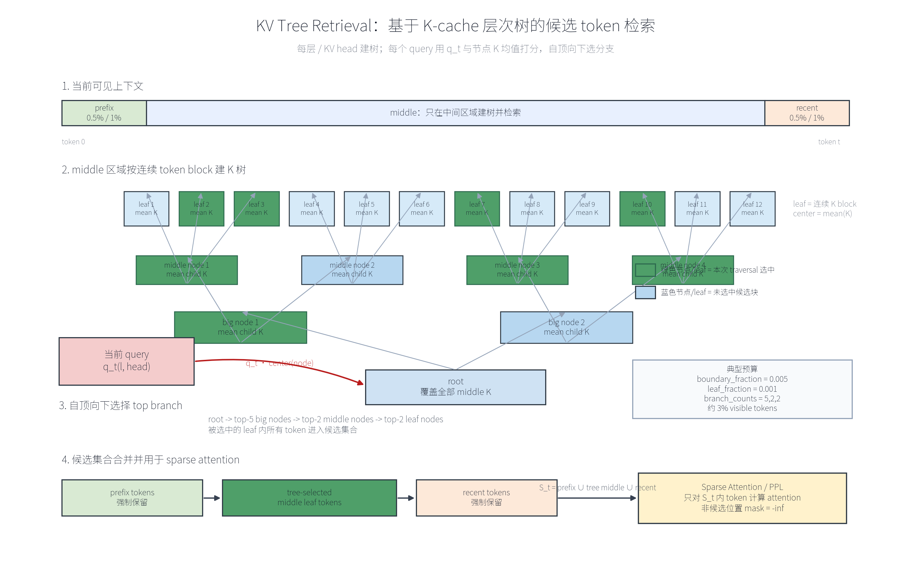

# Section 16. KV Tree Retrieval PPL 实验结果

本节记录 Section 15 中层次化 tree retrieval 策略进入 Phase B 之后的
直接 loss/PPL 实验结果。

## 1. 通用实验配置

下面三组实验使用相同的名义 tree retrieval 预算：

```text
model: Qwen3-0.6B
layers: 全部 28 层
kv_heads: 全部 8 个 KV head
boundary_fraction: 0.005
leaf_fraction: 0.001
leaf_size: 0
tree_fanout: 10
tree_branch_counts: 5,2,2
candidate_granularity: attention_head
```

候选集合比例大约为：

```text
prefix 0.5% + recent 0.5% + 5 * 2 * 2 个 leaf * 0.1%
= 每个 attention head 约 3% 可见 token
```

其中 `prefix` 和 `recent` 是强制保留的边界 token。tree 只在去掉
prefix/recent 后的 middle 区域里检索。



图 16-1：KV tree retrieval 的候选集合构造流程。每层、每个 KV head 在
middle 区域上构建连续 block 的 K-cache 层次树；每个 query 使用
`q_t · center(node)` 自顶向下选择 top branch，被选中 leaf 内的 token 与
强制保留的 prefix/recent token 合并为候选集合 `S_t`，再用于 sparse
attention 或 PPL 评估。

## 2. 实验结果

| Run | token_count | tree_attention_impl | tree_prefill | baseline loss | tree loss | delta loss | baseline PPL | tree PPL | PPL ratio |
|---|---:|---|---|---:|---:|---:|---:|---:|---:|
| A | 50000/50000 | 未记录 | 未记录 | 3.606601 | 3.519489 | -0.087112 | 36.8406 | 33.7672 | 0.9166 |
| B | 50000/5000 | sparse_gather | 未记录 | 3.814184 | 3.891407 | +0.077223 | 45.3397 | 48.9798 | 1.0803 |
| C | 200000/1000 | sparse_gather | false | 8.664809 | 8.749083 | +0.084275 | 5795.3366 | 6304.9070 | 1.0879 |

## 3. 结果解读

Run A 是目前最强的正向结果。在约 3% token budget 下，tree 版本的
loss 相比 baseline 降低 `0.0871`，PPL 下降约 `8.34%`。由于它评估了
50k 个 token，这一组在当前结果中统计稳定性最好。

Run B 和 Run C 在同样的名义 tree 预算下出现了轻微退化。loss 增加约
`0.077-0.084`，对应 PPL 大约增加 `8%`。这两组评估 token 数更少，
尤其 Run C 只有 1000 个 eval token，因此更容易受到文本片段、prefill
长度和 eval 边界位置的影响。

当前最重要的质量结论是：即使在全部层、全部 KV head 上都使用 tree
retrieval，并且每个 attention head 只保留约 3% 可见 token，这个策略也
没有出现灾难性 PPL 崩坏。根据文本片段和运行模式不同，它的表现范围大致是：

```text
最好：PPL 比 baseline 下降约 8%
较差：PPL 比 baseline 上升约 8-9%
```

这说明 tree retrieval 作为候选集合策略是有继续研究价值的，但还需要更
严格的同文本、同 token 数、同 prefill 设置下的对照实验。

## 4. 运行速度记录

50k-token tree run 的日志中记录了：

```text
ppl tree chunk 195/196: tokens 99664-99919
ppl tree chunk 196/196: tokens 99920-99999
timer tree_eval: 1119.632s
timer tree_total: 1568.806s
eval throughput: 44.66 tokens/s
```

这说明当前实现仍然应该被视为 retrieval policy 的质量验证实验，而不是
生产级 sparse attention 加速实现。即使已经加入 `sparse_gather`，当前版本
仍然存在 tree 构建、候选选择、gather 以及 PyTorch eager kernel 调度开销。

## 5. 可比性注意事项

这三条记录不能直接解释成单一的单调趋势，因为它们的 eval token 数不同，
并且至少 Run C 使用了 `tree_prefill=false`。

后续需要做更严格的 controlled comparison：

1. 固定同一文本片段和同一 token 数，对比 `tree_attention_impl=mask` 与
   `tree_attention_impl=sparse_gather`。
2. 固定同一文本片段和同一 token 数，对比 `tree_prefill=true` 与
   `tree_prefill=false`。
3. 在另一个文本片段上重复 50k-token run，确认 Run A 的 PPL 改善是否稳定。
4. 每次实验同时记录 candidate fraction、PPL 和运行时间。

## 6. 下一步 sweep 建议

当前配置约为 3% token budget。建议下一步围绕 3-6% 做小范围 sweep：

```text
boundary_fraction=0.005, tree_branch_counts=5,2,2  # 约 3%
boundary_fraction=0.010, tree_branch_counts=5,2,2  # 约 4%
boundary_fraction=0.005, tree_branch_counts=5,3,2  # 约 4%
boundary_fraction=0.005, tree_branch_counts=5,3,3  # 约 5.5%
```

如果 Run A 中 50k-token 的 PPL 改善能在不同文本片段上复现，那么当前 tree
retrieval policy 就值得继续推进到更优化的 sparse attention 实现。
