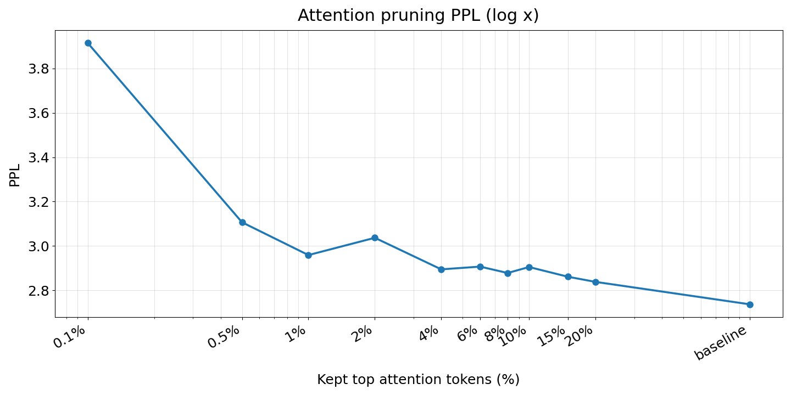
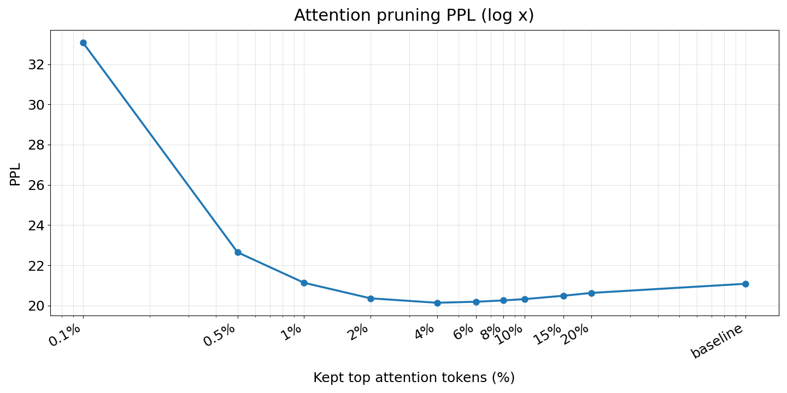

# Section 17. Attention Top-Ratio Pruning PPL 实验结果

本节记录 `qwen3_attention_pruning_cos_ppl` 项目中，按当前 query 的
attention/QK 分数保留 top-ratio token 后，对 loss/PPL 的直接影响。

对应项目：

```text
ymluo/projects/qwen3_attention_pruning_cos_ppl
```

需要注意的是，这里的 `top_ratio` 使用当前 query 的真实 attention/QK 排序，
因此它更接近一个 oracle pruning 诊断：它回答“如果每层每个 head 只保留
attention 分数最高的一小部分历史 token，模型行为会退化多少”。它还不是
query-agnostic 或低成本检索策略本身。

## 1. 实验设置

本次记录包含两组 PPL 实验：

1. 长文本检索任务：只评估末尾答案相关 token，`token_count=10`。
2. 普通 token 生成任务：评估连续普通文本 token，`token_count=10000`。

两组实验都使用相同的保留比例 sweep：

```text
0.1%, 0.5%, 1%, 2%, 4%, 6%, 8%, 10%, 15%, 20%
```

`baseline` 表示完整 attention，`top_ratio=r` 表示每层、每个 attention
head 只保留当前可见上下文中 attention/QK 分数最高的 `r` 比例 token，
其余位置在 softmax 前 mask 为 `-inf`。

## 2. 长文本检索任务结果

| mode | kept_percent | loss | PPL | token_count |
| --- | ---: | ---: | ---: | ---: |
| baseline | 100.0 | 1.006910 | 2.737130 | 10 |
| top_ratio | 0.1 | 1.364625 | 3.914256 | 10 |
| top_ratio | 0.5 | 1.133571 | 3.106732 | 10 |
| top_ratio | 1.0 | 1.084834 | 2.958948 | 10 |
| top_ratio | 2.0 | 1.110807 | 3.036809 | 10 |
| top_ratio | 4.0 | 1.062857 | 2.894630 | 10 |
| top_ratio | 6.0 | 1.067103 | 2.906946 | 10 |
| top_ratio | 8.0 | 1.057148 | 2.878151 | 10 |
| top_ratio | 10.0 | 1.066470 | 2.905105 | 10 |
| top_ratio | 15.0 | 1.051280 | 2.861311 | 10 |
| top_ratio | 20.0 | 1.043162 | 2.838177 | 10 |



图 17-1：长文本检索任务中，保留 top attention token 比例与 PPL 的关系。

图中的主要现象是：极低保留比例会明显破坏长文本检索答案位置的预测质量。
只保留 `0.1%` token 时，PPL 从 baseline 的 `2.7371` 上升到 `3.9143`，
相对增加约 `43.0%`。保留比例提高到 `0.5%` 后退化明显收敛，但 PPL
仍为 `3.1067`。

从 `1%` 到 `20%` 区间，PPL 已经进入较小波动范围。`20%` 是本组 sweep 中
最接近 baseline 的剪枝点，PPL 为 `2.8382`，相比 baseline 仍高约 `3.7%`。
`4%`、`8%`、`15%` 的结果也比较接近，说明长文本检索任务在答案 token
附近对少量关键 attention 目标较敏感，但并不需要完整 100% token 才能维持
接近 baseline 的 PPL。

这组结果的可比性限制是 `token_count=10` 很小。它更适合解释为“长文本检索
答案位置上的局部行为诊断”，不应单独作为全局 PPL 结论。

## 3. 普通 token 生成结果

| mode | kept_percent | loss | PPL | token_count |
| --- | ---: | ---: | ---: | ---: |
| baseline | 100.0 | 3.048617 | 21.086161 | 10000 |
| top_ratio | 0.1 | 3.498304 | 33.059324 | 10000 |
| top_ratio | 0.5 | 3.120157 | 22.649929 | 10000 |
| top_ratio | 1.0 | 3.050939 | 21.135172 | 10000 |
| top_ratio | 2.0 | 3.013721 | 20.363023 | 10000 |
| top_ratio | 4.0 | 3.002810 | 20.142060 | 10000 |
| top_ratio | 6.0 | 3.005332 | 20.192918 | 10000 |
| top_ratio | 8.0 | 3.008585 | 20.258712 | 10000 |
| top_ratio | 10.0 | 3.011820 | 20.324362 | 10000 |
| top_ratio | 15.0 | 3.020024 | 20.491785 | 10000 |
| top_ratio | 20.0 | 3.026782 | 20.630745 | 10000 |



图 17-2：普通 token 生成任务中，保留 top attention token 比例与 PPL 的关系。

普通 token 生成的曲线更稳定，因为评估了 `10000` 个 token。只保留 `0.1%`
仍然会严重退化，PPL 从 `21.0862` 上升到 `33.0593`，相对增加约 `56.8%`。
`0.5%` 时 PPL 仍高于 baseline 约 `7.4%`。

1、验证为什么是噪声导致baseline不好

2、剩下3%有多差，或者97%有多少

3、能不能用这种方式expand 小模型的 context len

4、为什么小模型可以增加context len

5、小模型帮助大模型压缩seq

6、小模型hidden维度限制了大context len？context太长了导致小模型没法做很长context的推理。


从 `1%` 开始，PPL 已经几乎回到 baseline：`1%` 的 PPL 为 `21.1352`，
只比 baseline 高约 `0.23%`。在 `2%-20%` 区间，本次实验的 PPL 反而低于
完整 attention，其中 `4%` 最好，PPL 为 `20.1421`，相比 baseline 下降约
`4.48%`。

这个“适度剪枝优于 baseline”的现象不能直接解释为剪枝必然提升模型质量。
更保守的解释是：普通文本生成中，大量低 attention mass 的 token 对 next-token
预测贡献很小，甚至可能引入轻微噪声；按真实 attention 分数保留 top token
可以在这个文本片段上起到类似 attention 去噪的效果。是否稳定成立，还需要
换文本、换长度、换随机片段重复验证。

## 4. 两类任务的差异

两张图共同说明：attention 的有效 token budget 和任务类型有关。

长文本检索任务只评估答案附近 token，更依赖远处少数关键信息是否被保留。
因此在 `0.1%-0.5%` 区间退化明显，直到 `4%-20%` 才比较接近 baseline。

普通 token 生成任务主要是局部语言建模和常规上下文续写。它对极低比例剪枝
仍然敏感，但 `1%` 已基本恢复 baseline，`2%-20%` 在本次样本上还略优于
baseline。这说明普通 next-token PPL 不能完全代表长文本检索能力；长文本
检索需要单独评估答案 token 或任务成功率。

## 5. 当前结论

1. `0.1%` top attention token 对两类任务都不够，PPL 都出现明显上升。
2. 普通 token 生成在 `1%` 保留比例时已经接近 full attention，说明大部分
   token 对常规 next-token PPL 的边际贡献很小。
3. 长文本检索答案位置更保守，`1%` 仍有约 `8.1%` PPL 增加，`20%` 才收敛到
   约 `3.7%` 的 PPL gap。
4. 对普通 token 生成，`2%-20%` 的 PPL 均低于 baseline；这可以作为
   attention 去噪假设的线索，但需要重复实验确认。
5. 如果目标是构建真实 sparse attention 或 KV 检索系统，不能只看普通 PPL；
   需要同时保留长文本检索、答案 token PPL、以及更大 token_count 的稳定性
   对照。

## 6. 后续建议

建议下一步围绕三个方向继续：

1. 对长文本检索任务扩大 `token_count` 或增加更多样本，避免只用 10 个答案
   token 得出过强结论。
2. 在 `1%-8%` 区间做更密集 sweep，例如 `1%, 1.5%, 2%, 3%, 4%, 6%, 8%`，
   因为普通生成的转折点在 `1%-2%` 附近，长文本检索的可接受区间可能在
   `4%-8%` 之后。
3. 将 top-ratio oracle pruning 结果作为上界，对比 Section 15/16 中的
   query-agnostic retrieval 或 tree retrieval 策略，观察真实检索候选集距离
   oracle top attention 还有多大 gap。
