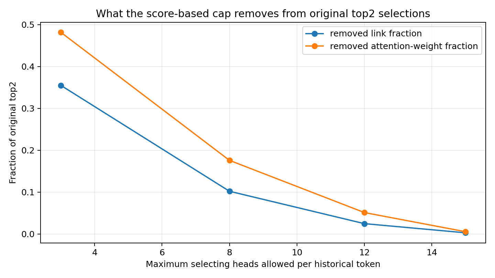
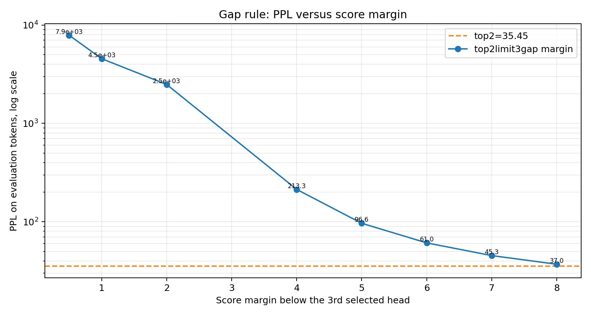
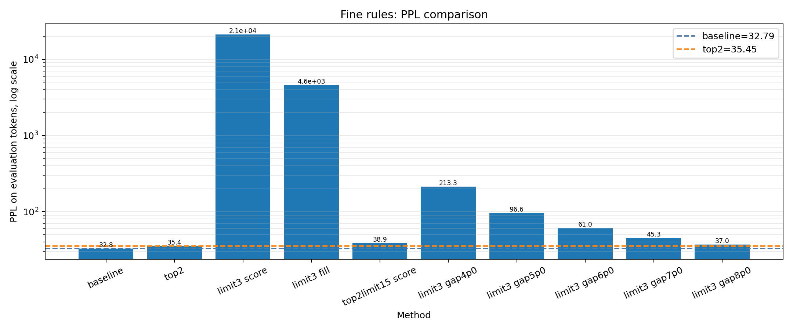
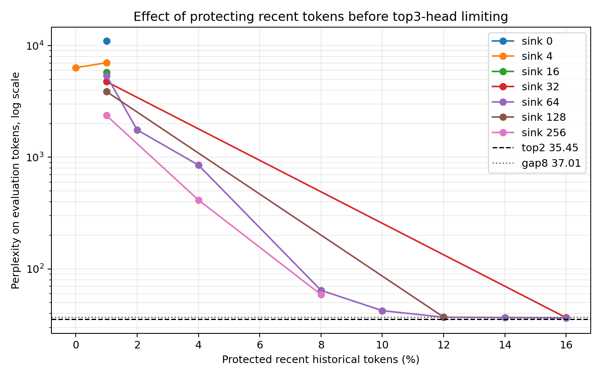
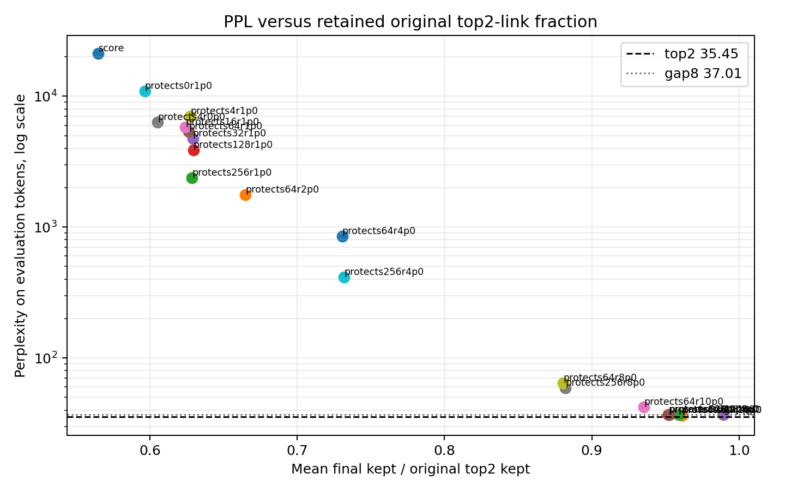
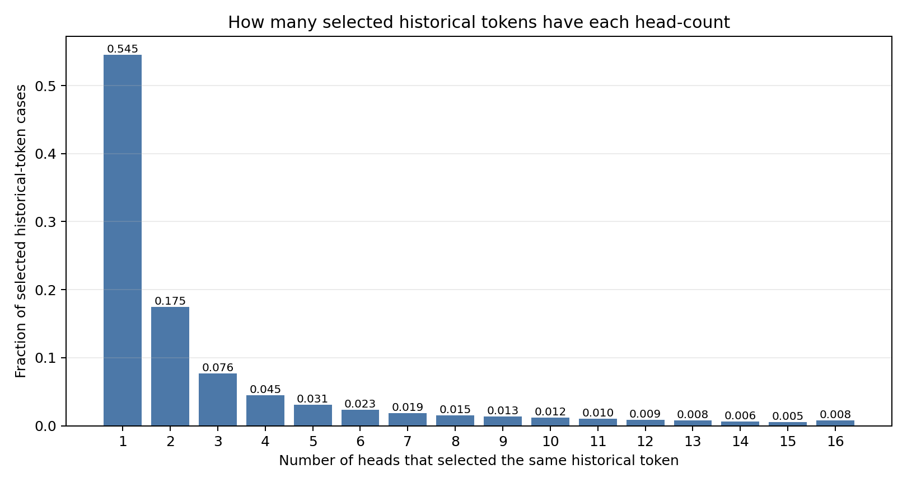
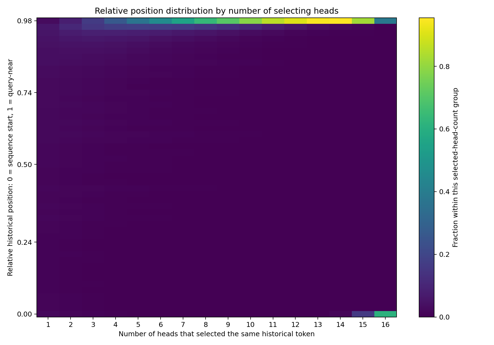
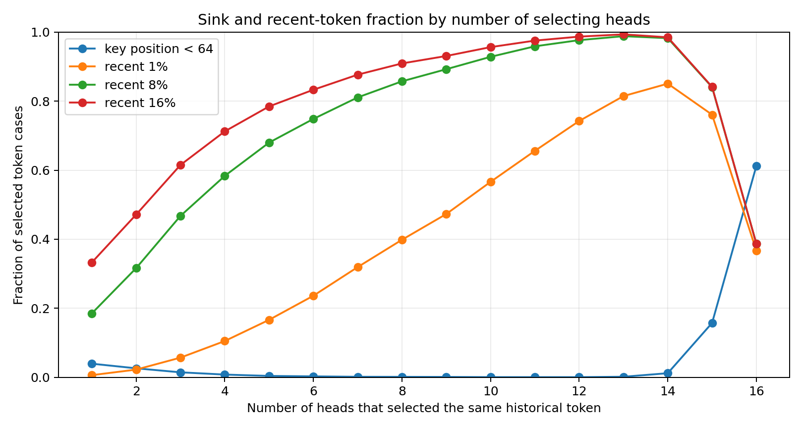
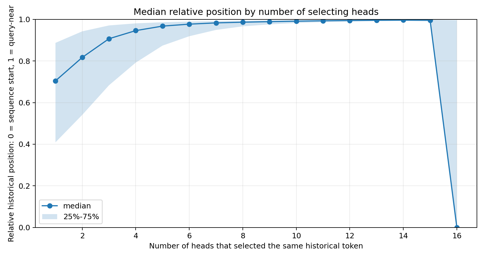

# Section 21. Top2 Attention 的跨 head 重合、PPL 崩坏与 sink/recent 保护实验

本节整理 `qwen3_top2_head_limit3_ppl` 项目中的实验方法和结果。

对应项目：

```text
ymluo/projects/qwen3_top2_head_limit3_ppl
```

本节关注的问题是：

```text
如果每个 attention head 只保留 top 2% 历史 token，
再进一步限制同一个历史 token 最多进入少数 head，
PPL 为什么会崩坏？
哪些 token 不能随意删？
跨 head 重合 token 的位置分布是什么样？
```

## 1. 统一实验设置

模型和数据：

| 项目 | 值 |
| --- | --- |
| model | `ymluo/models/Qwen3-0.6B` |
| text | `external/needle-in-a-haystack/needlehaystack/PaulGrahamEssays/worked.txt` |
| prefill tokens | 1024 |
| eval tokens | 512 |
| chunk size | 128 |
| dtype | `bfloat16` |
| attention implementation | `eager` |
| top fraction | 0.02 |

PPL 计算方式：

```text
PPL = exp(mean next-token cross entropy)
```

所有剪枝都发生在 softmax 之前：不保留的位置被 mask 成 `-inf`。

默认保留当前 query token 自己的位置。也就是说，本节讨论的剪枝都只作用在历史 token `j < q` 上。

## 2. 基础定义

对 layer `l`、head `h`、query token `q`、历史 token `j < q`，令：

```text
s[l, h, q, j] = pre-softmax attention score
```

### 2.1 top2

`top2` 表示每个 head 只保留历史 token 中 score 最高的 `ceil(0.02 * history_count)` 个 token。

```text
S(l, h, q) = top 2% historical tokens selected by head h
```

### 2.2 一个 token 被多少个 head 选中

对固定的 layer `l`、query `q`、历史 token `j`，定义：

```text
H(l, q, j) = {h : j in S(l, h, q)}
selected_head_count(l, q, j) = |H(l, q, j)|
```

如果 `selected_head_count = 8`，表示这个历史 token 在该 layer、该 query 下被 8 个 head 的 top2 选中。

## 3. 第一轮：hard top3-head cap 为什么失败

最初的想法是：

```text
每个 head 只选 top2% 历史 token；
如果同一个历史 token 被超过 3 个 head 选中，
只保留其中 3 个 head，其余 head-token link 删除。
```

测试过三种实现：

| mode | 定义 |
| --- | --- |
| `top2limit3` | 超过 3 个 head 时随机保留 3 个 head |
| `top2limit3score` | 超过 3 个 head 时保留 score 最大的 3 个 head |
| `top2limit3scorefill` | 先保留 score 最大的 3 个 head，再给每个 head 补回原始 top2 数量 |

主要结果：

| mode | PPL | PPL / top2 | kept fraction | removed links per head/query |
| --- | ---: | ---: | ---: | ---: |
| baseline | 32.793 | 0.925 |  |  |
| top2 | 35.448 | 1.000 |  |  |
| top2limit3score | 21146.067 | 596.538 | 0.565 | 11.965 |
| top2limit3scorefill | 4589.929 | 129.483 | 1.000 | 12.724 |

结论：

1. 随机不是主要问题。改成 score 最大的 3 个 head 仍然崩。
2. 每个 head 的 token 数量不是主要问题。`scorefill` 把每个 head 的数量补回去了，PPL 仍然很差。
3. 关键问题是删掉了错误的跨 head link。

## 4. 删除 link 的诊断：hard cap 删除的是高权重 link

为了判断 hard cap 删除的是不是低价值重复 link，做了一个离线诊断。

方法：

1. 用 full attention 得到原始 attention weight。
2. 按每个 head 的 top2 历史 token 重建原始 top2 link。
3. 模拟 score-based cap。
4. 统计每个 cap 删除了多少 link，以及删除了多少原始 top2 attention weight。

结果：

| cap | removed link fraction | removed top2 attention-weight fraction | removed links/query |
| ---: | ---: | ---: | ---: |
| 3 | 0.355 | 0.482 | 148.154 |
| 8 | 0.102 | 0.176 | 42.630 |
| 12 | 0.025 | 0.051 | 10.363 |
| 15 | 0.003 | 0.006 | 1.234 |



图 21-1：score-based cap 删除的 link fraction 和 attention-weight fraction。横轴是每个历史 token 最多允许几个 head 选中，纵轴是删除比例。`cap=3` 删除 `35.5%` link，却删除 `48.2%` top2 attention weight。

这说明 hard top3 不是只删低权重冗余项，而是在大量删除原本高 attention weight 的共享 link。

## 5. 第二轮：score-gap 规则

为了避免删除 score 很接近的 head，测试了：

```text
top2limit3gapM:
  如果一个历史 token 被超过 3 个 head 选中，
  先保留 score 最大的 3 个 head；
  额外保留所有 score >= 第三名 score - M 的 head。
```

结果：

| mode | kept fraction | removed links per head/query | PPL | PPL / top2 |
| --- | ---: | ---: | ---: | ---: |
| top2limit3gap4p0 | 0.903 | 2.662 | 213.291 | 6.017 |
| top2limit3gap5p0 | 0.943 | 1.558 | 96.550 | 2.724 |
| top2limit3gap6p0 | 0.967 | 0.902 | 60.987 | 1.720 |
| top2limit3gap7p0 | 0.981 | 0.528 | 45.329 | 1.279 |
| top2limit3gap8p0 | 0.989 | 0.294 | 37.011 | 1.044 |



图 21-2：`top2limit3gapM` 的 PPL 随 margin 变化。纵轴是 log PPL。margin 太小时仍然崩，`M=8.0` 时接近 top2。



图 21-3：不同规则的 PPL 对比。`top2limit3gap8p0` 明显好于 hard top3 和 scorefill。

阶段性结论：

```text
只允许 3 个 head 是过硬约束。
更安全的规则是只删明显低于前三名 score 的重复 head。
```

但 `M=8.0` 是 raw pre-softmax score margin，可能不容易迁移到其他模型、层或序列长度。

## 6. 第三轮：保护 sink 和 recent token

新的假设是：

```text
PPL 崩坏来自删除了 attention sink token 和最近局部上下文 token。
这些 token 即使被很多 head 同时选中，也不应该随便删。
```

测试规则：

```text
top2limit3protectsSrR:
  先做每个 head 的 top2 历史 token；
  保护前 S 个历史 token 位置；
  保护最近 R% 的历史 token 位置；
  被保护 token 保留所有原始 top2-selected heads；
  其他 token 如果被超过 3 个 head 选中，只保留 score 最大的 3 个 head。
```

例子：

```text
top2limit3protects64r16p0
```

表示保护前 64 个历史位置和最近 16% 历史位置，其余 token 才做 top3-head cap。

主要结果：

| mode | PPL | PPL / top2 | kept fraction | removed links per head/query |
| --- | ---: | ---: | ---: | ---: |
| top2 | 35.448 | 1.000 |  |  |
| top2limit3score | 21146.067 | 596.538 | 0.565 | 11.965 |
| top2limit3protects64r8p0 | 64.375 | 1.816 | 0.881 | 3.286 |
| top2limit3protects64r10p0 | 42.351 | 1.195 | 0.935 | 1.781 |
| top2limit3protects64r12p0 | 36.964 | 1.043 | 0.952 | 1.322 |
| top2limit3protects64r14p0 | 36.768 | 1.037 | 0.959 | 1.132 |
| top2limit3protects64r16p0 | 36.462 | 1.029 | 0.961 | 1.064 |
| top2limit3gap8p0 | 37.011 | 1.044 | 0.989 | 0.294 |



图 21-4：保护 recent token 比例对 PPL 的影响。横轴是保护最近多少历史 token，纵轴是 log PPL。只保护最近 `1%` 不够，`10%` 到 `12%` 附近出现明显转折，`16%` 已经接近 top2。



图 21-5：保留原始 top2 link 比例和 PPL 的关系。`protects64r16p0` 比 `gap8` 删除更多 link，但 PPL 略低。

当前最佳规则：

```text
top2limit3protects64r16p0
```

它相对 top2 的变化：

| 指标 | top2 | protects64r16p0 |
| --- | ---: | ---: |
| PPL | 35.448 | 36.462 |
| PPL ratio | 1.000 | 1.029 |
| kept fraction |  | 0.961 |
| removed links/head/query |  | 1.064 |

这个结果支持 sink/recent prior，但也说明“最近 1%”太窄。对这段文本和这个窗口来说，需要保护更宽的 recent band，大约 `12%` 到 `16%`。

## 7. 第四轮：被 1..16 个 head 选中的 token 的位置分布

为了验证 sink/recent 解释，进一步统计：

```text
对每个 layer、query、历史 token：
  统计它被多少个 head 的 top2 选中；
  分组为 selected_head_count = 1..16；
  记录 token 的绝对位置、离 query 的距离、相对位置。
```

相对位置定义：

```text
relative_position = key_index / (history_count - 1)
```

`0` 表示序列开头，也就是 sink 侧。`1` 表示接近当前 query。

### 7.1 每个 head-count 组有多少 token

| selected heads | token cases | fraction |
| ---: | ---: | ---: |
| 1 | 1212248 | 0.545 |
| 2 | 388868 | 0.175 |
| 3 | 170085 | 0.076 |
| 4 | 99393 | 0.045 |
| 8 | 34429 | 0.015 |
| 12 | 19242 | 0.009 |
| 15 | 11331 | 0.005 |
| 16 | 17690 | 0.008 |



图 21-6：不同 selected-head-count 的 token case 占比。多数 token 只被 1 或 2 个 head 选中；被 16 个 head 都选中的情况很少，但不是零。

### 7.2 位置分布

| selected heads | median relative position | median distance to query | key < 64 | recent 1% | recent 8% | recent 16% |
| ---: | ---: | ---: | ---: | ---: | ---: | ---: |
| 1 | 0.705 | 385 | 0.039 | 0.006 | 0.185 | 0.333 |
| 2 | 0.817 | 237 | 0.026 | 0.022 | 0.316 | 0.471 |
| 4 | 0.946 | 70 | 0.008 | 0.105 | 0.583 | 0.713 |
| 8 | 0.987 | 18 | 0.001 | 0.398 | 0.858 | 0.909 |
| 12 | 0.995 | 8 | 0.000 | 0.743 | 0.977 | 0.987 |
| 14 | 0.997 | 5 | 0.012 | 0.851 | 0.983 | 0.985 |
| 15 | 0.996 | 6 | 0.157 | 0.761 | 0.841 | 0.842 |
| 16 | 0.000 | 1123 | 0.613 | 0.367 | 0.387 | 0.387 |



图 21-7：不同 selected-head-count 组的相对位置分布。每一列在该 head-count 组内归一化，颜色表示该组内 token 落在对应位置 bin 的比例。`1..14` 个 head 的 token 越来越靠近 query；但 `16` 个 head 的 token 出现强 sink 分量。



图 21-8：每个 head-count 组中属于 sink 或 recent 区域的比例。`8..14` 个 head 选中的 token 大多是 recent；`16` 个 head 选中的 token 主要是 sink，同时还有一部分 recent。



图 21-9：相对位置中位数和 25%-75% 区间。这个图显示 typical token 随 selected-head-count 增加而靠近 query，但 `16` 个 head 的中位数跳到 0，说明 all-head overlap 不是“更 recent”，而是 sink 主导。

结论：

1. `1..14` 个 head 的共享 token 越来越接近 query。
2. `8..14` 个 head 选中的 token 基本属于 broad recent band。
3. `16` 个 head 都选中的 token 是特殊组，`61.3%` 在前 64 个位置，说明 all-head overlap 很大一部分是 attention sink。
4. 这解释了为什么 `protects64r16p0` 比 hard top3 稳定：它同时保护了 all-head sink 和 high-overlap recent token。

## 8. 当前统一解释

这些实验共同支持下面的解释：

```text
top2 以后，同一个历史 token 被多个 head 选中并不一定是冗余。
高重合 token 主要分成两类：
1. 序列开头的 attention sink token；
2. 距离 query 较近的 broad recent context token。

hard top3-head cap 会把这两类 token 的跨 head 连接删掉，
因此 PPL 严重崩坏。
```

`score-gap` 方法有效，是因为它避免删除 score 近似 tied 的共享 head。

`protect sink + recent` 方法更直接地利用了位置先验。当前最好的固定规则是：

```text
top2limit3protects64r16p0
```

这个规则在当前文本和窗口中：

- PPL 只比 top2 高 `2.9%`；
- 比 `top2limit3gap8p0` 略好；
- 删除的 top2 link 比 gap8 更多。

## 9. 局限性

1. 当前结果只来自一个文本前缀和一个模型。
2. `recent 16%` 是固定比例，不一定迁移到其他 sequence length。
3. `sink 64` 是固定绝对位置，也不一定是最优边界。
4. PPL 只评估 next-token likelihood，不等价于长文本检索任务成功率。
5. head-count 位置分布说明 shared token 在哪里，但不单独证明每个 link 都有因果必要性。因果必要性来自 PPL 剪枝实验。

## 10. 后续建议

下一步建议不要只固定 `sink=64, recent=16%`，而是做 adaptive rule：

```text
先保护 sink；
再保护 recent，直到剩余可删 link 的 full-attention weight 足够低，
或 score 与第三名 head 的 gap 足够大。
```

可以测试三类规则：

1. normalized score gap：

```text
keep if score >= third_score - alpha * local_score_std
```

2. attention-weight threshold：

```text
delete only if original full-attention weight is below a small threshold
```

3. position + score hybrid：

```text
protect sink and recent;
outside protected region, apply normalized score-gap deletion
```

目标是保留 `protects64r16p0` 的 PPL 稳定性，同时进一步减少保留 link 数量。

## 11. 文件索引

主要代码：

```text
ymluo/projects/qwen3_top2_head_limit3_ppl/src/evaluate_qwen3_top2_head_limit3_ppl.py
ymluo/projects/qwen3_top2_head_limit3_ppl/src/diagnose_top2_limit_removal.py
ymluo/projects/qwen3_top2_head_limit3_ppl/src/analyze_top2_head_count_positions.py
```

主要结果：

```text
ymluo/projects/qwen3_top2_head_limit3_ppl/outputs/final_fine_rules/fine_rule_summary.csv
ymluo/projects/qwen3_top2_head_limit3_ppl/outputs/protect_sink_recent_combined/combined_protect_sink_recent_summary.csv
ymluo/projects/qwen3_top2_head_limit3_ppl/outputs/head_count_position_distribution/head_count_position_summary.csv
ymluo/projects/qwen3_top2_head_limit3_ppl/outputs/removal_diagnostics/removed_weight_summary_by_cap.csv
```

项目内详细记录：

```text
ymluo/projects/qwen3_top2_head_limit3_ppl/docs/design.md
ymluo/projects/qwen3_top2_head_limit3_ppl/docs/experiment_design.md
ymluo/projects/qwen3_top2_head_limit3_ppl/docs/visualization_results.md
ymluo/projects/qwen3_top2_head_limit3_ppl/docs/viewer_audit.md
```
