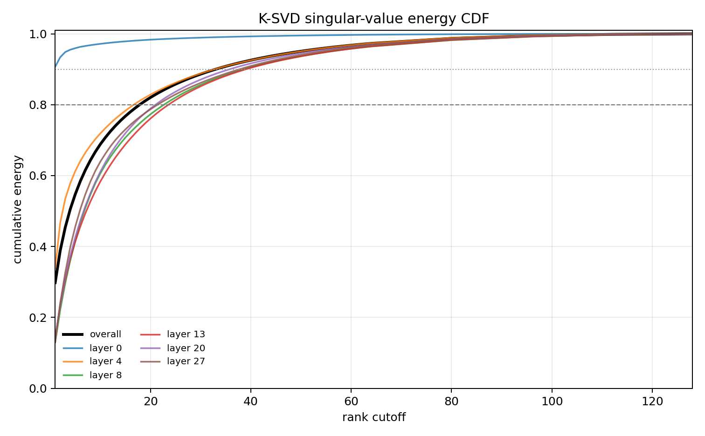
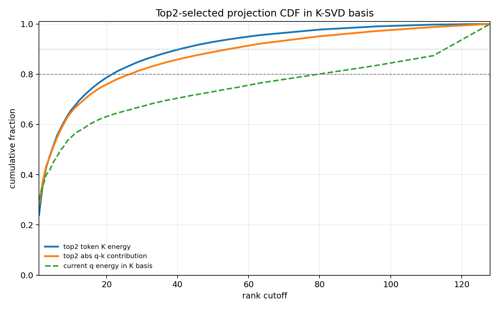
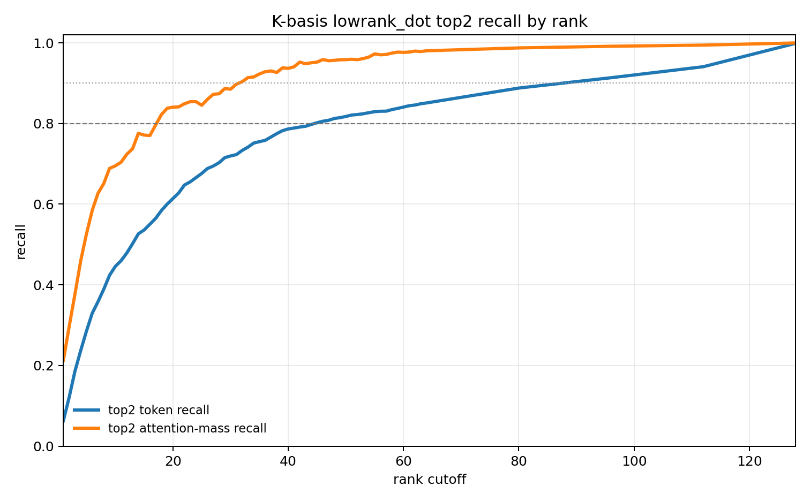
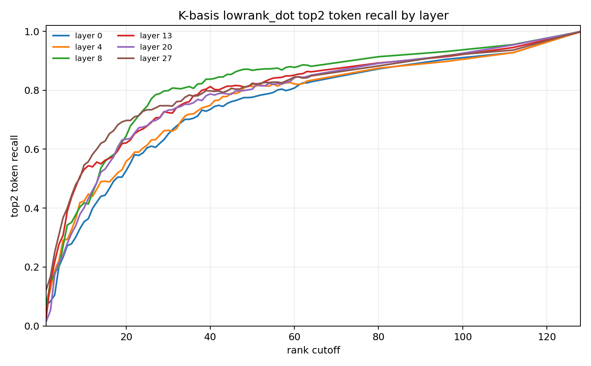

# Section 39: 分离 Q/K 低秩子空间分析

日期：2026-06-30

## 0. 实验目标

本实验测试“Q 和 K 分别使用自己的低秩子空间”的版本：

```text
q 投影到历史 Q 的低秩子空间。
k 投影到历史 K 的低秩子空间。
```

关键点：

```text
Q 子空间和 K 子空间是两个不同的坐标系，所以不能直接逐维相乘 q_i * k_i。
正确的分离子空间打分方式是：

score_r(q, k) = q_Q,r^T (B_Q,r^T B_K,r) k_K,r

其中 B_Q 是 Q-SVD basis，B_K 是 K-SVD basis。
中间的 B_Q^T B_K 是 cross-basis matrix，用来连接两个不同的坐标系。
```

新增文件：

```text
ymluo/projects/qwen3_top2_head_limit3_ppl/src/analyze_top2_qk_separate_spectral.py
ymluo/projects/qwen3_top2_head_limit3_ppl/scripts/run_top2_qk_separate_spectral_server.sh
```

## 1. 服务器运行

服务器：

```text
fdong@10.176.37.31
```

输出目录：

```text
/home/fdong/ymluo/projects/qwen3_top2_head_limit3_ppl/outputs/top2_qk_separate_spectral_medium_0630
```

本地拷贝目录：

```text
ymluo/projects/qwen3_top2_head_limit3_ppl/outputs/top2_qk_separate_spectral_medium_0630
```

运行命令：

```bash
OUT=/home/fdong/ymluo/projects/qwen3_top2_head_limit3_ppl/outputs/top2_qk_separate_spectral_medium_0630 \
VARIANTS=compact_kv,json_kv,needle_sentence,topic_table \
TASKS_PER_VARIANT=2 \
LAYERS=0,4,8,13,20,27 \
HEADS=0,4,8,12 \
MAX_QUERY_TOKENS_PER_TASK=2 \
bash scripts/run_top2_qk_separate_spectral_server.sh
```

实验规模：

```text
tasks = 8
selected layers = 0,4,8,13,20,27
selected heads = 0,4,8,12
sampled query tokens per task = 2
observed SVD rows = 384
skipped Q SVD rows = 0
skipped K SVD rows = 0
runtime = 18.7s
```

## 2. 实验方法

对每一个 sampled layer/head/query row：

1. 记录当前 query token 之前的历史 Q 向量。
2. 从 cache 中取历史 K 向量。
3. 分别拟合 centered SVD basis：

```text
B_Q = historical Q 的右奇异向量
B_K = historical K 的右奇异向量
```

4. 用分离子空间的 rank-r 近似对历史 token 打分：

```text
q_Q = q B_Q,r
k_K = k B_K,r
score_r = q_Q (B_Q,r^T B_K,r) k_K^T
```

5. 选出和 full-QK top2 数量相同的 token，并报告 recall。

正确性检查：

```text
当 rank=128 时，B_Q 和 B_K 都是完整 head dimension 的正交基。
因此分离子空间 score 应该能恢复 full-QK score，最多只有数值误差。
```

## 3. Q/K 谱分布

整体谱分布：

| 子空间 | Effective rank | Rank80 | Rank90 | Top8 | Top16 | Top32 | Top64 |
| --- | ---: | ---: | ---: | ---: | ---: | ---: | ---: |
| Q | 39.62 | 26.55 | 41.64 | 50.4% | 68.1% | 84.6% | 96.1% |
| K | 26.97 | 18.25 | 30.98 | 64.3% | 78.0% | 89.6% | 97.3% |

分层谱分布：

| 子空间 | 层 | Effective rank | Rank80 | Rank90 | Top16 | Top32 | Top64 |
| --- | ---: | ---: | ---: | ---: | ---: | ---: | ---: |
| Q | 0 | 44.16 | 32.08 | 50.19 | 64.1% | 80.2% | 94.4% |
| Q | 4 | 31.79 | 20.81 | 35.06 | 74.8% | 88.1% | 97.6% |
| Q | 8 | 44.00 | 28.75 | 43.97 | 64.3% | 83.5% | 95.8% |
| Q | 13 | 31.67 | 20.38 | 33.72 | 75.1% | 89.4% | 97.4% |
| Q | 20 | 36.66 | 25.50 | 41.00 | 71.1% | 85.7% | 95.8% |
| Q | 27 | 49.41 | 31.80 | 45.92 | 59.4% | 80.8% | 95.8% |
| K | 0 | 1.80 | 1.00 | 1.53 | 98.0% | 99.0% | 99.7% |
| K | 4 | 20.69 | 17.69 | 31.47 | 79.4% | 89.7% | 97.4% |
| K | 8 | 35.99 | 23.50 | 38.91 | 72.3% | 86.8% | 96.4% |
| K | 13 | 36.58 | 24.09 | 39.47 | 70.4% | 86.4% | 96.4% |
| K | 20 | 33.90 | 21.25 | 36.31 | 73.6% | 88.1% | 96.9% |
| K | 27 | 32.87 | 21.97 | 38.19 | 74.4% | 87.2% | 96.8% |

解释：

```text
这复现了前面实验的结论：
整体上 K 比 Q 更集中。
K 的 layer 0 极端低秩，但 Q 的 layer 0 并不是。
```

这说明 K 子空间天然更适合做 top2 token selection 的低秩近似。

## 4. 各 token group 在自己子空间里的能量覆盖

这里每一侧都在自己的 basis 里统计能量：

| token 组 | 样本数 | attention mass | Q own top32 | K own top32 | Q own top64 | K own top64 |
| --- | ---: | ---: | ---: | ---: | ---: | ---: |
| top2_selected | 4800 | 0.0640 | 70.7% | 86.4% | 87.4% | 95.6% |
| sink | 3840 | 0.0465 | 70.6% | 87.2% | 87.1% | 96.1% |
| recent | 6144 | 0.0016 | 70.6% | 89.7% | 87.1% | 97.2% |
| evidence_key | 5184 | 0.0002 | 70.5% | 89.1% | 87.1% | 97.2% |
| evidence_label | 384 | 0.0047 | 70.6% | 88.2% | 87.1% | 96.9% |
| evidence_any | 10704 | 0.0025 | 70.5% | 88.6% | 87.1% | 97.0% |

解释：

```text
如果分开看，Q 和 K 两边都呈现一定低秩性：
top2 q 在 Q top32 中有约 70.7% 能量；
top2 k 在 K top32 中有约 86.4% 能量。
```

但是，单独看能量覆盖并不能保证 cross q-k score 被很好保留。

原因是最终 attention score 依赖的是 q-k alignment，而不是只依赖 q 自己或 k 自己的能量 CDF。

## 5. 分离子空间的 top2 recall

使用如下打分：

```text
q_Q,r^T (B_Q,r^T B_K,r) k_K,r
```

整体结果：

| rank | top2 recall | top2 attention-mass recall |
| ---: | ---: | ---: |
| 1 | 4.1% | 10.8% |
| 2 | 5.0% | 9.6% |
| 4 | 8.6% | 13.8% |
| 8 | 10.9% | 17.9% |
| 16 | 19.4% | 21.3% |
| 32 | 37.9% | 35.0% |
| 64 | 56.7% | 57.4% |
| 128 | 99.9% | 100.0% |

正确性检查：

```text
Rank128 几乎完全恢复 full-QK top2。
所以 cross-basis scoring 的实现是对的。
```

和前面方法对比：

| 方法 | Rank32 top2 recall | Rank32 mass recall | Rank64 top2 recall | Rank64 mass recall |
| --- | ---: | ---: | ---: | ---: |
| K-basis lowrank dot | 73.3% | 90.4% | 85.1% | 98.0% |
| Q-basis lowrank dot | 44.1% | 50.7% | 60.7% | 69.2% |
| Separate Q/K basis | 37.9% | 35.0% | 56.7% | 57.4% |

解释：

```text
Separate Q/K 的形式在数学上是合理的。
但在相同 symmetric rank budget 下，它没有比更简单的 Q-basis score 更好，
并且明显弱于 K-basis。
```

## 6. 分层 recall

| rank | 层 | top2 recall | top2 attention-mass recall |
| ---: | ---: | ---: | ---: |
| 32 | 0 | 32.3% | 46.2% |
| 32 | 4 | 41.1% | 52.3% |
| 32 | 8 | 34.3% | 24.9% |
| 32 | 13 | 44.7% | 47.8% |
| 32 | 20 | 28.4% | 23.3% |
| 32 | 27 | 46.7% | 15.3% |
| 64 | 0 | 48.6% | 66.5% |
| 64 | 4 | 63.2% | 82.0% |
| 64 | 8 | 55.7% | 48.5% |
| 64 | 13 | 65.3% | 61.9% |
| 64 | 20 | 40.8% | 30.8% |
| 64 | 27 | 66.9% | 54.8% |

解释：

```text
Layer 4 是 separate-subspace 中 attention-mass recall 最强的一层。
Layer 20 一直比较弱。
Rank64 有明显提升，但整体上仍然达不到 K-basis rank32 的水平。
```

## 7. 当前结论

Separate Q/K subspace 的想法在数学上很干净，但经验结果更弱：

```text
虽然 q 和 k 分别在自己的空间里都有低秩结构，
但同时截断两边，然后再通过 B_Q^T B_K 连接，会损失太多 top2 token selection
所需要的 q-k alignment。
```

主要结论：

```text
对当前 top2-selection 问题来说，K 的 leading subspace 仍然是最好的 standalone low-rank basis。
Q 自己的子空间有用，但更弱。
Separate Q/K subspaces 在 symmetric rank32/rank64 budget 下没有带来提升。
```

下一步值得检查：

```text
做 asymmetric rank grid，例如 Q16/K64、Q32/K64、Q64/K32、Q64/K128。
当前结果只测试了 symmetric ranks。
```

## 8. 最近两组 Q 子空间实验总结

这一节汇总 K 子空间实验之后继续做的两组实验：

```text
Section 38: Q-only basis
  q 和 k 都投影到历史 Q 的 SVD 子空间里，再用低秩 q-k dot 打分。

Section 39: separate Q/K basis
  q 投影到历史 Q 的 SVD 子空间；
  k 投影到历史 K 的 SVD 子空间；
  两边 basis 不同，所以打分时显式使用 cross-basis matrix B_Q^T B_K。
```

两组实验的目标一致：

```text
在每个 sampled layer/head/query row 上，恢复 full-QK 选出的 top 2% 历史 token。
```

### 8.1 谱分布对比

整体谱集中程度：

| 子空间 | Effective rank | Rank80 | Rank90 | Top16 energy | Top32 energy | Top64 energy |
| --- | ---: | ---: | ---: | ---: | ---: | ---: |
| K-SVD | 26.97 | 18.25 | 30.98 | 78.0% | 89.6% | 97.3% |
| Q-SVD | 39.62 | 26.55 | 41.64 | 68.1% | 84.6% | 96.1% |

解释：

```text
Q 和 K 都有低秩倾向，但 K 明显更集中。
K 大约 18 个方向能覆盖 80% 能量，而 Q 需要约 27 个方向。
K 大约 31 个方向能覆盖 90% 能量，而 Q 需要约 42 个方向。
```

分层差异：

```text
K 的 layer 0 几乎是 rank-1/rank-2。
但 Q 的 layer 0 不是：Q layer 0 的 effective rank 约 44，
需要约 32 个方向才能覆盖 80% 能量。
```

这一点很重要，因为之前 K-basis 效果好，部分原因就是 K 在某些层里非常集中，尤其是 layer 0。

### 8.2 Top2 recall 对比

最直接的比较是 top2 恢复能力：

| 方法 | Rank32 top2 recall | Rank32 mass recall | Rank64 top2 recall | Rank64 mass recall |
| --- | ---: | ---: | ---: | ---: |
| K-basis lowrank dot | 73.3% | 90.4% | 85.1% | 98.0% |
| Q-basis lowrank dot | 44.1% | 50.7% | 60.7% | 69.2% |
| Separate Q/K basis | 37.9% | 35.0% | 56.7% | 57.4% |

正确性检查：

```text
Q-basis rank128 可以恢复 full-QK top2：99.9% recall，100.0% mass recall。
Separate Q/K rank128 也可以恢复 full-QK top2：99.9% recall，100.0% mass recall。
```

所以 rank32/rank64 的下降是真实的低秩截断损失，不是实现口径不一致导致的。

### 8.3 结果说明什么

当前结论：

```text
top2-selection 信号确实有低秩性，
但它更自然地落在 K 空间里，而不是 Q 空间里。
```

更具体地说：

```text
1. Q 也有低秩谱结构，但集中程度弱于 K。
2. Q-only lowrank scoring 是有用的，明显高于随机 2%，但弱于 K-only scoring。
3. Separate Q/K subspaces 在数学上是合理的，
   但对两边做 symmetric rank truncation 后，
   会通过 cross-basis matrix B_Q^T B_K 损失 q-k alignment。
4. 在 rank32/rank64 budget 下，Separate Q/K 没有比 Q-only 更好，
   并且明显弱于 K-only。
```

这支持后续方法设计上的判断：

```text
如果要做 low-rank top2 classifier 或 sparse attention proxy，
K-SVD 仍然是最好的 standalone basis。
Q-subspace features 可以作为辅助信号，但不应该替代 K-subspace features。
```

### 8.4 下一步实验

当前 Separate Q/K 只测试了 symmetric rank budget：

```text
Q32/K32
Q64/K64
```

下一步更值得测 asymmetric rank allocation：

```text
Q16/K64
Q32/K64
Q32/K128
Q64/K32
Q64/K128
```

假设：

```text
因为 K 是更强的 basis，把更多 rank 分配给 K，而不是 Q，
可能在相同或接近的 compute budget 下恢复更多 top2 attention mass。
```

## 9. K 子空间 dense rank CDF 补充实验

为了更细地观察 K 子空间的低秩投影行为，这里重新跑了一组 dense rank sweep：

```text
rank cutoffs = 1..64,80,96,112,128
```

运行配置和前面的 medium run 保持一致：

```text
tasks = 8
variants = compact_kv,json_kv,needle_sentence,topic_table
selected layers = 0,4,8,13,20,27
selected heads = 0,4,8,12
sampled query tokens per task = 2
observed SVD rows = 384
skipped SVD rows = 0
runtime = 395.5s
```

输出目录：

```text
/home/fdong/ymluo/projects/qwen3_top2_head_limit3_ppl/outputs/top2_k_spectral_dense_rank_0630
ymluo/projects/qwen3_top2_head_limit3_ppl/outputs/top2_k_spectral_dense_rank_0630
```

本次也修正了 K 分析脚本里的 `head_dim` 读取方式：

```text
原来使用 hidden_size / num_attention_heads，会截到 64。
现在使用 model.config.head_dim，因此可以覆盖到 rank128。
```

### 9.1 K-SVD 奇异值能量 CDF



分层统计：

| Layer | Rank80 | Rank90 | Top16 | Top32 | Top64 | Top128 |
| ---: | ---: | ---: | ---: | ---: | ---: | ---: |
| 0 | 1.00 | 1.66 | 98.0% | 99.0% | 99.7% | 100.0% |
| 4 | 17.75 | 31.66 | 79.4% | 89.7% | 97.4% | 100.0% |
| 8 | 23.62 | 38.75 | 72.2% | 86.8% | 96.4% | 100.0% |
| 13 | 24.06 | 39.28 | 70.5% | 86.5% | 96.5% | 100.0% |
| 20 | 21.28 | 36.25 | 73.6% | 88.2% | 96.9% | 100.0% |
| 27 | 21.97 | 38.03 | 74.4% | 87.3% | 96.8% | 100.0% |

解释：

```text
Layer 0 的 K 空间非常极端，rank2 左右已经覆盖 90% 能量。
其他层更平滑，通常需要 18-24 个方向覆盖 80% 能量，
需要 32-40 个方向覆盖 90% 能量。
rank64 已经覆盖约 96%-97% 能量，rank128 是完整空间。
```

### 9.2 top2_selected 在 K-SVD basis 中的投影 CDF



整体细分 rank 表：

| Rank | K-SVD energy | top2 K energy | top2 abs q-k contrib | q energy in K basis |
| ---: | ---: | ---: | ---: | ---: |
| 1 | 29.8% | 23.9% | 28.3% | 30.0% |
| 2 | 38.8% | 35.6% | 37.1% | 35.1% |
| 4 | 50.5% | 47.4% | 47.0% | 41.8% |
| 8 | 64.3% | 60.9% | 60.4% | 51.3% |
| 16 | 78.0% | 74.5% | 72.5% | 60.6% |
| 24 | 85.1% | 81.8% | 78.6% | 64.9% |
| 32 | 89.6% | 86.5% | 82.8% | 68.0% |
| 40 | 92.6% | 89.8% | 85.8% | 70.4% |
| 48 | 94.7% | 92.3% | 88.3% | 72.6% |
| 56 | 96.2% | 94.2% | 90.4% | 74.6% |
| 64 | 97.3% | 95.7% | 92.3% | 76.7% |
| 80 | 98.7% | 97.8% | 95.1% | 80.1% |
| 96 | 99.5% | 99.0% | 97.2% | 83.5% |
| 112 | 99.9% | 99.7% | 98.8% | 87.4% |
| 128 | 100.0% | 100.0% | 100.0% | 100.0% |

解释：

```text
top2_selected 的 K 向量能量和 abs q-k contribution 都明显集中在前面几十个 K-SVD 方向。

rank32:
  K-SVD energy = 89.6%
  top2 K energy = 86.5%
  top2 abs q-k contribution = 82.8%

rank64:
  K-SVD energy = 97.3%
  top2 K energy = 95.7%
  top2 abs q-k contribution = 92.3%
```

这解释了为什么前面的 K-basis lowrank dot 在 rank32/rank64 下效果很好：

```text
rank32 已经覆盖大部分 K 空间能量和 top2 q-k 贡献；
rank64 基本接近完整 K 子空间，尤其对 attention-mass recall 很强。
```

但是也要注意：

```text
当前 q 在 K basis 中的能量更长尾。
rank32 只覆盖约 68.0% q energy，
rank64 覆盖约 76.7% q energy，
到 rank96 才约 83.5%。
```

所以 K-basis 的有效性主要来自：

```text
1. K 空间本身低秩集中；
2. top2 token 的 K 能量集中；
3. q-k dot 的绝对贡献也集中在 K 的 leading directions；
4. 不是因为 q 自己在 K basis 中极端低秩。
```

### 9.3 top2 token 召回率曲线

上面两张 CDF 图只说明“能量/贡献覆盖了多少”，还没有直接回答“按低秩 score 重新选 token 能召回多少 full-QK top2 token”。因此这里补充 `K-basis lowrank_dot` 的 dense rank recall 曲线。

实验设置：

```text
train tasks = 32
eval tasks = 8
eval rows = 384
rank cutoffs = 1..64,80,96,112,128
method = lowrank_dot
```

注意：

```text
这里使用 train_top2_lowrank_classifier.py 的输出，但本节只使用 lowrank_dot，
不使用 trained_linear 结果。
```

整体 top2 recall 曲线：



分层 top2 token recall 曲线：



整体细分 rank 表：

| Rank | top2 token recall | top2 attention-mass recall |
| ---: | ---: | ---: |
| 1 | 6.3% | 21.3% |
| 2 | 12.1% | 29.7% |
| 4 | 23.7% | 46.0% |
| 8 | 38.9% | 65.1% |
| 16 | 55.0% | 77.0% |
| 24 | 66.6% | 85.4% |
| 32 | 73.3% | 90.4% |
| 40 | 78.6% | 93.7% |
| 48 | 81.2% | 95.7% |
| 56 | 83.0% | 97.0% |
| 64 | 85.1% | 98.0% |
| 80 | 88.8% | 98.7% |
| 96 | 91.4% | 99.2% |
| 112 | 94.1% | 99.4% |
| 128 | 99.9% | 100.0% |

分层 rank32/rank64/rank128 对比：

| Layer | Rank32 recall | Rank32 mass recall | Rank64 recall | Rank64 mass recall | Rank128 recall | Rank128 mass recall |
| ---: | ---: | ---: | ---: | ---: | ---: | ---: |
| 0 | 67.9% | 87.2% | 82.9% | 94.7% | 99.9% | 100.0% |
| 4 | 67.0% | 81.0% | 83.4% | 96.7% | 99.9% | 99.9% |
| 8 | 80.6% | 94.0% | 88.1% | 99.3% | 99.9% | 100.0% |
| 13 | 74.1% | 91.1% | 86.2% | 97.1% | 99.8% | 100.0% |
| 20 | 74.1% | 90.8% | 85.1% | 98.8% | 99.9% | 100.0% |
| 27 | 76.1% | 95.5% | 84.9% | 99.9% | 100.0% | 100.0% |

结论：

```text
rank32 已经是一个强 operating point：
  top2 token recall = 73.3%
  top2 attention-mass recall = 90.4%

rank64 基本覆盖了绝大部分重要 attention mass：
  top2 token recall = 85.1%
  top2 attention-mass recall = 98.0%

rank128 是 full-rank sanity check：
  top2 token recall = 99.9%
  top2 attention-mass recall = 100.0%
```

这条 recall 曲线和前面的 CDF 曲线是一致的：

```text
K-SVD energy / top2 K energy / abs q-k contribution 在 rank32-rank64 已经很高，
因此 lowrank_dot 在 rank32-rank64 能恢复大部分 full-QK top2 token，
尤其是恢复几乎全部 attention mass。
```
