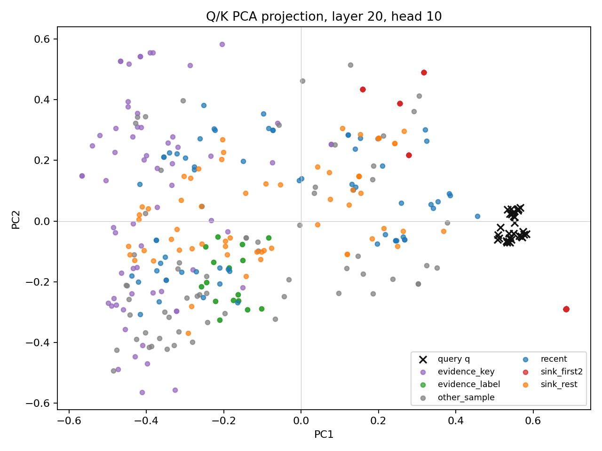
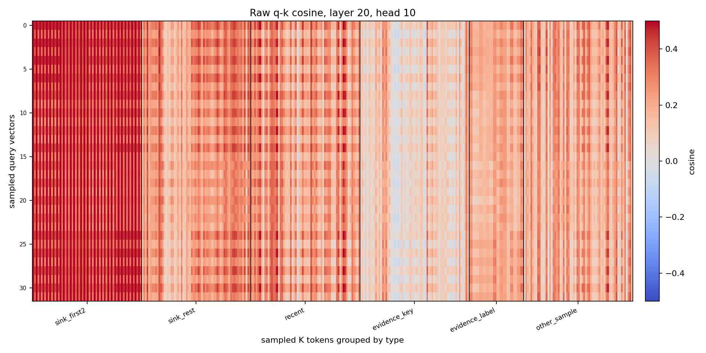
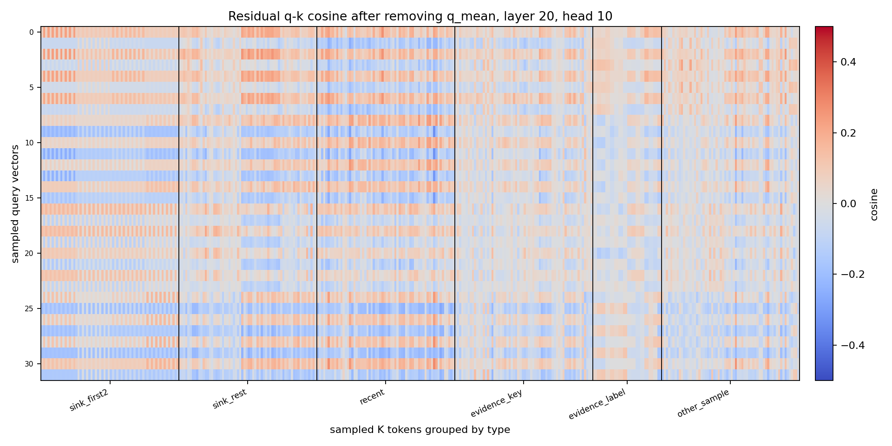

# Section 44: sink vector 三张可视化图

日期：2026-07-01

## 1. 目的

这三张图用一个最强 sink head 来直观看高维 q/k 结构：

```text
layer 20, head 10
```

前面 Section 43 里，这个 head 的 `sink_first2` 很强：

```text
full cosine = 0.447
residual cosine = 0.000
K cos q_mean = 0.514
common energy = 27.5%
```

这次可视化直接画：

1. q/k PCA 投影；
2. 原始 q-k cosine heatmap；
3. 去掉 q_mean 后的 residual q-k cosine heatmap。

## 2. 新增脚本和输出

新增脚本：

```text
ymluo/projects/qwen3_top2_head_limit3_ppl/src/plot_sink_vector_visualization.py
```

输出目录：

```text
ymluo/projects/qwen3_top2_head_limit3_ppl/outputs/sink_vector_visualization_l20h10_0701_v1
ymluo/doc/assets/section44_sink_vector_visualization
```

数据规模：

```text
query_count = 32
key_count = 352
groups:
  sink_first2 = 64
  sink_rest = 64
  recent = 64
  evidence_key = 64
  evidence_label = 32
  other_sample = 64
```

## 3. 图 1：Q/K PCA 投影



观察：

1. 黑色 `x` 是 query q，聚成一小团。
2. 红色 `sink_first2` 不在 evidence cluster 里，而是在 q 团附近沿一个主方向伸出去。
3. evidence_key、evidence_label、recent、other_sample 分布更散。

解释：

```text
q 不是任意分散的，而是有很强的公共方向。
sink_first2 沿着这个公共方向对齐，所以它能同时和很多 q 有较高 cosine。
```

## 4. 图 2：原始 q-k cosine heatmap



横轴是 sampled K tokens，按类型分组；纵轴是 sampled query vectors。

最关键的现象：

```text
sink_first2 是最左侧一整块深红竖带。
```

这说明 `sink_first2` 不是只匹配某几个 query，而是对几乎所有 query 都有高 cosine。

对应数值：

| group | raw cosine mean | raw cosine std |
|---|---:|---:|
| sink_first2 | 0.4440 | 0.0964 |
| sink_rest | 0.2487 | 0.0933 |
| recent | 0.2394 | 0.1090 |
| evidence_label | 0.1998 | 0.0583 |
| evidence_key | 0.0875 | 0.0821 |
| other_sample | 0.1990 | 0.1053 |

`sink_first2` 明显最高。

## 5. 图 3：去掉 q_mean 后的 residual cosine heatmap



这里先计算所有 query 的平均方向 `q_mean`，然后从 q 和 k 中都投影掉这个方向，再重新算 cosine。

最关键的现象：

```text
sink_first2 的深红竖带消失了。
```

对应数值：

| group | residual cosine mean | residual cosine std |
|---|---:|---:|
| sink_first2 | -0.0058 | 0.1045 |
| sink_rest | -0.0032 | 0.1014 |
| recent | -0.0044 | 0.1238 |
| evidence_label | 0.0001 | 0.0656 |
| evidence_key | -0.0016 | 0.0706 |
| other_sample | -0.0022 | 0.0762 |

所有 group 的 residual mean 都接近 0。

这说明：

```text
sink_first2 的高 cosine 几乎全部来自 q_mean 这个公共方向。
去掉公共方向后，它不再特殊。
```

## 6. 结论

这三张图给出的直观解释是：

```text
q vectors themselves form a narrow bundle.
sink_first2 K vectors point along that bundle's common direction.
```

所以 sink 并不是在 64/128 维空间里“同时理解所有 query 的语义”，而是所有 query 都带有强公共分量：

```text
q = q_common + q_specific
k_sink_first2 ≈ aligned_to(q_common)
```

原始 cosine：

```text
cos(q, k_sink_first2) 高
```

去掉公共方向后：

```text
cos(q_residual, k_sink_residual) ≈ 0
```

这就是 sink 看起来“无论 q 是什么都能对上”的原因。

