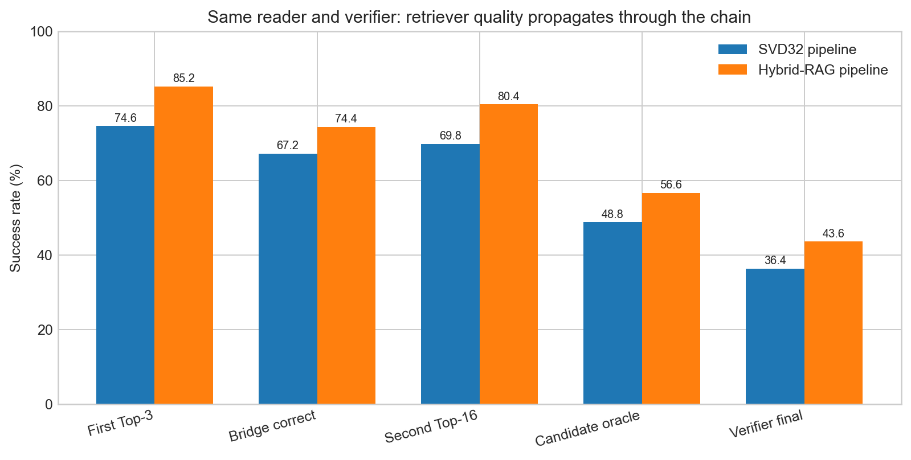
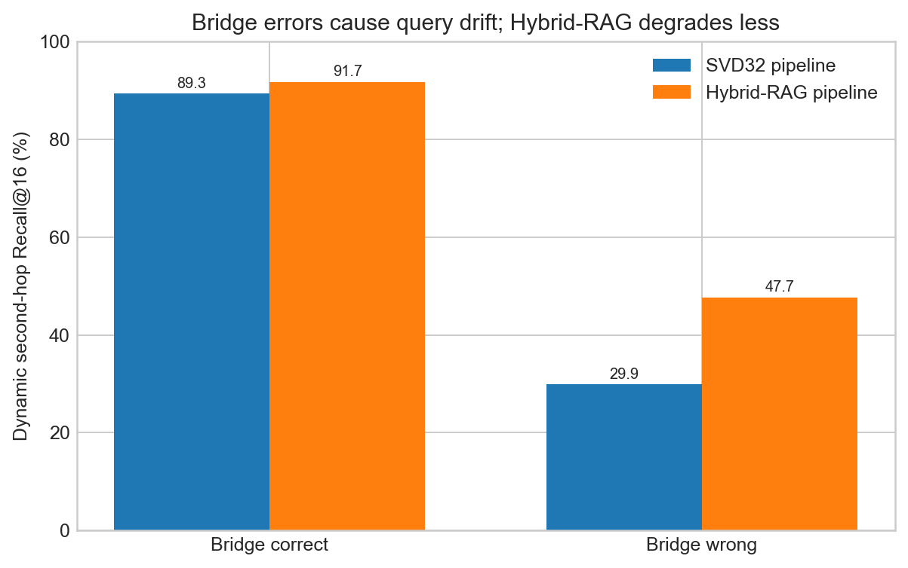
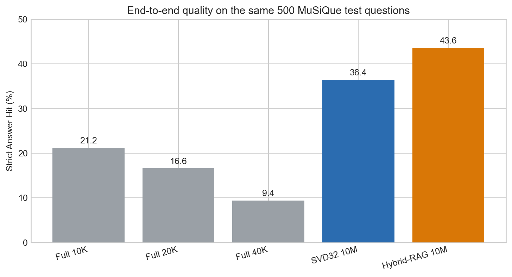
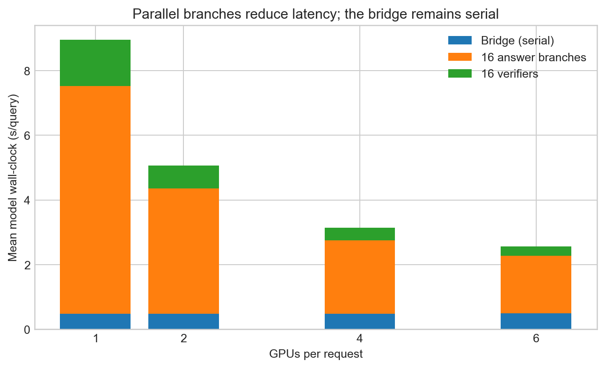

# 面向 10M Token Context 的逐步稀疏检索与并行验证

> **一句话结论：在同一份9,999,872-token语料、同一500题和相同Qwen3-8B reader/verifier下，当前最强的BM25 + E5 Hybrid-RAG逐步系统每题最多读取4,864 tokens，最终Answer Hit为43.6%（218/500）；它显著高于四通道SVD32系统的36.4%（182/500，配对p=4.37e-5），也高于10K/20K/40K one-shot full-attention的21.2%/16.6%/9.4%，但尚未达到70.8%的局部reader oracle，也尚未证明优于matched stepwise full-attention。**

**日期：** 2026-07-13  
**实验平台：** 8 x NVIDIA RTX 3090，按空闲情况使用1/2/4/6卡  
**模型：** Qwen3-0.6B、Qwen3-8B、E5-base-v2  
**数据：** Official MuSiQue 2-hop + 10M真实文本干扰语料  
**文档方法：** Research Exploration Agent单文档流程

## 0. 研究状态

### 0.1 当前最重要的结论

| 命题 | 判定 | 证据 |
|---|---|---|
| 每步只读取少量证据可以完成10M二跳推理 | 支持 | Hybrid-RAG 43.6%，每题最多读取4,864 tokens，占全文0.049% |
| 当前四通道SVD32检索优于标准RAG | 否定 | SVD32 36.4%，Hybrid-RAG 43.6%，56胜20负，p=4.37e-5 |
| 更多full-attention上下文自然带来更好答案 | 否定 | 10K/20K/40K Answer Hit随长度从21.2%降到16.6%和9.4% |
| 当前系统已接近无损 | 否定 | 最强43.6%，局部gold-paragraph reader oracle为70.8% |
| 16路分支适合多卡并行 | 支持 | 1卡8.99s，4卡3.18s，6卡2.60s；输出trace一致 |
| 稀疏检索本身优于matched stepwise full-attention | 证据不足 | 当前full-attention基线是one-shot，任务分解方式不同 |
| 10M结果可以直接外推到1B | 证据不足 | 尚无真实1B索引、通信、KV paging和wall-clock实验 |

### 0.2 当前正确定位

本研究已经证明的是：

```text
大规模文本索引
-> 每一步读取少量blocks
-> 模型生成中间状态
-> 用新状态再次检索
-> 多候选抽取和验证
```

在10M真实文本上是可运行且有质量收益的。

本研究尚未证明的是：

```text
模型内部Q/K检索优于外部RAG
或
稀疏检索在完全匹配的推理流程下优于full attention
或
该系统已实现1B-token近似无损推理
```

## 1. 可证伪猜想

以下通过/失败标准是对现有实验的研究审计，E1-E5并非预注册实验。后续实验应在运行前冻结标准。

### C1：逐步条件稀疏性

**猜想：** 二跳问题不要求模型一次性读取全部10M tokens。模型在第一步只需少量第一跳证据，生成bridge后，再读取少量第二跳证据即可完成推理。

**可用条件：**

- test链中不使用gold block、gold bridge或gold answer选候选；
- 每题累计检索不超过4,864 tokens；
- 最终Answer Hit显著高于同题10K one-shot full-attention的21.2%。

**当前判定：** 支持。SVD32为36.4%，相对10K one-shot基线的同题配对差异显著；Hybrid-RAG边际准确率进一步达到43.6%，但尚未生成它与10K基线的独立逐题配对汇总。由于任务分解方式不同，该结果只支持“完整逐步系统有效”，不单独证明retrieval是全部增益来源。

### C2：四通道SVD32提供超越强RAG的检索信号

**猜想：** Qwen3-0.6B真实Q/K的四通道SVD32表示包含外部文本embedding没有的模型内生相关性，因此在相同reader和预算下应不弱于BM25 + E5 Hybrid-RAG。

**通过条件：** SVD32链最终结果不低于Hybrid-RAG，或者把SVD32加入冻结Hybrid-RAG后在test上带来显著净胜。

**当前判定：** 当前操作化被否定。SVD32链比Hybrid-RAG低7.2个百分点。尚未测试“RAG候选 + SVD32 residual rerank”，因此不能否定所有Q/K辅助检索方法。

### C3：扩大原始上下文可以替代检索

**猜想：** 只要gold evidence在上下文中，增加full-attention长度不会显著降低答案质量。

**失败条件：** 同题nested distractors下，长度增加造成显著配对退化。

**当前判定：** 被否定。10K到20K和40K均显著下降，说明证据存在不等于模型能稳定使用证据。

### C4：当前系统接近无损

**操作定义：** 最终Answer Hit至少保留gold paragraph + gold state局部reader oracle的90%，即达到 `0.9 x 70.8%=63.72%`。

**当前判定：** 被否定。Hybrid-RAG 43.6%只保留该oracle的61.6%；SVD32 36.4%只保留51.4%。

### C5：候选分支可以通过多卡降低在线延迟

**通过条件：** 4卡相对1卡至少2倍加速，且bridge replay和输出质量口径不变。

**当前判定：** 支持。4卡2.83倍，6卡3.46倍；bridge replay匹配率均为100%。

## 2. 任务、数据和成功标准

### 2.1 任务输入和输出

输入是一条二跳自然语言问题和一个包含39,062个blocks的10M-token语料。输出是最终短答案。

典型问题：

```text
Evidence 1: Lou Breslow's wife was Marion Byron.
Evidence 2: Marion Byron was born in Dayton, Ohio.
Question: Where was Lou Breslow's wife born?
Answer: Dayton, Ohio.
```

系统需要完成：

```text
Lou Breslow
-> 检索第一条证据
-> 生成bridge "Marion Byron"
-> 用新状态检索第二条证据
-> 抽取 "Dayton, Ohio"
```

### 2.2 10M语料

主实验使用 `musique_official_10m_aligned_2000_v3`：

| 项目 | 数值 |
|---|---:|
| 总tokens | 9,999,872 |
| block size | 256 tokens |
| blocks | 39,062 |
| Official MuSiQue questions | 2,000 |
| train/dev/test | 1,000 / 500 / 500 |
| 对齐支持blocks | 2,816 |
| 平均支持段落长度 | 113.14 tokens |
| p95支持段落长度 | 215 tokens |

每条支持段落完整位于一个block内。其余tokens来自真实MuSiQue distractor paragraphs。主结果不使用合成高斯向量、合成文本或padding target。

### 2.3 数据泄漏契约

严格链必须满足：

1. 第一跳检索不知道gold block、bridge和答案。
2. bridge必须由Qwen3-8B实际生成，不能用gold entity修正。
3. 第二跳的lookup entity、atomic question、retrieval state和compact state必须由生成bridge重写。
4. passage head、融合参数和verifier校准只能使用train/dev。
5. test gold只用于最终rank和答案统计。
6. 任何状态中残留gold bridge的运行全部作废。

### 2.4 指标

**Gold block Recall@K：**

```text
Recall@K = mean[gold evidence block rank <= K]
```

**Answer Hit：** 标准化后，gold answer是否完整出现在模型输出中。它是本报告的主质量指标。

**Candidate oracle：** 16个独立候选中是否至少一个包含正确答案。它测量verifier之前的可选上限，不是系统最终准确率。

**配对显著性：** 对同一500题使用McNemar exact test。

**并行指标：**

```text
speedup(N)    = T_1 / T_N
efficiency(N) = speedup(N) / N
GPU-seconds   = N x T_N
```

## 3. 可观测先验与数学模型

### P1：每一步只需要当前关系对应的少量证据

二跳问题的完整证据集合为 `E={b1,b2}`，但第一步和第二步的条件不同：

```text
z0 = original question
b1 ~ Retriever(z0)
z1 = StateUpdate(z0, Reader(b1, z0))
b2 ~ Retriever(z1)
answer = Reader(b2, z1)
```

物理含义是“证据需求随生成状态变化”，不是“整道题永远只需要固定三个blocks”。

实现路径：第一跳Top3、bridge生成、无泄漏状态写回、第二跳Top16。

### P2：中间状态质量决定下一次检索分布

令真实bridge为 `g`，生成bridge为 `z1`。第二跳检索实际优化：

```text
rank(b2 | z1, relation2, original_question)
```

当 `z1 != g` 时，query会漂移到错误实体或事实簇。这个先验由“bridge正确/错误条件下的第二跳Recall@16”直接测量。

### P3：不同检索信号解决不同子问题

**词法信号：** 实体名、专有名词和关系词提供高精度全局过滤。

**外部embedding：** E5把自然语言query和passage映射到统一语义空间：

```text
e_q = normalize(mean_pool(E5("query: " + state)))
e_b = normalize(mean_pool(E5("passage: " + block)))
s_E5(q,b) = e_q^T e_b
```

**模型内部Q/K低秩信号：** 对calibration K中心化并拟合rank-32子空间：

```text
K_c = K - mean(K)
K_c ~= U_32 Sigma_32 V_32^T
k_32 = K_c V_32
q_32 = q V_32
s_SVD(q,k) = q_32^T k_32
```

当前四个代表通道为：

```text
L3/H10, L21/H8, L6/H7, L16/H14
```

rank-32平均保留约97.5%的K谱能量。但能量保留不等于全局语义召回，因此SVD32只应被视为候选集内的residual feature。

### P4：多个相似blocks会造成reader和verifier竞争

设第二跳Top16中每个block产生一个候选 `a_i` 和支持分数 `v_i`：

```text
a_i = Extract(question, state, block_i)
v_i = logit(Yes | question, state, block_i, a_i)
      - logit(No | question, state, block_i, a_i)
final = a_argmax(v_i)
```

候选oracle只要求某个 `a_i` 正确；最终系统还要求正确候选的 `v_i` 高于最多15个hard negatives。因此pairwise verifier准确率较高时，16-way Top1仍可能明显下降。

### P5：分支计算可以并行，bridge状态转移不能并行

在线时间可写为：

```text
T(N) = T_bridge + T_answer_branches(N) + T_verifier(N)
       + T_retrieval + T_overhead(N)
```

`T_bridge`依赖第一跳结果，是第二跳的串行前缀；16个答案分支和16个verifier分支可以在GPU间分配。随着N增加，Amdahl串行项、分支长度不均和同步开销限制效率。

### 3.1 模型到代码和证据的映射

| 先验/模型 | 实现阶段 | 主要代码 | 可证伪证据 |
|---|---|---|---|
| 条件稀疏性P1 | 两次检索与状态更新 | strict-chain scripts | 两步Recall、Answer Hit、读取tokens |
| 状态漂移P2 | bridge写回第二跳 | `prepare_verified_chained_answer_steps.py` | bridge条件Recall |
| SVD32 P3 | 第一跳候选重排 | Q/K profile + passage head | SVD链与RAG链配对结果 |
| E5/RRF P3 | 两步Hybrid-RAG | `run_external_embedding_retrieval.py` | BM25/E5/Hybrid dev/test recall |
| 候选竞争P4 | 16路抽取与Yes/No选择 | `score_candidate_support_distributed.py` | candidate oracle与final差距 |
| 分支并行P5 | 1/2/4/6卡同请求 | scaling benchmark | stage latency、speedup、GPU-s |

## 4. 精确系统算法与实现契约

### 4.1 公共参数

| 参数 | 值 | 定义与理由 | 太小时 | 太大时 |
|---|---:|---|---|---|
| block size | 256 tokens | 保证支持段落通常完整落入一个block | 索引和分支数量增加 | 多关系和干扰事实混入同block |
| 第一跳读取 | Top3 blocks | bridge需要少量并行证据 | gold block漏召回 | bridge reader受额外干扰 |
| 第二跳读取 | Top16 blocks | 正确bridge时可达到约90% recall | 第二证据漏召回 | candidate抽取和hard negatives增加 |
| 最大检索tokens | 4,864 | `3x256 + 16x256` | 证据覆盖不足 | reader成本和干扰增加 |
| SVD rank | 32 | 约四分之一原始128维，保留约97.5%谱能量 | 模型内信号损失 | 存储和点积增加 |
| RAG dense top | 512 | 为RRF保留宽候选 | BM25/E5互补候选丢失 | 融合和内存成本增加 |
| RRF constant | 60 | 标准平滑，dev冻结 | 过度奖励Top rank | 排名差异被压平 |
| answer branches | 16 | 每个第二跳block独立抽取 | candidate oracle下降 | 推理和多负例竞争增加 |
| reader/verifier | Qwen3-8B | 0.6B关系读取明显不足 | 小模型抽取错误增多 | 更大模型成本增加 |

### 4.2 SVD32逐步系统

**输入：** 原始问题、10M block索引、BM25/词法索引、四通道pre-RoPE SVD32 profile、冻结passage head。

**算法：**

1. 用词法入口从39,062个blocks中产生宽候选。
2. 对候选计算四通道SVD32 late-interaction、lexical和rank features。
3. 使用train-only passage head融合特征，取第一跳Top3。
4. 拼接Top3 blocks，由Qwen3-8B直接输出最短bridge entity。
5. 把实际生成bridge写入第二跳lookup key、atomic question和state。
6. 用动态BM25检索第二跳Top16。当前严格链该阶段 `qk_share=0`，不能写成SVD32第二跳。
7. 对Top16每个block独立抽取最短答案候选。
8. 用冻结Yes/No support margin选择最终候选。

**输出：** 第一跳Top3、bridge、第二跳Top16、16个候选、支持分数和最终答案。

**失败原因标签：** `first_miss`、`bridge_wrong`、`second_miss`、`extractor_miss`、`verifier_miss`。

### 4.3 Hybrid-RAG逐步系统

**输入：** 与SVD32系统相同的问题、blocks、reader、prompt、预算和verifier；检索器替换为BM25 + E5-base-v2。

**索引：**

```text
passage embedding = E5("passage: " + block_text)
query embedding   = E5("query: " + current_step_state)
```

39,062个768维FP16 passage embeddings约58MB。

**检索算法：**

1. BM25和E5分别返回Top512。
2. 对每个候选计算：

```text
RRF(d) = 1/(60 + rank_BM25(d)) + 1/(60 + rank_E5(d))
```

3. 第一跳按RRF取Top3。
4. 使用与SVD32链相同的Qwen3-8B bridge prompt生成实际bridge。
5. 无泄漏重写第二跳state。
6. 用新state重新执行BM25 + E5 RRF，取Top16。
7. 使用完全相同的16路候选抽取与Yes/No verifier。

**控制变量：** 只替换retriever。数据、TopK、reader、prompt、生成模型和verifier不变。

### 4.4 Bridge生成契约

Top3 blocks拼接后，prompt要求直接输出最短实体，不要求自由文本CoT。原因是0.6B上的显式CoT增加格式和关系选择错误；8B direct-answer在第一跳召回成功时bridge正确率达到82.84%。

bridge输出必须原样进入状态更新；禁止用gold alias或答案字符串修正。

### 4.5 Candidate extractor与verifier契约

对16个第二跳blocks分别执行：

```text
candidate_i = Qwen3-8B atomic extraction(question, state, block_i)
margin_i = logit(Yes) - logit(No)
winner = argmax_i margin_i
```

调试输出必须保存block id、block rank、candidate text、是否Answer Hit、Yes/No logits和winner原因。只报告final accuracy不足以定位extractor还是verifier失败。

### 4.6 多卡执行契约

- bridge始终单路执行；
- 16个answer branches和16个verifier branches按GPU分配；
- 1/2/4/6卡使用同一30题、同一冻结routing trace和2题预热；
- 模型加载不计时；
- 加回42.5ms检索采用值；
- 每种卡数必须报告bridge replay match，避免速度测试改变质量。

## 5. 实验设计与通过条件

### E1：Retriever dev选型

**问题：** BM25、E5和RRF谁更适合第一跳Top3与第二跳Top16？

**协议：** 只在dev比较；选择同时改善两个阶段的配置；test不再改融合参数。

**通过：** Hybrid在dev两个关键预算都不低于单一retriever。

### E2：SVD32与Hybrid-RAG严格链

**问题：** 在完全相同下游链路中，哪种retriever产生更高最终答案？

**协议：** 同一500题、无泄漏实际bridge、相同Top3/Top16和相同8B extractor/verifier。

**主指标：** final Answer Hit。  
**次指标：** 第一跳Top3、bridge、动态第二跳Top16、candidate oracle。  
**判定：** 使用同题McNemar exact test。

### E3：One-shot full-attention长度基线

**问题：** gold evidence全部存在时，直接增加上下文长度是否能替代逐步系统？

**协议：** 每题构造nested 10K/20K/40K contexts；两条gold blocks完整存在；distractors来自同一10M语料；六种early/middle/late位置组合均衡；Qwen3-8B直接回答原问题。

**限制：** 这是one-shot baseline，不是matched stepwise baseline。

### E4：Stage oracle与失败分解

**问题：** 误差主要来自retrieval、bridge、extractor还是verifier？

**协议：** 计算gold-state retrieval、candidate oracle、gold block + gold state和gold paragraph + gold state。

**注意：** 局部reader oracle不是完整二跳端到端oracle，只测给定正确第二跳状态后的读取能力。

### E5：多卡扩展

**问题：** 16路分支能否带来同请求wall-clock收益？

**协议：** 同30题，在1/2/4/6卡重新运行所有在线模型阶段；输出trace保持一致。

## 6. 实验结果

### 6.1 主结果：Hybrid-RAG显著优于SVD32链



**图的目的：** 在reader、verifier和读取预算不变时，观察retriever变化如何沿二跳链传播。  
**横轴：** 第一跳召回、bridge正确、第二跳召回、候选oracle和最终verifier五个阶段。  
**纵轴：** 每个阶段的成功题目比例。  
**观察：** Hybrid-RAG在每个阶段都高于SVD32链，第一跳和第二跳各提高10.6个百分点，最终提高7.2个百分点。  
**允许结论：** 更强retriever的收益会通过bridge和第二跳传播。  
**不允许结论：** 图中不能说明E5或BM25单独贡献多少，也不能证明RAG已经接近无损。

| 阶段 | SVD32链 | Hybrid-RAG | 变化 |
|---|---:|---:|---:|
| 第一跳Top3 block recall | 74.6%（373/500） | **85.2%（426/500）** | +10.6pp |
| bridge正确 | 67.2%（336/500） | **74.4%（372/500）** | +7.2pp |
| 动态第二跳Top16 recall | 69.8%（349/500） | **80.4%（402/500）** | +10.6pp |
| 16候选至少一个正确 | 48.8%（244/500） | **56.6%（283/500）** | +7.8pp |
| verifier最终正确 | 36.4%（182/500） | **43.6%（218/500）** | +7.2pp |

最终逐题比较：

```text
Hybrid-RAG胜：56题
SVD32胜：20题
持平：424题
McNemar exact p = 4.37e-5
```

因此当前最强结果是Hybrid-RAG的43.6%，不是SVD32的36.4%。

### 6.2 RAG retriever诊断

**Dev选型：**

| 步骤与预算 | BM25 | E5 Dense | Hybrid-RAG |
|---|---:|---:|---:|
| 第一跳Recall@3 | 70.2% | 75.2% | **78.4%** |
| 第二跳gold-state Recall@16 | 84.4% | 80.4% | **91.4%** |

**Test gold-state能力：**

| 步骤与预算 | BM25 | E5 Dense | Hybrid-RAG |
|---|---:|---:|---:|
| 第一跳Recall@3 | 71.6% | 79.0% | **85.2%** |
| 第一跳Recall@16 | 86.6% | 91.0% | **95.2%** |
| 第二跳Recall@3 | 60.2% | 63.4% | **72.0%** |
| 第二跳Recall@16 | 89.8% | 78.6% | **91.4%** |

E5在第一跳更强，BM25在包含明确bridge entity的第二跳Top16更强。RRF利用了语义匹配和精确实体匹配的互补性。

gold-state第二跳表使用正确bridge，只用于retriever诊断；严格链80.4%使用实际生成bridge，不能混用。

### 6.3 Bridge错误导致query漂移



**图的目的：** 区分“retriever本身找不到”与“上一步生成错误导致query错误”。  
**横轴：** 实际bridge是否正确。  
**纵轴：** 动态第二跳Recall@16。  
**观察：** bridge正确时两种系统都接近90%；bridge错误时SVD32链降到29.88%，Hybrid-RAG仍有47.66%。  
**结论：** 第一跳状态质量是误差传播的关键；Hybrid-RAG还对错误或不完整bridge更稳健。  
**不能证明：** 错误bridge时的召回不等于正确推理，可能来自替代证据或文本重叠。

| 条件 | SVD32链 | Hybrid-RAG |
|---|---:|---:|
| bridge正确时第二跳Top16 | 89.29% | **91.67%** |
| bridge错误时第二跳Top16 | 29.88% | **47.66%** |

### 6.4 Candidate extractor和verifier损失

| 指标 | SVD32链 | Hybrid-RAG |
|---|---:|---:|
| 第二跳Top16 recall | 69.8% | 80.4% |
| Candidate oracle | 48.8% | 56.6% |
| Verifier final | 36.4% | 43.6% |
| 给定第二跳召回成功时final | 未统一汇总 | 53.23% |
| 第二跳召回失败时final | 未统一汇总 | 4.08% |

SVD32链中，244个至少有一个正确候选的问题里，verifier选对182个，条件选择率74.6%。正确候选相对错误候选的branch-pair排序准确率为74.32%，但16-way最大值会放大任一hard negative的异常高分。

局部reader diagnostic：

| 输入条件 | Answer Hit |
|---|---:|
| Gold block + gold state | 68.8%（344/500） |
| Gold paragraph + gold state | **70.8%（354/500）** |

这说明即使检索和状态都正确，Qwen3-8B局部读取仍有约29%失败；检索不是唯一瓶颈。

### 6.5 Top16直接拼接为何不够

| Gold block排名 | 问题数 | Top3拼接 | Top16拼接 |
|---|---:|---:|---:|
| Rank 1-3 | 235 | **55.32%** | 50.64% |
| Rank 4-16 | 114 | 18.42% | **35.09%** |
| >16 / 未召回 | 151 | 4.64% | 3.97% |

Top16能救回rank4-16证据，但额外13个distractors会损害原本Top3已足够的问题。因此Top16更适合作为候选池，而不是直接作为4,096-token原始上下文。

### 6.6 与one-shot full attention比较



**图的目的：** 比较同一500题上one-shot长上下文和两种10M逐步系统的最终Answer Hit。  
**观察：** full-attention从10K的21.2%随长度增加降到40K的9.4%；SVD32和Hybrid-RAG分别为36.4%和43.6%。  
**允许结论：** SVD32逐步系统已有同题配对证据，显著强于三个one-shot长上下文基线；Hybrid-RAG边际准确率更高，但尚缺少它与三个长度的独立逐题显著性汇总。  
**不允许结论：** 由于逐步系统额外使用bridge分解、候选抽取和verifier，不能把全部差异归因于稀疏retrieval。

| Context/系统 | Answer Hit | 95% CI | Exact Match | Token F1 | Mean latency |
|---|---:|---:|---:|---:|---:|
| Full attention 10K | 21.2% | [17.84%,25.00%] | 15.8% | 30.84 | 3.11s，1 GPU |
| Full attention 20K | 16.6% | [13.60%,20.11%] | 11.6% | 25.39 | 7.07s，1 GPU |
| Full attention 40K | 9.4% | [7.14%,12.28%] | 5.4% | 16.17 | 17.99s，2 GPU |
| SVD32 10M逐步系统 | 36.4% | - | - | - | 见多卡结果 |
| Hybrid-RAG 10M逐步系统 | **43.6%** | - | - | - | 批量运行，未做同口径单请求scaling |

长度配对结果：

| 比较 | 长上下文独有正确 | 短上下文独有正确 | McNemar p |
|---|---:|---:|---:|
| 10K -> 20K | 19 | 42 | 0.00444 |
| 10K -> 40K | 15 | 74 | 1.53e-10 |
| 20K -> 40K | 18 | 54 | 2.57e-5 |

SVD32逐步系统与full-attention的既有配对结果：

| 对照 | Full attention | SVD32系统 | 系统胜/负 | p |
|---|---:|---:|---:|---:|
| 10K | 21.2% | 36.4% | 128/52 | 1.40e-8 |
| 20K | 16.6% | 36.4% | 137/38 | 2.46e-14 |
| 40K | 9.4% | 36.4% | 159/24 | 1.27e-25 |

Hybrid-RAG的43.6%更高，但尚未生成与三个full-attention长度逐题配对的独立汇总文件；不能从边际准确率直接声称对应McNemar p值。

### 6.7 检索与索引成本

| 项目 | 结果 | 口径 |
|---|---:|---|
| 10M lexical postings entry | 约0.69ms | 在线查询 |
| SVD32 Q capture + residual rerank | 约41.4ms/step | 在线采用值 |
| 动态第二跳BM25 | 约1ms/题 | 常驻索引 |
| SVD32链检索合计采用值 | 约42.5ms/题 | 加入scaling总时间 |
| E5索引构建 | 43.84s | 一次性 |
| E5索引大小 | 58MB | 39,062 x 768 FP16 |
| BM25索引构建 | 约19-24s | 一次性 |
| 2,000 gold-state RAG queries | 5.82s | 2.91ms/query，批量 |
| 500动态第二跳RAG queries | 2.33s | 4.65ms/query，批量 |

两种系统的在线主要成本都不在39K-block检索，而在Qwen3-8B的16路候选生成和verifier。

### 6.8 多卡分阶段加速



**图的目的：** 显示哪些阶段随GPU数量下降，哪些阶段保持串行。  
**横轴：** 每个请求使用的GPU数量。  
**纵轴：** 平均模型wall-clock。  
**观察：** 16路答案和verifier明显缩短，bridge始终约0.49s。  
**结论：** 分支并行有效，但串行bridge和负载不均限制线性扩展。  
**限制：** 该30题子集accuracy为50%，不能当作500题质量结果；该scaling基于SVD32链的冻结trace，不是RAG链的独立延迟测试。

| GPU | Mean online | Median | p95 | Speedup | Efficiency | GPU-s/题 |
|---:|---:|---:|---:|---:|---:|---:|
| 1 | 8.993s | 8.040s | 14.593s | 1.00x | 100.0% | **8.99** |
| 2 | 5.101s | 4.730s | 7.837s | 1.76x | **88.1%** | 10.20 |
| 4 | 3.177s | 2.975s | 5.330s | 2.83x | 70.8% | 12.71 |
| 6 | **2.598s** | **2.462s** | **4.081s** | **3.46x** | 57.7% | 15.59 |

分阶段：

| GPU | Bridge | 16路答案生成 | 16路Verifier |
|---:|---:|---:|---:|
| 1 | 0.487s | 7.032s | 1.432s |
| 2 | 0.483s | 3.872s | 0.703s |
| 4 | 0.485s | 2.268s | 0.382s |
| 6 | 0.489s | 1.777s | 0.289s |

2卡具有最高资源效率；4卡是更合理的低延迟折中；6卡最低延迟但GPU-seconds增加73%。

## 7. 分阶段失败解释

### 7.1 大失败：SVD32为什么没有超过RAG

```text
候选原因1：SVD低秩重建不准确
  -> 不是主要证据；rank32保留约97.5%谱能量

候选原因2：Q/K天然等价于文本语义embedding
  -> 被否定；高能量保留没有转化为更高gold recall

候选原因3：实体精确匹配对39K全局定位更重要
  -> 得到支持；BM25第二跳Top16强于E5，二者融合最好

候选原因4：当前只选四个heads，覆盖不足
  -> 仍可能；全head并集提高召回，但多数投票失败

验证瓶颈：当前Q/K操作化更适合候选内residual ranking，不适合独立全局地址
```

被否定的是“当前四通道SVD32全局链优于强RAG”，不是所有模型内部KV信号。

### 7.2 大失败：bridge错误后第二跳崩溃

```text
第一跳漏召回
-> reader看不到正确关系
-> bridge实体错误或不完整
-> 第二跳query锚定错误实体
-> gold answer block排名下降
```

RAG把第一跳Top3从74.6%提高到85.2%，bridge随之从67.2%提高到74.4%。这说明提高第一跳证据质量比在错误bridge后继续扩大TopK更有效。

### 7.3 大失败：召回了第二跳block仍没有正确候选

Hybrid-RAG第二跳Top16为80.4%，candidate oracle只有56.6%，中间损失23.8个百分点。可能原因包括：

- block内有多个同类实体和值；
- 模型输出subject或bridge，而不是目标relation value；
- 答案格式过长或包含替代事实；
- 256-token block虽然包含gold paragraph，但还包含竞争关系。

该阶段需要relation-conditioned extractor profiling，不能继续只优化retriever。

### 7.4 大失败：candidate存在但verifier选错

Hybrid-RAG candidate oracle 56.6%，final 43.6%，损失13.0个百分点。SVD32损失12.4个百分点。说明verifier问题在两种retriever下都稳定存在。

问题不是“一个question + block + candidate完全看不懂”，而是16-way最大值校准：单个错误block只要获得一次异常高Yes margin，就会覆盖正确候选。

下一步metric应是per-query 16-way Top1，而不是只看branch pair accuracy。

### 7.5 Full-attention为什么随长度下降

两条gold evidence始终存在，而且六种位置组合都覆盖。40K所有位置组合表现都低，因此不能只归因于lost-in-the-middle。当前证据支持的混合原因是：

- 位置偏差；
- 大量相似实体和值竞争；
- 两条关系的绑定错误；
- one-shot模型无法稳定建立中间bridge；
- 更长prefill增加计算，但没有提供更强选择机制。

## 8. 研究迭代账本

### Iteration 1：合成向量并行检索

**猜想：** SVD和多卡TopK可以高效扫描10M规模。  
**操作化：** 人工构造与query高相似的高斯正样本。  
**结果：** 系统kernel和并行流程可运行。  
**失败解释：** 正样本方向由构造过程预知，不能证明真实模型检索。  
**更新：** 切换到真实文本和真实模型Q/K。

### Iteration 2：真实Q/K全库检索

**猜想：** 少数固定head的full128 QK可以直接找gold block。  
**结果：** 召回极低。  
**失败解释：** 单一`Answer:`末尾Q、模板token、block-max极值和post-RoPE位置相位共同污染。  
**更新：** 清洗数据，使用pre-RoPE multi-Q和词法入口。

### Iteration 3：多head与SVD32 passage ranking

**猜想：** 不同heads互补，低秩空间可作为候选重排信号。  
**结果：** 全head并集提高召回；多数投票删除专业head；train-only passage head在1,000外部steps上把Top3从65.9%提高到68.7%，p=0.0072。  
**更新：** SVD32定位为residual ranker，而非单一全库检索器。

### Iteration 4：动态bridge链

**猜想：** 每生成一个中间状态再刷新query，可以完成二跳。  
**结果：** 0.6B bridge能力不足；8B把整体bridge从44.2%提高到67.2%。  
**更新：** 0.6B提供检索profile，8B承担关系读取和状态转移。

### Iteration 5：Top16上下文扩展

**猜想：** 第二证据进入Top16后，直接拼接16个blocks即可回答。  
**结果：** Top16 concat仅33.0%，相对Top3只提高1.4pp且不显著。  
**失败解释：** Top16救回rank4-16，但破坏原本Top3足够的问题。  
**更新：** Top16改为候选池，每block独立抽取。

### Iteration 6：候选抽取与verifier

**猜想：** 独立抽取后，用支持判断可以抑制竞争实体。  
**结果：** SVD32链candidate oracle 48.8%，final 36.4%；Yes/No selector优于answer likelihood的29.4%。  
**更新：** verifier有效但仍损失12.4pp，需要16-way校准。

### Iteration 7：强RAG基线

**猜想：** 模型内生SVD32链可能优于标准外部embedding RAG。  
**操作化：** 只替换retriever为BM25 + E5 RRF，保持其它阶段不变。  
**结果：** Hybrid-RAG 43.6%，显著高于36.4%。  
**解释：** 当前Q/K检索没有越过强RAG；实体词法和外部语义embedding互补更强。  
**目标更新：** 把Hybrid-RAG设为冻结全局入口，测试Q/K是否能在seed后扩展或候选内提供额外增益。

## 9. 更新后的研究主张

### 9.1 旧主张

```text
真实Q/K的SVD32表示可以成为10M上下文的主要全局检索器。
```

该主张不再成立。

### 9.2 当前主张

```text
超长上下文推理具有步骤级条件稀疏性：
强全局retriever先找到当前证据，模型生成中间状态后重新检索，
每步只加载少量blocks即可形成比one-shot长上下文更强的完整系统。
```

这个主张已得到10M可行性支持，但仍缺少matched stepwise full-attention对照。

### 9.3 Q/K方向的新位置

后续不再让四通道SVD32与RAG争夺同一个“第一次全局语义寻址”任务。更合理的职责分离是：

```text
BM25 + E5 RRF：第一次全局seed
-> 当前生成状态与seed KV
-> pre-RoPE residual-K hierarchy / query-conditioned QK：内部扩展
-> post-RoPE exact QK：少量候选精排
-> 加载KV继续生成
```

该组合是否优于RAG-only尚未测试，不能写成已取得结果。

## 10. 结论边界和有效性威胁

### 10.1 可以支持

1. 在10M真实文本中，逐步检索系统最多读取0.049%的tokens即可完成部分真实二跳问题。
2. 当前最强Hybrid-RAG严格链为43.6%，显著优于SVD32严格链36.4%。
3. 第一跳检索质量会通过bridge状态系统性影响第二跳。
4. 直接扩大10K到40K one-shot上下文会显著降低本实验Qwen3-8B的答案质量。
5. 16路候选计算可以通过多卡降低同请求延迟。

### 10.2 不能支持

1. 不能声称SVD32优于BM25、E5或Hybrid-RAG。
2. 不能声称43.6%接近无损或达到full-attention oracle。
3. 不能声称逐步retrieval已经优于matched stepwise full-attention。
4. 不能把10M结果直接写成1B实测结论。
5. 不能把30题scaling子集的50% accuracy当作500题结果。
6. 不能声称跨任务、跨模型或跨语言泛化。

### 10.3 主要有效性威胁

- 当前最完整实验集中在MuSiQue 2-hop；
- Answer Hit不是所有LongBench任务的统一官方指标；
- one-shot full-attention与逐步系统的推理流程不匹配；
- SVD32只使用四个代表通道；
- RAG检索延迟主要是批量测量，尚无与SVD32完全同协议的单请求scaling；
- gold paragraph oracle是局部reader上限，不是完整链理论上限；
- 10M文本由MuSiQue段落组成，不代表所有1B上下文的组织结构。

## 11. 下一步冻结实验

### E6：Matched Stepwise Full-Attention

在同一10K/20K/40K context上运行与检索系统相同的两步流程：

```text
full context -> bridge
bridge写回 -> 同一full context -> final answer
```

保持模型、prompt、解码和状态字段一致。只有evidence access不同。

**通过条件：** Hybrid-RAG在最终Answer Hit或同质量延迟上形成显著配对优势。  
**失败：** stepwise full-attention达到或超过Hybrid-RAG，说明现有收益主要来自任务分解。  
**证据不足：** 两组使用不同bridge prompt、不同reader或不同状态格式。

### E7：RAG + SVD32 residual rerank

固定BM25 + E5 RRF作为全局入口，只在其Top512内加入SVD32 features。权重在train/dev拟合，test冻结。

**必须超过：** 第一跳85.2%、动态第二跳80.4%、最终43.6%。  
**停止条件：** 两个合理融合模型都无法在test形成配对净胜，则停止把当前四通道SVD32作为主质量贡献。

### E8：RAG seed + residual-KV expansion

给定相同RAG seed，比较：

```text
A. RAG-only动态二次检索
B. RAG seed + 模型内部KV结构扩展 + post-RoPE exact rerank
```

同时报告第二证据Recall、attention top-token recall、加载tokens、最终答案和分阶段wall-clock。centroid几何近邻不能作为唯一指标。

### E9：Extractor/verifier蒸馏和校准

- 用8B无泄漏输出蒸馏0.6B/1.7B relation-conditioned extractor；
- 优化每题16-way Top1而非branch pair accuracy；
- 使用hard-negative mining；
- 加入abstention和风险门控；
- 在相同candidate pool上比较candidate oracle到final的保留率。

目标是缩小Hybrid-RAG的56.6% candidate oracle与43.6% final之间13.0pp差距。

### E10：泛化和规模

- HotpotQA、2WikiMQA及其他LongBench multi-doc QA；
- Qwen3-4B/14B与其他模型；
- 100M后再到1B；
- 1/2/4/6/8卡的检索、通信、TopK merge、KV paging和decode wall-clock；
- 对每个规模保持相同质量点，避免只报告吞吐而忽略召回。

## 12. 总结

本研究已经从合成向量扫描原型推进到真实10M文本、真实模型Q/K、无泄漏状态传播、强RAG对照、完整答案生成和多卡延迟测试。

最终得到的研究判断不是“SVD32已经解决超长上下文检索”，而是：

1. **步骤级稀疏读取可行。** 10M逐步系统只读取最多4,864 tokens即可达到43.6%。
2. **强RAG是当前最佳全局入口。** BM25和E5的互补性稳定优于当前四通道SVD32链。
3. **中间状态是核心变量。** bridge错误会改变第二跳检索分布，错误会沿链累积。
4. **检索之后仍有大量损失。** extractor和verifier共同限制最终答案。
5. **更多上下文不是自动解法。** 10K到40K one-shot full-attention随长度显著退化。
6. **分支并行有工程价值。** 4卡将8.99s降到3.18s，6卡降到2.60s，但资源效率下降。

当前最严谨的论文级结论应写成：

> 在包含9,999,872 tokens和39,062个blocks的真实文本索引上，动态两步Hybrid-RAG只读取最多0.049%的tokens，Qwen3-8B最终Answer Hit达到43.6%；该结果显著高于同协议SVD32检索链，但距离局部reader oracle仍有明显差距。下一项决定性实验是matched stepwise full-attention，以及RAG seed后模型内部KV扩展能否提供独立收益。

## 附录 A：证据文件

| 证据 | 本地或服务器路径 |
|---|---|
| SVD32第一跳 | [first_step_summary.json](../projects/parallel_block_retrieval/outputs/report_svd32_strict_chain500_v1/first_step_summary.json) |
| SVD32 bridge | [bridge_summary.json](../projects/parallel_block_retrieval/outputs/report_svd32_strict_chain500_v1/bridge_summary.json) |
| SVD32第二跳 | [second_retrieval_summary.json](../projects/parallel_block_retrieval/outputs/report_svd32_strict_chain500_v1/second_retrieval_summary.json) |
| SVD32 candidate/verifier | [final_selector_summary.json](../projects/parallel_block_retrieval/outputs/report_svd32_strict_chain500_v1/final_selector_summary.json) |
| Hybrid-RAG严格链 | [summary.json](../projects/parallel_block_retrieval/outputs/rag_e5_hybrid_strict_chain500_v1/summary.json) |
| Full-attention长度基线 | [summary.json](../projects/parallel_block_retrieval/outputs/musique_fullcontext_10k20k40k_test500_v3/summary.json) |
| Full-attention与SVD32配对 | [paired_vs_10m_retrieval.json](../projects/parallel_block_retrieval/outputs/musique_fullcontext_10k20k40k_test500_v3/paired_vs_10m_retrieval.json) |
| 1/2/4/6卡scaling | [scaling.json](../projects/parallel_block_retrieval/outputs/musique_verifier_system_scaling_30q_v1/scaling.json) |

更完整的RAG诊断见 [rag_baseline_10m_20260713.md](rag_baseline_10m_20260713.md)。

## 附录 B：复现代码

```text
ymluo/projects/parallel_block_retrieval/src/run_external_embedding_retrieval.py
ymluo/projects/parallel_block_retrieval/src/summarize_rag_baseline.py
ymluo/projects/parallel_block_retrieval/src/prepare_allhead_block_branches.py
ymluo/projects/parallel_block_retrieval/src/evaluate_global_step_branch_generation.py
ymluo/projects/parallel_block_retrieval/src/prepare_verified_chained_answer_steps.py
ymluo/projects/parallel_block_retrieval/src/score_candidate_support_distributed.py
ymluo/projects/parallel_block_retrieval/src/evaluate_full_context_length_baseline.py
ymluo/projects/parallel_block_retrieval/src/compare_full_context_to_retrieval.py
ymluo/projects/parallel_block_retrieval/src/benchmark_verifier_system_same_query_scaling.py
ymluo/projects/parallel_block_retrieval/src/analyze_verifier_system_scaling.py
ymluo/projects/parallel_block_retrieval/scripts/plot_technical_report_10m_iterative_kv.py
```
