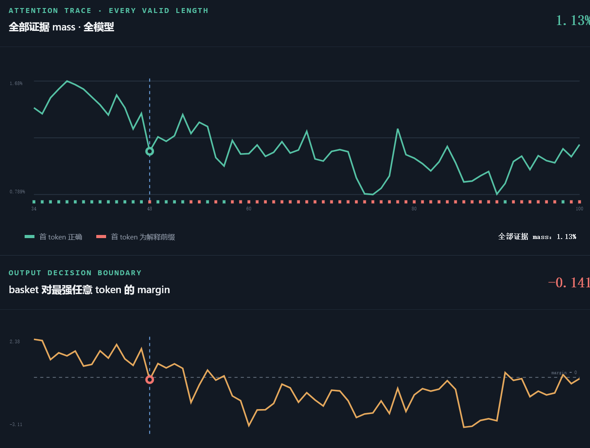

# 从 Evidence Attention Mass 到输出 Margin：Qwen3-8B 的逐层机制分析

> **图 1　实验背景。** 上图为 34--100 token 密集扫描中的全模型证据 attention mass，下图为正确答案 `basket` 相对完整词表中最强竞争 token 的 logit margin。绿色短线表示首 token 正确，红色短线表示首 token 进入解释前缀。图中标出的 48-token 点同时出现 evidence mass 降低和 margin 穿过零点。

## 核心问题与结论

本文回答的问题是：

> 查询位置分配给正确证据的 attention mass 降低以后，中间经过了哪些模型计算，最终导致正确答案 token 的输出 margin 降低？

核心链条为：

$$
\text{QK 匹配}
\longrightarrow
\text{evidence mass}
\longrightarrow
\text{Value 读取}
\longrightarrow
\text{residual stream 写入}
\longrightarrow
\text{后续层传播}
\longrightarrow
\text{输出 logit margin}.
$$

其中，attention mass 不会直接变成答案概率。它首先决定证据 Value 与背景 Value 在 attention 输出中的混合比例；该向量经过 $W_O$ 写入 residual stream，再经过后续 attention、MLP、RMSNorm 和 LM head，最终改变正确答案与竞争 token 的 logit 差。

本实验最重要的定量结果是：

- 47 $\rightarrow$ 48 时，全模型原子证据 mass 从 $1.4225\%$ 降至 $1.1271\%$，下降 $20.8\%$。
- L30--33 原子证据 mass 从 $2.8269\%$ 降至 $2.3221\%$，下降 $17.9\%$。
- `basket` 相对 `Let` 的 margin 从 $+1.781$ 降至 $-0.141$，变化 $-1.922$。
- 在完整 34--100 token 扫描中，L30--33 evidence mass 与完整词表 margin 的相关系数为 $r=0.920$，线性解释度为 $R^2=0.846$。

这里的证据集合 $E$ 指四个原子位置：

$$
E=
\{
\text{start key},
\text{hop1 result},
\text{hop2 input},
\text{hop2 result}
\}.
$$

需要注意：47 与 48 的样本由 `middle` 放置策略重新居中，局部 filler 和证据绝对位置同时发生变化，因此该转折不是“在完全相同的序列末尾只追加一个 token”的严格长度干预。本文分析的是：**在已经观察到 mass 降低的条件下，这个变化如何沿模型计算路径传递到输出 margin。**

---

## 1. 从 QK 匹配得到 evidence attention mass

对第 $\ell$ 层、第 $h$ 个 attention head，最终查询位置对历史 token $i$ 的 pre-softmax 分数为：

$$
s_{\ell h i}
=
\frac{
\widetilde{\mathbf q}_{\ell h}^{\mathsf T}
\widetilde{\mathbf k}_{\ell h i}
}{
\sqrt{d_h}
}.
$$

其中 $\widetilde{\mathbf q}$ 和 $\widetilde{\mathbf k}$ 是经过 Q/K norm 与 RoPE 后的 Query 和 Key。Qwen3-8B 在本实验中有 36 层、每层 32 个 Query head、8 个 KV head，head dimension 为 $d_h=128$。

Softmax 权重为：

$$
a_{\ell h i}
=
\frac{\exp(s_{\ell h i})}
{\sum_j\exp(s_{\ell h j})}.
$$

该 head 分配给证据集合的总质量为：

$$
M_{\ell h}
=
\sum_{e\in E}a_{\ell h e}.
$$

定义证据分数的 log-sum-exp：

$$
N_{\ell h}^{E}
=
\operatorname{logsumexp}_{e\in E}
\left(s_{\ell h e}\right),
$$

以及全部历史 token 的 log-sum-exp：

$$
D_{\ell h}
=
\operatorname{logsumexp}_{j}
\left(s_{\ell h j}\right).
$$

则 evidence mass 满足精确关系：

$$
\boxed{
\log M_{\ell h}
=
N_{\ell h}^{E}-D_{\ell h}
}.
$$

因此，evidence mass 降低有两个直接来源：

1. 证据自身的 QK 分数相对变弱，即 $N_{\ell h}^{E}$ 降低；
2. 其他 token 的竞争增强，即 $D_{\ell h}$ 增大。

### 47 $\rightarrow$ 48 的观测

对最终证据 token，全层平均结果为：

| 指标 | 47 | 48 | 变化 |
|---|---:|---:|---:|
| Query norm | 16.484 | 16.181 | $-1.84\%$ |
| Key norm | 30.176 | 30.175 | $-0.01\%$ |
| QK cosine | 0.1581 | 0.1491 | $-5.73\%$ |
| QK score | 4.849 | 4.453 | $-8.17\%$ |
| 全模型 evidence mass | $1.4225\%$ | $1.1271\%$ | $-20.8\%$ |

与此同时，平均 softmax log-sum-exp 从 $13.288$ 降到 $12.877$，并没有增大。因此这个局部转折不是由分母膨胀主导，而是证据 QK numerator 下降得比整体 denominator 更快。

在几个关键晚层 head 中，这个关系可以直接由

$$
\Delta\log M_{\ell h}
=
\Delta N_{\ell h}^{E}
-
\Delta D_{\ell h}
$$

验证：

| Head | $\Delta N^E$ | $\Delta D$ | mass 变化 |
|---|---:|---:|---:|
| L31H30 | $-1.371$ | $-1.164$ | $-18.8\%$ |
| L31H5 | $-1.943$ | $-1.478$ | $-37.2\%$ |
| L33H11 | $-1.224$ | $-0.886$ | $-28.7\%$ |
| L32H3 | $-1.885$ | $-1.515$ | $-30.9\%$ |

例如 L31H5：

$$
\Delta\log M_{31,5}
=
-1.943-(-1.478)
=
-0.465,
$$

因此：

$$
\frac{M_{48}}{M_{47}}
=
\exp(-0.465)
\approx
0.628,
$$

即 evidence mass 下降约 $37.2\%$。

---

## 2. Evidence mass 如何改变 Value 读取

一个 attention head 的输出是 Value 的加权和：

$$
\mathbf o_{\ell h}
=
\sum_i a_{\ell h i}\mathbf v_{\ell h i}.
$$

将历史 token 分成证据集合 $E$ 和非证据集合 $B$。定义证据集合内部的条件平均 Value：

$$
\overline{\mathbf v}_{\ell h}^{E}
=
\frac{1}{M_{\ell h}}
\sum_{e\in E}
a_{\ell h e}\mathbf v_{\ell h e},
$$

以及背景 token 的条件平均 Value：

$$
\overline{\mathbf v}_{\ell h}^{B}
=
\frac{1}{1-M_{\ell h}}
\sum_{i\in B}
a_{\ell h i}\mathbf v_{\ell h i}.
$$

attention 输出可以精确改写为：

$$
\boxed{
\mathbf o_{\ell h}
=
M_{\ell h}\overline{\mathbf v}_{\ell h}^{E}
+
(1-M_{\ell h})\overline{\mathbf v}_{\ell h}^{B}
}.
$$

这表明 evidence mass 是证据 Value 和背景 Value 之间的混合系数。因为所有 attention 权重之和必须为 1，证据 mass 减少的部分一定会重新分配给非证据 token。

如果暂时固定两类 Value 的条件方向，则：

$$
\frac{\partial\mathbf o_{\ell h}}
{\partial M_{\ell h}}
=
\overline{\mathbf v}_{\ell h}^{E}
-
\overline{\mathbf v}_{\ell h}^{B}.
$$

小的 mass 变化产生：

$$
\boxed{
\Delta\mathbf o_{\ell h}
\approx
\Delta M_{\ell h}
\left(
\overline{\mathbf v}_{\ell h}^{E}
-
\overline{\mathbf v}_{\ell h}^{B}
\right)
}.
$$

因此，mass 降低同时意味着：

1. 证据 Value 的系数减小；
2. filler、问题文本、格式 token 等背景 Value 的系数增大。

它并不是单纯“少读一点证据”，而是把 attention 输出向量从证据方向推向背景方向。

---

## 3. Head 输出如何写入 residual stream

各个 head 的输出经过 $W_O$ 合并：

$$
\Delta\mathbf x_{\ell}^{\mathrm{attn}}
=
\sum_h
W_{O,\ell h}\mathbf o_{\ell h}.
$$

由 evidence mass 变化造成的 residual 改变量近似为：

$$
\boxed{
\Delta\mathbf x_{\ell}^{E}
\approx
\sum_h
\Delta M_{\ell h}
W_{O,\ell h}
\left(
\overline{\mathbf v}_{\ell h}^{E}
-
\overline{\mathbf v}_{\ell h}^{B}
\right)
}.
$$

这一步说明：相同幅度的 evidence mass，在不同 head 中不一定产生相同作用。决定作用方向的是：

$$
W_{O,\ell h}
\left(
\overline{\mathbf v}_{\ell h}^{E}
-
\overline{\mathbf v}_{\ell h}^{B}
\right).
$$

如果该方向编码最终答案、两跳连接或答案复制，它会支持正确输出；如果该 head 主要编码句法、格式或中间状态，mass 变化对最终答案可能较弱，甚至方向相反。

这解释了两个实验现象：

- 全模型 evidence mass 与完整词表 margin 的相关系数为 $r=0.795$；
- L30--33 evidence mass 与完整词表 margin 的相关系数提高到 $r=0.920$。

同时，部分 head 的 mass 与答案 margin 呈负相关，因此不能把所有 head 的 attention mass 当成等价证据信号。

---

## 4. 证据信号如何通过后续层传播

设从第 $\ell$ 层到最终层的网络变换为：

$$
\mathbf x_L
=
F_{\ell\rightarrow L}(\mathbf x_\ell).
$$

对局部变化进行一阶展开：

$$
\Delta\mathbf x_L
\approx
J_{\ell\rightarrow L}
\Delta\mathbf x_{\ell}^{E},
$$

其中：

$$
J_{\ell\rightarrow L}
=
\frac{\partial\mathbf x_L}
{\partial\mathbf x_\ell}
$$

代表后续 attention、MLP、RMSNorm 和 residual connection 对该信号的联合变换。

代入上一节：

$$
\Delta\mathbf x_L
\approx
\sum_{\ell,h}
J_{\ell\rightarrow L}
W_{O,\ell h}
\left(
\overline{\mathbf v}_{\ell h}^{E}
-
\overline{\mathbf v}_{\ell h}^{B}
\right)
\Delta M_{\ell h}.
$$

晚层 head 更重要的原因是：

- 它们距离 LM head 更近；
- 证据信号不需要穿过很多次非线性变换；
- 后面没有足够层数重新检索或修复证据；
- 它们写入的 residual 方向更容易直接改变输出 logits。

47 $\rightarrow$ 48 时，多个与答案 margin 高相关的晚层 head 同时下降：

| Head | evidence mass 变化 |
|---|---:|
| L31H5 | $-37.2\%$ |
| L32H3 | $-30.9\%$ |
| L33H11 | $-28.7\%$ |
| L31H30 | $-18.8\%$ |
| L33H16 | $-16.7\%$ |

因此，输出翻转不是所有 head 均匀地少读一点证据，而是若干晚层关键通路同时减弱。

---

## 5. 最终 residual 如何改变答案 margin

最终 hidden state 经过 RMSNorm 和 LM head 后得到 token $t$ 的 logit：

$$
z_t
=
\mathbf w_t^{\mathsf T}
\operatorname{RMSNorm}(\mathbf x_L)
+b_t.
$$

对正确答案 $g=\texttt{basket}$ 和竞争 token $c=\texttt{Let}$，定义完整词表 margin：

$$
m_{g,c}
=
z_g-z_c.
$$

由于 softmax 的公共分母相消：

$$
\boxed{
m_{g,c}
=
\log p(g)-\log p(c)
}.
$$

最终 residual 的变化对 margin 的一阶影响为：

$$
\Delta m_{g,c}
\approx
(\mathbf w_g-\mathbf w_c)^{\mathsf T}
J_{\mathrm{norm}}
\Delta\mathbf x_L.
$$

继续代入前面的 residual 传播式：

$$
\boxed{
\Delta m_{g,c}
\approx
\sum_{\ell,h}
\kappa_{\ell h}^{g,c}
\Delta M_{\ell h}
},
$$

其中：

$$
\kappa_{\ell h}^{g,c}
=
(\mathbf w_g-\mathbf w_c)^{\mathsf T}
J_{\mathrm{norm}}
J_{\ell\rightarrow L}
W_{O,\ell h}
\left(
\overline{\mathbf v}_{\ell h}^{E}
-
\overline{\mathbf v}_{\ell h}^{B}
\right).
$$

$\kappa_{\ell h}^{g,c}$ 的含义是：

> 第 $\ell$ 层第 $h$ 个 head 的一单位 evidence mass，最终能够给 `basket` 相对 `Let` 的 margin 带来多少贡献。

因此，真正决定答案 margin 的不是未加权的总 mass：

$$
\sum_{\ell,h}M_{\ell h},
$$

而是功能加权后的证据信号：

$$
\sum_{\ell,h}
\kappa_{\ell h}^{g,c}M_{\ell h}.
$$

---

## 6. 将 47 $\rightarrow$ 48 的实验结果代入

L30--33 的 evidence mass 为：

$$
M_{47}=0.028269,
\qquad
M_{48}=0.023221.
$$

所以：

$$
\Delta M
=
M_{48}-M_{47}
=
-0.005047,
$$

即下降 $0.5047$ 个百分点。

在完整 34--100 token 扫描中，描述性线性关系为：

$$
m_{\texttt{basket},\texttt{Let}}
\approx
-7.302
+
298.64M_{\mathrm{L30-33}}.
$$

换成百分点，L30--33 evidence mass 每增加一个百分点，margin 平均增加约：

$$
\frac{\Delta m}
{\Delta M_{\text{百分点}}}
\approx
2.986.
$$

因此，由本次 mass 变化预测的 margin 下降为：

$$
\widehat{\Delta m}
=
2.986\times(-0.5047)
\approx
-1.507.
$$

实际观察到：

$$
\Delta m_{\mathrm{actual}}
=
-1.922.
$$

在该样例内部，简单的晚层 mass 线性关系能够描述实际 margin 变化的约：

$$
\frac{1.507}{1.922}
\approx
78.4\%.
$$

剩余变化可能来自 Value 方向本身的变化、非证据 Value 的组成变化、其他层和 head、MLP 非线性，以及竞争输出模式的增强。该 $78.4\%$ 是同一样例内的描述性分解，不应解释成严格的因果贡献率。

### 输出端的精确分解

47 token 时：

$$
p_{47}(\texttt{basket})=0.4534,
\qquad
p_{47}(\texttt{Let})=0.0764.
$$

48 token 时：

$$
p_{48}(\texttt{basket})=0.1845,
\qquad
p_{48}(\texttt{Let})=0.2124.
$$

因此：

$$
\Delta\log p(\texttt{basket})
=
\log\frac{0.1845}{0.4534}
=
-0.899,
$$

$$
\Delta\log p(\texttt{Let})
=
\log\frac{0.2124}{0.0764}
=
+1.023.
$$

最终 margin 变化为：

$$
\Delta m
=
-0.899-1.023
=
-1.922.
$$

所以输出翻转由两部分共同构成：

1. 正确答案 `basket` 的 residual 支持减弱；
2. 通用生成前缀 `Let` 的 residual 支持增强。

最终：

$$
m_{\texttt{basket},\texttt{Let}}
:
+1.781
\longrightarrow
-0.141,
$$

margin 穿过零点，完整词表 greedy 首 token 随之翻转。

---

## 7. 证据强度与下一步因果验证

当前实验已经直接保存和测量：

1. QK score、cosine、norm；
2. 每层每个 head 的 evidence attention mass；
3. softmax log-sum-exp；
4. 最终词表概率、margin 与 PPL。

因此下面两段已由数据直接支持：

$$
\text{QK 变化}
\longrightarrow
\text{evidence mass 变化},
$$

$$
\text{最终 logits}
\longrightarrow
\text{margin、概率与 PPL 变化}.
$$

尚未完整保存的是：

$$
\text{Value}
\longrightarrow
W_O
\longrightarrow
\text{residual stream}
\longrightarrow
\text{LM head}.
$$

因此，从 mass 到 margin 的中间链条目前由模型公式、层/head 相关性和输出变化共同支持，但仍需要干预实验确认严格因果关系。

最直接的验证方法是在长度 48 的样本上，只恢复 L30--33 关键 head 的 evidence mass：

$$
0.023221
\longrightarrow
0.028269,
$$

同时保持长度 48 自己的 Value、MLP 和其他 head 不变，并按比例缩放非证据 attention，使每个 head 的权重和仍为 1。

根据当前线性关系，预期 margin 恢复：

$$
\Delta m_{\mathrm{predicted}}
\approx
+1.507,
$$

即：

$$
-0.141
\longrightarrow
\text{约 }+1.366.
$$

如果真实干预后 `basket` 重新超过 `Let`，就可以把：

$$
\text{evidence mass 下降}
\longrightarrow
\text{输出 margin 下降}
$$

从强机制关联提升为严格的因果证据。
