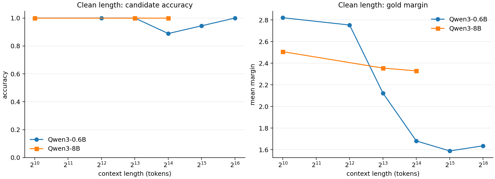
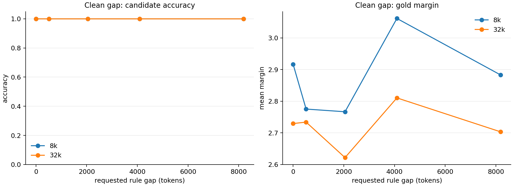
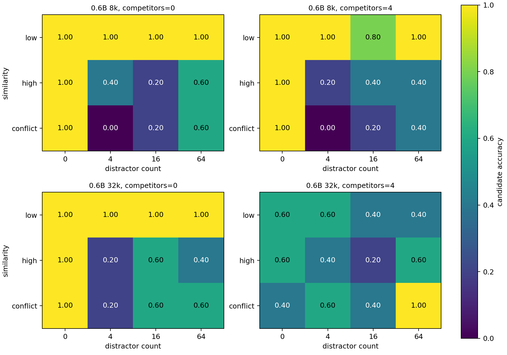
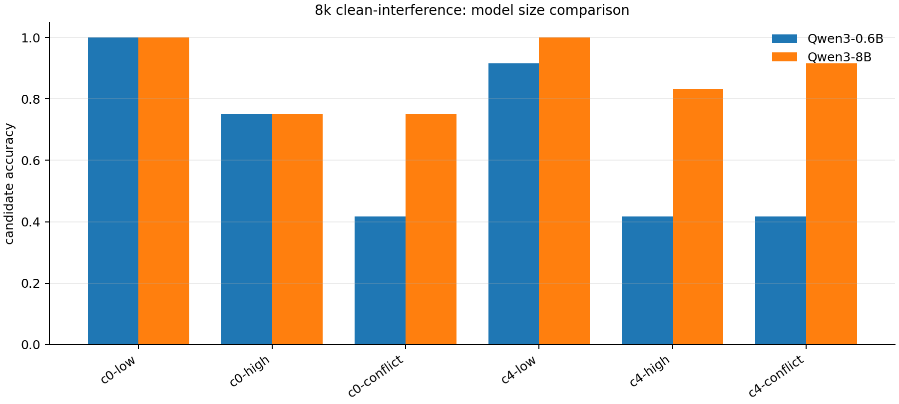
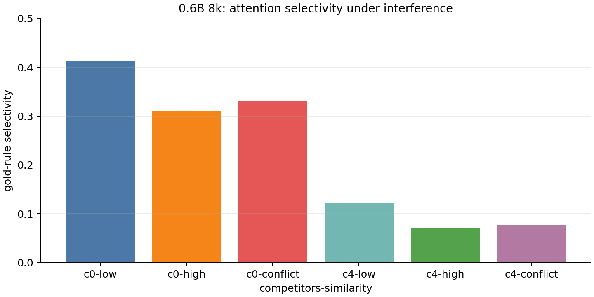

# 长上下文局部推理失败：最终综合结论

日期：2026-07-10

```
科学问题：如果真实世界中大量推理/决策本身是短程、低阶、局部可组合的，那么为什么小模型在长 context 推理中仍然会失败？

核心假设：复杂推理不一定是每一步都要同时聚合几十上百个条件，更可能是：每一步只依赖少数几个条件，推出一个新条件。复杂性主要来自很多局部 step 的连续组合，而不是单步推理本身很复杂。

即：Needle in the haystack 这类问题到底难在哪里？

难点可能不是短程关系本身，而是长 context 中的检索、筛选、抗干扰、变量绑定或中间状态维护。但这些目前都只是可能解释，需要实验验证。

子问题 1：什么 workload 对小模型是难的？

构造任务，使得：
* 小模型在干净短 context 中能做对；
* 同样的短程关系放进长 context 后会失败；
* 长 context 中可以加入无关信息、相似干扰、冲突规则、多条推理链等。

子问题 2：训练时 context 长度和模型大小有什么影响？
更大的模型在长 context 训练里到底提升了什么？

子问题 3：推理时为什么会失败？

在 inference 阶段，把简单短程依赖，例如 “if A then B”，放进越来越长、越来越复杂的 context。

控制变量包括：
* context length；
* 干扰信息数量；
* 干扰信息相似度；
* 相关信息之间的距离；
* 相关信息的位置；
* 推理链长度；
* 竞争推理链数量。

目标是画出不同模型的失败边界：
小模型在什么 context 长度和干扰强度下开始 fail？fail 时，有什么表现？例如 attention selectivity 变差，或者别的现象？
```

## 0. 当前最简结论

1. **Context 长度会影响模型推理时的 PPL / margin，但在 clean 条件下，不一定影响模型选出正确答案。**

2. **多个证据在文本中的分散程度，在 clean 条件下没有明显影响模型推理性能。**

3. **造成模型推理性能下降的主要原因，是存在相似干扰、冲突证据或竞争推理链。**

4. **Qwen3-8B 相对于 Qwen3-0.6B 的主要优势，是抗干扰能力更强。**

5. **模型推理能力下降，往往伴随着 gold-rule attention selectivity 下降。**

## 1. 总结答案

当前实验支持下面这个结论：

```text
小模型在长 context 中失败，不是因为它不会做短程、低阶、局部规则。
在干净条件下，Qwen3-0.6B 可以稳定完成 if A then B 以及少步规则组合，甚至到 64k candidate scoring 仍然很高。

真正困难的是：在长文本中找到正确证据、抑制相似/冲突证据、把问题变量绑定到正确链，并在多步组合中维护中间状态。
当 high-similarity distractor、conflict rule 或 competitor chain 出现时，gold 的 margin 和 attention selectivity 会明显下降，错误候选会接近甚至超过正确候选。
```

因此，更准确的表述不是：

```text
文本越长，所以模型推理能力越差。
```

而是：

```text
长文本增加了证据选择、抗干扰和变量绑定压力；当文本中存在相似或竞争型干扰时，小模型更容易选错证据，于是表现为长 context 推理失败。
```

## 2. 关键图

### 2.1 Clean length



无干扰、无竞争链时，0.6B 到 64k 的 candidate accuracy 仍然很高；但 margin 随长度变长明显变薄。

### 2.2 Clean gap



无干扰、无竞争链时，相关 rule 之间 gap 从 0 到 8192 tokens 没有造成失败。

### 2.3 Interference boundary



low-sim 普通干扰基本可控；high/conflict 干扰和 competitor chain 会明显降低 accuracy。干扰数量不是简单单调变量，结构更重要。

模型失败主要不是因为 context 变长本身，而是因为长文本里出现了相似干扰、冲突证据或竞争推理链，导致模型选错证据或绑定到错误链。

### 2.4 Model size



8B 相比 0.6B 的主要提升出现在 high/conflict 和 competitor 条件下，说明更大模型主要提升抗干扰、候选排序和变量绑定。

### 2.5 Attention selectivity



competitor chain 出现后，gold-rule attention selectivity 明显下降。失败样本不是局部规则不会推，而是没有稳定选中正确规则链。

## 3. 对三个子问题的回答

### 子问题 1：什么 workload 对小模型是难的？

当前结果显示，对小模型困难的不是干净局部规则，而是下面几类 workload：

1. 有 high-similarity distractor 的规则检索；
2. 有 conflict rule 的规则筛选；
3. 有多条 competitor chain，需要把 start code 绑定到正确链；
4. 多步 chain length 增加后，需要维护中间状态；
5. 自然语言事实 needle，尤其中文事实/中文问题在 64k/128k 下 evidence mass 会明显下降。

证据：

```text
0.6B clean length:
1k=1.00, 4k=1.00, 8k=1.00, 16k=0.8889, 32k=0.9444, 64k=1.00

0.6B clean gap:
8k/32k 下 rule gap 0..8192，candidate acc 全部 1.00

0.6B interference:
8k, competitor=0, low = 1.00
8k, competitor=0, high/conflict = 0.55/0.45
8k, competitor=4, high/conflict = 0.50/0.40
32k, competitor=4, high/conflict = 0.45/0.60
```

所以 workload 设计上应该把“长度”和“干扰结构”分开控制。只加普通 filler 不一定难；加入相似、冲突、竞争链才会暴露失败。

#### 数据如何构造

每个样本由三部分组成：

```text
[filler tokens + gold rules + distractor / competitor rules]

Task: Follow symbolic rules exactly.
Use only lines beginning with VERIFIED RULE.
Ignore DECOY RULE and NOTE lines even if they look similar.
Start code: {start_code}
Apply exactly {chain_length} valid rule step(s).
What is the final active code?
Answer:
```

目标规则链是 gold evidence。例如：

```text
Start code: LA61-822

VERIFIED RULE T0: IF LA61-822 IS ACTIVE THEN LB71-739 BECOMES ACTIVE.
VERIFIED RULE T1: IF LB71-739 IS ACTIVE THEN LC38-299 BECOMES ACTIVE.
VERIFIED RULE T2: IF LC38-299 IS ACTIVE THEN LD38-299 BECOMES ACTIVE.

Gold answer: LD38-299
```

干扰项和竞争链的关系：

```text
distractor 是局部干扰，通常是一条或多条不该用的规则/文本。
competitor chain 是结构化干扰，是一整条看起来完整、合法、但起点不匹配的推理链。
```

也就是说，competitor chain 可以理解为更强的 distractor：它不是单条噪声，而是一条完整的错误候选链。

三类 distractor：

```text
low distractor:
NOTE L3: The catalog mentions code LX12-345, but this note is not an active rule.

high-similarity distractor:
VERIFIED RULE H7: IF LA61-823 IS ACTIVE THEN LB71-749 BECOMES ACTIVE.

conflict rule:
DECOY RULE X2: IF LA61-822 IS ACTIVE THEN LB99-111 BECOMES ACTIVE.
```

competitor chain 例子：

```text
VERIFIED RULE C0: IF QA12-111 IS ACTIVE THEN QB22-222 BECOMES ACTIVE.
VERIFIED RULE C1: IF QB22-222 IS ACTIVE THEN QC33-333 BECOMES ACTIVE.
VERIFIED RULE C2: IF QC33-333 IS ACTIVE THEN QD44-444 BECOMES ACTIVE.
```

这条链本身格式正确，也是一条完整推理链；但它的起点是 `QA12-111`，不是问题里的 `Start code: LA61-822`，所以模型应该忽略它。

最后构造 candidate set：

```text
正确答案：LD38-299
冲突答案：LB99-111
竞争链答案：QD44-444
随机错误 code：...
```

如果 gold candidate 的 NLL 最低，则 `candidate_correct = 1`；否则为 0。

### 子问题 2：训练时 context 长度和模型大小有什么影响？

模型大小部分可以初步回答：

```text
8B 相比 0.6B 主要提升的是抗干扰、抗竞争链和变量绑定，而不是 clean local reasoning。
```

公平 8k clean-interference 子集：

```text
Qwen3-0.6B: 65.28%
Qwen3-8B:   87.50%
```

在 `competitor=4` 条件下：

```text
0.6B: 58.33%
8B:   91.67%
```

在 `competitor=4 + high/conflict` 下：

```text
0.6B: 41.67% / 41.67%
8B:   83.33% / 91.67%
```

这说明更大模型在长 context 中提升的核心不是“会不会做 if A then B”，而是：

1. 更好地区分 gold rule 和相似干扰；
2. 更好地抑制 competitor chain；
3. 更稳定地把 start code 绑定到正确链；
4. 给正确候选更高相对概率。

训练时 context length 的因果效应目前不能严格回答。原因是我们没有 matched checkpoints：

```text
same model size
same training data
same recipe
different training context length
```

本地 config 显示当前 Qwen3-0.6B 和 Qwen3-8B 都是：

```text
max_position_embeddings = 40960
rope_theta = 1000000
rope_scaling = None
```

所以这轮只能回答模型大小，不能把训练长度效应从模型大小和训练数据差异中隔离出来。

### 子问题 3：推理时为什么会失败？

推理时失败更像是证据选择和绑定失败，具体表现为：

1. gold candidate margin 下降到接近 0 或负数；
2. gold-rule attention selectivity 下降；
3. 模型把概率分配给 conflict/competitor/distractor 产生的错误 code；
4. 自由生成时会出现格式错误、miss、或先答错再补正确答案。

最直接证据：

```text
0.6B 8k interference:
competitor=0: mean selectivity 0.3518
competitor=4: mean selectivity 0.0901

32k interference:
competitor=0: mean margin 1.2873
competitor=4: mean margin 0.0015
```

这说明加入竞争链以后，模型并不是“推理步骤算错”，而是正确链的证据优势被压掉了。

## 4. 与年龄 needle 实验的统一解释

年龄 needle 结果：

1. `zh prompt + zh filler` 在 64k 前/中部失败，128k 全部失败；
2. `zh prompt + en filler` 到 64k 很强，但 128k 失败；
3. `en prompt + en filler` 在 128k seed0 三个位置都成功；
4. 中文 128k 下 evidence mass 会掉到很低。

local-rule clean ablation 结果：

1. 英文符号规则、candidate scoring、无干扰时，0.6B 到 64k 仍然稳；
2. gap 0..8192 不造成失败；
3. high/conflict/competitor 一出现，准确率、margin、selectivity 明显下降。

统一解释：

```text
Needle-in-the-haystack 的难点不是单一的 context length。
它取决于 language、task format、scoring/decoding method、position、RoPE 外推、干扰结构和变量绑定压力。

中文年龄 needle 的 128k 失败更像自然语言事实检索和 attention mass 崩塌；
local-rule 的失败更像相似规则/竞争链造成的证据筛选和绑定错误。
```

## 5. 现在可以写进论文/汇报的结论

推荐表述：

```text
Our results do not support the simple view that long-context reasoning fails because local reasoning itself becomes hard.
In clean contexts, Qwen3-0.6B can solve local symbolic rules and their short compositions even at long lengths.
The failure boundary emerges when long contexts contain similar, conflicting, or competing evidence.
These distractors reduce gold-evidence selectivity and shrink the probability margin of the correct candidate,
causing the model to bind the query to a wrong chain.
Larger models mainly improve this evidence selection and binding robustness, rather than the clean local rule itself.
```

中文版本：

```text
实验结果不支持“长上下文直接削弱局部推理能力”的简单解释。
在干净上下文中，Qwen3-0.6B 可以稳定完成短程规则及其局部组合。
真正的失败边界出现在长文本包含相似、冲突或竞争型证据时。
这些干扰会降低 gold evidence 的 attention selectivity，压缩正确候选的概率 margin，
使模型把问题绑定到错误规则链。
更大模型主要提升的是证据筛选、抗干扰和变量绑定鲁棒性，而不是干净局部规则本身。
```

## 6. 仍未严格回答的部分

唯一没有被严格因果识别的是：

```text
训练时 context length 到底提升了什么？
```

原因是当前没有 matched training-context checkpoints。要严格回答，需要同一模型大小、同一训练配方、不同训练上下文长度的 checkpoint。

可行后续实验：

1. 找或训练 matched 0.6B checkpoints，例如 4k/16k/32k/64k context training；
2. 对这些 checkpoint 跑同一套 clean length/interference/gap；
3. 看训练长度主要提升 clean retrieval、RoPE 外推、还是 interference robustness。

在没有 matched checkpoints 前，当前最可靠结论是：

```text
模型大小提升了抗干扰和绑定能力；训练长度效应不能单独归因。
```
