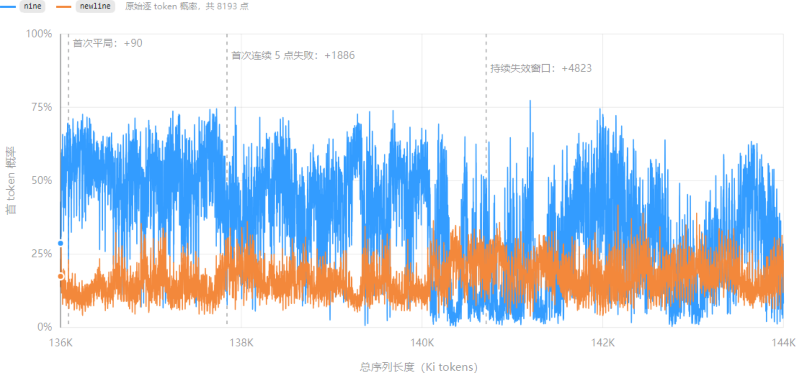

**研究问题**：长上下文增长时，真实答案 `nine` 如何被强竞争输出 token `newline` 夺走主导地位？是否存在决定输出切换的数值阈值？

> **实验范围**：Qwen3-8B，136K–144K，8193 个连续长度点

**图 1**　蓝线为 `P(nine)`，橙线为 `P(newline)`。虚线依次标出首次平局、首次连续 5 点失败和持续失效窗口。

## 1. 完整机制链条

实验观察到的完整机制可以概括为：

$$
\text{长度与新增内容变化}
\rightarrow
\text{Query 状态(贡献80\%和 RoPE 相对位置变化（贡献20\%）}
\rightarrow
\text{真实 nine 的关键 QK 降低}
$$

$$
\rightarrow
\text{证据 attention 相对优势下降}
\rightarrow
\text{nine 的 Value 写入残差流减弱}
\rightarrow
\Delta_{\mathrm{out}}\le0
\rightarrow
\text{newline 获胜}.
$$

这条链中存在两种不同性质的边界：

- **软阈值**：关键 head 的加权 QK 降至约 14.11 后，`newline` 获胜风险显著增加，但单个样本仍可能恢复。

下面先解释这条计算链如何在模型内部发生，再给出实验数据支撑。

## 2. 从 QK 下降到输出切换

### 2.1 QK 分数控制证据的相对读取优势

pre-RoPE Query cosine  1.000 → 0.968

在某个 attention head 中，真实证据 token $g$ 的 attention 为：

$$
a_g
=
\frac{
\exp(s_g)
}{
\exp(s_g)+\sum_{j\ne g}\exp(s_j)
}.
$$

它相对某个竞争 token $c$ 的 attention 比例为：

$$
\frac{a_g}{a_c}
=
\exp(s_g-s_c).
$$

如果真实证据相对竞争 token 的 QK 分数差降低 1，而其他分数不变，则：

$$
\frac{a_g'}{a_c'}
=
e^{-1}
\frac{a_g}{a_c}
\approx
0.368
\frac{a_g}{a_c}.
$$

也就是说，真实证据相对该竞争 token 的 attention 优势只剩原来的 36.8%，缩小约 63.2%。

### 2.2 Attention 控制真实证据写入残差流

Value 向量携带被检索到的内容，attention weight 决定该内容以多大强度写入当前查询位置。对某一个 head：

$$
o_h
=
a_{g,h}v_{g,h}
+
\sum_{j\ne g}a_{j,h}v_{j,h}.
$$

其中：

- $v_{g,h}$：真实证据 `nine` 携带的 Value 信息；
- $a_{g,h}$：模型从这条证据读取多少；
- $a_{g,h}v_{g,h}$：最终从真实证据取回并传递给后续网络的信息量。

多个 head 的输出经过 $W_O$ 投影，并与原残差和 MLP 更新共同形成下一层表示：

$$
r_{\ell+1}
=
r_\ell
+
W_O
\begin{bmatrix}
o_1;\ldots;o_H
\end{bmatrix}
+
\operatorname{MLP}(\cdot).
$$

因此，当真实证据的 attention 降低时，与 `nine` 有关的 Value 信息写入残差流的强度减弱，干扰信息和格式信息在查询表示中的相对占比上升。

### 2.3 最终隐藏状态被 LM Head 读成 `nine` 或 `newline`

经过所有层后，最终查询状态经 RMSNorm 得到：

$$
\tilde r_L
=
\operatorname{RMSNorm}(r_L).
$$

LM Head 为两个输出 token 分别打分：

$$
z_{\mathrm{nine}}
=
w_{\mathrm{nine}}^\top\tilde r_L,
$$

$$
z_{\mathrm{newline}}
=
w_{\mathrm{newline}}^\top\tilde r_L.
$$

因此：

$$
\Delta_{\mathrm{out}}
=
\left(
w_{\mathrm{nine}}-w_{\mathrm{newline}}
\right)^\top
\tilde r_L.
$$

| 总长度 | `P(nine)` | `P(newline)` | 输出 margin | 首 token |
|---:|---:|---:|---:|---|
| 136K | 28.70% | 17.41% | +0.50 | `nine` |
| 144K | 8.27% | 22.48% | −1.00 | `newline` |

从 136K 到 144K：

- `P(nine)` 从 28.70% 降至 8.27%；
- `P(newline)` 从 17.41% 升至 22.48%；
- 输出 margin 从 $+0.50$ 变为 $-1.00$。

在 144K：

$$
\log
\frac{0.0827}{0.2248}
\approx
-1.0.
$$

当输出 margin 穿过零点时，`newline` 接管首 token。

## 3. 实验支撑

### 3.1 主导权并非一次性、永久地交接

完整扫描覆盖 136K–144K，共 8193 个连续长度点。

| 边界定义 | 判定标准 | 新增 token | 对应总长度 |
|---|---|---:|---:|
| 瞬时边界 | 首次 $\Delta_{\mathrm{out}}\le 0$ | 90 | 136.088K |
| 短段稳定失败 | 连续 5 点 $\Delta_{\mathrm{out}}\le 0$ | 1886 | 137.842K |
| 统计边界 | 64 点窗口失败率 $\ge 50\%$ | 4160 | 140.063K |
| 持续失效窗口 | 256 点窗口失败率 $\ge 80\%$ | 4823 | 140.710K |

全区间中：

- 正确与错误共翻转 **907 次**；
- `newline` 获胜比例为 **25.22%**；
- 首次瞬时失败之后，模型仍会多次恢复到 `nine`。

因此，这一过程更像一个**带有大量抖动的相变区域**，而不是在某个固定长度之后永久失败。

### 3.2 主要是 `nine` 的支持崩塌，而非 `newline` 暴涨

| 区间 | 平均 `P(nine)` | 平均 `P(newline)` | `newline` 获胜率 | 关键 QK |
|---|---:|---:|---:|---:|
| 136–140K | 46.74% | 14.75% | 6.54% | 15.11 |
| 140–141K | 20.76% | 20.09% | 61.13% | 13.20 |
| 141–144K | 28.21% | 17.57% | 38.12% | 13.83 |

进入主要失败区时：

- `P(nine)` 平均下降约 **26 个百分点**；
- `P(newline)` 平均只上升约 **5 个百分点**。

所以更准确的描述是：

> 模型从真实证据得到的 `nine` 支持显著减弱后，`newline` 依靠原本存在的格式结束或换行先验接管输出。

### 3.3 最强内部预警指标：关键 head 的加权 QK

对此前识别出的 29 个关键 head，使用正确上下文中的证据 attention mass 作为权重，定义：

$$
S_{\mathrm{QK}}
=
\sum_{h\in\mathcal H}
w_h
\frac{
q_h^\top k_{\mathrm{nine},h}
}{
\sqrt d
}.
$$

本次数据得到的经验软阈值约为：

$$
S_{\mathrm{QK}}\approx 14.11.
$$

实验结果：

- $S_{\mathrm{QK}}\le14.11$ 时，`newline` 获胜概率为 **67.2%**；
- $S_{\mathrm{QK}}>14.11$ 时，`newline` 获胜概率只有 **4.8%**；
- balanced accuracy 为 **86.4%**；
- 与输出 margin 的 Pearson 相关系数为 **0.839**；
- 单独解释输出 margin 方差的 $R^2$ 为 **70.4%**。

分段结果更加直观：

| 加权 QK 区间 | `newline` 获胜概率 | 解释 |
|---:|---:|---|
| $\ge15$ | 0.7% | 真实证据占据明显优势 |
| 14.11–15 | 10.3% | 大多数点仍由 `nine` 主导 |
| 13–14.11 | 46.3% | 进入不稳定相变区域 |
| 12–13 | 90.8% | `newline` 几乎稳定接管 |
| $<12$ | 99.6% | 真实证据支持基本失效 |
