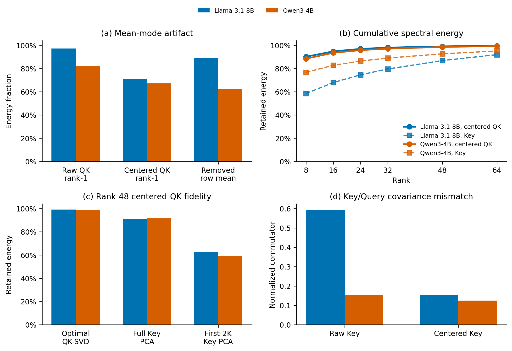

# CountCap：中心化 QK 奇异谱与 PCA/SVD 分析

更新时间：2026-07-26

## 1. 结论先行

1. 如果此前 SVD 分解的是同一个未中心化 Key 矩阵，那么 truncated SVD48 与
   uncentered PCA48 数学上完全等价，效果接近是必然结果。
2. 如果 SVD 直接分解完整 QK 矩阵，它是使用了 decode Query 的 query-aware
   上界，不等价于当前 Key-only PCA。
3. 原始 QK 的第一奇异模态有很大一部分是 token 维常数，而 softmax 会精确
   消掉该分量。QK 谱必须先按 token 维中心化再解释。
4. 中心化后，QK 仍然高度低秩：Llama-3.1-8B/Qwen3-4B/Qwen2.5-7B
   的能量有效秩分别为 4.72/5.43/6.29，最优 rank-48 保留
   99.09%/98.52%/98.80% 能量。
5. 但当前生产实现不是最优 QK-SVD，也不是 full-history Key-PCA。它用首 2K
   token 中每 32 个采一个 Key，只用 64 个样本建立 uncentered PCA48。
   该真实 basis 只保留 62.39%/59.07%/60.37% 的中心化 QK 能量。
6. 方法仍保持质量的直接原因不是“谱尾部没有语义”，而是生产候选仍保留
   86.47% full-attention mass，mass-weighted recall 为 92.38%，并且最终
   NLL 变化只有 Llama +0.01098、Qwen +0.00682 nat/token。

## 2. PCA 与 SVD 为什么效果相近

对某层、某个 KV head 的 post-RoPE Key：

$$
K\in\mathbb R^{N\times d},
\qquad
K=U\Sigma V^\mathsf T.
$$

未中心化 PCA 使用

$$
C_K=\frac{1}{N}K^\mathsf TK
=V\frac{\Sigma^2}{N}V^\mathsf T.
$$

因此 $C_K$ 的前 $r$ 个特征向量就是 $K$ 的前 $r$ 个右奇异向量：

$$
P_r=V_rV_r^\mathsf T.
$$

所以：

$$
\boxed{
\text{uncentered PCA}_r(K)
\equiv
\text{truncated right-SVD}_r(K)
}.
$$

这里必须限定为“同一个 $K$、同一种中心化方式、同一个 rank”。若直接对
$QK^\mathsf T$ 做 SVD，则基底同时利用了 $Q$ 与 $K$，是更强的 query-aware
解，不再与 Key-PCA 等价。

### 2.1 旧 SVD 实验与当前分析的对应关系

此前实验中的 “SVD” 需要分成三类：

| 分解对象 | 与 PCA 的关系 | 含义 |
|---|---|---|
| 首段采样 Key：$K_s$ | 与同一 $K_s^\mathsf TK_s$ 的未中心化 PCA 完全等价 | 当前生产 basis 的另一种计算写法 |
| 完整历史 Key：$K$ | 与 full-history 未中心化 PCA 完全等价 | 衡量首段采样 basis 的估计误差 |
| 中心化分数：$S^\circ=(QK^\mathsf T)H/\sqrt d$ | 不等价于 Key-only PCA | 使用真实 decode Query 的最优低秩上界 |

旧实验中，sampled PCA 与同样本 uncentered SVD 的主子空间重合度为
1.0000，检索指标差异约为 $10^{-5}$，实证验证了第一行的代数等价性。
在当前 rank-48 实验中，full-history SVD48 与 sampled full-history
PCA48 的候选 attention mass 分别为 90.49% 和 90.38%，只差 0.11
个百分点。这说明在该对照实验中，PCA/SVD 算法名称不是主要变量；真正影响
生产方法的是：

1. basis 看到了首段还是完整历史；
2. 分解对象只有 Key，还是同时考虑了 Query；
3. 是否去除了 softmax 无效的行均值模态；
4. 后续低比特量化、阈值候选选择和预算截断。

因此论文可以使用 SVD 语言解释谱结构，但不能把“将 PCA 换成 SVD”描述为一个
新方法。

## 3. 原始 QK 的 rank-1 为什么可能是伪影

令

$$
S=\frac{QK^\mathsf T}{\sqrt d},
\qquad
H=I_N-\frac{1}{N}\mathbf1\mathbf1^\mathsf T.
$$

按 token 维对每个 query 的分数行做中心化：

$$
S^\circ=SH.
$$

由于 $SH$ 只从每行减去一个常数，

$$
\boxed{
\operatorname{softmax}(S)
=
\operatorname{softmax}(S^\circ)
}.
$$

把 Key 分解为均值和中心化变化：

$$
\mu=\frac{1}{N}K^\mathsf T\mathbf1,
\qquad
\widetilde K=HK,
\qquad
K=\mathbf1\mu^\mathsf T+\widetilde K.
$$

则

$$
S
=
\frac{Q\mu\mathbf1^\mathsf T}{\sqrt d}
+
\frac{Q\widetilde K^\mathsf T}{\sqrt d}.
$$

第一项对每个 query 都是 token 维常数，可能具有很大 Frobenius 能量并形成
显著 rank-1 模态，但不会改变任何 attention 概率。

若 $S=U\Sigma V^\mathsf T$，第一右奇异向量与常数方向的对齐为

$$
\rho_1^2
=
\left|
v_1^\mathsf T\frac{\mathbf1}{\sqrt N}
\right|^2
=
\frac{|u_1^\mathsf TS\mathbf1|^2}{N\sigma_1^2}.
$$

行中心化删除的能量比例为

$$
\alpha_{\mathrm{mean}}
=
\frac{\|S(I-H)\|_F^2}{\|S\|_F^2}
=
\frac{\|S\mathbf1\|_2^2}{N\|S\|_F^2}.
$$

32K 实测：

| 模型 | 原始 rank-1 能量 | 删除的均值能量 | 第一右奇异向量与常数方向对齐 | 中心化 rank-1 能量 |
|---|---:|---:|---:|---:|
| Llama-3.1-8B | 97.19% | 88.83% | 91.13% | 70.89% |
| Qwen3-4B | 82.44% | 62.70% | 70.60% | 67.18% |
| Qwen2.5-7B | 95.63% | 90.51% | 93.55% | 63.58% |

因此，原始 QK 有效秩 1.22/2.79/1.41 不能直接作为稀疏检索的主要证据。

## 4. 中心化后低秩是否仍成立

本文用谱能量定义有效秩：

$$
p_j=\frac{\sigma_j^2}{\sum_\ell\sigma_\ell^2},
\qquad
r_{\mathrm{eff}}
=
\exp\left(-\sum_jp_j\log p_j\right).
$$

每个主题包含 64 个连续 decode 位置。Llama/Qwen3 每个 KV head 对应 4 个
GQA query head，因此每个 QK 谱堆叠 $M=256$ 个 query；Qwen2.5 每个 KV
head 对应 7 个 query head，因此 $M=448$。三者特征维度均为 128。

| 模型 | 中心化 QK 有效秩 | 最优 rank-16 | 最优 rank-32 | 最优 rank-48 |
|---|---:|---:|---:|---:|
| Llama-3.1-8B | 4.72 | 94.79% | 98.01% | 99.09% |
| Qwen3-4B | 5.43 | 93.50% | 97.08% | 98.52% |
| Qwen2.5-7B | 6.29 | 94.00% | 97.61% | 98.80% |

这说明去掉均值伪影后，QK 仍存在很强的真实低秩结构。
该结论在 head 分布尾部仍较稳定：最优 rank-48 的 p10 为
98.30%/97.74%/97.88%，最低值为 97.69%/95.11%/97.48%。

这里更准确的表述是“中心化 QK 的**奇异值谱快速衰减**”，而不是“奇异向量
很小”或“奇异向量很奇异”。奇异向量是单位方向，本身没有能量大小；能量由
$\sigma_j^2$ 决定。当相邻奇异值接近时，单个奇异向量还可以在对应子空间内
旋转，真正稳定且可解释的是主子空间和累计谱能量。

原始 QK 第一右奇异向量与常数方向高度对齐，说明最显著的单个方向主要是
softmax 无效的公共偏置。中心化后的右奇异向量才描述历史 token 之间的相对
分数变化；其快速衰减说明自然 decode Query 主要通过少数 token 对比模式读取
历史，而不是均匀使用全部 128 个特征方向。

## 5. Key-PCA 与最优 QK-SVD 的差距

令

$$
A^\circ=\widetilde K^\mathsf T\widetilde K,
\qquad
B=Q^\mathsf TQ,
\qquad
G^\circ
=
\frac{1}{d}(A^\circ)^{1/2}B(A^\circ)^{1/2}.
$$

$G^\circ$ 的特征值就是中心化 QK 的奇异值平方。最优 rank-$r$ QK-SVD
的平方残差与保留能量分别为

$$
\varepsilon_r^\star
=
\sum_{j>r}\lambda_j(G^\circ),
\qquad
E_r^\star
=
\sum_{j=1}^r\lambda_j(G^\circ).
$$

任意 rank-$r$ Key 子空间投影 $P$ 产生的近似为
$QP\widetilde K^\mathsf T/\sqrt d$，它相对完整中心化分数矩阵的真实平方残差为

$$
\varepsilon_r(P)
=
\frac{1}{d}
\|Q(I-P)\widetilde K^\mathsf T\|_F^2
=
\frac{1}{d}
\operatorname{tr}\!\left((I-P)A^\circ(I-P)B\right).
$$

因此应把实验中的 QK fidelity 定义为

$$
\mathcal F_r(P)
=
\frac{\|S^\circ\|_F^2-\varepsilon_r(P)}
{\|S^\circ\|_F^2},
$$

并定义归一化最优性差距

$$
\boxed{
\overline{\mathcal R}_r(P)
=
\frac{\varepsilon_r(P)-\varepsilon_r^\star}
{\|S^\circ\|_F^2}
=
\mathcal F_r^\star-\mathcal F_r(P)
\ge0.
}
$$

非负性直接来自 Eckart--Young--Mirsky：$QP\widetilde K^\mathsf T$ 的秩不超过
$r$，其残差不可能小于任意 rank-$r$ 近似的最优残差。这里不能在一般情况下把
$\|QP\widetilde K^\mathsf T\|_F^2/d$ 直接称为“保留能量”，因为
$QP\widetilde K^\mathsf T$ 与 $Q(I-P)\widetilde K^\mathsf T$ 未必 Frobenius
正交；只有在额外的对易/正交条件下两种写法才一致。

这个差别还可以写成一个显式构造。先假设 $A^\circ$ 在其支撑空间上可逆，令
$W_r$ 是 $G^\circ$ 的前 $r$ 个特征向量，并定义

$$
T_r^\star
=
(A^\circ)^{1/2}W_rW_r^\mathsf T(A^\circ)^{-1/2}.
$$

则 $T_r^\star$ 是 rank-$r$ 幂等算子，并且

$$
\frac{QT_r^\star\widetilde K^\mathsf T}{\sqrt d}
$$

恰好等于 $S^\circ$ 的 truncated rank-$r$ SVD。一般情况下
$T_r^\star$ 不是对称矩阵，所以它是中心化 Key 协方差白化坐标中的
query-aware 斜投影，而不是当前方法使用的正交 Key-PCA 投影。若
$A^\circ$ 奇异，只需把逆替换为 Moore--Penrose 伪逆并限制在其支撑空间。
当 $A^\circ$ 与 $B$ 对易时，$T_r^\star$ 才退化为共同特征方向上的正交选择；
此时 QK-SVD 选择最大的 $a_jb_j$，Key-PCA 则选择最大的 $a_j$。

实测 full-history uncentered Key-PCA48 对中心化 QK 的保能率为
Llama 91.10%、Qwen3 91.45%、Qwen2.5 91.67%，与最优 QK-SVD
相差 7.99/7.07/7.13 个百分点。

奇异向量是否共享可由 Key/Query 协方差的归一化交换子衡量。分别定义原始
Key 与中心化 Key 的协方差：

$$
\bar A=\frac{K^\mathsf TK}{N},
\qquad
\bar A^\circ=\frac{\widetilde K^\mathsf T\widetilde K}{N},
\qquad
\bar B=\frac{Q^\mathsf TQ}{M},
$$

并令

$$
\chi(A,B)
=
\frac{\|AB-BA\|_F}{\|A\|_F\|B\|_F}.
$$

若 $\chi=0$，两者可以同时对角化，QK 主方向可由共同特征方向解释；若
$\chi>0$，Key 的高能方向与自然 Query 关心的方向并不完全一致。32K 实测为：

| 模型 | 原始 $\chi(\bar A,\bar B)$ | 中心化 $\chi(\bar A^\circ,\bar B)$ | 全历史 stride-32 与 full Key 子空间重合 | 首 2K 与 full Key 子空间重合 |
|---|---:|---:|---:|---:|
| Llama-3.1-8B | 0.594 | 0.154 | 91.49% | 59.70% |
| Qwen3-4B | 0.151 | 0.124 | 88.72% | 57.23% |
| Qwen2.5-7B | 0.541 | 0.140 | 90.58% | 56.09% |

Llama 的交换子在中心化后从 0.594 大幅降到 0.154，说明原始 Key 均值方向也是
Key/Query 主方向失配的重要来源。中心化后三个模型的交换子都明显非零但较小：
这支持“自然 Query 与 centered-Key dominant subspace 具有经验对齐”，但不支持
“两者奇异向量逐个相同”。

这给出了旧 SVD/PCA 结果的更完整解释：

- 在同一批 Key 上，PCA 与 right-SVD 完全相同；
- 沿完整历史均匀采样时，估计出的 Key 主子空间仍较接近 full Key-SVD；
- 当前生产实现只观察首 2K，跨位置分布失配比 PCA/SVD 算法差异更大；
- Query 与 Key 的主方向并非逐个相同，因此最优 QK-SVD 只能作为上界，不能
  直接冒充可部署的 Key-only 方法。

这说明：

- 存在很好的 rank-48 QK 子空间；
- 只看 Key 建立的子空间并非最优；
- 直接把 QK-SVD 的 99% 能量保持率当成当前方法的精度是不成立的。

## 6. 当前生产 basis 的额外误差

冻结实现使用首个 2048-token chunk，每隔 32 个 token 采样一次：

$$
m=\left\lceil\frac{2048}{32}\right\rceil=64.
$$

然后用 64 个样本估计 rank-48 basis，并在该次请求中冻结。令 full-history
对照投影为 $P$，首段投影为 $\widehat P$，则

$$
S^\circ-\widehat SH
=
\frac{Q(I-P)\widetilde K^\mathsf T}{\sqrt d}
+
\frac{Q(P-\widehat P)\widetilde K^\mathsf T}{\sqrt d}.
$$

第一项是低秩截断误差，第二项是首段 basis 的分布失配。

| 模型 | Full Key-PCA48 中心化 fidelity | 生产 first-2K fidelity | 生产 centered cosine |
|---|---:|---:|---:|
| Llama-3.1-8B | 91.10% | 62.39% | 0.7953 |
| Qwen3-4B | 91.45% | 59.07% | 0.7609 |
| Qwen2.5-7B | 91.67% | 60.37% | 0.7864 |

因此生产代理的主要误差来自首段 basis，而不是 INT4。
并且该误差不是少数均值异常：生产 fidelity 的 p10 只有 39.58%/31.22%，
最低值为 9.88%/23.88%。这表明 first-2K basis 并非对每个 head 都稳定，
论文必须依赖候选 attention mass 和最终输出指标，而不能只报告平均谱 fidelity。

## 7. 从谱误差到最终输出

对任意投影 $P$，更准确的三项分解为

$$
\boxed{
S
=
\underbrace{\frac{Q\mu\mathbf1^\mathsf T}{\sqrt d}}_
{\text{softmax 精确忽略}}
+
\underbrace{\frac{QP\widetilde K^\mathsf T}{\sqrt d}}_
{\text{低维索引保留}}
+
\underbrace{\frac{Q(I-P)\widetilde K^\mathsf T}{\sqrt d}}_
{\text{影响排序的谱尾}}
}.
$$

INT4 K/INT8 Q 是投影坐标内的额外数值扰动。production-aligned 实验中：

| 指标 | 结果 |
|---|---:|
| First-2K PCA48 FP32 centered Pearson | 0.7771 |
| First-2K + INT4 K + INT8 Q centered Pearson | 0.7712 |
| INT4 新增 score error energy / exact score energy | 1.01% |
| Prefix/PCA 误差与量化误差 cosine | 0.00042 |

4% 候选：

| 方法 | Exact top-k recall | Mass-weighted recall | Full-attention mass |
|---|---:|---:|---:|
| Exact QK | 100.00% | 100.00% | 91.45% |
| Full SVD48 FP32 | 73.31% | 97.70% | 90.49% |
| Production PCA48 + INT4 K + INT8 Q | 47.34% | 92.38% | 86.47% |

虽然集合 recall 只有 47.34%，但高权重 token 的 recall 为 92.38%。候选集合
变化主要集中在低概率边界 token。

若候选遗漏 full-attention mass 为 $\eta$，候选内使用原始 FP16 Q/K/V
重算后严格有

$$
\|p-\widetilde p\|_1=2\eta,
$$

以及

$$
\|o-\widetilde o\|_2
\le
\eta\operatorname{diam}(V).
$$

最终 32K token-logit 配对：

| 模型 | top-1 agreement | 平均 KL | 平均 NLL 变化 | PPL 倍数 |
|---|---:|---:|---:|---:|
| Llama-3.1-8B | 94.69% | 0.01554 | +0.01098 | 1.0110x |
| Qwen3-4B | 91.73% | 0.03201 | +0.00682 | 1.0068x |

这条证据链支持的是自然输入上的条件稳定性，不是任意 query 下的无条件等价。

### 谱分析汇总图

图中四个面板分别验证：

1. raw QK 的 rank-1 集中度包含显著的 softmax 无效行均值模态；
2. 删除该模态后，centered QK 的累计奇异能量仍快速饱和；
3. full-history Key-PCA48 接近但严格低于 query-aware QK-SVD 上界，而
   first-2K Key-PCA 的分布失配明显更大；
4. 中心化会明显减小 Key/Query 协方差交换子，支持二者主子空间存在经验对齐，
   但交换子非零且 rank-48 边界谱隙很小，不能声称单个奇异向量一致。

逐 layer/head 的描述性 Spearman 相关性进一步给出：

| 指标对 | Llama-3.1-8B | Qwen3-4B |
|---|---:|---:|
| 删除的行均值能量 vs raw QK rank-1 能量 | 0.800 | 0.866 |
| centered Key/Query 交换子 vs Key-PCA 最优性差距 | -0.650 | 0.216 |
| first-2K 子空间重合 vs first-2K centered-QK fidelity | 0.235 | -0.016 |
| centered-QK 有效秩 vs first-2K fidelity | -0.486 | 0.406 |

只有第一项在两个模型上方向一致且较强，直接支持“raw rank-1 含均值伪影”。
其余单一谱统计量都不能跨模型稳定预测生产 fidelity。这是负结果，但它限定了
理论结论的边界：谱衰减、Query 对齐、prefix 分布漂移、量化和 top-$k$ 边界密度
必须联合记账，不能用一个有效秩或交换子替代端到端验证。不同 layer/head
并非独立样本，因此这里不报告把 80 行当独立观测得到的显著性 $p$ 值。

## 8. 对论文故事的影响

可以使用的论述：

> QK 的原始奇异谱包含显著的 softmax 无效均值模态。去掉该模态后，中心化
> QK 仍表现出强低秩结构。CountCap 使用请求首段构造低比特 Key-only 谱索引，
> 其代理无需精确恢复 top-k 集合；只要保留高 attention-mass token，候选内
> 精确 Q/K/V attention 和 residual 路径即可维持最终 logit 稳定。

不能使用的论述：

- “PCA 尾部没有语义”；
- “原始 QK 有效秩接近 1，所以 48 维近似几乎无误差”；
- “QK-SVD rank-48 的 99% 能量就是生产 first-2K PCA48 的保能率”；
- “SVD/PCA 低秩本身是本文独立创新”。

PCA 低维 token selection 已由
[Loki](https://arxiv.org/abs/2406.02542)研究；联合 Q/K 低秩由
[LRQK](https://arxiv.org/abs/2510.23649)研究；Key SVD 潜在通道量化由
[SVDq](https://arxiv.org/abs/2502.15304)研究；[RaBitQCache](https://arxiv.org/abs/2606.31519)
也会对 Q/K 做 centroid re-centering 后再量化；[SALS](https://papers.neurips.cc/paper_files/paper/2025/hash/00a0ebcad584c59dbc439c2af8793638-Abstract-Conference.html)
已在 latent Q/K 空间选 token；[Self-Indexing KVCache](https://ojs.aaai.org/index.php/AAAI/article/view/39988)
已把中心化压缩 Key 同时用作检索索引。因此，“需要中心化”或“压缩 Key
自索引”本身也不能作为独立创新。CountCap 的贡献必须落在
first-prefix online basis、低比特全历史扫描、sampled threshold、直接稀疏
attention、长度预算和包含全部检索开销的端到端系统组合及其完整误差链。

## 9. 结果与代码

- 完整数学附录：
  `docs/20260726_countcap_spectral_stability_mathematical_appendix_zh.md`
- 冻结方法复现：
  `docs/20260726_direct_countcap_frozen_method_reproduction_zh.md`
- 中心化 QK 分析代码：
  `src/analyze_qk_matrix_spectrum_20260726.py`
- 谱分析绘图代码：
  `src/plot_countcap_qk_spectrum_20260726.py`
- 谱统计相关性代码：
  `src/analyze_qk_spectral_correlations_20260726.py`
- 谱分析图片：
  `figures/20260726_countcap_centered_qk_spectrum.png`
  和 `figures/20260726_countcap_centered_qk_spectrum.pdf`
- 中心化谱汇总：
  `results/20260726_qk_matrix_spectrum_multimodel_32k/analysis_centered/summary.json`
- 中心化谱明细：
  `results/20260726_qk_matrix_spectrum_multimodel_32k/analysis_centered/qk_spectrum_rows.csv`
- 谱统计相关性：
  `results/20260726_qk_matrix_spectrum_multimodel_32k/analysis_centered/spectral_correlations.json`
