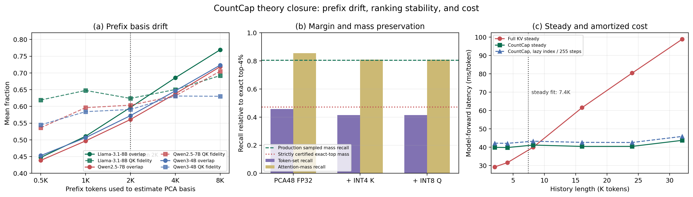
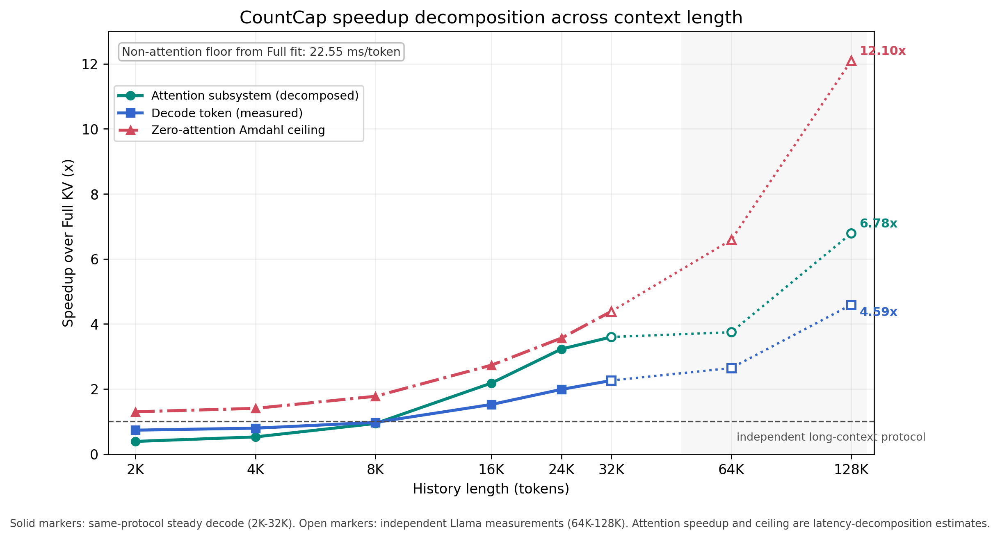

# CountCap 三项理论补充：前缀泛化、排序稳定性与完整成本模型

更新时间：2026-07-26

## 1. 结论先行

这份补充回答三个此前尚未闭合的问题：

1. 只用前 2048 个 token、每 32 个 token 采样一次得到的 PCA48 basis，为什么可以用于后续长历史？
2. PCA48、INT4 Key、INT8 Query 和 256 点阈值采样产生分数扰动后，为什么关键候选仍可能被保留？
3. 把建索引、低比特扫描、候选筛选和精确稀疏 attention 全部计入后，CountCap 在什么长度和生成步数下才真正更快？

当前可以严格成立的结论是：

- 前缀 basis 的 QK 误差存在一个**精确分解恒等式**，可以把理想 full-history PCA 截断误差与 prefix-basis 漂移误差分开。
- 前缀 PCA 存在一个**不依赖 eigengap 的 excess-risk 上界**，但该上界在当前 64 个 prefix 样本上数值很松。
- Davis--Kahan 子空间稳定性界在当前 rank 48 边界处完全不提供有效保证，不能声称“前 2K 学到了稳定的完整历史 PCA 向量”。
- top-k 候选保持可以由 score margin 严格刻画；逐 token 的 PCA 尾范数与量化误差区间比全局最坏情况界明显更有用。
- 在 58,880 个 layer-head-query 条件上，生产代理的逐 token 误差上界全部成立；在 sampled threshold 下，它平均严格认证 exact top-4% 中 **47.26% 的 attention mass 必然被选中**。实际 mass recall 为 **80.48%**。
- 当前系统仍然是关于历史长度 $N$ 的线性扫描，不是次线性检索。加速来自低维低比特扫描和被 cap 的精确 attention 预算，而不是改变渐近复杂度。
- 同硬件 2K--32K 实测中，稳态 decode 的拟合交叉点为 7.4K，直接观测的交叉区间约为 8K--9K；把约 0.45 秒的懒建索引成本计入后，16K、24K、32K 分别约需 21、12、9 个生成步才能摊平。

因此，理论已经形成一条完整的**条件稳定性链**，但仍不能证明任意输入上的答案必然不变：

$$
\text{prefix / quantization score error}
\Longrightarrow
\text{margin-conditioned candidate preservation}
\Longrightarrow
\text{omitted attention mass}
\Longrightarrow
\text{attention-output perturbation}
\Longrightarrow
\text{local logit stability}.
$$

---

## 2. 冻结方法与符号

本文不改变当前冻结方法：

- basis：首个 2048-token chunk，每 32 个 token 采样一个 Key，共 64 个样本；
- projection：每个 KV head 独立做 uncentered PCA48；
- index：PCA48 Key 使用 grouped log-scale INT4，Query 使用 INT8；
- threshold：均匀 midpoint 采样 256 个代理分数估计分位点；
- candidate：不做 exact rerank，候选内用原始 FP16 Q/K/V 做精确 attention；
- budget：

$$
B(N)=\min\left\{N,\ 1280,\ \max\left(256,\left\lceil0.06N\right\rceil\right)\right\};
$$

- 不使用 Full-attention fallback。

对某一层、某一 KV head，记历史 Key 为

$$
K\in\mathbb R^{N\times d},\qquad d=128.
$$

一批 decode Query 记为

$$
Q\in\mathbb R^{M\times d}.
$$

定义中心化矩阵

$$
H=I-\frac{1}{N}\mathbf 1\mathbf 1^\mathsf T,\qquad K_c=HK.
$$

因为

$$
QK^\mathsf T
=QK_c^\mathsf T+(Q\mu_K)\mathbf 1^\mathsf T,
$$

第二项对同一 query 的所有 token 都是公共常数，softmax 会精确消掉它。因此，理论中的 QK fidelity 和误差都应优先在 $QK_c^\mathsf T$ 上定义。

---

## 3. 理论一：Prefix PCA 的泛化与失配

### 3.1 精确的 QK 误差分解

令完整历史二阶矩的 top-$r$ 投影为

$$
P=UU^\mathsf T,
$$

令 prefix 样本得到的生产投影为

$$
\widehat P=\widehat U\widehat U^\mathsf T.
$$

对任意投影 $A$，定义中心化 QK 残差矩阵

$$
E(A)=\frac{1}{\sqrt d}Q(I-A)K_c^\mathsf T.
$$

由于

$$
I-\widehat P=(I-P)+(P-\widehat P),
$$

有精确恒等式

$$
E(\widehat P)=E(P)+D,
$$

其中

$$
D=\frac{1}{\sqrt d}Q(P-\widehat P)K_c^\mathsf T.
$$

因此：

$$
\|E(\widehat P)\|_F^2
=
\|E(P)\|_F^2
+\|D\|_F^2
+2\langle E(P),D\rangle_F.
$$

这不是上界，而是精确分解。它说明生产误差由三部分共同决定：

1. 即使使用 full-history PCA48 也存在的 intrinsic truncation；
2. prefix basis 与 full-history basis 的漂移；
3. 两种误差的交叉项。

进一步有三角界：

$$
\frac{\|E(\widehat P)\|_F}{\|QK_c^\mathsf T\|_F}
\le
\frac{\|E(P)\|_F}{\|QK_c^\mathsf T\|_F}
+
\frac{\|Q(P-\widehat P)K_c^\mathsf T\|_F}
{\|QK_c^\mathsf T\|_F}.
$$

第二项还满足：

$$
\frac{\|Q(P-\widehat P)K_c^\mathsf T\|_F}
{\|QK_c^\mathsf T\|_F}
\le
\kappa_{QK}\|P-\widehat P\|_2,
$$

其中

$$
\kappa_{QK}
=
\frac{\|Q\|_2\|K_c\|_F}
{\|QK_c^\mathsf T\|_F}.
$$

实验对该恒等式的相对数值误差均值小于 $2\times10^{-7}$。

### 3.2 Davis--Kahan 界为什么在这里失效

定义完整历史和 prefix 样本的二阶矩：

$$
\Sigma_N=\frac{1}{N}K^\mathsf TK,\qquad
\widehat\Sigma_m=\frac{1}{m}K_m^\mathsf TK_m.
$$

令

$$
\Delta_m=\|\widehat\Sigma_m-\Sigma_N\|_2,
\qquad
g_r=\lambda_r(\Sigma_N)-\lambda_{r+1}(\Sigma_N).
$$

当 $\Delta_m<g_r/2$ 时，Davis--Kahan 型界给出：

$$
\|P-\widehat P\|_2
\le
\frac{2\Delta_m}{g_r}.
$$

如果右侧大于 1，该界只退化为投影距离的平凡上界 1。

32K、rank 48 的真实结果如下。每个模型同时覆盖体育和医学文本。

| 模型 | 2K prefix 实际样本 | 相对 covariance drift | 相对 rank-48 eigengap | DK 有效比例 | 投影谱距离 | 平均子空间 overlap |
|---|---:|---:|---:|---:|---:|---:|
| Llama-3.1-8B | 64 | 56.33% | 0.0211% | 0% | 0.99976 | 59.70% |
| Qwen2.5-7B | 64 | 51.63% | 0.0247% | 0% | 0.99979 | 56.09% |
| Qwen3-4B | 64 | 46.86% | 0.0120% | 0% | 0.99989 | 57.24% |

结论是：

> rank 48 边界没有足够 eigengap，最坏 principal angle 接近 90 度。当前数据不支持“prefix PCA 向量稳定”这一说法。

这并不与方法有效矛盾。边界附近奇异值接近时，单个向量可以大幅旋转，而由整个低秩空间完成的候选排序仍可能保持重要 attention mass。

### 3.3 不需要 eigengap 的 PCA excess-risk 定理

定义 rank-$r$ 投影 $A$ 在完整历史二阶矩上的 Key 重构风险：

$$
\mathcal R_{\Sigma_N}(A)
=
\operatorname{tr}\left[(I-A)\Sigma_N\right].
$$

其中 $P$ 是 $\Sigma_N$ 上的最优 rank-$r$ 投影，$\widehat P$ 是 $\widehat\Sigma_m$ 上的最优 rank-$r$ 投影。

则有不依赖 eigengap 的确定性上界：

$$
0
\le
\mathcal R_{\Sigma_N}(\widehat P)
-\mathcal R_{\Sigma_N}(P)
\le
2r\|\widehat\Sigma_m-\Sigma_N\|_2.
$$

证明如下。因为 $\widehat P$ 最大化
$\operatorname{tr}(A\widehat\Sigma_m)$：

$$
\begin{aligned}
\operatorname{tr}(P\Sigma_N)-\operatorname{tr}(\widehat P\Sigma_N)
={}&
\operatorname{tr}\left[P(\Sigma_N-\widehat\Sigma_m)\right]\\
&+
\left[
\operatorname{tr}(P\widehat\Sigma_m)
-\operatorname{tr}(\widehat P\widehat\Sigma_m)
\right]\\
&+
\operatorname{tr}\left[\widehat P(\widehat\Sigma_m-\Sigma_N)\right].
\end{aligned}
$$

中间项不大于 0；对任意 rank-$r$ 正交投影 $A$，

$$
|\operatorname{tr}(A\Delta)|\le r\|\Delta\|_2.
$$

因此得到上界。

这个定理的重要性在于：即使 eigengap 很小、特征向量本身不稳定，只要 prefix 二阶矩估计准确，完整历史上的重构风险仍可稳定。

但是，当前实验也表明这个最坏情况上界仍然很松：

| 模型 | Full-history PCA48 Key fidelity | 2K-prefix Key fidelity | 实际 excess risk / Key energy | Gap-free 上界 / Key energy |
|---|---:|---:|---:|---:|
| Llama-3.1-8B | 86.84% | 64.69% | 22.15% | 2197% |
| Qwen2.5-7B | 89.92% | 70.75% | 19.17% | 1901% |
| Qwen3-4B | 92.63% | 79.01% | 13.63% | 2222% |

所以正确表述应是：

- gap-free 定理给出了正确的结构性结论；
- 以当前 64 个 prefix 样本代入后，数值上界是 vacuous 的；
- 生产方法的任务质量不能只靠这一条最坏情况界解释，必须继续使用后面的 margin 和 attention-mass 分析。

### 3.4 条件性的总体分布泛化

如果采样 Key 来自同一平稳、sub-Gaussian 分布，并把序列相关性折算为有效样本数 $m_{\mathrm{eff}}$，标准 covariance concentration 形式为：

$$
\|\widehat\Sigma_m-\Sigma\|_2
\lesssim
\|\Sigma\|_2
\left[
\sqrt{
\frac{r_{\mathrm{eff}}(\Sigma)+\log(1/\delta)}
{m_{\mathrm{eff}}}
}
+
\frac{r_{\mathrm{eff}}(\Sigma)+\log(1/\delta)}
{m_{\mathrm{eff}}}
\right].
$$

与 gap-free excess-risk 定理组合，可得到一个高概率总体风险界。

但当前方法每个 head 只有 64 个 basis 样本，并且 Transformer Key 沿序列显著相关。因此该式只能作为**条件定理**，不能在未验证平稳性和有效样本数前写成无条件保证。

### 3.5 前缀长度曲线说明什么

从 512 增大到 8192 prefix token 时：

- Llama 子空间 overlap 从 44.74% 增至 76.92%，实际 Key excess risk 从 27.32% 降至 11.77%；
- Qwen2.5 overlap 从 43.87% 增至 71.85%，excess risk 从 23.61% 降至 11.53%；
- Qwen3 overlap 从 45.30% 增至 72.33%，excess risk 从 17.56% 降至 7.72%。

然而，中心化 QK fidelity 并不严格单调，例如 Llama 在 1K 为 64.77%、2K 为 62.39%。原因是 Key 重构目标不等于当前 Query 分布下的 QK 目标，且交叉项可能为正或负。

2K 处，intrinsic full-history PCA48 的中心化 QK fidelity 为 91% 左右，而 production prefix basis 只有 59%--62%。这进一步说明：

> Frobenius QK energy fidelity 不是最终质量的充分条件；真正决定稀疏候选是否可用的是排序间隔和 attention mass。

---

## 4. 理论二：Margin-conditioned 候选保持

### 4.1 生产代理分数的逐 token 误差上界

令 $U\in\mathbb R^{d\times r}$ 为生产 prefix basis，
$P=UU^\mathsf T$。定义：

$$
q_p=U^\mathsf Tq,\qquad k_{p,i}=U^\mathsf Tk_i,
$$

$$
q_t=(I-P)q,\qquad k_{t,i}=(I-P)k_i.
$$

量化后的低维 Query 和 Key 分别记为 $\bar q$、$\bar k_i$。精确分数与生产代理分数为：

$$
s_i=\alpha q^\mathsf Tk_i,\qquad
\widehat s_i=\alpha\bar q^\mathsf T\bar k_i.
$$

误差可精确拆成：

$$
s_i-\widehat s_i
=
\alpha
\left[
q_t^\mathsf Tk_{t,i}
+(q_p-\bar q)^\mathsf Tk_{p,i}
+\bar q^\mathsf T(k_{p,i}-\bar k_i)
\right].
$$

因此逐 token 上界为：

$$
|s_i-\widehat s_i|
\le u_i,
$$

$$
u_i
=
|\alpha|
\left[
\|q_t\|_2\|k_{t,i}\|_2
+\|q_p-\bar q\|_2\|k_{p,i}\|_2
+\|\bar q\|_2\|k_{p,i}-\bar k_i\|_2
\right].
$$

三项分别对应：

1. PCA 丢弃的尾部；
2. INT8 Query 量化；
3. INT4 Key 量化。

生产代理在 58,880 个真实 layer-head-query 条件、每个条件 31,999 个历史 token 上验证了该上界，最大违反量为 0。

### 4.2 全局误差范围下的 top-k 核心保持定理

令

$$
\widehat s_i=s_i+\eta_i,
\qquad
R_\eta=\max_i\eta_i-\min_i\eta_i.
$$

设 $S^\star$ 是精确分数的 top-$k$ 集合，

$$
\tau=s_{(k)}
$$

是精确第 $k$ 大分数。定义 robust core：

$$
\mathcal C_R
=
\left\{
i\in S^\star:
s_i>\tau+R_\eta
\right\}.
$$

则严格有：

$$
\mathcal C_R\subseteq\widehat S_k,
$$

其中 $\widehat S_k$ 是代理分数的 top-$k$。

证明：对任意 $i\in\mathcal C_R$ 和任意
$j\notin S^\star$：

$$
\widehat s_i-\widehat s_j
=(s_i-s_j)+(\eta_i-\eta_j)
>(\tau+R_\eta-\tau)-R_\eta
=0.
$$

因此 $i$ 严格排在全部 exact-top-k 外部 token 之前，必定进入代理 top-$k$。

如果 $p_i$ 是精确 attention 概率，则代理候选至少保留：

$$
\sum_{i\in\mathcal C_R}p_i
$$

的 exact-top-k attention mass；始终保留的 current/recent token 还可以单独加上。

这个定理无分布假设，但 $R_\eta$ 由全局极端误差决定，实测平均只认证 exact-top-4% 中 7.43% 的 mass，过于保守。

### 4.3 256 点 sampled threshold 的额外误差

令 $\widehat\tau$ 为完整代理分数的第 $k$ 大阈值，
$\widetilde\tau$ 为 256 个 midpoint 样本估计的阈值，并定义：

$$
\rho=|\widetilde\tau-\widehat\tau|.
$$

则更强 margin core：

$$
\mathcal C_{R+\rho}
=
\left\{
i\in S^\star:
s_i>\tau+R_\eta+\rho
\right\}
$$

必定满足：

$$
\widehat s_i>\widetilde\tau.
$$

所以这些 token 必定通过 sampled threshold。

证明如下。记

$$
\eta_{\max}=\max_i\eta_i,\qquad
\eta_{\min}=\min_i\eta_i.
$$

完整代理分数的第 $k$ 大阈值满足

$$
\widehat\tau\le \tau+\eta_{\max}.
$$

这是因为严格满足 $s_i>\tau$ 的 token 最多只有 $k-1$ 个；
其余 token 均有
$\widehat s_i=s_i+\eta_i\le\tau+\eta_{\max}$。
因此代理排序中的第 $k$ 大值不可能超过
$\tau+\eta_{\max}$。于是对任意
$i\in\mathcal C_{R+\rho}$，

$$
\widehat s_i
=s_i+\eta_i
> \tau+R_\eta+\rho+\eta_{\min}
=\tau+\eta_{\max}+\rho
\ge \widehat\tau+\rho
\ge \widetilde\tau.
$$

因此该 token 一定被 sampled threshold 保留。

在 32K、目标 4% 下：

- 采样阈值绝对误差均值为 0.218，p50 为 0.162，p90 为 0.451；
- 实际选中比例均值为 3.964%，p10--p90 为 2.688%--5.329%；
- sampled threshold 相比完整代理 top-4% 的 mass recall 只下降 0.40 个百分点。

这说明 256 点采样本身不是主要质量损失来源。

### 4.4 基于 $L_2$ 误差的 boundary-mass 定理

对任意中心常数 $c$ 和 $\gamma>0$，定义 top-k 边界带：

$$
\mathcal B_\gamma
=
\left\{
i\in S^\star:
s_i\le\tau+2\gamma
\right\},
$$

以及大误差 token 集合：

$$
\mathcal L_\gamma
=
\left\{
i:
|\eta_i-c|\ge\gamma
\right\}.
$$

由 Markov/Chebyshev 计数界：

$$
|\mathcal L_\gamma|
\le
\frac{\|\eta-c\mathbf1\|_2^2}{\gamma^2}.
$$

任何不在边界带内却被代理 top-$k$ 漏掉的 token，都可以与一个进入代理 top-$k$ 的外部 token 配对。因为两者精确分数差大于 $2\gamma$，至少一个配对 token 必须属于 $\mathcal L_\gamma$。

令

$$
m_\gamma
=
\min\left(
k,
\left\lceil
\frac{\|\eta-c\mathbf1\|_2^2}{\gamma^2}
\right\rceil
\right).
$$

则漏掉的 exact-top-k attention mass 满足：

$$
M_{\mathrm{FN}}
\le
\sum_{i\in\mathcal B_\gamma}p_i
+
\operatorname{TopMass}_{m_\gamma}
\left(
S^\star\setminus\mathcal B_\gamma
\right).
$$

这个定理解释了“set recall 低但 mass recall 高”的机制：大量交换发生在阈值附近，而阈值附近 token 的单个 attention 权重通常很小。

不过当前全局 $L_2$ 误差使 $m_\gamma$ 在最优网格上仍饱和到 $k=1280$，所以完整上界数值上是 vacuous 的。论文应保留该定理作为结构解释，但不能把它报告成紧的实证保证。

### 4.5 逐 token interval certificate

逐 token 上界 $u_i$ 比全局 $R_\eta$ 或全局 $L_2$ 更细。

对任意 $i\in S^\star$，如果

$$
s_i-u_i
>
\max_{j\notin S^\star}(s_j+u_j),
$$

则 $i$ 必定进入代理 top-$k$。

对 sampled threshold，如果

$$
s_i-u_i>\widetilde\tau,
$$

则因为

$$
\widehat s_i\ge s_i-u_i,
$$

$i$ 必定被生产阈值选中。

真实结果为：

- production PCA48 + INT4 K + INT8 Q 的 norm bound 在全部 58,880 个条件上成立；
- sampled-threshold interval certificate 的 inclusion 检查 100% 成立；
- 它平均认证 exact-top-4% attention mass 的 47.26%，对应绝对 attention mass 44.47%；
- 证书覆盖率 p50 为 50.93%，p90 为 94.80%。

这个证书仍是 trace 上的 a posteriori 分析，因为判定 exact-top token 时使用了精确 $s_i$。它不应被描述为当前线上 router 或安全门控，但它严格验证了生产分数扰动确实保留了一块非空的重要候选核心。

### 4.6 从遗漏 mass 到 attention 输出扰动

设 $S$ 是保留集合，精确 attention 输出为：

$$
o=\sum_i p_iv_i.
$$

稀疏集合内重新归一化后的输出为：

$$
o_S
=
\frac{1}{1-\epsilon}
\sum_{i\in S}p_iv_i,
\qquad
\epsilon=\sum_{i\notin S}p_i.
$$

如果

$$
\|v_i\|_2\le V_{\max},
$$

则有：

$$
\|o-o_S\|_2\le2V_{\max}\epsilon.
$$

因此，候选 set recall 本身不是最直接的稳定性量，遗漏 attention mass $\epsilon$ 才直接控制 attention 输出。

若该层之后到 logits 的映射在当前轨迹附近具有局部 Lipschitz 常数 $L_{\ell\rightarrow z}$，则：

$$
\|\Delta z\|_2
\le
2L_{\ell\rightarrow z}V_{\max}\epsilon.
$$

这里必须写“局部、条件性”。深层 Transformer 的全局最坏 Lipschitz 常数通常极松，最终 NLL、logit margin 和任务分数仍需实测。

### 4.7 真实 margin 与 mass 结果

32K、exact top-4%、58,880 个条件的逐阶段结果：

| 代理阶段 | Token-set recall | Mass-weighted recall | 代理候选实际保留 mass |
|---|---:|---:|---:|
| Prefix PCA48 FP32 | 45.70% | 85.54% | 78.18% |
| + INT4 Key | 41.45% | 80.88% | 74.37% |
| + INT8 Query | 41.45% | 80.88% | 74.36% |
| + 256 点 sampled threshold | 40.69% | 80.48% | 74.03% |

可见：

- token 集合只重合约 41%，但被重合 token 承载的 exact-top attention mass 达到约 80%；
- INT4 Key 是量化阶段的主要额外损失，mass recall 下降 4.66 个百分点；
- INT8 Query 的新增损失约 0.003 个百分点；
- sampled threshold 的新增损失约 0.40 个百分点。

生产 sampled-threshold 的分模型结果：

| 模型 | 条件数 | 实际候选比例 | Token-set recall | Mass recall | 实际保留 attention mass |
|---|---:|---:|---:|---:|---:|
| Llama-3.1-8B | 20,480 | 3.913% | 46.92% | 88.83% | 81.13% |
| Qwen2.5-7B | 17,920 | 3.945% | 37.38% | 74.35% | 67.89% |
| Qwen3-4B | 20,480 | 4.031% | 37.35% | 77.50% | 72.30% |

该结果说明理论机制跨模型成立，但代理质量仍有明显模型差异，不能只用 Llama 的结果声称统一的 90% mass recall。

预算从 2% 增至 6% 的 production sampled-threshold 曲线：

| 目标比例 | 实际选中比例 | Token-set recall | Mass recall | 实际保留 attention mass |
|---|---:|---:|---:|---:|
| 2% | 2.139% | 36.32% | 77.22% | 68.58% |
| 4% | 3.964% | 40.69% | 80.48% | 74.03% |
| 6% | 5.823% | 44.02% | 82.78% | 77.63% |

提升候选比例带来平滑但边际递减的 mass 收益。这与当前“短序列最多 6%，长序列 cap 到 1280 token”的预算设计一致。

---

## 5. 理论三：完整复杂度与速度交叉点

### 5.1 单层、单 decode token 的操作量

记：

- $H_q$：Query head 数；
- $H_{kv}$：KV head 数；
- $d$：head dimension；
- $r=48$：索引维度；
- $N$：历史长度；
- $B=B(N)$：实际候选预算。

Full attention 的 QK 和 AV 各需要约
$2H_qNd$ FLOPs，因此：

$$
C_{\mathrm{full}}
\approx
4H_qNd.
$$

CountCap 的主要部分为：

1. Query 投影：

$$
C_{\mathrm{qproj}}\approx2H_qdr;
$$

2. 全历史低比特扫描：

$$
C_{\mathrm{scan}}=\Theta(H_qNr);
$$

3. 256 点阈值估计和全历史阈值比较：

$$
C_{\mathrm{select}}=\Theta(H_qN);
$$

4. 候选内精确 QK 和 AV：

$$
C_{\mathrm{sparse}}
\approx
4H_qBd.
$$

所以：

$$
C_{\mathrm{CountCap}}
\approx
2H_qdr
+c_{\mathrm{scan}}H_qNr
+c_{\mathrm{select}}H_qN
+4H_qBd.
$$

$c_{\mathrm{scan}}$ 是 INT8$\times$INT4 kernel 的硬件常数，不能直接与 FP16 FLOP 常数等同。

重要结论：

> CountCap 对 $N$ 仍然是 $\Theta(N)$；它依赖更低的每 token 扫描成本和被 cap 的 $B$ 获得加速，不应写成 sublinear retrieval。

### 5.2 索引建立复杂度

每个 KV head 的 basis 使用

$$
m=2048/32=64
$$

个样本。索引建立包括：

1. 二阶矩：

$$
\Theta(H_{kv}md^2);
$$

2. $d\times d$ 特征分解：

$$
\Theta(H_{kv}d^3);
$$

3. 全部历史 Key 投影：

$$
\Theta(H_{kv}Ndr);
$$

4. 分组 log-scale INT4 量化：

$$
\Theta(H_{kv}Nr).
$$

总计：

$$
C_{\mathrm{index}}
=
\Theta
\left(
H_{kv}md^2
+H_{kv}d^3
+H_{kv}Ndr
\right).
$$

当前实测的一次性成本在 2K--32K 间近似常数，说明该范围内 basis/eigendecomposition 和固定 kernel 调度占主导；这不代表投影项在更长序列上仍然没有 $N$ 成本。

### 5.3 索引存储不是完整 KV 压缩率

对 $d=128,r=48$，每个 token、每个 KV head 的低比特 Key 索引约为：

- INT4 code：$48/2=24$ bytes；
- FP16 base scale：2 bytes；
- 三个 16 维 group 的 4-bit exponent：2 bytes；
- 合计：28 bytes。

原始 FP16 K+V 为：

$$
2\times128\times2=512\ \text{bytes}.
$$

因此，低比特 Key 索引相对完整 FP16 K+V 的附加比例为：

$$
\frac{28}{512}=5.47\%.
$$

但候选内精确 attention 仍需要原始 K/V。因此：

> 5.47% 是附加检索索引大小，不是当前系统的总物理 KV 存储比例。只有配合 CPU/offload 或 GPU hot-cache 设计，才能把原始 K/V 的 GPU 常驻比例真正降下来。

### 5.4 请求级成本模型

设生成 $G$ 个 decode token。Full KV 的请求成本写为：

$$
T_{\mathrm{full}}(N,G)
=
P_{\mathrm{full}}(N)
+G\,t_{\mathrm{full}}(N).
$$

CountCap 写为：

$$
T_{\mathrm{cc}}(N,G)
=
P_{\mathrm{full}}(N)
+I_{\mathrm{visible}}(N)
+G\,t_{\mathrm{cc}}(N,B(N)).
$$

其中：

- $I_{\mathrm{visible}}$ 是没有被 prefill 增量构建或异步执行遮蔽的一次性索引成本；
- PPL 长度扫描在首个稀疏 decode step 懒建索引；
- production `prefillindex` 把该成本移入 prefill，稳态 decode 方程不变。

如果

$$
\Delta t(N)
=t_{\mathrm{full}}(N)-t_{\mathrm{cc}}(N,B(N))>0,
$$

则最少生成步数为：

$$
G_{\mathrm{BE}}(N)
=
\left\lceil
\frac{I_{\mathrm{visible}}(N)}
{\Delta t(N)}
\right\rceil.
$$

若 $\Delta t(N)\le0$，无论生成多少步都不能靠均摊一次性成本获得加速。

### 5.5 正确拆分 `Tfixed` 与 `Tstep`

此前把 `dense_prompt_seconds` 的方法间差值当成索引成本是不正确的。该 PPL harness 的真实执行顺序是：

1. 两个方法都执行 dense prompt；
2. CountCap 在首个 timed sparse decode step 懒建 PCA/INT4 索引；
3. 后续 254 个 step 复用索引；
4. 报告的平均 online latency 把首步成本均摊到 255 步。

因此本文从 `token_results.csv` 重新拆分：

$$
T_{\mathrm{fixed}}
\approx
\operatorname{median}
\left[
(t^{\mathrm{cc}}_1-\bar t^{\mathrm{cc}}_{\ge2})
-
(t^{\mathrm{full}}_1-\bar t^{\mathrm{full}}_{\ge2})
\right],
$$

$$
T_{\mathrm{step}}^{\mathrm{cc}}
=
\bar t^{\mathrm{cc}}_{\ge2}.
$$

这样既排除了 Full 首步的公共 warmup，也不把 dense prefill 噪声误认为索引。

### 5.6 同硬件 2K--32K 拟合

Full steady decode 拟合：

$$
t_{\mathrm{full}}(N)
=
22.554
+2.392\frac{N}{1000}
\quad\text{ms/token},
$$

$$
R^2=0.9977.
$$

CountCap steady decode 拟合：

$$
t_{\mathrm{cc}}(N,B)
=
39.593
+0.0946\frac{N}{1000}
+0\cdot\frac{B}{1000}
\quad\text{ms/token},
$$

$$
R^2=0.5892.
$$

这里 $B$ 系数被非负约束截到 0。它不表示精确稀疏 attention 没有成本，而表示固定 32K 预算探针中的 kernel shape 非单调，$B$ 的正斜率低于当前端到端计时噪声与形状效应，不能从这组数据可靠识别。

一次性 lazy index 拟合为：

$$
I_{\mathrm{lazy}}(N)
\approx454.3\ \text{ms}.
$$

它在 2K--32K 内的线性 $N$ 系数同样被非负拟合截到 0，RMSE 为 19.9 ms。

由稳态方程得到全局拟合交叉点：

$$
N_{\mathrm{cross}}\approx7417.
$$

考虑 8K 实测仍略慢、16K 已明显更快，直接观测和局部插值得到更保守的实用结论：

> 当前实现的稳态交叉点约在 8K--9K，而不是“所有长度都加速”。

### 5.7 分长度实测

以下均为同一 Llama-3.1-8B、同硬件、相同 PPL 流程。`均摊速度` 包含 lazy index 并在 255 个 timed decode step 上均摊。

| 历史长度 | Full steady | CountCap steady | 稳态加速 | Lazy index | Break-even 生成步 | 255 步均摊加速 |
|---:|---:|---:|---:|---:|---:|---:|
| 2K | 29.28 ms | 39.96 ms | 0.733x | 487 ms | 不存在 | 0.693x |
| 4K | 31.64 ms | 39.86 ms | 0.794x | 476 ms | 不存在 | 0.751x |
| 8K | 40.03 ms | 41.20 ms | 0.972x | 438 ms | 不存在 | 0.924x |
| 16K | 61.57 ms | 40.46 ms | 1.522x | 435 ms | 21 | 1.443x |
| 24K | 80.43 ms | 40.48 ms | 1.987x | 442 ms | 12 | 1.888x |
| 32K | 98.89 ms | 43.77 ms | 2.259x | 447 ms | 9 | 2.154x |

所以，小于 8K 时速度缺陷不是“额外开销没均摊”这么简单，而是 CountCap 的稳态固定底座本身已经比 Full attention 慢。16K 以后，Full 的线性 attention 成本才超过低比特扫描与调度底座。

### 5.8 固定 32K 预算探针

在相同 GPU、主题和窗口内，对 320、640、960、1280 候选做交叉复测：

- raw 斜率为 $-0.00251$ ms / candidate token；
- 95% 区间为 $[-0.00447,-0.00055]$；
- 非负物理模型将该系数截到 0。

实际均值还出现了 640-token kernel 比 1280-token kernel 更慢的现象。这说明当前 CUDA 路径存在明显的 launch、split 和 occupancy 形状效应。

正确解释是：

> 在当前 32K 实现中，全历史低比特扫描和固定调度主导总延迟；不能用这组端到端探针给精确稀疏 attention 拟合一个可信的线性正系数。

论文中应同时报告：

- 渐近操作量中的 $4H_qBd$；
- 固定 $N$ 的真实非单调 latency 曲线；
- 不把负经验斜率解释为“增加候选反而减少计算”。

### 5.9 64K/128K 结果如何使用

已有独立长上下文测量继续支持长度增长后的加速趋势，例如：

- Llama 64K：148.52 ms 对 56.18 ms，2.643x；
- Llama 128K：272.86 ms 对 59.45 ms，4.590x；
- Qwen3 64K：158.53 ms 对 57.18 ms，2.772x；
- Qwen3 128K：297.54 ms 对 72.26 ms，4.118x。

但这些结果使用了不同的长上下文/多 GPU 配置，不能混入 2K--32K 的同硬件系数拟合。它们只能作为外部趋势验证，不能替代统一硬件上的长度曲线。

### 5.10 Attention、decode 与零 attention 上限

为了区分 attention 子系统加速与整模型 decode 加速，使用
2K--32K Full steady-decode 拟合的截距作为非 attention 底座：

$$
T_{\mathrm{base}}=22.554\ \text{ms/token}.
$$

这里的 $T_{\mathrm{base}}$ 包含 MLP、LayerNorm、非 attention 投影、
运行时，以及不能由历史长度线性项识别出的固定 launch 成本。因此，
把它当作非 attention 成本是一种保守分解。

对每个历史长度，定义：

$$
T_{\mathrm{attn}}^{\mathrm{full}}
=T_{\mathrm{full}}-T_{\mathrm{base}},
$$

$$
T_{\mathrm{attn}}^{\mathrm{cc}}
=T_{\mathrm{cc}}-T_{\mathrm{base}}.
$$

$T_{\mathrm{attn}}^{\mathrm{cc}}$ 不只包含最后的稀疏 QK/AV，
还包含 PCA48 Query 投影、INT8$\times$INT4 全历史扫描、
256 点分位数估计、候选 compact/gather 和稀疏 attention。
由此得到三条不同曲线：

$$
S_{\mathrm{attn}}(N)
=
\frac{
T_{\mathrm{full}}(N)-T_{\mathrm{base}}
}{
T_{\mathrm{cc}}(N)-T_{\mathrm{base}}
},
$$

$$
S_{\mathrm{decode}}(N)
=
\frac{T_{\mathrm{full}}(N)}{T_{\mathrm{cc}}(N)},
$$

$$
S_{\mathrm{zero\text{-}attn}}(N)
=
\frac{T_{\mathrm{full}}(N)}{T_{\mathrm{base}}}.
$$

第三条曲线是假设整个 attention 路径耗时为 0 时的 Amdahl
理论上限，不是当前方法能够直接达到的速度。

| 历史长度 | Attention 子系统加速 | Decode token 加速 | 零 attention 上限 | 口径 |
|---:|---:|---:|---:|---|
| 2K | 0.387x | 0.733x | 1.298x | 同协议 steady |
| 4K | 0.525x | 0.794x | 1.403x | 同协议 steady |
| 8K | 0.937x | 0.972x | 1.775x | 同协议 steady |
| 16K | 2.179x | 1.522x | 2.730x | 同协议 steady |
| 24K | 3.228x | 1.987x | 3.566x | 同协议 steady |
| 32K | 3.598x | 2.259x | 4.385x | 同协议 steady |
| 64K | 3.746x | 2.643x | 6.585x | 独立长上下文协议 |
| 128K | 6.785x | 4.590x | 12.098x | 独立长上下文协议 |

这张图给出三个直接结论：

1. 8K 以前，CountCap attention 路径本身仍不比 Full attention 快，
   所以整模型不可能获得加速。
2. 16K--32K 后，attention 子系统的收益开始明显兑现，但
   非 attention 底座把 32K 的 3.60x attention 加速压缩为
   2.26x decode 加速。
3. 128K 的零 attention 上限为 12.10x，而实际 decode 为 4.59x。
   这说明长度增大后仍有 attention-path 优化空间，但不能把
   12.10x 写成方法预期速度。

图中 2K--32K 的实心点来自同一 steady-decode 长度扫描；
64K/128K 空心点来自 Llama 的独立长上下文实验。后两点没有参与
$T_{\mathrm{base}}$ 或 2K--32K 成本系数拟合。

---

## 6. 三项理论如何连成论文故事

最稳妥的理论叙事不是“PCA 基稳定，所以答案不变”，而是：

### 第一步：低秩与量化只用于候选定位

生产代理满足逐 token 分数误差分解：

$$
\text{PCA tail}
+
\text{INT8-Q error}
+
\text{INT4-K error}.
$$

代理误差不会直接进入最终 attention value aggregation，因为候选内重新使用原始 FP16 Q/K/V。

### 第二步：排序扰动只在 margin 不足处产生 crossing

有足够 score margin 的 exact-top token 由 uniform 或 tokenwise interval theorem 保证进入候选。阈值附近 token 即使大量交换，也可能只承载很小的 attention mass。

### 第三步：最终误差由遗漏 mass 控制

$$
\|o-o_S\|_2\le2V_{\max}\epsilon.
$$

因此 set recall 不是唯一目标；mass-weighted recall 和 omitted mass 更接近最终模型扰动。

### 第四步：系统收益来自两种线性项的常数差

Full attention 的主项为 $Nd$ 的 FP16 QK+AV；CountCap 的主项为 $Nr$ 的低比特扫描加 $Bd$ 的精确 attention。两者都对 $N$ 线性，但后者在足够长的历史上具有更小斜率。

---

## 7. 论文中可以与不可以声称的内容

### 可以声称

1. 提供了 prefix-basis QK 残差的精确分解。
2. 提供了不依赖 eigengap 的 prefix-PCA excess-risk 定理。
3. 提供了 uniform range、sampled threshold、boundary mass 和逐 token interval 四类候选保持定理。
4. 证明遗漏 attention mass 直接控制单层 attention 输出扰动。
5. 在三个模型、两类困难主题、58,880 个真实条件上验证生产逐 token 上界和 margin certificate。
6. 给出包含一次性索引、稳态扫描、候选预算和生成步数的完整请求级成本模型。
7. 明确测出短上下文慢、约 8K--9K 稳态交叉、16K 以后逐渐加速。

### 不可以声称

1. 不可以声称前 2K PCA 子空间在 spectral norm 下稳定。
2. 不可以声称 Davis--Kahan 或 gap-free 最坏情况界在当前数据上很紧。
3. 不可以把 47.26% 的严格 certificate coverage 写成 80.48% 的实际 mass recall；前者是可证明核心，后者是实测结果。
4. 不可以声称任意 query、任意输入下答案必然不变。
5. 不可以声称 CountCap 是关于历史长度的次线性检索。
6. 不可以把 5.47% 低比特索引比例写成总物理 KV cache 比例。
7. 不可以把预算探针的负斜率解释为更多候选具有更少算术量。

---

## 8. 复现实验与文件

理论诊断代码：

- `src/analyze_countcap_prefix_drift_20260726.py`
- `src/analyze_countcap_margin_certificate_20260726.py`
- `src/fit_countcap_cost_model_20260726.py`
- `src/plot_countcap_theory_closure_20260726.py`
- `src/plot_countcap_speedup_ceiling_20260726.py`

结果：

- `results/20260726_countcap_theory_closure/prefix_drift_v2/summary.json`
- `results/20260726_countcap_theory_closure/margin_certificate/summary.json`
- `results/20260726_countcap_theory_closure/margin_certificate_v2/summary.json`
- `results/20260726_countcap_theory_closure/budget_probe_32k/`
- `results/20260726_countcap_theory_closure/cost_model_v3/summary.json`
- `results/20260726_countcap_theory_closure/speedup_ceiling_curve/summary.json`
- `results/20260726_countcap_theory_closure/speedup_ceiling_curve/summary.csv`

图：

- `docs/assets/20260726_countcap_three_theory_closure.png`
- `docs/assets/20260726_countcap_three_theory_closure.pdf`
- `docs/assets/20260726_countcap_speedup_ceiling.png`
- `docs/assets/20260726_countcap_speedup_ceiling.pdf`

测试：

- `tests/test_countcap_theory_closure_20260726.py`

该补充应与完整谱分析附录
`docs/20260726_countcap_spectral_stability_mathematical_appendix_zh.md`
配套使用。前者聚焦三项尚未闭合的理论，后者保留更完整的 PCA/SVD、softmax、output 和 logit 推导。
