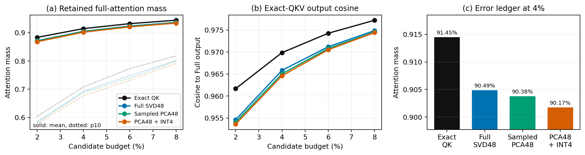

# PCA48 与 INT4 检索误差为何对最终结果影响较小

更新时间：2026-07-26

## 结论

当前证据支持下面这个更严谨的命题：

> PCA48 和 INT4 不需要精确恢复全部 QK 排名。它们只负责构造候选集合，候选内部仍使用原始 Q/K/V 计算 attention。只要候选集合遗漏的 full-attention mass 很小，局部 attention 输出误差就有严格上界；最终模型质量是否保持，则由端到端 PPL 和生成任务验证。

不能把该结论表述为“PCA 尾部没有语义”或“任意输入的答案一定不变”。PCA 保留的是 **K 的高能谱子空间**，不是人工定义的公共语义；INT4 引入的是主子空间内的量化噪声，也不是第二个正交语义尾部。

新做的 32K 真实 Q/K/V 探针表明：

- PCA48 保留平均 **86.84% K 谱能量**；
- 生产 PCA48+INT4 代理分数与精确 QK 的平均相关系数为 **0.9338**；
- 在每个 query head 固定选择4%历史 token 时，精确 QK 保留 **91.45%** full-attention mass，生产 PCA48+INT4 保留 **90.17%**；
- 因此，PCA、采样基底和量化合计只比同预算精确 QK 多遗漏 **1.28 个百分点** attention mass；
- INT4 相对 PCA48 FP32 只额外遗漏 **0.20 个百分点**，query INT8 的附加变化小于 **0.001 个百分点**；
- PCA 谱尾误差与 INT4 误差的平均余弦为 **0.00073**，没有观察到二者系统性同向叠加；
- 对应的端到端 32K targeted PPL 从8.3930变为8.5064，NLL仅增加 **0.01342 nat/token**。

---

## 1. PCA 与 SVD 是什么关系

设一个 KV head 的历史 Key 矩阵为：

$$
K\in\mathbb R^{N\times d},
$$

其中每一行对应一个历史 token 的 post-RoPE key。对它做未中心化 SVD：

$$
K=U\Sigma V^\mathsf T.
$$

未中心化 PCA 使用的二阶矩为：

$$
C_K=\frac{1}{N}K^\mathsf TK
   =V\frac{\Sigma^2}{N}V^\mathsf T.
$$

所以，未中心化 PCA 的特征向量就是 K 的右奇异向量。若取前 $r=48$ 个方向：

$$
P_r=V_rV_r^\mathsf T,
$$

则：

$$
K_{\mathrm c}=KP_r,\qquad
K_{\mathrm{tail}}=K(I-P_r),\qquad
K=K_{\mathrm c}+K_{\mathrm{tail}}.
$$

因此，全量 uncentered SVD48 与全量 uncentered PCA48 在数学上是同一个子空间。当前实现每隔32个 token 采样一个 K 来估计二阶矩，所以它是全量 SVD/PCA 的近似，而不是另一种分解。

根据 Eckart--Young 定理，$K_{\mathrm c}$ 是所有 rank-48 矩阵中使下面重构误差最小的解：

$$
\|K-\widetilde K\|_F^2.
$$

但是模型最终关心的不是 K 的重构误差，而是当前 query 下的 QK 分数，因此还需要继续分析 query。

---

## 2. PCA 尾部如何进入 QK 分数

将 query 也按同一正交子空间分解：

$$
q_{\mathrm c}=P_rq,\qquad
q_{\mathrm{tail}}=(I-P_r)q.
$$

对第 $i$ 个 key，精确分数为：

$$
s_i=\frac{q^\mathsf Tk_i}{\sqrt d}.
$$

由于主子空间和尾子空间正交：

$$
s_i
=
\frac{
q_{\mathrm c}^\mathsf Tk_{\mathrm c,i}
+q_{\mathrm{tail}}^\mathsf Tk_{\mathrm{tail},i}
}{\sqrt d}.
$$

PCA48 分数只保留第一项：

$$
s_i^{\mathrm{PCA}}
=
\frac{q_{\mathrm c}^\mathsf Tk_{\mathrm c,i}}{\sqrt d}.
$$

所以 PCA 截断误差精确等于：

$$
\delta_i^{\mathrm{PCA}}
=s_i-s_i^{\mathrm{PCA}}
=
\frac{q_{\mathrm{tail}}^\mathsf Tk_{\mathrm{tail},i}}{\sqrt d}.
$$

逐 token 的充分上界为：

$$
|\delta_i^{\mathrm{PCA}}|
\le
\frac{
\|q_{\mathrm{tail}}\|_2
\|k_{\mathrm{tail},i}\|_2
}{\sqrt d}.
$$

从整个 score vector 看，谱分解给出更有解释力的公式：

$$
\|K_{\mathrm{tail}}q\|_2^2
=
\sum_{j>r}
\sigma_j^2(v_j^\mathsf Tq)^2.
$$

这说明尾部影响同时由两件事决定：

1. 尾部奇异值 $\sigma_j$ 是否足够小；
2. 当前 query 是否恰好对齐尾部奇异方向。

因此，“K 保留86.84%能量”本身还不能证明 QK 稳定。必须直接测量 query-weighted score error、attention mass 和最终输出。

---

## 3. INT4 是主子空间内的量化误差

令 PCA 坐标为：

$$
z_i=V_r^\mathsf Tk_i,\qquad
u=V_r^\mathsf Tq.
$$

当前生产实现把48维 $z_i$ 分成三个16维组，对每组使用 log-scale INT4；query 使用 INT8。写成：

$$
\widehat z_i=z_i+e_{k,i},\qquad
\widehat u=u+e_q.
$$

生产代理分数为：

$$
\widehat s_i
=
\frac{\widehat u^\mathsf T\widehat z_i}{\sqrt d}.
$$

相对 PCA FP32 分数的量化扰动为：

$$
\delta_i^{\mathrm Q}
=
\frac{
u^\mathsf Te_{k,i}
+e_q^\mathsf Tz_i
+e_q^\mathsf Te_{k,i}
}{\sqrt d}.
$$

因此，总误差为：

$$
s_i-\widehat s_i
=
\delta_i^{\mathrm{PCA}}-\delta_i^{\mathrm Q}.
$$

一个直接的充分上界是：

$$
|s_i-\widehat s_i|
\le
\frac{
\|q_{\mathrm{tail}}\|_2\|k_{\mathrm{tail},i}\|_2
+\|u\|_2\|e_{k,i}\|_2
+\|e_q\|_2\|z_i\|_2
+\|e_q\|_2\|e_{k,i}\|_2
}{\sqrt d}.
$$

该上界对最坏情况有效，但通常很松。真实 trace 中：

- PCA 尾部 score energy / 精确 score energy：**10.63%**；
- INT4 score error energy / 精确 score energy：**2.13%**；
- INT4 / PCA 尾部误差能量比：平均32.38%，中位数23.47%；
- 两个误差向量的平均余弦：**0.00073**；
- 余弦 p10--p90：**-0.0108 到 0.0110**。

最后一项尤其重要：INT4 误差近似与 PCA 尾部误差正交，因此没有观察到 INT4 持续放大同一批谱尾方向。

---

## 4. 为什么 top-k 集合变化不等于答案变化

若要求近似分数恢复完全相同的 top-k，充分条件是：

$$
s_{(k)}-s_{(k+1)}
>
2\|\delta\|_\infty.
$$

真实长上下文中，大量低权重 token 的边界分数非常密集，这个条件经常不成立。因此 PCA48+INT4 的 exact top-k token recall 不高：

- 4%预算下，生产索引的 exact top-4% recall 为 **68.99%**；
- 但它仍保留 **90.17%** 的 full-attention mass。

原因是 top-k recall 将每个 token 等权计数，而 softmax attention 并不等权。交换许多边界附近、概率极低的 token，可以显著降低集合 recall，却几乎不改变模型真正读取的概率质量。

---

## 5. 从遗漏 attention mass 到输出误差的严格界

当前方法仅用代理分数选择候选集合 $C$。进入 $C$ 后，重新使用原始 Q/K/V 计算：

$$
p_i
=
\frac{\exp(s_i)}{\sum_j\exp(s_j)},
$$

$$
\widetilde p_i
=
\frac{\exp(s_i)}{\sum_{j\in C}\exp(s_j)},
\qquad i\in C.
$$

定义候选外遗漏的 full-attention mass：

$$
\eta=1-\sum_{i\in C}p_i.
$$

将 sparse 分布在候选外补零，可以得到精确关系：

$$
\|p-\widetilde p\|_1=2\eta.
$$

full 和 sparse attention 输出分别为：

$$
o=\sum_i p_iv_i,\qquad
\widetilde o=\sum_{i\in C}\widetilde p_iv_i.
$$

令 $o_C$ 和 $o_{\bar C}$ 分别表示候选内外的条件 Value 均值，则：

$$
o=(1-\eta)o_C+\eta o_{\bar C},
$$

从而：

$$
\boxed{
\|o-\widetilde o\|_2
=
\eta\|o_{\bar C}-o_C\|_2
\le
\eta\,\operatorname{diam}(V)
\le
2\eta\max_i\|v_i\|_2
}.
$$

这就是当前方法最核心的条件性保证：**PCA/INT4 分数不需要处处准确；只要它构造的候选集合使 $\eta$ 小，使用精确 Q/K/V 的 attention 输出就有界。**

---

## 6. 从 attention 输出到最终答案

attention 输出经过 $W_O$ 写入 residual stream：

$$
\Delta x_\ell=W_{O,\ell}(\widetilde o_\ell-o_\ell).
$$

因此局部有：

$$
\|\Delta x_\ell\|_2
\le
\|W_{O,\ell}\|_2
\eta_\ell\operatorname{diam}(V_\ell).
$$

设从第 $\ell$ 层到最终 logits 的映射为 $F_{\ell\rightarrow L}$，局部一阶传播为：

$$
\Delta z
\approx
J_{\ell\rightarrow L}\Delta x_\ell.
$$

若 full 模型预测token的 logit margin为：

$$
m=z_{(1)}-z_{(2)},
$$

则下面是预测token保持不变的充分条件：

$$
m>2\|\Delta z\|_\infty.
$$

但是深层 Transformer 的全局 Jacobian 上界通常极松，autoregressive generation 还会累积轨迹差异，所以不能仅靠这个式子无条件证明最终答案一致。论文应使用：

1. 上面的 attention mass/output 条件界；
2. teacher-forced PPL/NLL；
3. 自由生成 benchmark；
4. 最终 logit KL、top-1 agreement 和 margin flip；

共同建立证据链。

---

## 7. 新实验设置

- 模型：Llama-3.1-8B-Instruct；
- 真实自然文本：sports、medicine；
- 历史长度：32K；
- 层：0、8、16、24、31；
- 每层32个 query head、8个 KV head；
- 总计：320个 layer-query-head case；
- 基底：每32个 K 采样一个，建立 uncentered PCA48；
- 量化：生产版16维分组 log-scale INT4 K + INT8 query；
- 候选预算：2%、4%、6%、8%；
- 候选选出后统一使用原始 FP16 Q/K/V 计算 attention。

该实验是机制探针，不是完整论文统计：目前只有两个主题、五个层和每个主题一个查询位置。其价值是逐项隔离误差，不能替代完整 LongBench、RULER、多模型和多decode-step验证。

---

## 8. 谱结构结果

| 指标 | 结果 |
|---|---:|
| 谱统计单元 | 80个 layer-KV-head |
| PCA48保留K能量 | 86.84% |
| PCA48保留K能量 p10 | 81.52% |
| K的平均有效秩 | 24.67 |
| $\sigma_1/\sigma_{48}$ | 10.73 |
| $\lambda_{48}/\lambda_{49}$ | 1.021 |
| sampled PCA48 与 full SVD48 子空间重合度 | 91.50% |

$\lambda_{48}/\lambda_{49}$ 接近1，说明第48和第49个单独奇异向量并不稳定。因此，论文不应声称“第48个奇异方向本身特殊”。真正稳定的是前48维整体子空间，以及它对 QK attention mass 的恢复能力。

虽然 query 本身平均只有65.16%的能量落在前48维，但 QK尾部分数能量只有10.63%。这是因为 query 的尾部分量还要乘上较小的 K 尾部奇异值。

---

## 9. 代理分数结果

| 分数方法 | Centered NRMSE | Pearson | Pearson p10 |
|---|---:|---:|---:|
| Exact QK | 0 | 1.0000 | 1.0000 |
| Full SVD48 FP32 | 0.2920 | 0.9508 | 0.9011 |
| Sampled PCA48 FP32 | 0.3090 | 0.9448 | 0.8853 |
| Sampled PCA48 + INT4 K | 0.3447 | 0.9338 | 0.8760 |
| 生产版 PCA48 + INT4 K + INT8 Q | 0.3448 | 0.9338 | 0.8758 |

结论：

1. Full SVD48 到 sampled PCA48 的差距很小，说明 stride-32 的基底估计总体有效。
2. INT4 会降低分数拟合精度，但生产版仍保持0.934的平均相关性。
3. INT8 query 几乎不再引入可见损失。
4. 分数 NRMSE 并不算极小，所以不能用“代理分数几乎等于精确分数”描述方法。

---

## 10. 4%预算下的逐级误差账本

| 候选方法 | Exact top-4% recall | Full attention mass | 输出相对L2 | 输出 cosine |
|---|---:|---:|---:|---:|
| Exact QK | 100.00% | 91.45% | 15.96% | 0.96985 |
| Full SVD48 FP32 | 73.31% | 90.49% | 18.29% | 0.96582 |
| Sampled PCA48 FP32 | 71.88% | 90.38% | 18.60% | 0.96504 |
| Sampled PCA48 + INT4 K | 68.98% | 90.18% | 18.85% | 0.96463 |
| 生产版 PCA48 + INT4 K + INT8 Q | 68.99% | 90.17% | 18.86% | 0.96459 |

逐项增加的 attention mass 损失：

| 误差来源 | 附加损失 |
|---|---:|
| 只使用4%连接，即使Exact QK | 8.55个百分点 |
| rank-48谱截断 | 0.96个百分点 |
| sampled PCA相对full SVD | 0.11个百分点 |
| INT4 K量化 | 0.20个百分点 |
| INT8 query量化 | 小于0.001个百分点 |
| 全部近似相对同预算Exact QK | **1.28个百分点** |

因此，当前误差的主项不是 INT4，也不是采样 PCA；最大误差来源是稀疏预算本身。PCA48+INT4 的作用是以低成本找到一个接近 Exact-QK 稀疏上界的候选集合。

在6%预算下，生产版保留92.06% full-attention mass，同预算 Exact QK 为93.21%，差距为1.14个百分点。

---

## 11. 分层结果与反例

生产版 PCA48+INT4 在4%预算下：

| 层 | Attention mass | 输出相对L2 | 输出 cosine |
|---:|---:|---:|---:|
| 0 | 68.22% | 55.34% | 0.8612 |
| 8 | 94.75% | 7.08% | 0.9957 |
| 16 | 96.81% | 6.98% | 0.9944 |
| 24 | 97.70% | 10.81% | 0.9910 |
| 31 | 93.40% | 14.08% | 0.9806 |

第0层是明确反例：不能声称每一层的 PCA/INT4 sparse attention 输出都近似不变。当前端到端质量仍然稳定，说明早层 attention 扰动经过 residual stream、$W_O$、后续层和归一化后没有等比例传递到最终 NLL。

这个现象应成为下一轮理论实验的重点：

- 测量 $\|W_O\Delta o\|/\|x_{\mathrm{residual}}\|$；
- 测量逐层扰动到最终 logit 的放大/衰减；
- 比较早层与晚层的 margin sensitivity；
- 评估是否需要对最早若干层使用不同预算，但不能在证据完成前加入任务规则。

---

## 12. 最终结果层面的证据

### 12.1 32K targeted PPL

体育和医学、6个不重叠窗口、每种方法1536个目标token：

| 方法 | PPL | NLL | 相对 Full |
|---|---:|---:|---:|
| Full KV | 8.3930 | 2.127402 | 1.0000 |
| Direct CountCap | 8.5064 | 2.140822 | +1.35% PPL |

NLL变化为：

$$
\Delta\mathrm{NLL}
=
\log\frac{\mathrm{PPL}_{\mathrm{sparse}}}
{\mathrm{PPL}_{\mathrm{full}}}
=0.01342\ \text{nat/token}.
$$

### 12.2 2K--32K自然文本

在另一组混合自然文本中，Direct CountCap相对Full的PPL增加为：

| 长度 | PPL增加 |
|---:|---:|
| 2K | 1.89% |
| 4K | 2.32% |
| 8K | 2.23% |
| 16K | 2.23% |
| 24K | 3.37% |
| 32K | 2.02% |

### 12.3 LongBench证据边界

此前 Dense-Suffix Key-PCA CountCap 在3750条 LongBench 上相对同运行 Full 保持99.57%宏平均质量。但是该结果属于较早的 Key-PCA路径，不能直接当作当前“Direct、无精确重排”最终实现的正式结果。投稿前必须完成 final-direct LongBench bridge experiment。

---

## 13. 可以写进论文的核心命题

推荐表述：

> Uncentered Key-PCA is equivalent to truncating the right singular subspace of the historical key matrix. Although PCA48+INT4 substantially changes the exact boundary-token ranking, its additional attention-mass loss over exact-QK sparsification is only 1.28 percentage points at a 4% budget. Because compressed scores are used only for candidate construction and original Q/K/V are used for final attention, the local output error is controlled by the omitted full-attention mass rather than exact top-k set recovery.

中文含义：

> 我们不要求低维量化索引重建精确QK排名。它只需构造一个遗漏attention mass较小的候选集；最终精确Q/K/V计算把索引误差限制在“选错候选”这一处，不让量化误差继续进入softmax和Value聚合。

---

## 14. 不能写成的结论

以下说法证据不足或数学上不成立：

1. “PCA48保留公共语义，尾部没有语义。”
2. “INT4丢掉的也是语义长尾。”
3. “PCA48+INT4保证任何输入的最终答案不变。”
4. “68.99%的top-k recall已经证明代理分数足够精确。”
5. “每一层的attention输出误差都很小。”

更准确的术语是：

- dominant spectral subspace；
- spectral residual；
- within-subspace quantization error；
- retained attention mass；
- exact-QKV candidate attention；
- conditional output stability。

---

## 15. 投稿前还需要的理论实验

1. 在最终 Direct 实现上采集全部层、多个模型和多个 decode step 的相同误差账本。
2. 直接记录 full/sparse 最终 logits，报告 KL、top-1 agreement、full margin以及margin flip比例。
3. 测量逐层 $\|W_O\Delta o\|/\|x_{\mathrm{residual}}\|$，解释第0层局部误差为何没有破坏最终NLL。
4. 构造 tail-aligned query 压力测试，验证尾部奇异方向上的最坏情况边界。
5. 在最终 Direct 实现上补齐 LongBench、RULER和多模型验证。
6. 将平均结果与p10、最差case同时报告，避免宏平均掩盖少数危险head。

完成这些实验后，可以形成“谱截断误差 -> 量化误差 -> 候选遗漏mass -> attention输出 -> residual/logit -> 最终任务质量”的完整理论和实验证据链。

## 文件

- 分析脚本：`src/analyze_pca_int4_delta_invariance_20260726.py`
- 绘图脚本：`src/plot_pca_int4_delta_invariance_20260726.py`
- 最终汇总：`results/20260726_pca48_int4_delta_invariance_32k_v3/summary.json`
- 谱明细：`results/20260726_pca48_int4_delta_invariance_32k_v3/spectrum_rows.csv`
- 分数明细：`results/20260726_pca48_int4_delta_invariance_32k_v3/score_rows.csv`
- 候选与输出明细：`results/20260726_pca48_int4_delta_invariance_32k_v3/candidate_rows.csv`
