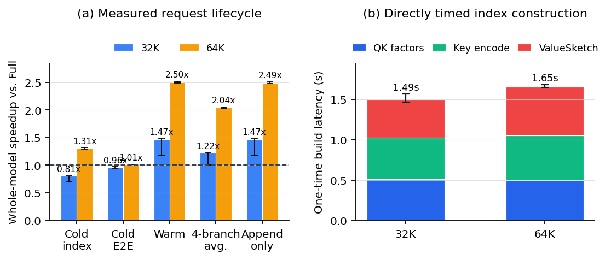

# Persistent-KV 结果

## 实验设置

- 模型：Yarn-Llama-2-7B-128K，原生 MHA，FP16。
- 硬件：RTX 3090；32K 使用两张卡，64K 使用三张卡，每种方法使用相同卡数。
- 方法：Full attention 与冻结的 QKSieve-Robust。
- 每个前缀在同一 QK 坐标系下运行四个 32-token 分支，再回放第一个分支；
  append-only 区间为同一请求连续生成 128 token。
- CUDA 扩展加载在请求计时外完成；QK 坐标、完整 Key index 和 ValueSketch 构建计入 cold。
- 原始结果：`raw_results/20260810_qksieve_persistent_kv_v3_multiseed/`。
- 独立汇总：`raw_results/20260810_qksieve_persistent_kv_v3_multiseed/independent_summary.json`。

## 图契约

### 图 A：四种生命周期的整模型加速

- 研究问题：索引成本在什么复用条件下能够被真实 Decode 节省抵消？
- 指标：`Full 的直接计时 / QKSieve 的直接计时`，无单位；大于 1 表示 QKSieve 更快。
- 数据：32K/64K 成对原始 JSON，每个长度三个独立进程；固定输入与 greedy decode。
- 横轴：cold-index、cold-E2E、warm、四分支均摊、append-only。
- 纵轴：整模型速度比；虚线 1 表示与 Full 持平。
- 允许结论：在本模型和硬件上，32K 需要复用才能加速；64K 单次 32-token cold-E2E 大致打平，复用后明显加速。
- 不允许结论：该图不能证明 H100、多模型或所有输出长度都具有相同比值。

### 图 B：一次性索引构建成本

- 研究问题：cold 请求的固定成本由哪些真实阶段构成？
- 指标：每个阶段在完整运行中的 CUDA 同步墙钟秒数。
- 数据：QKSieve 原始 JSON 中三个进程的 QK factor、完整 Key 编码和 ValueSketch 构建计时中位数。
- 横轴：32K/64K；纵轴：秒；颜色表示三个互斥阶段。
- 允许结论：三个阶段成本同量级，不能只优化低比特扫描来解决 cold 延迟。
- 限制：堆叠柱用于解释 `prebuild_wall_seconds`，不会与其他独立微基准相加构造 Decode 延迟。

## 数值结果

| 长度 | Cold-index | Cold-E2E | Warm | 四分支均摊 | Append-only | 建索引 |
|---:|---:|---:|---:|---:|---:|---:|
| 32K | 0.806x | 0.963x | 1.474x | 1.220x | 1.472x | 1.486 s |
| 64K | 1.312x | 1.013x | 2.503x | 2.040x | 2.493x | 1.650 s |

32K 的 Full/QKSieve warm 延迟中位数为 84.002/57.032 ms/token；64K 为
145.081/57.973 ms/token。32K cold-E2E 变慢不是注意力路径失效，而是 32-token
输出无法完全摊薄索引成本；64K 同口径只达到约 1.013x，不能称为明显加速。
图中误差条是固定工作负载的进程重复区间，不代表样本或硬件分布置信区间。

32K 的 QK/Key/Value 构建中位数分别为 0.511/0.517/0.471 秒；64K 为
0.495/0.556/0.605 秒。结果说明 QK 小矩阵因子成本近似不随长度增长，而历史 Key
编码与 ValueSketch 构建随长度增加。

## 生命周期审计

- 每种长度：32 层 Key 与 Value 均完成预建。
- 每种长度：6 个状态快照、5 次 rewind 全部重新解析通过。
- 预建结束：索引与 KV 等长；Decode 结束：索引严格落后 KV 一个 token。
- 所有快照：Key/Value 指针和两类重建计数不变。
- 重复第一个分支：token 序列与 SHA256 完全一致。
- 没有 Full fallback、router、任务规则或候选复用。

## 结论边界

该实验支持“索引可以和精确 KV 一起常驻并在共享前缀与追加式 Decode 中复用”。
它不比较 QKSieve 与 Full 的任务质量；质量由独立的 LongBench、RULER 和 PPL
实验承担。它也没有测试换一个用户问题后 Query 统计发生变化的跨请求索引复用；
这种情况按冻结契约需要重新构建 request-local 索引。当前速度已有三个独立进程
重复，但只有一个固定工作负载和 RTX 3090 主机；最终论文仍应在 H100 上用至少
三个独立进程复测 64K/128K。
